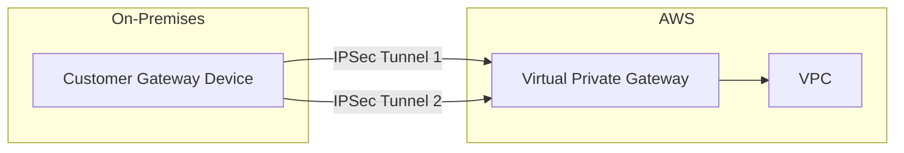

# How to Set Up AWS Site-to-Site VPN with BGP Routing

Author: [nawazdhandala](https://github.com/nawazdhandala)

Tags: AWS, VPN, BGP, Networking, Hybrid Cloud, VPC

Description: Step-by-step guide to setting up an AWS Site-to-Site VPN connection with BGP dynamic routing for resilient hybrid connectivity.

---

Connecting your on-premises network to AWS is one of the first things most organizations do when adopting the cloud. While AWS Direct Connect gives you a dedicated physical link, a Site-to-Site VPN is faster to set up, cheaper, and works great as either a primary connection for lighter workloads or a backup for Direct Connect.

Using BGP (Border Gateway Protocol) for dynamic routing makes the VPN connection much more robust than static routing. Routes are exchanged automatically, failover happens without manual intervention, and you do not need to update route tables every time your network changes.

## Architecture Overview

A Site-to-Site VPN with BGP consists of these components:



Each VPN connection gets two tunnels for redundancy. With BGP, both tunnels can be active simultaneously and routes are exchanged over each.

## Step 1: Create a Customer Gateway

The Customer Gateway (CGW) represents your on-premises VPN device in AWS. You need your device's public IP and BGP ASN.

```bash
# Create a Customer Gateway with your on-premises device's public IP and BGP ASN
aws ec2 create-customer-gateway \
  --type ipsec.1 \
  --public-ip 203.0.113.12 \
  --bgp-asn 65000 \
  --tag-specifications 'ResourceType=customer-gateway,Tags=[{Key=Name,Value=on-prem-cgw}]'
```

If you do not have a specific ASN, use a private ASN in the range 64512-65534.

## Step 2: Create a Virtual Private Gateway

The Virtual Private Gateway (VGW) is the AWS side of the VPN connection. You attach it to your VPC.

```bash
# Create a Virtual Private Gateway with a specific Amazon-side ASN
aws ec2 create-vpn-gateway \
  --type ipsec.1 \
  --amazon-side-asn 64512 \
  --tag-specifications 'ResourceType=vpn-gateway,Tags=[{Key=Name,Value=prod-vgw}]'
```

Attach the VGW to your VPC.

```bash
# Attach the Virtual Private Gateway to your VPC
aws ec2 attach-vpn-gateway \
  --vpn-gateway-id vgw-0abc123def456789 \
  --vpc-id vpc-0abc123def456789
```

## Step 3: Enable Route Propagation

This is the step people often forget. You need to enable route propagation on your VPC route tables so that routes learned via BGP are automatically added.

```bash
# Enable route propagation so BGP-learned routes appear in the route table
aws ec2 enable-vgw-route-propagation \
  --route-table-id rtb-0abc123def456789 \
  --gateway-id vgw-0abc123def456789
```

Do this for every route table in your VPC that needs to reach on-premises resources.

## Step 4: Create the VPN Connection

Now create the actual VPN connection. Specify BGP as the routing type.

```bash
# Create the Site-to-Site VPN connection with BGP dynamic routing
aws ec2 create-vpn-connection \
  --type ipsec.1 \
  --customer-gateway-id cgw-0abc123def456789 \
  --vpn-gateway-id vgw-0abc123def456789 \
  --options '{"StaticRoutesOnly":false,"TunnelInsideIpVersion":"ipv4","TunnelOptions":[{"TunnelInsideCidr":"169.254.10.0/30","PreSharedKey":"YourStrongPreSharedKey1"},{"TunnelInsideCidr":"169.254.10.4/30","PreSharedKey":"YourStrongPreSharedKey2"}]}' \
  --tag-specifications 'ResourceType=vpn-connection,Tags=[{Key=Name,Value=prod-vpn}]'
```

Key options explained:

- `StaticRoutesOnly: false` enables BGP
- `TunnelInsideCidr` defines the /30 subnets used for the BGP peering sessions inside each tunnel
- Each tunnel gets its own pre-shared key

## Step 5: Download and Apply the Configuration

AWS generates a configuration file tailored to your customer gateway device.

```bash
# Download the VPN configuration for your specific device type
aws ec2 describe-vpn-connections \
  --vpn-connection-ids vpn-0abc123def456789 \
  --query 'VpnConnections[0].CustomerGatewayConfiguration' \
  --output text > vpn-config.xml
```

The configuration includes:

- IPSec tunnel settings (encryption algorithms, lifetime, DPD settings)
- BGP peering details (neighbor IP, ASN, tunnel inside addresses)
- Pre-shared keys

Here is what a typical BGP configuration looks like for a Linux-based VPN device using StrongSwan and FRRouting.

```bash
# /etc/frr/frr.conf - BGP configuration for the on-premises router
router bgp 65000
  bgp router-id 203.0.113.12

  # Peer with AWS tunnel 1
  neighbor 169.254.10.1 remote-as 64512
  neighbor 169.254.10.1 description AWS-Tunnel-1
  neighbor 169.254.10.1 timers 10 30

  # Peer with AWS tunnel 2
  neighbor 169.254.10.5 remote-as 64512
  neighbor 169.254.10.5 description AWS-Tunnel-2
  neighbor 169.254.10.5 timers 10 30

  # Advertise on-premises networks to AWS
  address-family ipv4 unicast
    network 10.0.0.0/8
    network 172.16.0.0/12
    neighbor 169.254.10.1 soft-reconfiguration inbound
    neighbor 169.254.10.5 soft-reconfiguration inbound
  exit-address-family
```

## Step 6: Verify the Connection

Once your on-premises device is configured, verify the tunnels are up.

```bash
# Check VPN tunnel status - both tunnels should show UP
aws ec2 describe-vpn-connections \
  --vpn-connection-ids vpn-0abc123def456789 \
  --query 'VpnConnections[0].VgwTelemetry[*].{Tunnel:OutsideIpAddress,Status:Status,StatusMessage:StatusMessage,AcceptedRoutes:AcceptedRouteCount}'
```

You should see both tunnels with Status "UP" and AcceptedRouteCount greater than 0 if BGP is working.

## BGP Route Manipulation

### Preferring One Tunnel Over Another

You can use AS path prepending to make AWS prefer one tunnel over another for return traffic.

```bash
# Make tunnel 2 less preferred by prepending the AS path
router bgp 65000
  neighbor 169.254.10.5 route-map PREPEND out

route-map PREPEND permit 10
  set as-path prepend 65000 65000
```

### Filtering Routes

You may not want to advertise all on-premises routes to AWS or accept all AWS routes.

```bash
# Only advertise specific prefixes to AWS
ip prefix-list TO-AWS seq 10 permit 10.0.0.0/16
ip prefix-list TO-AWS seq 20 permit 10.1.0.0/16
ip prefix-list TO-AWS seq 100 deny 0.0.0.0/0 le 32

router bgp 65000
  address-family ipv4 unicast
    neighbor 169.254.10.1 prefix-list TO-AWS out
    neighbor 169.254.10.5 prefix-list TO-AWS out
```

## Monitoring the VPN

Set up CloudWatch alarms to get notified when tunnels go down.

```bash
# Create an alarm that fires when a VPN tunnel goes down
aws cloudwatch put-metric-alarm \
  --alarm-name vpn-tunnel-down \
  --namespace AWS/VPN \
  --metric-name TunnelState \
  --dimensions Name=VpnId,Value=vpn-0abc123def456789 \
  --statistic Maximum \
  --period 300 \
  --threshold 1 \
  --comparison-operator LessThanThreshold \
  --evaluation-periods 2 \
  --alarm-actions arn:aws:sns:us-east-1:123456789012:NetworkAlerts
```

Monitor tunnel data transfer to spot anomalies.

```bash
# Check bytes in/out for the VPN over the last hour
aws cloudwatch get-metric-statistics \
  --namespace AWS/VPN \
  --metric-name TunnelDataIn \
  --dimensions Name=VpnId,Value=vpn-0abc123def456789 \
  --start-time $(date -u -d '1 hour ago' +%Y-%m-%dT%H:%M:%S) \
  --end-time $(date -u +%Y-%m-%dT%H:%M:%S) \
  --period 300 \
  --statistics Sum
```

## Troubleshooting BGP Issues

Common BGP problems and their fixes:

1. **BGP session not establishing** - Check that the tunnel inside CIDRs match on both sides, the ASNs are correct, and IKE/IPSec is established first.

2. **Routes not propagating** - Verify route propagation is enabled on your VPC route tables. Check that your on-premises device is advertising the correct prefixes.

3. **Asymmetric routing** - If you have multiple VPN connections, AWS may send return traffic through a different tunnel. Use AS path prepending or MED to control path selection.

For deeper network analysis, consider using [VPC Flow Logs](https://oneuptime.com/blog/post/2026-02-12-monitor-network-performance-with-vpc-flow-logs/view) to see what traffic is actually traversing the VPN. You can also use [Reachability Analyzer](https://oneuptime.com/blog/post/2026-02-12-use-reachability-analyzer-for-network-troubleshooting/view) to verify that your VPC configuration allows traffic to reach the VPN gateway.

## Summary

Setting up a Site-to-Site VPN with BGP routing gives you a resilient, dynamically-routed connection between your on-premises network and AWS. The two redundant tunnels combined with automatic route exchange mean you get failover without manual intervention. While the initial setup requires coordination between your network team and AWS, the ongoing maintenance is minimal compared to static routing where every network change requires manual updates on both sides.
