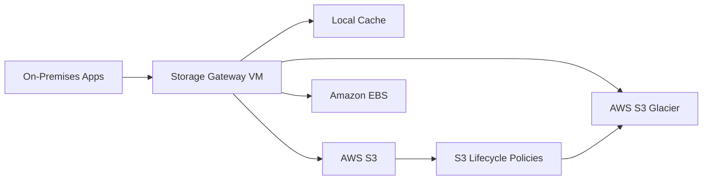

# How to Set Up AWS Storage Gateway for Hybrid Storage

Author: [nawazdhandala](https://github.com/nawazdhandala)

Tags: AWS, Storage Gateway, Hybrid Cloud, Storage

Description: Step-by-step guide to deploying AWS Storage Gateway for hybrid storage environments, bridging your on-premises infrastructure with AWS cloud storage.

---

If your organization still runs workloads on-premises but wants to take advantage of cloud storage, AWS Storage Gateway is the bridge you need. It's a hybrid cloud storage service that gives on-premises applications seamless access to virtually unlimited cloud storage - without requiring you to rewrite your applications or change your workflows.

In this post, we'll cover the full setup process from downloading the gateway appliance to activating it and connecting it to your AWS account.

## What is AWS Storage Gateway?

Storage Gateway is essentially a virtual appliance that you deploy in your on-premises environment (or in AWS as an EC2 instance). It presents standard storage interfaces like NFS, SMB, iSCSI, and iSCSI VTL to your local applications, while transparently moving data to and from AWS storage services like S3, S3 Glacier, and EBS.

There are three types of gateways:

- **File Gateway** - presents S3 objects as files via NFS or SMB
- **Volume Gateway** - presents iSCSI block storage backed by S3 with EBS snapshots
- **Tape Gateway** - presents a virtual tape library backed by S3 and Glacier



## Prerequisites

Before you start, make sure you have:

- An AWS account with appropriate IAM permissions
- A hypervisor environment (VMware ESXi, Microsoft Hyper-V, or Linux KVM) or an EC2 instance for the gateway
- At least 4 vCPUs, 16 GB of RAM, and 80 GB of disk for the gateway VM
- Additional disks for the local cache (minimum 150 GB recommended)
- Network connectivity between your on-premises environment and AWS (Direct Connect or internet)
- Port 443 outbound access to AWS endpoints

## Step 1: Create the Gateway in AWS Console

Start by setting up the gateway resource in your AWS account. You can do this through the CLI as well:

```bash
# List available gateway types to confirm options
aws storagegateway list-gateways --region us-east-1

# We'll create the gateway after deploying and activating the VM
# First, let's prepare by creating an IAM role for the gateway
aws iam create-role \
  --role-name StorageGatewayRole \
  --assume-role-policy-document '{
    "Version": "2012-10-17",
    "Statement": [{
      "Effect": "Allow",
      "Principal": {"Service": "storagegateway.amazonaws.com"},
      "Action": "sts:AssumeRole"
    }]
  }'

# Attach the necessary policy
aws iam attach-role-policy \
  --role-name StorageGatewayRole \
  --policy-arn arn:aws:iam::aws:policy/AmazonS3FullAccess
```

In production, you'd want to scope that S3 policy down to specific buckets rather than granting full access.

## Step 2: Download and Deploy the Gateway VM

AWS provides the gateway appliance as a VM image for various hypervisors. Download the appropriate image for your environment.

For VMware ESXi, you'll get an OVA file. For Hyper-V, it's a VHD. For KVM, a QCOW2 image.

```bash
# If deploying on EC2 instead of on-premises,
# you can launch the gateway AMI directly
aws ec2 run-instances \
  --image-id ami-0123456789abcdef0 \
  --instance-type m5.xlarge \
  --key-name my-key-pair \
  --security-group-ids sg-0123456789abcdef0 \
  --subnet-id subnet-0abc1234 \
  --block-device-mappings '[
    {
      "DeviceName": "/dev/xvda",
      "Ebs": {"VolumeSize": 80, "VolumeType": "gp3"}
    },
    {
      "DeviceName": "/dev/xvdb",
      "Ebs": {"VolumeSize": 150, "VolumeType": "gp3"}
    }
  ]' \
  --tag-specifications 'ResourceType=instance,Tags=[{Key=Name,Value=StorageGateway}]'
```

The second volume (`/dev/xvdb`) serves as the local cache disk. The cache stores frequently accessed data locally, so your applications get low-latency reads without waiting for data from S3.

## Step 3: Configure the VM

Once your VM is running, you need to configure basic network settings. The gateway VM has a local console you can access:

1. Open the VM console through your hypervisor
2. Set the time zone to UTC (this is important for proper synchronization)
3. Configure the network interface with a static IP or DHCP
4. Note the IP address - you'll need it for activation

If you deployed on EC2, the network configuration is handled automatically. Just grab the private IP or public IP of the instance.

## Step 4: Activate the Gateway

Activation links your gateway VM to your AWS account. You'll need the gateway's IP address:

```bash
# Get the activation key by making an HTTP request to the gateway
# This returns a redirect URL containing the activation key
curl -s "http://GATEWAY_IP_ADDRESS/?activationRegion=us-east-1&no_redirect"

# Once you have the activation key, activate the gateway
aws storagegateway activate-gateway \
  --activation-key ABCDE-12345-FGHIJ-67890-KLMNO \
  --gateway-name "MyHybridGateway" \
  --gateway-timezone "GMT" \
  --gateway-region us-east-1 \
  --gateway-type "FILE_S3"
```

The `gateway-type` parameter determines what kind of gateway you're setting up:
- `FILE_S3` for File Gateway
- `CACHED` for Volume Gateway (cached mode)
- `STORED` for Volume Gateway (stored mode)
- `VTL` for Tape Gateway

## Step 5: Configure Local Disks

After activation, you need to assign the local disks to their roles. The gateway uses local disks for caching and upload buffering:

```bash
# List the local disks on your gateway
aws storagegateway list-local-disks \
  --gateway-arn arn:aws:storagegateway:us-east-1:123456789012:gateway/sgw-12345678

# Add cache storage - this is the 150GB disk we attached
aws storagegateway add-cache \
  --gateway-arn arn:aws:storagegateway:us-east-1:123456789012:gateway/sgw-12345678 \
  --disk-ids "disk-abc123"
```

The cache disk is critical for performance. Size it based on your working set - the data your applications access most frequently. AWS recommends the cache be at least 150 GB, but you might need more depending on your workload.

## Step 6: Configure CloudWatch Monitoring

You'll want to monitor your gateway's health and performance. Storage Gateway publishes metrics to CloudWatch automatically, but setting up alarms helps you catch issues early:

```bash
# Set up an alarm for cache hit percentage
aws cloudwatch put-metric-alarm \
  --alarm-name "StorageGateway-CacheHitPercent" \
  --metric-name CacheHitPercent \
  --namespace "AWS/StorageGateway" \
  --statistic Average \
  --period 300 \
  --threshold 70 \
  --comparison-operator LessThanThreshold \
  --evaluation-periods 6 \
  --dimensions Name=GatewayId,Value=sgw-12345678 \
  --alarm-actions arn:aws:sns:us-east-1:123456789012:storage-alerts

# Monitor upload buffer usage
aws cloudwatch put-metric-alarm \
  --alarm-name "StorageGateway-UploadBuffer" \
  --metric-name UploadBufferPercentUsed \
  --namespace "AWS/StorageGateway" \
  --statistic Average \
  --period 300 \
  --threshold 80 \
  --comparison-operator GreaterThanThreshold \
  --evaluation-periods 3 \
  --dimensions Name=GatewayId,Value=sgw-12345678 \
  --alarm-actions arn:aws:sns:us-east-1:123456789012:storage-alerts
```

A low cache hit percentage means your applications are frequently requesting data that isn't in the local cache, resulting in higher latency as data gets fetched from S3. If you see this happening consistently, consider increasing your cache disk size.

## Network Optimization

The connection between your gateway and AWS is the lifeline of your hybrid setup. Here are some configurations to optimize it:

```bash
# Configure bandwidth throttling to avoid saturating your WAN link
aws storagegateway update-bandwidth-rate-limit \
  --gateway-arn arn:aws:storagegateway:us-east-1:123456789012:gateway/sgw-12345678 \
  --average-upload-rate-limit-in-bits-per-sec 104857600 \
  --average-download-rate-limit-in-bits-per-sec 104857600
```

That sets both upload and download limits to 100 Mbps. Adjust based on your available bandwidth and what you can dedicate to the gateway without impacting other traffic.

For production deployments, consider using AWS Direct Connect instead of the public internet. It provides consistent latency, dedicated bandwidth, and lower data transfer costs.

## Maintenance and Updates

Storage Gateway VMs receive automatic software updates. You can control when these updates happen:

```bash
# Set a maintenance window for gateway updates
aws storagegateway update-maintenance-start-time \
  --gateway-arn arn:aws:storagegateway:us-east-1:123456789012:gateway/sgw-12345678 \
  --hour-of-day 2 \
  --minute-of-hour 0 \
  --day-of-week 0
```

This schedules maintenance for Sunday at 2:00 AM UTC. Pick a time when your gateway has the least activity.

## What's Next

With your Storage Gateway deployed, you're ready to configure specific gateway types for your use case. Check out our guides on [configuring File Gateway for S3 access](https://oneuptime.com/blog/post/2026-02-12-configure-storage-gateway-file-gateway-s3-access/view), [setting up Volume Gateway](https://oneuptime.com/blog/post/2026-02-12-configure-storage-gateway-volume-gateway/view), or [configuring Tape Gateway](https://oneuptime.com/blog/post/2026-02-12-configure-storage-gateway-tape-gateway/view) depending on your needs.

The beauty of Storage Gateway is that your on-premises applications don't need to change at all. They keep using the same file shares, block volumes, or tape interfaces they always have - the data just flows seamlessly into AWS behind the scenes.
