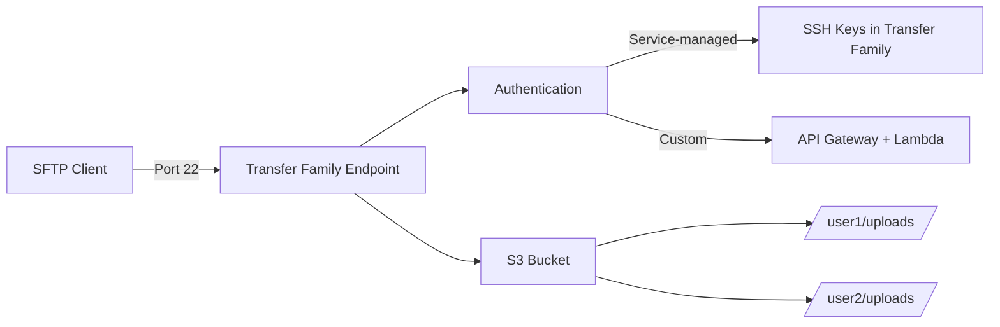

# How to Set Up AWS Transfer Family for SFTP Access to S3

Author: [nawazdhandala](https://github.com/nawazdhandala)

Tags: AWS, Transfer Family, SFTP, S3, File Transfer

Description: Deploy an AWS Transfer Family SFTP server to give external partners and applications secure file upload access directly to Amazon S3 buckets.

---

Plenty of organizations still rely on SFTP for exchanging files with partners, vendors, and internal systems. It's battle-tested, widely supported, and familiar. But running your own SFTP server means managing infrastructure, patching, scaling, and dealing with SSH key management.

AWS Transfer Family gives you a fully managed SFTP server that stores files directly in S3. Your partners connect using standard SFTP clients and see a normal directory structure, but everything lands in an S3 bucket behind the scenes. No servers to manage, no patches to apply.

## How It Works

Transfer Family creates an SFTP endpoint that authenticates users, maps them to IAM roles, and translates SFTP operations into S3 API calls. Each user gets a home directory that maps to an S3 prefix.



## Step 1: Create the IAM Roles

You need two roles: one for the Transfer Family service itself, and one (or more) for your users that defines what they can access in S3.

The logging role:

```bash
# Create the logging role for Transfer Family
aws iam create-role \
  --role-name TransferFamilyLoggingRole \
  --assume-role-policy-document '{
    "Version": "2012-10-17",
    "Statement": [{
      "Effect": "Allow",
      "Principal": {"Service": "transfer.amazonaws.com"},
      "Action": "sts:AssumeRole"
    }]
  }'

# Attach CloudWatch Logs policy
aws iam put-role-policy \
  --role-name TransferFamilyLoggingRole \
  --policy-name CloudWatchLogs \
  --policy-document '{
    "Version": "2012-10-17",
    "Statement": [{
      "Effect": "Allow",
      "Action": [
        "logs:CreateLogGroup",
        "logs:CreateLogStream",
        "logs:PutLogEvents"
      ],
      "Resource": "arn:aws:logs:*:*:log-group:/aws/transfer/*"
    }]
  }'
```

The user role (scoped to specific S3 paths):

```bash
# Create a role that SFTP users will assume
aws iam create-role \
  --role-name TransferFamilyUserRole \
  --assume-role-policy-document '{
    "Version": "2012-10-17",
    "Statement": [{
      "Effect": "Allow",
      "Principal": {"Service": "transfer.amazonaws.com"},
      "Action": "sts:AssumeRole"
    }]
  }'

# Attach S3 access policy
aws iam put-role-policy \
  --role-name TransferFamilyUserRole \
  --policy-name S3Access \
  --policy-document '{
    "Version": "2012-10-17",
    "Statement": [
      {
        "Effect": "Allow",
        "Action": ["s3:ListBucket"],
        "Resource": "arn:aws:s3:::sftp-files-bucket"
      },
      {
        "Effect": "Allow",
        "Action": [
          "s3:PutObject",
          "s3:GetObject",
          "s3:DeleteObject",
          "s3:GetObjectVersion"
        ],
        "Resource": "arn:aws:s3:::sftp-files-bucket/*"
      }
    ]
  }'
```

## Step 2: Create the S3 Bucket

```bash
# Create the bucket for SFTP files
aws s3api create-bucket \
  --bucket sftp-files-bucket \
  --region us-east-1

# Enable versioning to protect against accidental overwrites
aws s3api put-bucket-versioning \
  --bucket sftp-files-bucket \
  --versioning-configuration Status=Enabled

# Block public access
aws s3api put-public-access-block \
  --bucket sftp-files-bucket \
  --public-access-block-configuration '{
    "BlockPublicAcls": true,
    "IgnorePublicAcls": true,
    "BlockPublicPolicy": true,
    "RestrictPublicBuckets": true
  }'
```

## Step 3: Create the SFTP Server

```bash
# Create a public-facing SFTP server
aws transfer create-server \
  --protocols SFTP \
  --identity-provider-type SERVICE_MANAGED \
  --endpoint-type PUBLIC \
  --logging-role "arn:aws:iam::123456789012:role/TransferFamilyLoggingRole" \
  --tags '[{"Key": "Environment", "Value": "Production"}]'
```

This creates a server with a public endpoint and service-managed authentication (SSH keys stored in Transfer Family). You'll get back a server ID like `s-0123456789abcdef0`.

For VPC-based endpoints (more secure, accessible only from your VPC):

```bash
# Create a VPC endpoint SFTP server
aws transfer create-server \
  --protocols SFTP \
  --identity-provider-type SERVICE_MANAGED \
  --endpoint-type VPC \
  --endpoint-details '{
    "SubnetIds": ["subnet-0abc1234", "subnet-0def5678"],
    "VpcId": "vpc-0abc1234",
    "SecurityGroupIds": ["sg-0123456789abcdef0"]
  }' \
  --logging-role "arn:aws:iam::123456789012:role/TransferFamilyLoggingRole"
```

## Step 4: Create Users

Now add users to the server. Each user gets an SSH key, an IAM role, and a home directory:

```bash
# Generate an SSH key pair for the user
ssh-keygen -t rsa -b 4096 -f sftp_user1_key -N ""

# Get the public key content
PUB_KEY=$(cat sftp_user1_key.pub)

# Create the user
aws transfer create-user \
  --server-id s-0123456789abcdef0 \
  --user-name "partner-acme" \
  --role "arn:aws:iam::123456789012:role/TransferFamilyUserRole" \
  --home-directory "/sftp-files-bucket/partners/acme" \
  --ssh-public-key-body "$PUB_KEY" \
  --home-directory-type PATH
```

For logical directory mappings (hiding the bucket structure from users):

```bash
# Create user with logical directory mappings
aws transfer create-user \
  --server-id s-0123456789abcdef0 \
  --user-name "vendor-globex" \
  --role "arn:aws:iam::123456789012:role/TransferFamilyUserRole" \
  --home-directory-type LOGICAL \
  --home-directory-mappings '[
    {"Entry": "/", "Target": "/sftp-files-bucket/vendors/globex"},
    {"Entry": "/shared", "Target": "/sftp-files-bucket/shared-resources"}
  ]'
```

With logical mappings, the user sees a root directory and a `/shared` folder without knowing anything about the underlying S3 bucket structure.

## Step 5: Test the Connection

```bash
# Get the server endpoint
ENDPOINT=$(aws transfer describe-server \
  --server-id s-0123456789abcdef0 \
  --query 'Server.EndpointDetails.VpcEndpointId' \
  --output text)

# For public endpoints, use the auto-generated hostname
aws transfer describe-server \
  --server-id s-0123456789abcdef0 \
  --query 'Server.Endpoint' \
  --output text

# Connect via SFTP
sftp -i sftp_user1_key partner-acme@s-0123456789abcdef0.server.transfer.us-east-1.amazonaws.com

# Once connected, test file operations
# sftp> pwd
# sftp> ls
# sftp> put test-file.txt
# sftp> get test-file.txt downloaded-file.txt
```

## Step 6: Set Up a Custom Domain

The auto-generated Transfer Family hostname is long and not exactly memorable. Set up a custom domain using Route 53:

```bash
# Get the server hostname
SERVER_HOST=$(aws transfer describe-server \
  --server-id s-0123456789abcdef0 \
  --query 'Server.Endpoint' \
  --output text)

# Create a CNAME record in Route 53
aws route53 change-resource-record-sets \
  --hosted-zone-id Z1234567890 \
  --change-batch '{
    "Changes": [{
      "Action": "CREATE",
      "ResourceRecordSet": {
        "Name": "sftp.example.com",
        "Type": "CNAME",
        "TTL": 300,
        "ResourceRecords": [{"Value": "'$SERVER_HOST'"}]
      }
    }]
  }'
```

Now users can connect with `sftp partner-acme@sftp.example.com`.

## Step 7: Set Up Event Notifications

Get notified when files are uploaded - useful for triggering downstream processing:

```bash
# Set up S3 event notifications to trigger a Lambda function
aws s3api put-bucket-notification-configuration \
  --bucket sftp-files-bucket \
  --notification-configuration '{
    "LambdaFunctionConfigurations": [{
      "LambdaFunctionArn": "arn:aws:lambda:us-east-1:123456789012:function:process-sftp-upload",
      "Events": ["s3:ObjectCreated:*"],
      "Filter": {
        "Key": {
          "FilterRules": [{
            "Name": "prefix",
            "Value": "partners/"
          }]
        }
      }
    }]
  }'
```

## Monitoring and Security

Transfer Family logs all SFTP activity to CloudWatch. Enable structured logging for easy analysis:

```bash
# List user sessions
aws transfer list-executions \
  --workflow-id w-0123456789abcdef0

# Check server status
aws transfer describe-server \
  --server-id s-0123456789abcdef0 \
  --query 'Server.{State:State,UserCount:UserCount,Endpoint:Endpoint}'
```

Security best practices:
- Use VPC endpoints instead of public endpoints when possible
- Scope each user's IAM role to their specific S3 prefix
- Rotate SSH keys regularly
- Enable CloudTrail for audit logging
- Use S3 bucket policies to prevent cross-user access

Transfer Family takes the operational burden of running SFTP off your plate while giving you the scalability and durability of S3. It's a clean solution for file exchange workflows that need to stay on SFTP.
