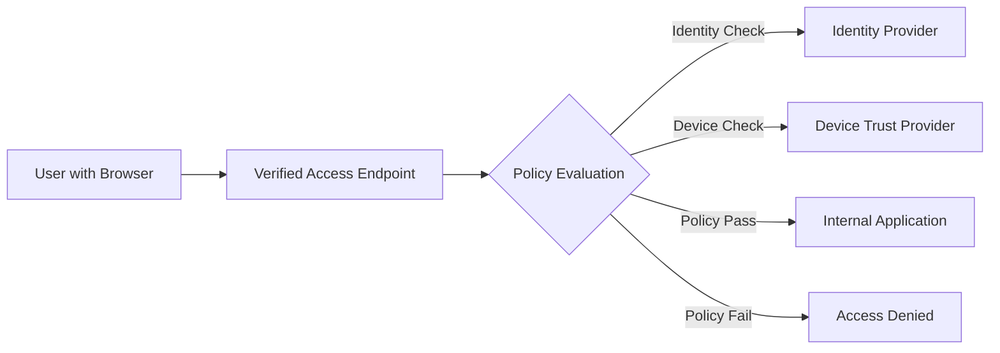

# How to Set Up AWS Verified Access for Secure Application Access

Author: [nawazdhandala](https://github.com/nawazdhandala)

Tags: AWS, Verified Access, Zero Trust, Security, VPN, Identity

Description: Step-by-step guide to configuring AWS Verified Access as a zero-trust alternative to VPNs for securing access to internal applications.

---

VPNs were designed for a different era. They give users broad network access when all they need is access to specific applications. AWS Verified Access takes a different approach: it evaluates every request against security policies before granting access, without requiring a VPN connection. This is zero-trust networking in practice.

## What is AWS Verified Access?

Verified Access is a service that provides secure access to your applications without a VPN. When a user tries to reach an internal application, Verified Access evaluates their identity and the security posture of their device against your policies. If they pass, they get access. If not, they are denied.



Key differences from a VPN:
- Users access specific applications, not the entire network
- Every request is evaluated against policy
- No client software required (browser-based)
- Device security posture can be checked
- Access is logged and auditable

## Components of Verified Access

Understanding the components helps you plan your setup:

**Verified Access Instance**: The top-level container that groups your trust providers and endpoints.

**Trust Provider**: Connects to your identity provider (IdP) or device management system. Verified Access supports OIDC-compatible identity providers and device trust providers like CrowdStrike, Jamf, and JumpCloud.

**Verified Access Group**: A collection of endpoints that share the same access policy.

**Verified Access Endpoint**: Represents a specific application. Maps to a load balancer, network interface, or other backend.

**Access Policy**: Cedar-language policy that defines who can access what under what conditions.

## Step 1: Create a Trust Provider

First, set up the connection to your identity provider.

```bash
# Create an OIDC trust provider (using Okta as an example)
aws ec2 create-verified-access-trust-provider \
    --trust-provider-type user \
    --user-trust-provider-type oidc \
    --oidc-options '{
        "Issuer": "https://your-company.okta.com/oauth2/default",
        "AuthorizationEndpoint": "https://your-company.okta.com/oauth2/default/v1/authorize",
        "TokenEndpoint": "https://your-company.okta.com/oauth2/default/v1/token",
        "UserInfoEndpoint": "https://your-company.okta.com/oauth2/default/v1/userinfo",
        "ClientId": "0oa1234567890abcdef",
        "ClientSecret": "your-client-secret",
        "Scope": "openid profile email groups"
    }' \
    --policy-reference-name "okta" \
    --description "Okta OIDC Identity Provider" \
    --tag-specifications 'ResourceType=verified-access-trust-provider,Tags=[{Key=Name,Value=okta-idp}]'
```

If you also want device posture checking, create a device trust provider:

```bash
# Create a device trust provider (CrowdStrike example)
aws ec2 create-verified-access-trust-provider \
    --trust-provider-type device \
    --device-trust-provider-type crowdstrike \
    --device-options '{
        "TenantId": "your-crowdstrike-tenant-id"
    }' \
    --policy-reference-name "crowdstrike" \
    --description "CrowdStrike Device Trust" \
    --tag-specifications 'ResourceType=verified-access-trust-provider,Tags=[{Key=Name,Value=crowdstrike-device}]'
```

## Step 2: Create the Verified Access Instance

```bash
# Create the Verified Access instance
aws ec2 create-verified-access-instance \
    --description "Corporate Application Access" \
    --tag-specifications 'ResourceType=verified-access-instance,Tags=[{Key=Name,Value=corp-verified-access}]'

# Attach the trust providers
aws ec2 attach-verified-access-trust-provider \
    --verified-access-instance-id vai-0123456789abcdef0 \
    --verified-access-trust-provider-id vatp-okta-0123456789

aws ec2 attach-verified-access-trust-provider \
    --verified-access-instance-id vai-0123456789abcdef0 \
    --verified-access-trust-provider-id vatp-crowdstrike-0123456789
```

## Step 3: Create an Access Group with Policy

Access groups contain the Cedar policy that determines who gets access.

```bash
# Create a Verified Access group with a Cedar policy
aws ec2 create-verified-access-group \
    --verified-access-instance-id vai-0123456789abcdef0 \
    --policy-document '
        permit(principal, action, resource)
        when {
            context.okta.groups.contains("engineering") &&
            context.okta.email_verified == true
        };
    ' \
    --description "Engineering Applications" \
    --tag-specifications 'ResourceType=verified-access-group,Tags=[{Key=Name,Value=engineering-apps}]'
```

### Writing Cedar Policies

Cedar is the policy language used by Verified Access. Here are some practical examples:

```cedar
// Allow only users in the engineering group
permit(principal, action, resource)
when {
    context.okta.groups.contains("engineering")
};

// Allow only from managed devices with acceptable risk score
permit(principal, action, resource)
when {
    context.okta.groups.contains("engineering") &&
    context.crowdstrike.overall_assessment == "meets_requirements"
};

// Allow specific users with MFA verified
permit(principal, action, resource)
when {
    context.okta.email like "*@yourcompany.com" &&
    context.okta.amr.contains("mfa")
};

// Deny access from high-risk devices explicitly
forbid(principal, action, resource)
when {
    context.crowdstrike.overall_assessment == "does_not_meet_requirements"
};
```

## Step 4: Create Endpoints for Your Applications

Each application gets its own endpoint. You can point endpoints at ALBs, NLBs, or network interfaces.

```bash
# Create an endpoint for an internal web application behind an ALB
aws ec2 create-verified-access-endpoint \
    --verified-access-group-id vag-0123456789abcdef0 \
    --endpoint-type load-balancer \
    --attachment-type vpc \
    --domain-certificate-arn arn:aws:acm:us-east-1:123456789012:certificate/abc123 \
    --application-domain "internal-app.yourcompany.com" \
    --endpoint-domain-prefix "internal-app" \
    --load-balancer-options '{
        "LoadBalancerArn": "arn:aws:elasticloadbalancing:us-east-1:123456789012:loadbalancer/app/internal-app/abc123",
        "Port": 443,
        "Protocol": "https",
        "SubnetIds": ["subnet-1a", "subnet-1b"]
    }' \
    --security-group-ids sg-0123456789abcdef0 \
    --description "Internal Application" \
    --tag-specifications 'ResourceType=verified-access-endpoint,Tags=[{Key=Name,Value=internal-app}]'
```

## Step 5: Configure DNS

After creating the endpoint, you get a Verified Access domain. Create a CNAME record pointing your application domain to the Verified Access endpoint.

```bash
# Get the endpoint domain
aws ec2 describe-verified-access-endpoints \
    --verified-access-endpoint-ids vae-0123456789abcdef0 \
    --query 'VerifiedAccessEndpoints[0].EndpointDomain'
# Returns something like: internal-app.abc123.va.us-east-1.amazonaws.com

# Create DNS record in Route 53
aws route53 change-resource-record-sets \
    --hosted-zone-id Z1234567890 \
    --change-batch '{
        "Changes": [{
            "Action": "UPSERT",
            "ResourceRecordSet": {
                "Name": "internal-app.yourcompany.com",
                "Type": "CNAME",
                "TTL": 300,
                "ResourceRecords": [{
                    "Value": "internal-app.abc123.va.us-east-1.amazonaws.com"
                }]
            }
        }]
    }'
```

## Step 6: Enable Access Logging

Verified Access logs are critical for security auditing and troubleshooting access issues.

```bash
# Enable access logs to CloudWatch Logs
aws ec2 modify-verified-access-instance-logging-configuration \
    --verified-access-instance-id vai-0123456789abcdef0 \
    --access-logs '{
        "CloudWatchLogs": {
            "Enabled": true,
            "LogGroup": "/aws/verified-access/corp-access-logs"
        },
        "S3": {
            "Enabled": true,
            "BucketName": "corp-verified-access-logs",
            "Prefix": "access-logs"
        },
        "IncludeTrustContext": true
    }'
```

The logs include:
- Who accessed what application
- When they accessed it
- Whether access was granted or denied
- The trust context (identity claims, device posture) at the time of the request

## Testing Your Setup

Before rolling out to users, test the entire flow:

```bash
# Verify the endpoint is active
aws ec2 describe-verified-access-endpoints \
    --verified-access-endpoint-ids vae-0123456789abcdef0 \
    --query 'VerifiedAccessEndpoints[0].Status.Code'
# Should return "active"

# Test access by navigating to your application URL in a browser
# You should be redirected to your IdP for authentication
# After authenticating, you should reach your application
```

## Migration from VPN

Moving users from VPN to Verified Access should be gradual:

1. Start with one low-risk internal application
2. Create the Verified Access endpoint alongside the existing VPN access
3. Have a pilot group test Verified Access access
4. Once validated, route all users through Verified Access for that application
5. Repeat for additional applications
6. Eventually decommission VPN access for migrated applications

## Troubleshooting Common Issues

**Users getting "Access Denied"**: Check the Cedar policy. Use the access logs to see what trust context was evaluated. The most common issue is a mismatch between the group name in the policy and what the IdP returns.

**Slow page loads**: Verified Access adds a small amount of latency for policy evaluation. If you see significant delays, check the health of your trust providers.

**Certificate errors**: Make sure your ACM certificate matches the application domain and is validated.

## Conclusion

AWS Verified Access replaces the blunt instrument of VPN access with fine-grained, policy-driven application access. It is easier for users (no VPN client needed), more secure for your organization (no broad network access), and more auditable (every access decision is logged). Start with one application, prove the model works, and then expand across your internal application portfolio.
