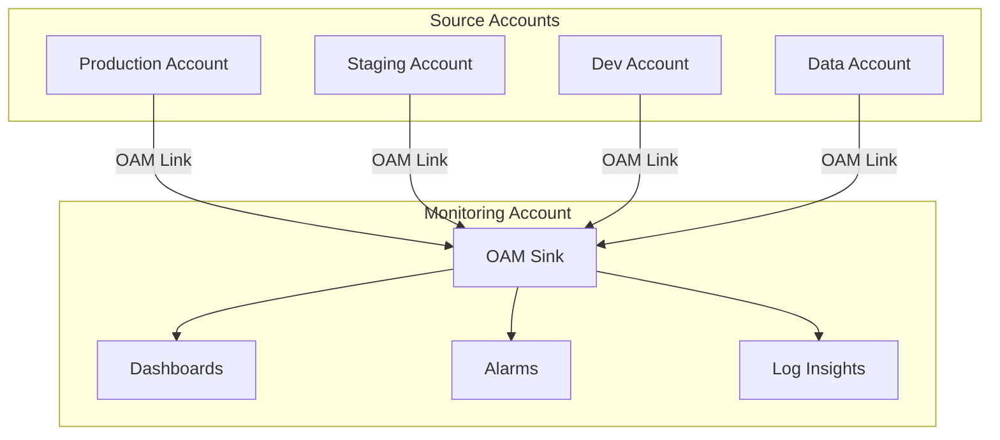

# How to Set Up Centralized Monitoring for Multi-Account AWS

Author: [nawazdhandala](https://github.com/nawazdhandala)

Tags: AWS, Monitoring, Multi-Account, CloudWatch, Organizations, Observability

Description: Build a centralized monitoring architecture across multiple AWS accounts using CloudWatch cross-account observability and Organizations integration.

---

Most organizations start with one AWS account and grow to dozens or hundreds. Each account is an island with its own metrics, logs, traces, and alarms. Your operations team ends up with a browser full of tabs, each logged into a different account. Centralized monitoring brings everything into a single account where your team can see the health of the entire organization from one place.

This guide covers the architecture and step-by-step setup for centralized monitoring across multiple AWS accounts.

## Architecture Overview

The architecture has three layers: source accounts that generate telemetry, a central monitoring account that aggregates it, and dashboards and alarms in the monitoring account that your team uses.



AWS provides this capability through CloudWatch Observability Access Manager (OAM). Source accounts create links to a monitoring account sink, and the monitoring account can then query metrics, logs, and traces from all linked accounts.

## Prerequisites

- AWS Organizations set up with all features enabled
- A dedicated monitoring account (or you can use the management account, but a separate account is cleaner)
- Admin access to both the monitoring account and source accounts
- AWS CLI v2

## Step 1: Set Up the Monitoring Account Sink

In your monitoring account, create an OAM sink. This is the receiving end for telemetry from source accounts.

```bash
# In the monitoring account: create the OAM sink
aws oam create-sink \
  --name "organization-monitoring-sink" \
  --region us-east-1
```

Save the sink ARN from the output. You will need it for every source account link.

Next, create a sink policy that allows accounts in your organization to link to it:

```bash
# Allow any account in your organization to link to this sink
aws oam put-sink-policy \
  --sink-identifier "arn:aws:oam:us-east-1:999888777666:sink/sink-id-here" \
  --policy '{
    "Version": "2012-10-17",
    "Statement": [{
      "Effect": "Allow",
      "Principal": "*",
      "Action": ["oam:CreateLink", "oam:UpdateLink"],
      "Resource": "*",
      "Condition": {
        "ForAnyValue:StringEquals": {
          "aws:PrincipalOrgID": "o-your-org-id"
        }
      }
    }]
  }'
```

The condition restricts access to accounts within your organization, so random AWS accounts cannot link to your sink.

## Step 2: Create Links from Source Accounts

In each source account, create a link to the monitoring account sink. You control which resource types to share.

```bash
# In each source account: create a link to the monitoring sink
aws oam create-link \
  --label-template '$AccountName' \
  --resource-types '["AWS::CloudWatch::Metric", "AWS::Logs::LogGroup", "AWS::XRay::Trace"]' \
  --sink-identifier "arn:aws:oam:us-east-1:999888777666:sink/sink-id-here" \
  --region us-east-1
```

The `label-template` uses `$AccountName` to automatically label data with the source account's name, making it easy to identify in dashboards.

### Automate with CloudFormation StackSets

For organizations with many accounts, use CloudFormation StackSets to deploy the link to all accounts at once:

```yaml
# CloudFormation template for OAM link (deployed via StackSet)
AWSTemplateFormatVersion: '2010-09-09'
Description: Create OAM link to centralized monitoring account

Parameters:
  MonitoringSinkArn:
    Type: String
    Description: ARN of the monitoring account OAM sink

Resources:
  OAMLink:
    Type: AWS::Oam::Link
    Properties:
      LabelTemplate: '$AccountName'
      ResourceTypes:
        - 'AWS::CloudWatch::Metric'
        - 'AWS::Logs::LogGroup'
        - 'AWS::XRay::Trace'
      SinkIdentifier: !Ref MonitoringSinkArn
```

```bash
# Deploy the link to all accounts in the organization
aws cloudformation create-stack-set \
  --stack-set-name oam-monitoring-link \
  --template-body file://oam-link.yaml \
  --parameters ParameterKey=MonitoringSinkArn,ParameterValue=arn:aws:oam:us-east-1:999888777666:sink/sink-id \
  --permission-model SERVICE_MANAGED \
  --auto-deployment Enabled=true,RetainStacksOnAccountRemoval=false

# Deploy to all accounts in the organization
aws cloudformation create-stack-instances \
  --stack-set-name oam-monitoring-link \
  --deployment-targets OrganizationalUnitIds=["ou-root-id"] \
  --regions '["us-east-1"]'
```

With auto-deployment enabled, new accounts added to the organization automatically get the link created.

## Step 3: Set Up Centralized Log Aggregation

With OAM links sharing log groups, you can run CloudWatch Logs Insights queries across all accounts from the monitoring account.

```bash
# Query logs across all linked accounts
# In the monitoring account:
aws logs start-query \
  --log-group-names '/aws/lambda/my-function' \
  --start-time $(date -d '1 hour ago' +%s) \
  --end-time $(date +%s) \
  --query-string 'fields @timestamp, @message | filter @message like /ERROR/ | sort @timestamp desc | limit 50' \
  --region us-east-1
```

The query automatically searches across all linked accounts that have a matching log group. This is powerful for investigating issues that span multiple services in different accounts.

## Step 4: Create Cross-Account Alarms

In the monitoring account, create alarms that reference metrics from source accounts:

```bash
# Create an alarm on a metric from a source account
aws cloudwatch put-metric-alarm \
  --alarm-name "prod-high-cpu" \
  --metric-name "CPUUtilization" \
  --namespace "AWS/EC2" \
  --statistic "Average" \
  --period 300 \
  --evaluation-periods 3 \
  --threshold 90 \
  --comparison-operator "GreaterThanThreshold" \
  --dimensions Name=InstanceId,Value=i-abc123 \
  --alarm-actions "arn:aws:sns:us-east-1:999888777666:ops-alerts" \
  --account-id "111111111111"
```

The `--account-id` parameter tells CloudWatch to evaluate the metric from the linked source account.

## Step 5: Build the Central Dashboard

Create a comprehensive dashboard in the monitoring account that shows data from all accounts:

```json
// Central monitoring dashboard
{
  "widgets": [
    {
      "type": "text",
      "x": 0, "y": 0, "width": 24, "height": 1,
      "properties": {
        "markdown": "## Organization Health Overview"
      }
    },
    {
      "type": "metric",
      "x": 0, "y": 1, "width": 12, "height": 6,
      "properties": {
        "metrics": [
          [{"expression": "SEARCH('{AWS/EC2,InstanceId} MetricName=\"CPUUtilization\"', 'Average', 300)", "id": "prod", "accountId": "111111111111", "label": "Production"}],
          [{"expression": "SEARCH('{AWS/EC2,InstanceId} MetricName=\"CPUUtilization\"', 'Average', 300)", "id": "staging", "accountId": "222222222222", "label": "Staging"}]
        ],
        "title": "EC2 CPU Utilization - All Accounts",
        "view": "timeSeries"
      }
    },
    {
      "type": "metric",
      "x": 12, "y": 1, "width": 12, "height": 6,
      "properties": {
        "metrics": [
          ["AWS/Lambda", "Errors", {"stat": "Sum", "accountId": "111111111111", "label": "Production Lambda Errors"}],
          ["AWS/Lambda", "Errors", {"stat": "Sum", "accountId": "222222222222", "label": "Staging Lambda Errors"}]
        ],
        "title": "Lambda Errors - All Accounts",
        "view": "timeSeries",
        "period": 300
      }
    },
    {
      "type": "alarm",
      "x": 0, "y": 7, "width": 24, "height": 4,
      "properties": {
        "title": "Critical Alarms - All Accounts",
        "alarms": [
          "arn:aws:cloudwatch:us-east-1:999888777666:alarm:prod-high-cpu",
          "arn:aws:cloudwatch:us-east-1:999888777666:alarm:prod-high-errors",
          "arn:aws:cloudwatch:us-east-1:999888777666:alarm:staging-high-cpu"
        ]
      }
    }
  ]
}
```

## Step 6: Centralize CloudTrail Events

While OAM handles metrics, logs, and traces, you also want centralized audit logging. Use a CloudTrail organization trail for this:

```bash
# Create an organization trail in the management account
aws cloudtrail create-trail \
  --name org-audit-trail \
  --s3-bucket-name org-cloudtrail-logs \
  --is-organization-trail \
  --is-multi-region-trail \
  --enable-log-file-validation

aws cloudtrail start-logging --name org-audit-trail
```

See our detailed guide on [CloudTrail Organization Trail for multi-account](https://oneuptime.com/blog/post/set-up-cloudtrail-organization-trail-for-multi-account/view) for the full setup.

## Step 7: Set Up Cross-Account SNS Notifications

Route all alarms from the monitoring account to a central SNS topic:

```bash
# Create a central alert topic
aws sns create-topic --name org-monitoring-alerts

# Subscribe the ops team
aws sns subscribe \
  --topic-arn arn:aws:sns:us-east-1:999888777666:org-monitoring-alerts \
  --protocol email \
  --notification-endpoint ops@example.com

# Subscribe a Slack webhook Lambda
aws sns subscribe \
  --topic-arn arn:aws:sns:us-east-1:999888777666:org-monitoring-alerts \
  --protocol lambda \
  --notification-endpoint arn:aws:lambda:us-east-1:999888777666:function:slack-notifier
```

## Access Control

Not everyone should see everything in the monitoring account. Use IAM policies to restrict access:

```json
// IAM policy to allow viewing only production account metrics
{
  "Version": "2012-10-17",
  "Statement": [
    {
      "Effect": "Allow",
      "Action": [
        "cloudwatch:GetMetricData",
        "cloudwatch:GetDashboard",
        "cloudwatch:ListDashboards"
      ],
      "Resource": "*",
      "Condition": {
        "StringEquals": {
          "cloudwatch:requestedAccountId": "111111111111"
        }
      }
    }
  ]
}
```

## Troubleshooting

**Metrics not showing from a source account**: Verify the OAM link is active with `aws oam list-links` in the source account. Check that the sink policy in the monitoring account allows the source account's organization.

**High latency on cross-account queries**: Cross-account metric queries can be slower than single-account queries. Use specific time ranges and avoid wildcard SEARCH expressions on large accounts.

**Missing log groups**: Make sure the OAM link includes `AWS::Logs::LogGroup` in the resource types. Also verify the log group exists and has recent data.

## Wrapping Up

Centralized monitoring turns your multi-account AWS environment from a fragmented set of islands into a unified operational view. The OAM-based approach is native to AWS, requires no third-party tools, and scales automatically as you add accounts.

For more on building effective dashboards, see [CloudWatch cross-account dashboards](https://oneuptime.com/blog/post/use-cloudwatch-cross-account-dashboards/view) and [health-aware dashboards on AWS](https://oneuptime.com/blog/post/set-up-health-aware-dashboards-on-aws/view). For specific alarm configurations, check out our guides on [CloudWatch alarms for Lambda error rates](https://oneuptime.com/blog/post/create-cloudwatch-alarms-for-lambda-error-rates/view) and [CloudWatch alarms for ECS service health](https://oneuptime.com/blog/post/create-cloudwatch-alarms-for-ecs-service-health/view).
