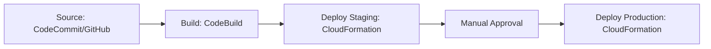

# How to Set Up CI/CD for Lambda Functions with CodePipeline

Author: [nawazdhandala](https://github.com/nawazdhandala)

Tags: AWS, Lambda, CodePipeline, CI/CD, DevOps

Description: Build an automated deployment pipeline for AWS Lambda functions using CodePipeline, CodeBuild, and CloudFormation with staging environments and approval gates.

---

If you're fully invested in the AWS ecosystem, CodePipeline is the native CI/CD solution for deploying Lambda functions. It integrates tightly with CodeCommit, CodeBuild, CloudFormation, and other AWS services without any third-party tools. You get a visual pipeline, built-in approval gates, and deployment tracking all within the AWS console.

Let's build a complete CodePipeline setup for Lambda functions, from source to production.

## Pipeline Architecture

A typical CodePipeline for Lambda consists of these stages:



## Step 1: Set Up the CodeBuild Project

CodeBuild handles testing and packaging your Lambda function. Create a `buildspec.yml` in your repository root:

```yaml
# buildspec.yml - Defines the build process for CodeBuild
version: 0.2

phases:
  install:
    runtime-versions:
      nodejs: 20
    commands:
      - echo "Installing dependencies..."
      - npm ci

  pre_build:
    commands:
      - echo "Running tests..."
      - npm test
      - echo "Running linter..."
      - npm run lint

  build:
    commands:
      - echo "Packaging Lambda function..."
      # Install only production dependencies for the deployment package
      - npm ci --production
      - zip -r function.zip src/ node_modules/ package.json
      - echo "Package size: $(du -sh function.zip | cut -f1)"

  post_build:
    commands:
      - echo "Build completed on $(date)"

artifacts:
  files:
    - function.zip
    - template.yml
  discard-paths: yes

cache:
  paths:
    - 'node_modules/**/*'
```

## Step 2: Create the SAM/CloudFormation Template

Use a SAM template to define your Lambda function. This lets CloudFormation manage deployments:

```yaml
# template.yml - SAM template for the Lambda function
AWSTemplateFormatVersion: '2010-09-09'
Transform: AWS::Serverless-2016-10-31
Description: Lambda function deployed via CodePipeline

Parameters:
  Environment:
    Type: String
    AllowedValues: [staging, production]
    Default: staging
  CodeS3Bucket:
    Type: String
  CodeS3Key:
    Type: String

Globals:
  Function:
    Runtime: nodejs20.x
    Timeout: 30
    MemorySize: 256

Resources:
  ApiFunction:
    Type: AWS::Serverless::Function
    Properties:
      FunctionName: !Sub "my-api-${Environment}"
      Handler: src/handler.handler
      CodeUri:
        Bucket: !Ref CodeS3Bucket
        Key: !Ref CodeS3Key
      Environment:
        Variables:
          ENVIRONMENT: !Ref Environment
          TABLE_NAME: !Sub "my-table-${Environment}"
      AutoPublishAlias: live
      DeploymentPreference:
        Type: !If [IsProduction, Canary10Percent5Minutes, AllAtOnce]
        Alarms:
          - !Ref ApiErrorAlarm

  ApiErrorAlarm:
    Type: AWS::CloudWatch::Alarm
    Properties:
      AlarmName: !Sub "${Environment}-api-errors"
      MetricName: Errors
      Namespace: AWS/Lambda
      Statistic: Sum
      Period: 60
      EvaluationPeriods: 1
      Threshold: 5
      ComparisonOperator: GreaterThanThreshold
      Dimensions:
        - Name: FunctionName
          Value: !Ref ApiFunction

Conditions:
  IsProduction: !Equals [!Ref Environment, production]

Outputs:
  FunctionArn:
    Value: !GetAtt ApiFunction.Arn
  FunctionName:
    Value: !Ref ApiFunction
```

## Step 3: Create the Pipeline

Here's the CloudFormation template that creates the entire pipeline:

```yaml
# pipeline.yml - Creates the CodePipeline and related resources
AWSTemplateFormatVersion: '2010-09-09'
Description: CI/CD Pipeline for Lambda Function

Resources:
  # S3 bucket for pipeline artifacts
  ArtifactBucket:
    Type: AWS::S3::Bucket
    Properties:
      BucketName: !Sub "${AWS::AccountId}-pipeline-artifacts"
      VersioningConfiguration:
        Status: Enabled

  # CodeBuild project
  BuildProject:
    Type: AWS::CodeBuild::Project
    Properties:
      Name: lambda-build
      ServiceRole: !GetAtt CodeBuildRole.Arn
      Artifacts:
        Type: CODEPIPELINE
      Environment:
        Type: LINUX_CONTAINER
        ComputeType: BUILD_GENERAL1_SMALL
        Image: aws/codebuild/amazonlinux2-x86_64-standard:5.0
      Source:
        Type: CODEPIPELINE
        BuildSpec: buildspec.yml
      TimeoutInMinutes: 10

  # The pipeline itself
  Pipeline:
    Type: AWS::CodePipeline::Pipeline
    Properties:
      Name: lambda-deploy-pipeline
      RoleArn: !GetAtt PipelineRole.Arn
      ArtifactStore:
        Type: S3
        Location: !Ref ArtifactBucket

      Stages:
        # Stage 1: Source from GitHub
        - Name: Source
          Actions:
            - Name: SourceAction
              ActionTypeId:
                Category: Source
                Owner: ThirdParty
                Provider: GitHub
                Version: "1"
              Configuration:
                Owner: your-org
                Repo: your-lambda-repo
                Branch: main
                OAuthToken: !Sub "{{resolve:secretsmanager:github-token}}"
              OutputArtifacts:
                - Name: SourceOutput

        # Stage 2: Build and test
        - Name: Build
          Actions:
            - Name: BuildAction
              ActionTypeId:
                Category: Build
                Owner: AWS
                Provider: CodeBuild
                Version: "1"
              Configuration:
                ProjectName: !Ref BuildProject
              InputArtifacts:
                - Name: SourceOutput
              OutputArtifacts:
                - Name: BuildOutput

        # Stage 3: Deploy to staging
        - Name: DeployStaging
          Actions:
            - Name: DeployToStaging
              ActionTypeId:
                Category: Deploy
                Owner: AWS
                Provider: CloudFormation
                Version: "1"
              Configuration:
                ActionMode: CREATE_UPDATE
                StackName: lambda-staging
                TemplatePath: BuildOutput::template.yml
                Capabilities: CAPABILITY_IAM,CAPABILITY_AUTO_EXPAND
                ParameterOverrides: |
                  {
                    "Environment": "staging",
                    "CodeS3Bucket": { "Fn::GetArtifactAtt": ["BuildOutput", "BucketName"] },
                    "CodeS3Key": { "Fn::GetArtifactAtt": ["BuildOutput", "ObjectKey"] }
                  }
                RoleArn: !GetAtt CloudFormationRole.Arn
              InputArtifacts:
                - Name: BuildOutput

        # Stage 4: Manual approval
        - Name: Approval
          Actions:
            - Name: ManualApproval
              ActionTypeId:
                Category: Approval
                Owner: AWS
                Provider: Manual
                Version: "1"
              Configuration:
                NotificationArn: !Ref ApprovalTopic
                CustomData: "Please review the staging deployment before promoting to production."

        # Stage 5: Deploy to production
        - Name: DeployProduction
          Actions:
            - Name: DeployToProduction
              ActionTypeId:
                Category: Deploy
                Owner: AWS
                Provider: CloudFormation
                Version: "1"
              Configuration:
                ActionMode: CREATE_UPDATE
                StackName: lambda-production
                TemplatePath: BuildOutput::template.yml
                Capabilities: CAPABILITY_IAM,CAPABILITY_AUTO_EXPAND
                ParameterOverrides: |
                  {
                    "Environment": "production",
                    "CodeS3Bucket": { "Fn::GetArtifactAtt": ["BuildOutput", "BucketName"] },
                    "CodeS3Key": { "Fn::GetArtifactAtt": ["BuildOutput", "ObjectKey"] }
                  }
                RoleArn: !GetAtt CloudFormationRole.Arn
              InputArtifacts:
                - Name: BuildOutput

  # SNS topic for approval notifications
  ApprovalTopic:
    Type: AWS::SNS::Topic
    Properties:
      TopicName: pipeline-approval
      Subscription:
        - Protocol: email
          Endpoint: team@yourcompany.com
```

## Step 4: IAM Roles

The pipeline needs several IAM roles. Here are the key ones:

```yaml
# IAM role for CodePipeline
PipelineRole:
  Type: AWS::IAM::Role
  Properties:
    AssumeRolePolicyDocument:
      Statement:
        - Effect: Allow
          Principal:
            Service: codepipeline.amazonaws.com
          Action: sts:AssumeRole
    Policies:
      - PolicyName: PipelinePolicy
        PolicyDocument:
          Statement:
            - Effect: Allow
              Action:
                - s3:GetObject
                - s3:PutObject
                - s3:GetBucketVersioning
              Resource:
                - !GetAtt ArtifactBucket.Arn
                - !Sub "${ArtifactBucket.Arn}/*"
            - Effect: Allow
              Action:
                - codebuild:StartBuild
                - codebuild:BatchGetBuilds
              Resource: !GetAtt BuildProject.Arn
            - Effect: Allow
              Action:
                - cloudformation:*
              Resource: "*"
            - Effect: Allow
              Action:
                - iam:PassRole
              Resource: !GetAtt CloudFormationRole.Arn
            - Effect: Allow
              Action: sns:Publish
              Resource: !Ref ApprovalTopic

# IAM role for CodeBuild
CodeBuildRole:
  Type: AWS::IAM::Role
  Properties:
    AssumeRolePolicyDocument:
      Statement:
        - Effect: Allow
          Principal:
            Service: codebuild.amazonaws.com
          Action: sts:AssumeRole
    Policies:
      - PolicyName: CodeBuildPolicy
        PolicyDocument:
          Statement:
            - Effect: Allow
              Action:
                - logs:CreateLogGroup
                - logs:CreateLogStream
                - logs:PutLogEvents
              Resource: "*"
            - Effect: Allow
              Action:
                - s3:GetObject
                - s3:PutObject
              Resource: !Sub "${ArtifactBucket.Arn}/*"
```

## Adding a Test Stage

You can add a test stage between staging deployment and approval that runs integration tests:

```yaml
# Add a testing stage after staging deployment
- Name: IntegrationTest
  Actions:
    - Name: RunTests
      ActionTypeId:
        Category: Build
        Owner: AWS
        Provider: CodeBuild
        Version: "1"
      Configuration:
        ProjectName: !Ref IntegrationTestProject
        EnvironmentVariables: |
          [{"name":"API_ENDPOINT","value":"https://staging-api.yourapp.com","type":"PLAINTEXT"}]
      InputArtifacts:
        - Name: SourceOutput
```

With a separate buildspec for integration tests:

```yaml
# buildspec-integration.yml
version: 0.2
phases:
  install:
    commands:
      - npm ci
  build:
    commands:
      - echo "Running integration tests against staging..."
      - npm run test:integration
```

## Monitoring Pipeline Executions

Set up CloudWatch Events to track pipeline state changes:

```yaml
# Alert on pipeline failures
PipelineFailureRule:
  Type: AWS::Events::Rule
  Properties:
    EventPattern:
      source:
        - aws.codepipeline
      detail-type:
        - "CodePipeline Pipeline Execution State Change"
      detail:
        state:
          - FAILED
        pipeline:
          - !Ref Pipeline
    Targets:
      - Arn: !Ref AlertTopic
        Id: PipelineFailureAlert
```

For more on Lambda monitoring, see [monitoring Lambda performance with CloudWatch](https://oneuptime.com/blog/post/monitor-lambda-function-performance-with-cloudwatch/view).

## Wrapping Up

CodePipeline gives you a fully managed, visual CI/CD pipeline that lives entirely within AWS. It integrates natively with CloudFormation for infrastructure-as-code deployments, supports manual approval gates for production releases, and provides built-in artifact management. The initial setup is more involved than GitHub Actions, but you get tighter integration with the AWS ecosystem and don't need to manage any external CI/CD credentials.
