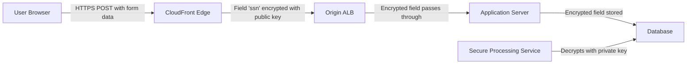
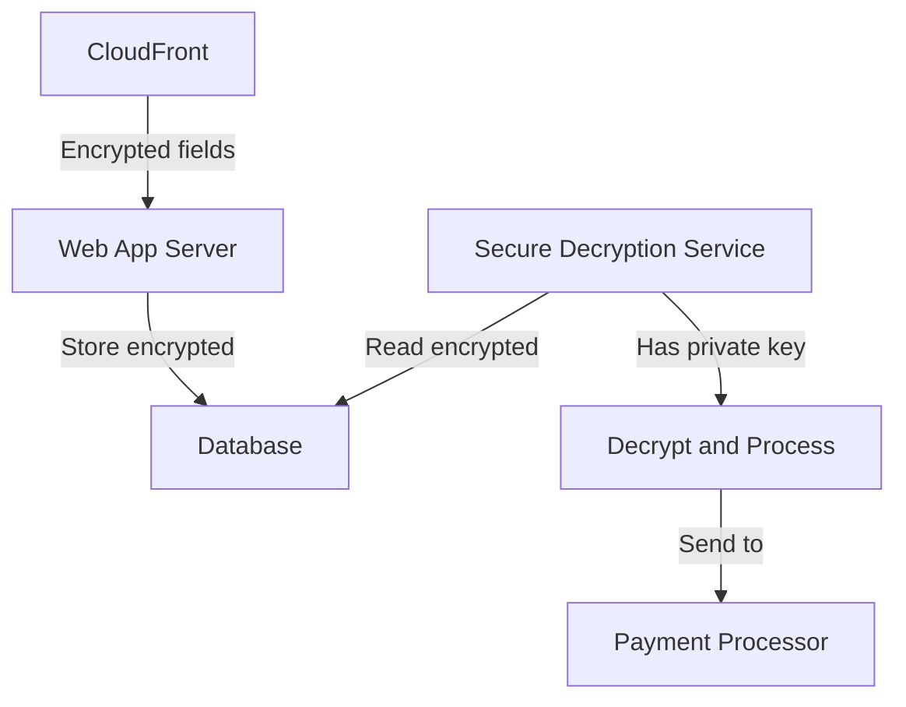

# How to Set Up CloudFront Field-Level Encryption

Author: [nawazdhandala](https://github.com/nawazdhandala)

Tags: AWS, CloudFront, Security, Encryption, PII, Data Protection

Description: Step-by-step guide to configuring CloudFront field-level encryption to protect sensitive form data at the edge before it reaches your origin servers.

---

HTTPS encrypts data in transit, but once a request reaches your origin server, the data is in plaintext. If you handle sensitive fields like credit card numbers, Social Security numbers, or personal health information, you want those fields encrypted as early as possible - ideally at the CDN edge. CloudFront field-level encryption does exactly that.

## How Field-Level Encryption Works

CloudFront field-level encryption intercepts POST requests at the edge, identifies specific form fields, and encrypts them using a public key you provide. The encrypted fields travel through your entire infrastructure - load balancers, web servers, application servers - in encrypted form. Only the component with the private key can decrypt them.



The key benefit: your application servers never see the plaintext sensitive data. Even if your web server is compromised, the attacker cannot read the encrypted fields because the private key is not stored there.

## Prerequisites

- A CloudFront distribution serving your application
- Your application uses POST requests with form-encoded data (application/x-www-form-urlencoded)
- An RSA key pair (2048-bit minimum)

## Step 1: Generate the Key Pair

Generate an RSA key pair. The public key goes to CloudFront. The private key stays with your secure processing service.

```bash
# Generate a 2048-bit RSA private key
openssl genrsa -out private_key.pem 2048

# Extract the public key
openssl rsa -pubout -in private_key.pem -out public_key.pem

# View the public key (you will need this for CloudFront)
cat public_key.pem
```

Store the private key securely. Use AWS Secrets Manager, HSM, or a secure vault. Never put it on your web servers.

## Step 2: Upload the Public Key to CloudFront

```bash
# Read the public key content
PUBLIC_KEY=$(cat public_key.pem)

# Upload the public key to CloudFront
aws cloudfront create-public-key \
    --public-key-config '{
        "CallerReference": "fle-key-2026-02-12",
        "Name": "sensitive-data-encryption-key",
        "EncodedKey": "'"$PUBLIC_KEY"'",
        "Comment": "Public key for field-level encryption of PII"
    }'

# Note the PublicKey Id from the response
# Example: K1234567890ABC
```

## Step 3: Create a Field-Level Encryption Profile

The profile defines which fields to encrypt and which key to use.

```bash
# Create a field-level encryption profile
aws cloudfront create-field-level-encryption-profile \
    --field-level-encryption-profile-config '{
        "Name": "pii-encryption-profile",
        "CallerReference": "fle-profile-2026-02-12",
        "Comment": "Encrypts PII fields in form submissions",
        "EncryptionEntities": {
            "Quantity": 2,
            "Items": [
                {
                    "PublicKeyId": "K1234567890ABC",
                    "ProviderId": "PiiProtection",
                    "FieldPatterns": {
                        "Quantity": 1,
                        "Items": ["ssn"]
                    }
                },
                {
                    "PublicKeyId": "K1234567890ABC",
                    "ProviderId": "PiiProtection",
                    "FieldPatterns": {
                        "Quantity": 1,
                        "Items": ["credit_card"]
                    }
                }
            ]
        }
    }'

# Note the Profile Id
# Example: FLE_PROFILE_ID
```

The `ProviderId` is a string that gets included in the encrypted value. Your decryption service uses it to identify which provider (key) was used for encryption.

## Step 4: Create a Field-Level Encryption Configuration

```bash
# Create the field-level encryption configuration
aws cloudfront create-field-level-encryption-config \
    --field-level-encryption-config '{
        "CallerReference": "fle-config-2026-02-12",
        "Comment": "FLE for customer registration form",
        "QueryArgProfiles": {
            "Config": {
                "ForwardWhenQueryArgProfileIsUnknown": true,
                "QueryArgProfiles": {
                    "Quantity": 0,
                    "Items": []
                }
            }
        },
        "ContentTypeProfileConfig": {
            "ForwardWhenContentTypeIsUnknown": true,
            "ContentTypeProfiles": {
                "Quantity": 1,
                "Items": [
                    {
                        "Format": "URLEncoded",
                        "ProfileId": "FLE_PROFILE_ID",
                        "ContentType": "application/x-www-form-urlencoded"
                    }
                ]
            }
        }
    }'

# Note the Configuration Id
# Example: FLE_CONFIG_ID
```

## Step 5: Associate with CloudFront Distribution

```bash
# Get the current distribution config
aws cloudfront get-distribution-config \
    --id E1234567890ABC > dist-config.json

# Edit the distribution config to add the FLE config ID
# to the cache behavior that handles form submissions
# Add: "FieldLevelEncryptionId": "FLE_CONFIG_ID"

# Update the distribution
aws cloudfront update-distribution \
    --id E1234567890ABC \
    --if-match ETAG_FROM_GET \
    --distribution-config file://updated-dist-config.json
```

In the distribution configuration, the field-level encryption ID goes in the cache behavior:

```json
{
    "CacheBehaviors": {
        "Quantity": 1,
        "Items": [
            {
                "PathPattern": "/api/register",
                "TargetOriginId": "my-origin",
                "ViewerProtocolPolicy": "https-only",
                "FieldLevelEncryptionId": "FLE_CONFIG_ID",
                "AllowedMethods": {
                    "Quantity": 3,
                    "Items": ["GET", "HEAD", "POST"]
                },
                "ForwardedValues": {
                    "QueryString": false,
                    "Cookies": {"Forward": "none"}
                }
            }
        ]
    }
}
```

## How the Encrypted Data Looks

When a user submits a form with `ssn=123-45-6789`, your origin receives something like:

```
ssn=AYABeKrawExample...LongBase64String...==
```

The encrypted value includes:
- The encryption envelope
- The provider ID you configured
- The encrypted field value

Your origin server stores this encrypted blob as-is. It never sees the plaintext value.

## Step 6: Decrypting on the Secure Service

Only the service with the private key can decrypt the fields:

```python
import base64
import json
from cryptography.hazmat.primitives import serialization, hashes
from cryptography.hazmat.primitives.asymmetric import padding

def decrypt_fle_field(encrypted_value, private_key_path):
    """
    Decrypt a CloudFront field-level encrypted value.
    The encrypted value is base64-encoded and contains
    the encrypted data envelope.
    """
    # Load the private key
    with open(private_key_path, 'rb') as key_file:
        private_key = serialization.load_pem_private_key(
            key_file.read(),
            password=None
        )

    # Decode the encrypted value
    encrypted_bytes = base64.b64decode(encrypted_value)

    # The encrypted value contains a JSON envelope with
    # the encrypted symmetric key and the encrypted data
    # Parse and decrypt according to the FLE format

    # Decrypt using RSA-OAEP
    decrypted = private_key.decrypt(
        encrypted_bytes,
        padding.OAEP(
            mgf=padding.MGF1(algorithm=hashes.SHA256()),
            algorithm=hashes.SHA256(),
            label=None
        )
    )

    return decrypted.decode('utf-8')

# Usage in your secure processing service
encrypted_ssn = "AYABeKrawExample...=="
plaintext_ssn = decrypt_fle_field(encrypted_ssn, "/secure/private_key.pem")
print(f"Decrypted SSN: {plaintext_ssn}")
```

## Architecture Patterns

### Pattern 1: Decrypt in a Separate Microservice



The web app never has the private key. Only the secure decryption service can read the sensitive data.

### Pattern 2: Decrypt in Lambda

```python
import boto3
import json

def lambda_handler(event, context):
    """
    Lambda function that decrypts FLE fields for processing.
    Private key is stored in Secrets Manager.
    """
    # Get private key from Secrets Manager
    secrets = boto3.client('secretsmanager')
    private_key = secrets.get_secret_value(
        SecretId='fle-private-key'
    )['SecretString']

    # Decrypt the encrypted field
    encrypted_value = event['encrypted_ssn']
    # ... decryption logic ...

    return {
        'statusCode': 200,
        'body': json.dumps({'processed': True})
    }
```

## Limitations

- Only works with POST requests using `application/x-www-form-urlencoded` content type
- Does not work with `multipart/form-data` or JSON request bodies
- Maximum of 10 fields per profile
- Maximum of 10 profiles per account
- RSA key must be 2048-bit
- Encrypted field values are larger than the original (due to encryption overhead)

## Key Rotation

Periodically rotate your encryption keys:

1. Generate a new key pair
2. Upload the new public key to CloudFront
3. Create a new encryption profile with the new key
4. Update the FLE configuration to use the new profile
5. Your decryption service needs both the old and new private keys during the transition period
6. Once all old encrypted values have been processed, retire the old key

```bash
# Upload new public key
aws cloudfront create-public-key \
    --public-key-config '{
        "CallerReference": "fle-key-rotation-2026-03",
        "Name": "sensitive-data-encryption-key-v2",
        "EncodedKey": "'"$(cat new_public_key.pem)"'",
        "Comment": "Rotated key - March 2026"
    }'
```

For additional CloudFront security configurations, see our guide on [configuring CloudFront response headers policy](https://oneuptime.com/blog/post/configure-cloudfront-response-headers-policy/view).

## Conclusion

CloudFront field-level encryption adds a layer of protection that HTTPS alone cannot provide. By encrypting sensitive fields at the edge, you reduce the attack surface dramatically. Even if every server between CloudFront and your database is compromised, the sensitive data remains encrypted. The setup requires some work - key management, profile configuration, and a decryption service - but for applications handling PII, financial data, or health information, it is a security measure worth implementing.
