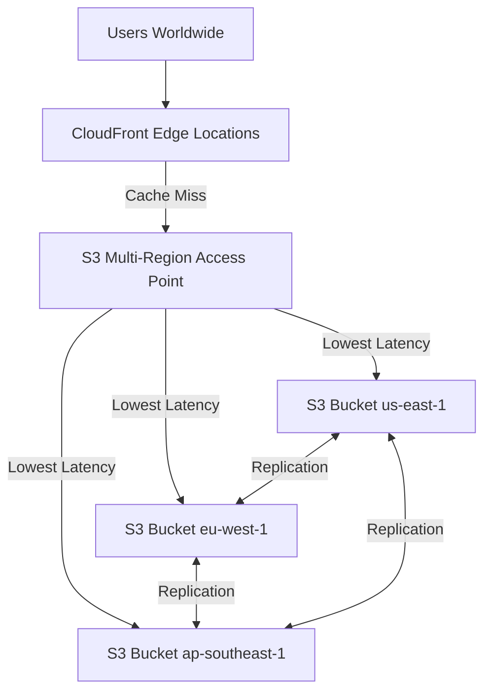

# How to Set Up CloudFront with S3 Multi-Region Access Points

Author: [nawazdhandala](https://github.com/nawazdhandala)

Tags: AWS, CloudFront, S3, Multi-Region, High Availability, Content Delivery

Description: Learn how to configure CloudFront with S3 Multi-Region Access Points for automatic failover and lowest-latency routing to replicated S3 buckets.

---

Serving content from a single S3 bucket in one region works fine until that region has issues. S3 Multi-Region Access Points (MRAP) give you a single endpoint that automatically routes requests to the closest healthy S3 bucket across multiple regions. Combine that with CloudFront, and you get a content delivery architecture that is both fast and resilient.

## How It Works

S3 Multi-Region Access Points provide a global endpoint that routes to the nearest S3 bucket based on network latency. When you pair this with CloudFront, cache misses get served from the closest bucket, and if one region fails, traffic automatically routes to the next closest healthy bucket.



## Step 1: Create S3 Buckets in Multiple Regions

```bash
# Create buckets in each region
aws s3api create-bucket \
    --bucket my-content-us-east-1 \
    --region us-east-1

aws s3api create-bucket \
    --bucket my-content-eu-west-1 \
    --region eu-west-1 \
    --create-bucket-configuration LocationConstraint=eu-west-1

aws s3api create-bucket \
    --bucket my-content-ap-southeast-1 \
    --region ap-southeast-1 \
    --create-bucket-configuration LocationConstraint=ap-southeast-1
```

### Enable Versioning

S3 replication requires versioning on all participating buckets:

```bash
# Enable versioning on all buckets
for BUCKET in my-content-us-east-1 my-content-eu-west-1 my-content-ap-southeast-1; do
    aws s3api put-bucket-versioning \
        --bucket $BUCKET \
        --versioning-configuration Status=Enabled
    echo "Versioning enabled on $BUCKET"
done
```

## Step 2: Configure Cross-Region Replication

Set up replication so content uploaded to any bucket is replicated to all others.

```bash
# Create an IAM role for replication
aws iam create-role \
    --role-name s3-replication-role \
    --assume-role-policy-document '{
        "Version": "2012-10-17",
        "Statement": [
            {
                "Effect": "Allow",
                "Principal": {"Service": "s3.amazonaws.com"},
                "Action": "sts:AssumeRole"
            }
        ]
    }'

# Attach replication permissions
aws iam put-role-policy \
    --role-name s3-replication-role \
    --policy-name s3-replication-policy \
    --policy-document '{
        "Version": "2012-10-17",
        "Statement": [
            {
                "Effect": "Allow",
                "Action": [
                    "s3:GetReplicationConfiguration",
                    "s3:ListBucket",
                    "s3:GetObjectVersionForReplication",
                    "s3:GetObjectVersionAcl",
                    "s3:GetObjectVersionTagging"
                ],
                "Resource": [
                    "arn:aws:s3:::my-content-*",
                    "arn:aws:s3:::my-content-*/*"
                ]
            },
            {
                "Effect": "Allow",
                "Action": [
                    "s3:ReplicateObject",
                    "s3:ReplicateDelete",
                    "s3:ReplicateTags"
                ],
                "Resource": "arn:aws:s3:::my-content-*/*"
            }
        ]
    }'
```

Configure replication rules on the primary bucket:

```bash
# Set up bi-directional replication from us-east-1 to other regions
aws s3api put-bucket-replication \
    --bucket my-content-us-east-1 \
    --replication-configuration '{
        "Role": "arn:aws:iam::123456789012:role/s3-replication-role",
        "Rules": [
            {
                "ID": "replicate-to-eu",
                "Status": "Enabled",
                "Priority": 1,
                "Filter": {"Prefix": ""},
                "Destination": {
                    "Bucket": "arn:aws:s3:::my-content-eu-west-1",
                    "ReplicationTime": {
                        "Status": "Enabled",
                        "Time": {"Minutes": 15}
                    },
                    "Metrics": {
                        "Status": "Enabled",
                        "EventThreshold": {"Minutes": 15}
                    }
                },
                "DeleteMarkerReplication": {"Status": "Enabled"}
            },
            {
                "ID": "replicate-to-apac",
                "Status": "Enabled",
                "Priority": 2,
                "Filter": {"Prefix": ""},
                "Destination": {
                    "Bucket": "arn:aws:s3:::my-content-ap-southeast-1",
                    "ReplicationTime": {
                        "Status": "Enabled",
                        "Time": {"Minutes": 15}
                    },
                    "Metrics": {
                        "Status": "Enabled",
                        "EventThreshold": {"Minutes": 15}
                    }
                },
                "DeleteMarkerReplication": {"Status": "Enabled"}
            }
        ]
    }'
```

## Step 3: Create the Multi-Region Access Point

```bash
# Create the Multi-Region Access Point
aws s3control create-multi-region-access-point \
    --account-id 123456789012 \
    --details '{
        "Name": "my-content-mrap",
        "Regions": [
            {"Bucket": "my-content-us-east-1"},
            {"Bucket": "my-content-eu-west-1"},
            {"Bucket": "my-content-ap-southeast-1"}
        ]
    }'

# Check creation status (takes a few minutes)
aws s3control describe-multi-region-access-point-operation \
    --account-id 123456789012 \
    --request-token-arn "arn:aws:s3:us-west-2:123456789012:async-request/mrap/create/abc123"
```

Once created, the MRAP endpoint looks like:
`my-content-mrap.mrap.accesspoint.s3-global.amazonaws.com`

## Step 4: Configure CloudFront

### Create an Origin Access Control

CloudFront needs Origin Access Control (OAC) to authenticate requests to the MRAP.

```bash
# Create OAC for the MRAP
aws cloudfront create-origin-access-control \
    --origin-access-control-config '{
        "Name": "mrap-oac",
        "Description": "OAC for S3 Multi-Region Access Point",
        "SigningProtocol": "sigv4",
        "SigningBehavior": "always",
        "OriginAccessControlOriginType": "s3"
    }'
```

### Create the CloudFront Distribution

```bash
# Create CloudFront distribution with MRAP as origin
aws cloudfront create-distribution \
    --distribution-config '{
        "CallerReference": "mrap-dist-2026-02-12",
        "Comment": "Distribution with S3 Multi-Region Access Point",
        "Enabled": true,
        "Origins": {
            "Quantity": 1,
            "Items": [
                {
                    "Id": "mrap-origin",
                    "DomainName": "my-content-mrap.mrap.accesspoint.s3-global.amazonaws.com",
                    "OriginAccessControlId": "OAC_ID_HERE",
                    "S3OriginConfig": {
                        "OriginAccessIdentity": ""
                    }
                }
            ]
        },
        "DefaultCacheBehavior": {
            "TargetOriginId": "mrap-origin",
            "ViewerProtocolPolicy": "redirect-to-https",
            "CachePolicyId": "658327ea-f89d-4fab-a63d-7e88639e58f6",
            "AllowedMethods": {
                "Quantity": 2,
                "Items": ["GET", "HEAD"]
            },
            "Compress": true
        },
        "PriceClass": "PriceClass_All",
        "ViewerCertificate": {
            "CloudFrontDefaultCertificate": true
        }
    }'
```

## Step 5: Configure S3 Bucket Policies

Each bucket needs a policy allowing CloudFront to access objects through the MRAP:

```bash
# Apply bucket policy to each bucket
for BUCKET in my-content-us-east-1 my-content-eu-west-1 my-content-ap-southeast-1; do
    aws s3api put-bucket-policy \
        --bucket $BUCKET \
        --policy '{
            "Version": "2012-10-17",
            "Statement": [
                {
                    "Sid": "AllowCloudFrontViaMRAP",
                    "Effect": "Allow",
                    "Principal": {
                        "Service": "cloudfront.amazonaws.com"
                    },
                    "Action": "s3:GetObject",
                    "Resource": "arn:aws:s3:::'$BUCKET'/*",
                    "Condition": {
                        "StringEquals": {
                            "aws:SourceArn": "arn:aws:cloudfront::123456789012:distribution/E1234567890ABC"
                        }
                    }
                }
            ]
        }'
    echo "Bucket policy applied to $BUCKET"
done
```

## Step 6: Configure Failover Routing

MRAP supports active-active and active-passive routing configurations:

```bash
# Configure active-active routing (all regions active)
aws s3control put-multi-region-access-point-routing-configuration \
    --account-id 123456789012 \
    --mrap "arn:aws:s3::123456789012:accesspoint/my-content-mrap.mrap" \
    --route-updates '[
        {
            "Bucket": "my-content-us-east-1",
            "Region": "us-east-1",
            "TrafficDialPercentage": 100
        },
        {
            "Bucket": "my-content-eu-west-1",
            "Region": "eu-west-1",
            "TrafficDialPercentage": 100
        },
        {
            "Bucket": "my-content-ap-southeast-1",
            "Region": "ap-southeast-1",
            "TrafficDialPercentage": 100
        }
    ]'
```

For failover scenarios, you can set a region to 0% to stop routing traffic there:

```bash
# Failover: remove us-east-1 from active routing
aws s3control put-multi-region-access-point-routing-configuration \
    --account-id 123456789012 \
    --mrap "arn:aws:s3::123456789012:accesspoint/my-content-mrap.mrap" \
    --route-updates '[
        {
            "Bucket": "my-content-us-east-1",
            "Region": "us-east-1",
            "TrafficDialPercentage": 0
        }
    ]'
```

## Testing the Setup

```bash
# Upload content to one bucket
aws s3 cp test-image.jpg s3://my-content-us-east-1/images/test-image.jpg

# Wait for replication (check replication status)
aws s3api head-object \
    --bucket my-content-eu-west-1 \
    --key images/test-image.jpg \
    --query 'ReplicationStatus'

# Access via CloudFront
curl -I https://d1234567890abc.cloudfront.net/images/test-image.jpg

# Verify it works from different regions using global testing tools
```

## Monitoring

### Replication Monitoring

```bash
# Check replication metrics
aws cloudwatch get-metric-statistics \
    --namespace AWS/S3 \
    --metric-name ReplicationLatency \
    --dimensions Name=SourceBucket,Value=my-content-us-east-1 \
                 Name=DestinationBucket,Value=my-content-eu-west-1 \
                 Name=RuleId,Value=replicate-to-eu \
    --start-time "2026-02-12T00:00:00Z" \
    --end-time "2026-02-13T00:00:00Z" \
    --period 3600 \
    --statistics Average
```

### CloudFront Cache Hit Ratio

```bash
# Monitor cache hit ratio to ensure CloudFront is caching effectively
aws cloudwatch get-metric-statistics \
    --namespace AWS/CloudFront \
    --metric-name CacheHitRate \
    --dimensions Name=DistributionId,Value=E1234567890ABC \
    --start-time "2026-02-12T00:00:00Z" \
    --end-time "2026-02-13T00:00:00Z" \
    --period 3600 \
    --statistics Average
```

## Cost Considerations

This architecture adds costs in several areas:
- S3 storage in multiple regions (2x or 3x storage)
- S3 replication data transfer
- MRAP request processing
- CloudFront data transfer and requests

However, the latency improvement for global users and the availability improvement from multi-region failover often justify the cost. For cost optimization strategies, see our post on [implementing post-migration optimization on AWS](https://oneuptime.com/blog/post/implement-post-migration-optimization-on-aws/view).

## Conclusion

CloudFront with S3 Multi-Region Access Points gives you the best of both worlds: CloudFront edge caching for fast content delivery and multi-region S3 for origin resilience. Users always get content from the closest location, and if an entire AWS region goes down, the MRAP automatically routes to the next closest healthy bucket. Set up replication, create the MRAP, point CloudFront at it, and you have a content delivery architecture that handles regional failures gracefully.
