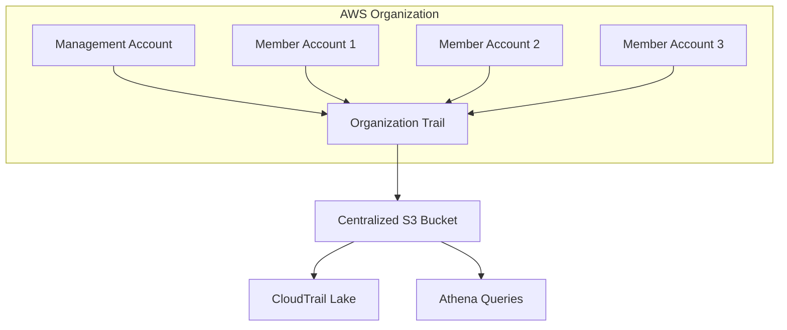

# How to Set Up CloudTrail Organization Trail for Multi-Account

Author: [nawazdhandala](https://github.com/nawazdhandala)

Tags: AWS, CloudTrail, Organizations, Multi-Account, Security, Compliance

Description: Create an AWS CloudTrail organization trail to centralize API activity logging across all accounts in your AWS Organization.

---

If your company uses multiple AWS accounts (and most do), you have a problem: each account has its own CloudTrail, its own S3 bucket, and its own set of logs. Investigating a security incident means hopping between accounts and piecing together a timeline from scattered log files. An organization trail solves this by sending CloudTrail events from every account in your AWS Organization to a single S3 bucket in your management or security account.

One trail, one bucket, all accounts. Let me show you how to set it up.

## Architecture

An organization trail is created in the management account (or a delegated administrator account) and automatically applies to all member accounts. Events flow from every account to a centralized S3 bucket.



When new accounts join the organization, they automatically start sending events to the trail. No per-account setup needed.

## Prerequisites

- AWS Organizations enabled with all features
- Access to the management account (or a delegated admin account)
- An S3 bucket for log storage (we will create one)
- AWS CLI configured for the management account

## Step 1: Create the Centralized S3 Bucket

The S3 bucket needs a specific bucket policy to allow CloudTrail from all organization accounts to write to it.

```bash
# Create the centralized log bucket
aws s3 mb s3://org-cloudtrail-logs-123456789012 \
  --region us-east-1
```

Now apply the bucket policy. This policy grants CloudTrail write access from any account in the organization.

```json
// S3 bucket policy for organization-wide CloudTrail
{
  "Version": "2012-10-17",
  "Statement": [
    {
      "Sid": "AWSCloudTrailAclCheck",
      "Effect": "Allow",
      "Principal": {
        "Service": "cloudtrail.amazonaws.com"
      },
      "Action": "s3:GetBucketAcl",
      "Resource": "arn:aws:s3:::org-cloudtrail-logs-123456789012",
      "Condition": {
        "StringEquals": {
          "aws:SourceArn": "arn:aws:cloudtrail:us-east-1:123456789012:trail/org-trail"
        }
      }
    },
    {
      "Sid": "AWSCloudTrailWrite",
      "Effect": "Allow",
      "Principal": {
        "Service": "cloudtrail.amazonaws.com"
      },
      "Action": "s3:PutObject",
      "Resource": "arn:aws:s3:::org-cloudtrail-logs-123456789012/AWSLogs/o-orgid123/*",
      "Condition": {
        "StringEquals": {
          "s3:x-amz-acl": "bucket-owner-full-control",
          "aws:SourceArn": "arn:aws:cloudtrail:us-east-1:123456789012:trail/org-trail"
        }
      }
    }
  ]
}
```

```bash
# Apply the bucket policy
aws s3api put-bucket-policy \
  --bucket org-cloudtrail-logs-123456789012 \
  --policy file://bucket-policy.json
```

Note the path pattern in the Resource: `AWSLogs/o-orgid123/*`. CloudTrail organizes logs by organization ID, then by account ID, region, and date. This makes it easy to query specific accounts later.

## Step 2: Enable Server-Side Encryption

For compliance, encrypt the log files at rest using a KMS key.

```bash
# Create a KMS key for CloudTrail encryption
KEY_ID=$(aws kms create-key \
  --description "CloudTrail Organization Trail Encryption" \
  --query "KeyMetadata.KeyId" \
  --output text)

# Create an alias for easy reference
aws kms create-alias \
  --alias-name alias/cloudtrail-org \
  --target-key-id $KEY_ID
```

The KMS key policy needs to allow CloudTrail to use it:

```json
// KMS key policy statement for CloudTrail
{
  "Sid": "AllowCloudTrailEncrypt",
  "Effect": "Allow",
  "Principal": {
    "Service": "cloudtrail.amazonaws.com"
  },
  "Action": [
    "kms:GenerateDataKey*",
    "kms:DescribeKey"
  ],
  "Resource": "*",
  "Condition": {
    "StringLike": {
      "kms:EncryptionContext:aws:cloudtrail:arn": "arn:aws:cloudtrail:*:123456789012:trail/*"
    }
  }
}
```

## Step 3: Create the Organization Trail

Now create the trail itself. The `--is-organization-trail` flag is what makes it span all accounts.

```bash
# Create the organization trail
aws cloudtrail create-trail \
  --name org-trail \
  --s3-bucket-name org-cloudtrail-logs-123456789012 \
  --is-organization-trail \
  --is-multi-region-trail \
  --enable-log-file-validation \
  --kms-key-id alias/cloudtrail-org \
  --include-global-service-events
```

Key flags explained:

- **is-organization-trail**: Applies to all accounts in the organization
- **is-multi-region-trail**: Captures events from all AWS regions
- **enable-log-file-validation**: Creates digest files for tamper detection
- **include-global-service-events**: Captures events for global services like IAM and STS

## Step 4: Start Logging

Creating the trail does not start logging. You need to explicitly start it.

```bash
# Start the organization trail
aws cloudtrail start-logging --name org-trail

# Verify the trail status
aws cloudtrail get-trail-status --name org-trail
```

The output should show `IsLogging: true` and `LatestDeliveryTime` should update within a few minutes.

## Step 5: Configure Data Event Logging (Optional)

By default, the trail only captures management events (like creating resources and modifying permissions). To also capture data events (like reading S3 objects or invoking Lambda functions), add event selectors.

```bash
# Add S3 data event logging for specific buckets
aws cloudtrail put-event-selectors \
  --trail-name org-trail \
  --advanced-event-selectors '[
    {
      "Name": "Management events",
      "FieldSelectors": [
        {"Field": "eventCategory", "Equals": ["Management"]}
      ]
    },
    {
      "Name": "S3 data events for sensitive buckets",
      "FieldSelectors": [
        {"Field": "eventCategory", "Equals": ["Data"]},
        {"Field": "resources.type", "Equals": ["AWS::S3::Object"]},
        {"Field": "resources.ARN", "StartsWith": ["arn:aws:s3:::sensitive-data-bucket/"]}
      ]
    }
  ]'
```

Be selective with data events. Logging every S3 GetObject across an entire organization can produce terabytes of logs and a hefty bill.

## Step 6: Send Events to CloudWatch Logs

For real-time alerting, send trail events to a CloudWatch Logs log group. This lets you create metric filters and alarms for specific API activities.

```bash
# Create a log group for CloudTrail events
aws logs create-log-group \
  --log-group-name /aws/cloudtrail/org-trail \
  --region us-east-1

# Create the IAM role for CloudTrail to write to CloudWatch Logs
aws iam create-role \
  --role-name CloudTrailToCloudWatchRole \
  --assume-role-policy-document '{
    "Version": "2012-10-17",
    "Statement": [{
      "Effect": "Allow",
      "Principal": {"Service": "cloudtrail.amazonaws.com"},
      "Action": "sts:AssumeRole"
    }]
  }'

aws iam put-role-policy \
  --role-name CloudTrailToCloudWatchRole \
  --policy-name CloudWatchLogsAccess \
  --policy-document '{
    "Version": "2012-10-17",
    "Statement": [{
      "Effect": "Allow",
      "Action": ["logs:CreateLogStream", "logs:PutLogEvents"],
      "Resource": "arn:aws:logs:us-east-1:123456789012:log-group:/aws/cloudtrail/org-trail:*"
    }]
  }'

# Update the trail to send events to CloudWatch Logs
aws cloudtrail update-trail \
  --name org-trail \
  --cloud-watch-logs-log-group-arn "arn:aws:logs:us-east-1:123456789012:log-group:/aws/cloudtrail/org-trail:*" \
  --cloud-watch-logs-role-arn "arn:aws:iam::123456789012:role/CloudTrailToCloudWatchRole"
```

## Step 7: Set Up S3 Lifecycle Policies

Even with CloudTrail Lake for querying, you want lifecycle policies on the S3 bucket to manage storage costs.

```bash
# Set up lifecycle policy: transition to Glacier after 90 days, delete after 365 days
aws s3api put-bucket-lifecycle-configuration \
  --bucket org-cloudtrail-logs-123456789012 \
  --lifecycle-configuration '{
    "Rules": [
      {
        "ID": "Archive old logs",
        "Status": "Enabled",
        "Transitions": [
          {
            "Days": 90,
            "StorageClass": "GLACIER"
          }
        ],
        "Expiration": {
          "Days": 365
        },
        "Filter": {
          "Prefix": "AWSLogs/"
        }
      }
    ]
  }'
```

Adjust the retention periods based on your compliance requirements. Some regulations require 7 years of audit logs.

## Step 8: Validate the Setup

After a few minutes, verify that logs are appearing from multiple accounts.

```bash
# List objects in the trail bucket to verify multi-account delivery
aws s3 ls s3://org-cloudtrail-logs-123456789012/AWSLogs/o-orgid123/ \
  --recursive | head -20
```

You should see directories for each account ID in your organization.

## Delegated Administrator

If you prefer not to manage the trail from the management account, designate a security or audit account as a delegated administrator:

```bash
# Register a delegated administrator for CloudTrail
aws organizations register-delegated-administrator \
  --account-id 999888777666 \
  --service-principal cloudtrail.amazonaws.com
```

The delegated admin can then create and manage organization trails without needing management account access.

## Troubleshooting

**Trail is logging but no files in S3**: Check the bucket policy. The principal `cloudtrail.amazonaws.com` must have both `GetBucketAcl` and `PutObject` permissions with the correct condition keys.

**Missing events from specific accounts**: Verify the account is part of the organization and has not explicitly disabled the trail (member accounts cannot disable an organization trail, but check for SCP restrictions).

**KMS errors**: Make sure the KMS key policy allows CloudTrail to encrypt. Also verify the key is in the same region as the trail.

## Wrapping Up

An organization trail is foundational for security in a multi-account AWS environment. Set it up once, and every account's API activity flows to a single bucket automatically. Combine it with CloudTrail Lake for SQL-based analysis (see [CloudTrail Lake for advanced event analysis](https://oneuptime.com/blog/post/use-cloudtrail-lake-for-advanced-event-analysis/view)) or with EventBridge for real-time detection (see [detecting unauthorized API calls with CloudTrail and EventBridge](https://oneuptime.com/blog/post/detect-unauthorized-api-calls-with-cloudtrail-and-eventbridge/view)).
