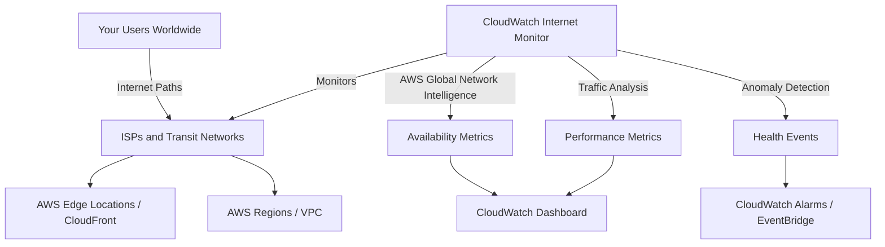

# How to Set Up CloudWatch Internet Monitor for Application Availability

Author: [nawazdhandala](https://github.com/nawazdhandala)

Tags: AWS, CloudWatch, Internet Monitor, Availability, Performance, Monitoring

Description: Set up Amazon CloudWatch Internet Monitor to track application availability and performance from your users' perspective across global internet paths

---

Traditional monitoring tells you if your servers are healthy. But your users do not connect directly to your servers. Their traffic crosses ISPs, transit networks, CDN edges, and internet exchange points before reaching your infrastructure. A perfectly healthy server means nothing if the internet path between your users and your application is degraded.

Amazon CloudWatch Internet Monitor gives you visibility into this gap. It uses AWS's global network intelligence to monitor the internet paths between your users and your AWS-hosted applications. When an ISP has an outage in a specific city, when a peering point is congested, or when a CDN edge location is degraded, Internet Monitor detects it and tells you which of your users are affected.

This guide covers setting up Internet Monitor, understanding its data, and using it to make informed decisions about your application's availability.

## How Internet Monitor Works



Internet Monitor analyzes traffic flowing through AWS services (CloudFront, WorkSpaces, etc.) and correlates it with global internet health data. It does not require any agents or instrumentation on your side. You tell it which AWS resources to monitor, and it starts tracking availability and performance.

## Step 1: Create an Internet Monitor

```bash
# Create an Internet Monitor for your application
aws internetmonitor create-monitor \
  --monitor-name "production-app" \
  --resources \
    "arn:aws:cloudfront::123456789012:distribution/EDFDVBD6EXAMPLE" \
    "arn:aws:ec2:us-east-1:123456789012:vpc/vpc-abc123" \
  --max-city-networks-to-monitor 100 \
  --traffic-percentage-to-monitor 100 \
  --internet-measurements-log-delivery '{
    "S3Config": {
      "BucketName": "internet-monitor-logs",
      "BucketPrefix": "production-app",
      "LogDeliveryStatus": "ENABLED"
    }
  }' \
  --tags Environment=production
```

Key configuration:

- **resources**: The AWS resources that serve your application's traffic. CloudFront distributions and VPCs are the most common.
- **max-city-networks-to-monitor**: Maximum number of city-network (city + ISP) combinations to monitor. Higher values give more granular insights but cost more.
- **traffic-percentage-to-monitor**: What percentage of traffic to analyze. 100% gives full visibility.

## Step 2: Understand the Monitored Resources

Internet Monitor can track traffic for:

- **CloudFront distributions**: Monitors the internet paths from users to CloudFront edge locations
- **VPCs**: Monitors internet paths from users to your VPC (for applications behind ALB/NLB)
- **WorkSpaces directories**: Monitors paths to WorkSpaces virtual desktops

For a typical web application, you would monitor both your CloudFront distribution (for static content and CDN-served pages) and your VPC (for API traffic that goes directly to your load balancer).

```bash
# Add a VPC to an existing monitor
aws internetmonitor update-monitor \
  --monitor-name "production-app" \
  --resources-to-add \
    "arn:aws:ec2:us-east-1:123456789012:vpc/vpc-def456"

# Remove a resource
aws internetmonitor update-monitor \
  --monitor-name "production-app" \
  --resources-to-remove \
    "arn:aws:ec2:us-east-1:123456789012:vpc/vpc-old789"
```

## Step 3: View Monitor Health

Once the monitor is running, it starts collecting data within minutes. You can query the health status through the CLI or console.

```bash
# Get the current monitor status
aws internetmonitor get-monitor \
  --monitor-name "production-app"

# List health events (outages and performance degradations)
aws internetmonitor list-health-events \
  --monitor-name "production-app" \
  --event-status ACTIVE

# Get details of a specific health event
aws internetmonitor get-health-event \
  --monitor-name "production-app" \
  --event-id "event-abc123"
```

## Step 4: Understanding Health Events

Internet Monitor generates health events when it detects significant availability or performance changes. Each event includes:

- **Impact type**: Availability or performance
- **Impacted locations**: Which cities and ISPs are affected
- **Traffic impact**: How much of your traffic is affected (percentage and estimated bytes)
- **Start and end time**: When the issue started and resolved
- **Status**: Active or resolved

Here is what a health event looks like:

```json
{
  "EventId": "event-abc123",
  "EventArn": "arn:aws:internetmonitor:us-east-1:123456789012:monitor/production-app/health-event/event-abc123",
  "StartedAt": "2024-01-15T10:30:00Z",
  "Status": "ACTIVE",
  "ImpactType": "AVAILABILITY",
  "PercentOfTotalTrafficImpacted": 3.5,
  "ImpactedLocations": [
    {
      "ASName": "Comcast Cable Communications",
      "ASNumber": 7922,
      "Country": "US",
      "Subdivision": "California",
      "Metro": "Los Angeles",
      "City": "Los Angeles",
      "CausedBy": {
        "Networks": [
          {
            "ASName": "Comcast Cable Communications",
            "ASNumber": 7922
          }
        ],
        "NetworkEventType": "AWS"
      },
      "Status": "ACTIVE",
      "ServiceLocation": "us-west-2"
    }
  ]
}
```

This tells you that Comcast users in Los Angeles are experiencing availability issues when accessing your application, and it affects 3.5% of your total traffic.

## Step 5: Set Up Automated Alerting

Use EventBridge to trigger actions when health events occur.

```bash
# Create an EventBridge rule for Internet Monitor health events
aws events put-rule \
  --name internet-monitor-alerts \
  --event-pattern '{
    "source": ["aws.internetmonitor"],
    "detail-type": ["Internet Monitor Health Event Created"],
    "detail": {
      "MonitorName": ["production-app"]
    }
  }'

# Add an SNS target for notifications
aws events put-targets \
  --rule internet-monitor-alerts \
  --targets '[
    {
      "Id": "sns-notification",
      "Arn": "arn:aws:sns:us-east-1:123456789012:internet-health-alerts"
    }
  ]'
```

You can also create CloudWatch alarms on Internet Monitor metrics.

```bash
# Alarm when availability drops below 99%
aws cloudwatch put-metric-alarm \
  --alarm-name internet-availability-low \
  --namespace AWS/InternetMonitor \
  --metric-name AvailabilityScore \
  --dimensions Name=MonitorName,Value=production-app \
  --statistic Average \
  --period 300 \
  --threshold 99 \
  --comparison-operator LessThanThreshold \
  --evaluation-periods 2 \
  --alarm-actions arn:aws:sns:us-east-1:123456789012:ops-alerts

# Alarm when performance score drops
aws cloudwatch put-metric-alarm \
  --alarm-name internet-performance-low \
  --namespace AWS/InternetMonitor \
  --metric-name PerformanceScore \
  --dimensions Name=MonitorName,Value=production-app \
  --statistic Average \
  --period 300 \
  --threshold 95 \
  --comparison-operator LessThanThreshold \
  --evaluation-periods 3 \
  --alarm-actions arn:aws:sns:us-east-1:123456789012:ops-alerts
```

## Step 6: Build a Dashboard

Create a CloudWatch dashboard that shows your internet-facing availability alongside traditional infrastructure metrics.

```bash
aws cloudwatch put-dashboard \
  --dashboard-name Internet-Health \
  --dashboard-body '{
    "widgets": [
      {
        "type": "metric",
        "properties": {
          "title": "Availability Score",
          "metrics": [
            ["AWS/InternetMonitor", "AvailabilityScore", "MonitorName", "production-app"]
          ],
          "period": 300,
          "stat": "Average",
          "view": "gauge",
          "yAxis": {"left": {"min": 90, "max": 100}}
        }
      },
      {
        "type": "metric",
        "properties": {
          "title": "Performance Score",
          "metrics": [
            ["AWS/InternetMonitor", "PerformanceScore", "MonitorName", "production-app"]
          ],
          "period": 300,
          "stat": "Average",
          "view": "gauge",
          "yAxis": {"left": {"min": 90, "max": 100}}
        }
      },
      {
        "type": "metric",
        "properties": {
          "title": "Traffic by Location",
          "metrics": [
            ["AWS/InternetMonitor", "TrafficMonitoredBytesIn", "MonitorName", "production-app"]
          ],
          "period": 3600,
          "stat": "Sum"
        }
      }
    ]
  }'
```

## Step 7: Use Internet Monitor Data for Decisions

Internet Monitor data is not just for alerting. It helps you make architectural decisions.

### Choosing CloudFront Edge Locations

If Internet Monitor shows consistently poor performance from certain regions, you can adjust your CloudFront cache behavior or origin configuration to improve it.

### Identifying ISP-Specific Issues

When a specific ISP consistently shows lower availability, you can:
- Contact the ISP's peering team if you have a relationship
- Add alternative routing through AWS Global Accelerator
- Adjust your CDN configuration to route traffic through different edge locations

### Planning Multi-Region Deployments

Internet Monitor data shows you where your traffic comes from and which paths have issues. This informs decisions about where to deploy additional application regions.

## Querying Historical Data

Internet Monitor stores measurement logs in S3 (if configured). You can query them with Athena for historical analysis.

```sql
-- Create an Athena table for Internet Monitor logs
CREATE EXTERNAL TABLE internet_monitor_logs (
  timestamp string,
  monitor_name string,
  city string,
  subdivision string,
  country string,
  as_name string,
  as_number int,
  availability_score double,
  performance_score double,
  bytes_in bigint,
  bytes_out bigint
)
ROW FORMAT SERDE 'org.apache.hive.hcatalog.data.JsonSerDe'
LOCATION 's3://internet-monitor-logs/production-app/'
```

```sql
-- Find the top 10 city-ISP combinations with lowest availability
SELECT city, as_name, country,
       AVG(availability_score) as avg_availability,
       SUM(bytes_in) as total_bytes
FROM internet_monitor_logs
WHERE timestamp > date_add('day', -7, current_timestamp)
GROUP BY city, as_name, country
HAVING SUM(bytes_in) > 1000000
ORDER BY avg_availability ASC
LIMIT 10
```

## Cost Considerations

Internet Monitor pricing is based on the number of city-networks monitored per month. The first 100 city-networks are included at a base price. Additional city-networks cost extra.

For most applications, 100 city-networks cover the vast majority of your traffic. Increase the limit only if you have a truly global user base and need granular insights for long-tail locations.

## Combining with Synthetics

Internet Monitor and CloudWatch Synthetics complement each other. Internet Monitor gives you passive, real-traffic-based visibility. Synthetics gives you active, probing-based checks.

| Capability | Internet Monitor | Synthetics Canaries |
|-----------|-----------------|-------------------|
| Requires real traffic | Yes | No |
| Detects ISP issues | Yes | Limited |
| Tests specific user flows | No | Yes |
| Works during zero-traffic periods | No | Yes |
| Shows geographic impact | Yes | Per-region canaries |

Use both for complete coverage. For more on Synthetics monitoring, see our guide on [monitoring website availability with CloudWatch Synthetics](https://oneuptime.com/blog/post/monitor-website-availability-with-cloudwatch-synthetics/view).

## Wrapping Up

CloudWatch Internet Monitor gives you a view of your application's availability that traditional monitoring cannot provide. It monitors the internet paths between your users and your infrastructure, detecting ISP outages, routing issues, and performance degradations that your server-side metrics would never see. Combined with CloudWatch alarms and EventBridge, you get automated alerting when internet issues affect your users. The setup is straightforward - point it at your CloudFront distributions and VPCs, and it starts monitoring immediately. Use the data to make informed decisions about your CDN configuration, multi-region strategy, and incident response.
