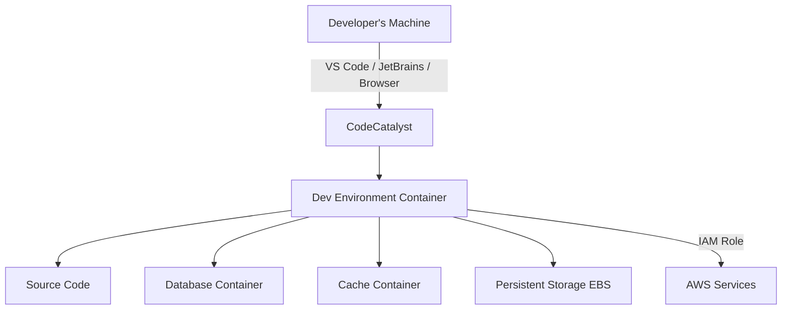

# How to Set Up CodeCatalyst Dev Environments

Author: [nawazdhandala](https://github.com/nawazdhandala)

Tags: AWS, CodeCatalyst, Dev Environments, Cloud IDE, Development, Remote Development

Description: Learn how to set up and configure CodeCatalyst Dev Environments for cloud-based development with consistent tooling and IDE integration.

---

Local development environments are the bane of every engineering team. New developers spend hours or even days getting their machines configured. Tools drift out of sync. "Works on my machine" becomes a running joke that nobody finds funny anymore. CodeCatalyst Dev Environments address this by providing cloud-based, pre-configured development environments that your team can spin up in minutes.

This guide covers creating Dev Environments, customizing them with devfiles, connecting your preferred IDE, and managing them for your team.

## What Are CodeCatalyst Dev Environments?

Dev Environments are cloud-based development workspaces that run on AWS infrastructure. Each Dev Environment is a container with your project's source code, dependencies, and tools pre-installed. You can connect to them using:

- **AWS Cloud9** - Browser-based IDE
- **VS Code** - Through the CodeCatalyst extension
- **JetBrains IDEs** - IntelliJ, PyCharm, WebStorm, etc., through JetBrains Gateway

The environment persists between sessions (your files are saved), but the compute automatically stops when you are not using it to save costs.

## Prerequisites

- A CodeCatalyst space and project
- A source repository in the project
- The CodeCatalyst toolkit extension for your IDE (if not using Cloud9)

## Step 1: Create a Dev Environment from the Console

The quickest way to get started:

1. Go to your CodeCatalyst project
2. Click "Dev Environments" in the left sidebar
3. Click "Create Dev Environment"
4. Choose your IDE (Cloud9, VS Code, or JetBrains)
5. Select the source repository and branch
6. Choose the instance size
7. Click "Create"

The environment will be ready in 2-5 minutes.

## Step 2: Create a Dev Environment via CLI

For automation, use the CodeCatalyst CLI:

```bash
# Create a Dev Environment with specific configuration
aws codecatalyst create-dev-environment \
  --space-name "my-company" \
  --project-name "PaymentService" \
  --repositories '[{
    "repositoryName": "payment-service",
    "branchName": "main"
  }]' \
  --instance-type "dev.standard1.medium" \
  --inactivity-timeout-minutes 30 \
  --persistent-storage '{
    "sizeInGiB": 32
  }'
```

Available instance types:

| Instance Type | vCPUs | Memory | Best For |
|--------------|-------|--------|----------|
| dev.standard1.small | 2 | 4 GB | Light editing, scripting |
| dev.standard1.medium | 4 | 8 GB | General development |
| dev.standard1.large | 8 | 16 GB | Large builds, multiple services |
| dev.standard1.xlarge | 16 | 32 GB | Heavy compilation, data processing |

## Step 3: Define Your Environment with a Devfile

A devfile is a YAML configuration that defines what your Dev Environment looks like - which tools are installed, which services run, and what commands are available. Place it in the root of your repository as `devfile.yaml`:

```yaml
# devfile.yaml - Dev Environment configuration
schemaVersion: 2.0.0
metadata:
  name: payment-service
  version: 1.0.0

components:
  # Main development container
  - name: dev
    container:
      image: public.ecr.aws/amazonlinux/amazonlinux:2023
      memoryLimit: 4Gi
      mountSources: true
      env:
        - name: NODE_ENV
          value: development
        - name: DATABASE_URL
          value: postgresql://localhost:5432/payments_dev
      endpoints:
        - name: app
          targetPort: 3000
          exposure: public
        - name: debug
          targetPort: 9229
          exposure: internal

  # PostgreSQL for local development
  - name: postgres
    container:
      image: postgres:16
      memoryLimit: 1Gi
      env:
        - name: POSTGRES_DB
          value: payments_dev
        - name: POSTGRES_USER
          value: developer
        - name: POSTGRES_PASSWORD
          value: dev_password
      endpoints:
        - name: postgres
          targetPort: 5432
          exposure: internal
      volumeMounts:
        - name: pgdata
          path: /var/lib/postgresql/data

  # Redis for caching
  - name: redis
    container:
      image: redis:7-alpine
      memoryLimit: 512Mi
      endpoints:
        - name: redis
          targetPort: 6379
          exposure: internal

volumes:
  - name: pgdata
    size: 2Gi

commands:
  # Setup command runs when the environment starts
  - id: install-deps
    exec:
      component: dev
      commandLine: npm install
      workingDir: ${PROJECT_SOURCE}
      group:
        kind: build
        isDefault: true

  # Start the development server
  - id: start-dev
    exec:
      component: dev
      commandLine: npm run dev
      workingDir: ${PROJECT_SOURCE}
      group:
        kind: run
        isDefault: true

  # Run tests
  - id: test
    exec:
      component: dev
      commandLine: npm test
      workingDir: ${PROJECT_SOURCE}
      group:
        kind: test
        isDefault: true

  # Run database migrations
  - id: migrate
    exec:
      component: dev
      commandLine: npm run db:migrate
      workingDir: ${PROJECT_SOURCE}
```

When someone creates a Dev Environment from a repo with this devfile, they automatically get Node.js, PostgreSQL, and Redis set up and ready to go.

## Step 4: Connect VS Code

To use VS Code with CodeCatalyst Dev Environments:

1. Install the "AWS Toolkit" extension in VS Code
2. Sign in with your AWS Builder ID
3. Open the CodeCatalyst panel
4. Click on your Dev Environment or create a new one
5. VS Code connects via SSH to the remote environment

Your VS Code settings, extensions, and keybindings transfer to the remote environment. You edit locally, but execution happens in the cloud.

```json
// .vscode/settings.json - Settings that sync to the Dev Environment
{
  "editor.formatOnSave": true,
  "editor.defaultFormatter": "esbenp.prettier-vscode",
  "typescript.preferences.importModuleSpecifier": "relative",
  "files.exclude": {
    "node_modules": true,
    ".git": true
  }
}
```

## Step 5: Connect JetBrains IDEs

For JetBrains users:

1. Install JetBrains Gateway
2. Install the CodeCatalyst plugin from the JetBrains Marketplace
3. Sign in with your AWS Builder ID
4. Select your Dev Environment
5. Choose which JetBrains IDE to use (IntelliJ, PyCharm, etc.)

Gateway downloads and runs the IDE backend on the Dev Environment while rendering the UI locally. This gives you a native JetBrains experience backed by cloud compute.

## Step 6: Customize with Lifecycle Scripts

Beyond devfiles, you can use lifecycle scripts to run setup commands at different stages:

```bash
# .codecatalyst/scripts/on-create.sh
# Runs once when the Dev Environment is first created

#!/bin/bash
set -e

echo "Setting up development environment..."

# Install global tools
npm install -g typescript ts-node nodemon

# Set up local database
cd /projects/payment-service
npm run db:create
npm run db:migrate
npm run db:seed

echo "Environment setup complete!"
```

```bash
# .codecatalyst/scripts/on-resume.sh
# Runs every time the Dev Environment starts (including after auto-stop)

#!/bin/bash
set -e

echo "Resuming development environment..."

# Make sure services are running
sudo service postgresql start
redis-server --daemonize yes

# Check for dependency updates
cd /projects/payment-service
npm install

echo "Ready to develop!"
```

## Managing Dev Environments

### List and Monitor

```bash
# List all Dev Environments in a project
aws codecatalyst list-dev-environments \
  --space-name "my-company" \
  --project-name "PaymentService"

# Get details of a specific Dev Environment
aws codecatalyst get-dev-environment \
  --space-name "my-company" \
  --project-name "PaymentService" \
  --id "devenv-abc123"
```

### Stop and Start

```bash
# Stop a Dev Environment (saves costs)
aws codecatalyst stop-dev-environment \
  --space-name "my-company" \
  --project-name "PaymentService" \
  --id "devenv-abc123"

# Start it back up
aws codecatalyst start-dev-environment \
  --space-name "my-company" \
  --project-name "PaymentService" \
  --id "devenv-abc123"
```

### Delete

```bash
# Delete a Dev Environment you no longer need
aws codecatalyst delete-dev-environment \
  --space-name "my-company" \
  --project-name "PaymentService" \
  --id "devenv-abc123"
```

## Architecture



## Cost Management

Dev Environments charge based on compute time and storage:

- Compute is charged per minute while the environment is running
- Storage is charged per GB-month for persistent volumes
- Auto-stop saves compute costs during inactive periods

To optimize costs:

```bash
# Set a default inactivity timeout for your project
# This applies to all new Dev Environments in the project
aws codecatalyst update-project \
  --space-name "my-company" \
  --project-name "PaymentService" \
  --dev-environment-settings '{
    "inactivityTimeoutMinutes": 15
  }'
```

## Best Practices

1. **Always use a devfile.** Without a devfile, every developer configures their environment differently, which defeats the purpose. Commit the devfile to your repo.

2. **Include supporting services.** If your app needs PostgreSQL and Redis, include them in the devfile. The goal is "clone and code" with zero local setup.

3. **Set aggressive auto-stop timers.** 15-30 minutes is reasonable. Nobody wants to pay for idle compute overnight.

4. **Use the smallest instance that works.** Start with small or medium. Only upgrade if builds or tests are too slow.

5. **Test your devfile in CI.** Make sure the devfile works by testing it in your CI pipeline. A broken devfile frustrates new developers.

6. **Keep persistent storage reasonable.** 16-32 GB is enough for most projects. Large storage adds unnecessary cost.

## Wrapping Up

CodeCatalyst Dev Environments eliminate the "it works on my machine" problem by giving every developer the same cloud-based workspace. With devfiles, you define the entire environment - language runtimes, databases, caches, tools - as code that lives alongside your application. Whether your team prefers VS Code, JetBrains, or a browser-based IDE, the experience is consistent and the setup time drops from hours to minutes. Start by adding a devfile to your most popular repository and let your team experience the difference.
