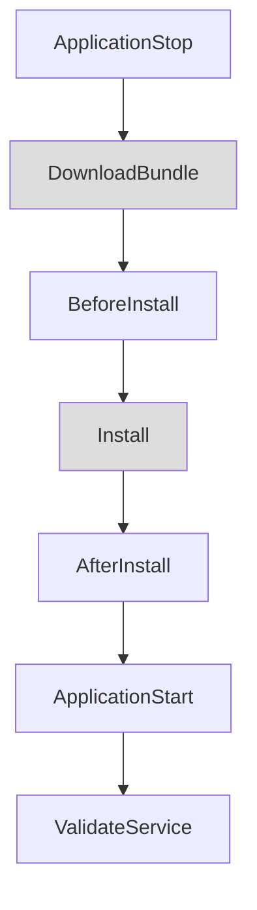
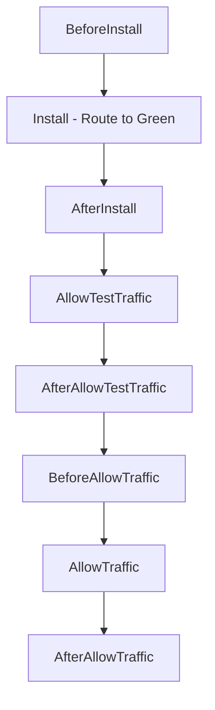

# How to Set Up CodeDeploy Lifecycle Hooks

Author: [nawazdhandala](https://github.com/nawazdhandala)

Tags: AWS, CodeDeploy, Deployment, Lifecycle Hooks, CI/CD, DevOps

Description: Learn how to set up AWS CodeDeploy lifecycle hooks to run custom scripts during deployments for validation, health checks, and graceful transitions.

---

Deploying code to production is not just about copying files. You need to stop services gracefully, run database migrations, validate the new deployment, warm up caches, register with load balancers, and a dozen other things that happen before, during, and after the actual file copy. AWS CodeDeploy lifecycle hooks give you specific points in the deployment process where you can run custom scripts to handle all of this.

This guide covers all the lifecycle hooks available for EC2/on-premises and ECS deployments, how to configure them in your AppSpec file, and practical examples for common deployment tasks.

## What Are Lifecycle Hooks?

Lifecycle hooks are pre-defined stages in the CodeDeploy deployment process where you can execute custom scripts. Think of them as callbacks that fire at specific points during deployment. If a hook script fails (returns a non-zero exit code), the deployment stops and rolls back.

The available hooks differ based on your deployment type (EC2/on-premises vs. ECS vs. Lambda).

## EC2/On-Premises Deployment Lifecycle

For EC2 and on-premises deployments, here is the complete lifecycle:



Gray boxes are CodeDeploy-managed steps. The others are your hooks.

| Hook | When It Runs | Common Uses |
|------|-------------|-------------|
| ApplicationStop | Before the new revision is downloaded | Stop running services, drain connections |
| BeforeInstall | After download, before file copy | Back up current files, install dependencies |
| AfterInstall | After files are copied | Set permissions, run migrations, configure files |
| ApplicationStart | After AfterInstall | Start services, warm up caches |
| ValidateService | After ApplicationStart | Health checks, smoke tests |

## Prerequisites

- AWS CodeDeploy application and deployment group configured
- CodeDeploy agent installed on target EC2 instances
- An AppSpec file (appspec.yml) in your deployment bundle
- IAM roles for CodeDeploy and EC2 instances

## Step 1: Create the AppSpec File

The AppSpec file defines which files to deploy and which hooks to run:

```yaml
# appspec.yml for EC2/on-premises deployment
version: 0.0
os: linux

files:
  - source: /app
    destination: /opt/myapp
  - source: /config
    destination: /opt/myapp/config
  - source: /scripts
    destination: /opt/myapp/scripts

permissions:
  - object: /opt/myapp
    owner: appuser
    group: appgroup
    mode: "755"
    type:
      - directory
  - object: /opt/myapp/scripts
    owner: appuser
    group: appgroup
    mode: "755"

hooks:
  ApplicationStop:
    - location: scripts/stop-application.sh
      timeout: 120
      runas: appuser

  BeforeInstall:
    - location: scripts/before-install.sh
      timeout: 300
      runas: root

  AfterInstall:
    - location: scripts/after-install.sh
      timeout: 300
      runas: root

  ApplicationStart:
    - location: scripts/start-application.sh
      timeout: 120
      runas: appuser

  ValidateService:
    - location: scripts/validate-service.sh
      timeout: 120
      runas: appuser
```

## Step 2: Write the Hook Scripts

### ApplicationStop - Graceful Shutdown

```bash
#!/bin/bash
# scripts/stop-application.sh
# Gracefully stop the application before deploying new version

set -e

SERVICE_NAME="myapp"
LOG_FILE="/var/log/codedeploy/stop-application.log"

echo "$(date) - Stopping $SERVICE_NAME..." >> $LOG_FILE

# Check if the service is running
if systemctl is-active --quiet $SERVICE_NAME; then
    # Drain connections from the load balancer
    echo "$(date) - Deregistering from load balancer..." >> $LOG_FILE

    INSTANCE_ID=$(curl -s http://169.254.169.254/latest/meta-data/instance-id)
    TARGET_GROUP_ARN=$(aws elbv2 describe-target-health \
        --query "TargetHealthDescriptions[?Target.Id=='$INSTANCE_ID'].TargetGroupArn" \
        --output text 2>/dev/null || true)

    if [ -n "$TARGET_GROUP_ARN" ]; then
        aws elbv2 deregister-targets \
            --target-group-arn $TARGET_GROUP_ARN \
            --targets Id=$INSTANCE_ID

        # Wait for connections to drain (max 30 seconds)
        echo "$(date) - Waiting for connections to drain..." >> $LOG_FILE
        sleep 30
    fi

    # Stop the service
    systemctl stop $SERVICE_NAME
    echo "$(date) - $SERVICE_NAME stopped successfully" >> $LOG_FILE
else
    echo "$(date) - $SERVICE_NAME is not running, skipping stop" >> $LOG_FILE
fi
```

### BeforeInstall - Prepare for New Deployment

```bash
#!/bin/bash
# scripts/before-install.sh
# Prepare the system for the new deployment

set -e

LOG_FILE="/var/log/codedeploy/before-install.log"

echo "$(date) - Running before-install hooks..." >> $LOG_FILE

# Back up the current deployment
if [ -d "/opt/myapp" ]; then
    BACKUP_DIR="/opt/myapp-backup-$(date +%Y%m%d%H%M%S)"
    echo "$(date) - Backing up current deployment to $BACKUP_DIR" >> $LOG_FILE
    cp -r /opt/myapp $BACKUP_DIR

    # Keep only the last 3 backups
    ls -dt /opt/myapp-backup-* | tail -n +4 | xargs rm -rf
fi

# Install system dependencies
echo "$(date) - Installing system dependencies..." >> $LOG_FILE
yum install -y jq nginx

# Create application directories
mkdir -p /opt/myapp/logs
mkdir -p /opt/myapp/tmp
mkdir -p /opt/myapp/data

# Create application user if it does not exist
if ! id "appuser" &>/dev/null; then
    useradd -r -s /sbin/nologin appuser
    echo "$(date) - Created appuser" >> $LOG_FILE
fi

echo "$(date) - Before-install completed successfully" >> $LOG_FILE
```

### AfterInstall - Configure the New Deployment

```bash
#!/bin/bash
# scripts/after-install.sh
# Configure the newly installed application

set -e

LOG_FILE="/var/log/codedeploy/after-install.log"

echo "$(date) - Running after-install hooks..." >> $LOG_FILE

cd /opt/myapp

# Install application dependencies
echo "$(date) - Installing application dependencies..." >> $LOG_FILE
npm install --production

# Run database migrations
echo "$(date) - Running database migrations..." >> $LOG_FILE
npm run db:migrate 2>&1 >> $LOG_FILE

# Generate environment-specific configuration
ENVIRONMENT=$(curl -s http://169.254.169.254/latest/meta-data/tags/instance/Environment || echo "production")
echo "$(date) - Configuring for environment: $ENVIRONMENT" >> $LOG_FILE

# Copy environment-specific config
if [ -f "config/$ENVIRONMENT.json" ]; then
    cp "config/$ENVIRONMENT.json" config/active.json
fi

# Set ownership and permissions
chown -R appuser:appgroup /opt/myapp
chmod -R 755 /opt/myapp
chmod 600 /opt/myapp/config/active.json

# Set up log rotation
cat > /etc/logrotate.d/myapp << 'LOGROTATE'
/opt/myapp/logs/*.log {
    daily
    rotate 7
    compress
    missingok
    notifempty
}
LOGROTATE

echo "$(date) - After-install completed successfully" >> $LOG_FILE
```

### ApplicationStart - Start the New Version

```bash
#!/bin/bash
# scripts/start-application.sh
# Start the application with the new deployment

set -e

SERVICE_NAME="myapp"
LOG_FILE="/var/log/codedeploy/start-application.log"

echo "$(date) - Starting $SERVICE_NAME..." >> $LOG_FILE

# Reload systemd to pick up any service file changes
sudo systemctl daemon-reload

# Start the service
sudo systemctl start $SERVICE_NAME

# Wait for the service to be fully started
MAX_RETRIES=30
RETRY_COUNT=0

while [ $RETRY_COUNT -lt $MAX_RETRIES ]; do
    if systemctl is-active --quiet $SERVICE_NAME; then
        echo "$(date) - $SERVICE_NAME started successfully" >> $LOG_FILE
        break
    fi
    RETRY_COUNT=$((RETRY_COUNT + 1))
    echo "$(date) - Waiting for $SERVICE_NAME to start (attempt $RETRY_COUNT/$MAX_RETRIES)..." >> $LOG_FILE
    sleep 2
done

if [ $RETRY_COUNT -eq $MAX_RETRIES ]; then
    echo "$(date) - ERROR: $SERVICE_NAME failed to start within timeout" >> $LOG_FILE
    exit 1
fi
```

### ValidateService - Verify the Deployment

```bash
#!/bin/bash
# scripts/validate-service.sh
# Validate that the new deployment is healthy

set -e

LOG_FILE="/var/log/codedeploy/validate-service.log"

echo "$(date) - Validating service..." >> $LOG_FILE

# Check that the application responds to health checks
MAX_RETRIES=20
RETRY_COUNT=0
HEALTH_URL="http://localhost:3000/health"

while [ $RETRY_COUNT -lt $MAX_RETRIES ]; do
    HTTP_STATUS=$(curl -s -o /dev/null -w "%{http_code}" $HEALTH_URL 2>/dev/null || echo "000")

    if [ "$HTTP_STATUS" = "200" ]; then
        echo "$(date) - Health check passed (HTTP $HTTP_STATUS)" >> $LOG_FILE
        break
    fi

    RETRY_COUNT=$((RETRY_COUNT + 1))
    echo "$(date) - Health check returned $HTTP_STATUS (attempt $RETRY_COUNT/$MAX_RETRIES)" >> $LOG_FILE
    sleep 5
done

if [ $RETRY_COUNT -eq $MAX_RETRIES ]; then
    echo "$(date) - ERROR: Health check failed after $MAX_RETRIES attempts" >> $LOG_FILE
    exit 1
fi

# Run smoke tests
echo "$(date) - Running smoke tests..." >> $LOG_FILE

# Test critical endpoints
ENDPOINTS=("/api/v1/status" "/api/v1/version")

for ENDPOINT in "${ENDPOINTS[@]}"; do
    HTTP_STATUS=$(curl -s -o /dev/null -w "%{http_code}" "http://localhost:3000$ENDPOINT")
    if [ "$HTTP_STATUS" != "200" ]; then
        echo "$(date) - ERROR: Smoke test failed for $ENDPOINT (HTTP $HTTP_STATUS)" >> $LOG_FILE
        exit 1
    fi
    echo "$(date) - Smoke test passed for $ENDPOINT" >> $LOG_FILE
done

# Re-register with load balancer
INSTANCE_ID=$(curl -s http://169.254.169.254/latest/meta-data/instance-id)
TARGET_GROUP_ARN=$(aws ssm get-parameter \
    --name "/myapp/target-group-arn" \
    --query "Parameter.Value" \
    --output text 2>/dev/null || true)

if [ -n "$TARGET_GROUP_ARN" ]; then
    aws elbv2 register-targets \
        --target-group-arn $TARGET_GROUP_ARN \
        --targets Id=$INSTANCE_ID
    echo "$(date) - Registered with load balancer" >> $LOG_FILE
fi

echo "$(date) - Validation completed successfully" >> $LOG_FILE
```

## ECS Deployment Lifecycle Hooks

For ECS deployments (Blue/Green), the lifecycle is different:



For ECS, hooks run as Lambda functions:

```yaml
# appspec.yml for ECS Blue/Green deployment
version: 0.0
Resources:
  - TargetService:
      Type: AWS::ECS::Service
      Properties:
        TaskDefinition: "arn:aws:ecs:us-east-1:123456789012:task-definition/myapp:5"
        LoadBalancerInfo:
          ContainerName: "myapp"
          ContainerPort: 3000

Hooks:
  - BeforeInstall: "arn:aws:lambda:us-east-1:123456789012:function:codedeploy-before-install"
  - AfterInstall: "arn:aws:lambda:us-east-1:123456789012:function:codedeploy-after-install"
  - AfterAllowTestTraffic: "arn:aws:lambda:us-east-1:123456789012:function:codedeploy-test-traffic"
  - BeforeAllowTraffic: "arn:aws:lambda:us-east-1:123456789012:function:codedeploy-before-traffic"
  - AfterAllowTraffic: "arn:aws:lambda:us-east-1:123456789012:function:codedeploy-after-traffic"
```

Here is a Lambda function for the AfterAllowTestTraffic hook that runs integration tests:

```python
# Lambda function for testing the green deployment
import boto3
import requests

codedeploy = boto3.client('codedeploy')

def handler(event, context):
    deployment_id = event['DeploymentId']
    lifecycle_event_hook_execution_id = event['LifecycleEventHookExecutionId']

    try:
        # Run integration tests against the test traffic endpoint
        test_url = "https://test.myapp.example.com"

        # Test health endpoint
        response = requests.get(f"{test_url}/health", timeout=10)
        assert response.status_code == 200, f"Health check failed: {response.status_code}"

        # Test critical API endpoint
        response = requests.get(f"{test_url}/api/v1/status", timeout=10)
        assert response.status_code == 200, f"Status check failed: {response.status_code}"

        # Report success to CodeDeploy
        codedeploy.put_lifecycle_event_hook_execution_status(
            deploymentId=deployment_id,
            lifecycleEventHookExecutionId=lifecycle_event_hook_execution_id,
            status='Succeeded'
        )

    except Exception as e:
        print(f"Validation failed: {str(e)}")

        # Report failure - this triggers a rollback
        codedeploy.put_lifecycle_event_hook_execution_status(
            deploymentId=deployment_id,
            lifecycleEventHookExecutionId=lifecycle_event_hook_execution_id,
            status='Failed'
        )
```

## Best Practices

1. **Keep hooks idempotent.** Hooks might run multiple times if a deployment is retried. Make sure your scripts produce the same result regardless of how many times they run.

2. **Set appropriate timeouts.** Each hook has a timeout. Set it long enough for the task to complete but short enough that a hung deployment does not block for hours.

3. **Log everything.** Write detailed logs from your hook scripts. When a deployment fails, the logs are your primary debugging tool.

4. **Validate before and after.** The ValidateService hook is your last chance to catch issues before the deployment is marked successful. Make it thorough.

5. **Handle the first deployment.** Your ApplicationStop script should handle the case where the application is not yet installed. Check for existing services before trying to stop them.

6. **Use exit codes properly.** Exit 0 for success, non-zero for failure. A failed hook triggers a rollback, which is exactly what you want when something goes wrong.

## Wrapping Up

CodeDeploy lifecycle hooks give you precise control over every phase of your deployment process. From graceful shutdown through validation, each hook is an opportunity to ensure your deployment succeeds safely. Take the time to write thorough hook scripts, especially for ApplicationStop (graceful draining) and ValidateService (health checking). These two hooks alone prevent the vast majority of deployment-related incidents by ensuring clean transitions and catching problems before they affect users.
