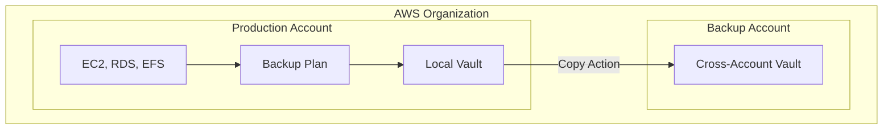

# How to Set Up Cross-Account Backup with AWS Backup

Author: [nawazdhandala](https://github.com/nawazdhandala)

Tags: AWS, Backup, Cross-Account, Organizations, Data Protection

Description: Configure AWS Backup cross-account backup to copy recovery points between AWS accounts using AWS Organizations, providing an additional layer of data protection.

---

Cross-region backup protects against regional failures. But what about a compromised account? If an attacker gains access to your production account, they could potentially delete both your resources and your backups. Cross-account backup adds another layer of defense by copying recovery points to a completely separate AWS account.

This pattern is increasingly common in enterprise setups: a dedicated "backup account" that's locked down tight, with minimal access, and serves purely as a vault for recovery points from other accounts in the organization.

## Architecture

The typical setup looks like this:



## Prerequisites

Cross-account backup requires:
- An AWS Organization with at least two accounts
- AWS Backup enabled in both accounts
- Cross-account backup feature enabled at the organization level

## Step 1: Enable Cross-Account Backup in AWS Organizations

You need to enable the cross-account backup feature from the organization's management account (or a delegated admin):

```bash
# Enable cross-account backup in the organization
aws backup update-region-settings \
  --region us-east-1 \
  --resource-type-management-preference '{
    "EBS": true,
    "EC2": true,
    "RDS": true,
    "DynamoDB": true,
    "EFS": true,
    "FSx": true,
    "S3": true
  }'

# Enable cross-account features
aws organizations enable-aws-service-access \
  --service-principal backup.amazonaws.com

# Register a delegated administrator for AWS Backup (optional)
aws organizations register-delegated-administrator \
  --account-id 222222222222 \
  --service-principal backup.amazonaws.com
```

## Step 2: Create the Backup Vault in the Destination Account

Switch to the backup account and create a vault with a restrictive access policy:

```bash
# In the backup/destination account (222222222222)

# Create KMS key
DEST_KEY=$(aws kms create-key \
  --region us-east-1 \
  --description "Cross-account backup vault encryption" \
  --query 'KeyMetadata.KeyId' --output text)

# Create the vault
aws backup create-backup-vault \
  --region us-east-1 \
  --backup-vault-name "cross-account-vault" \
  --encryption-key-arn "arn:aws:kms:us-east-1:222222222222:key/$DEST_KEY"

# Set the vault access policy to allow copies from the source account
aws backup put-backup-vault-access-policy \
  --region us-east-1 \
  --backup-vault-name "cross-account-vault" \
  --policy '{
    "Version": "2012-10-17",
    "Statement": [
      {
        "Sid": "AllowCrossAccountCopy",
        "Effect": "Allow",
        "Principal": {
          "AWS": "arn:aws:iam::111111111111:root"
        },
        "Action": "backup:CopyIntoBackupVault",
        "Resource": "*"
      }
    ]
  }'
```

Replace `111111111111` with your source/production account ID. You can also allow the entire organization:

```bash
# Allow any account in the organization
aws backup put-backup-vault-access-policy \
  --region us-east-1 \
  --backup-vault-name "cross-account-vault" \
  --policy '{
    "Version": "2012-10-17",
    "Statement": [
      {
        "Sid": "AllowOrgCopy",
        "Effect": "Allow",
        "Principal": "*",
        "Action": "backup:CopyIntoBackupVault",
        "Resource": "*",
        "Condition": {
          "StringEquals": {
            "aws:PrincipalOrgID": "o-abc1234567"
          }
        }
      }
    ]
  }'
```

## Step 3: Configure KMS Key Policy in the Destination

The destination KMS key needs to allow the source account to use it for encryption:

```bash
# Update KMS key policy in the backup account
aws kms put-key-policy \
  --region us-east-1 \
  --key-id "$DEST_KEY" \
  --policy-name default \
  --policy '{
    "Version": "2012-10-17",
    "Statement": [
      {
        "Sid": "EnableLocalAdministration",
        "Effect": "Allow",
        "Principal": {
          "AWS": "arn:aws:iam::222222222222:root"
        },
        "Action": "kms:*",
        "Resource": "*"
      },
      {
        "Sid": "AllowSourceAccountEncryption",
        "Effect": "Allow",
        "Principal": {
          "AWS": "arn:aws:iam::111111111111:root"
        },
        "Action": [
          "kms:Encrypt",
          "kms:Decrypt",
          "kms:ReEncrypt*",
          "kms:GenerateDataKey*",
          "kms:DescribeKey",
          "kms:CreateGrant"
        ],
        "Resource": "*"
      }
    ]
  }'
```

## Step 4: Create the Backup Plan in the Source Account

Back in the production account, create a backup plan with a cross-account copy action:

```bash
# In the production/source account (111111111111)
aws backup create-backup-plan \
  --region us-east-1 \
  --backup-plan '{
    "BackupPlanName": "cross-account-protection",
    "Rules": [
      {
        "RuleName": "DailyWithCrossAccountCopy",
        "TargetBackupVaultName": "production-vault",
        "ScheduleExpression": "cron(0 3 * * ? *)",
        "StartWindowMinutes": 60,
        "CompletionWindowMinutes": 180,
        "Lifecycle": {
          "DeleteAfterDays": 30
        },
        "CopyActions": [
          {
            "DestinationBackupVaultArn": "arn:aws:backup:us-east-1:222222222222:backup-vault:cross-account-vault",
            "Lifecycle": {
              "MoveToColdStorageAfterDays": 7,
              "DeleteAfterDays": 90
            }
          }
        ]
      }
    ]
  }'
```

## Step 5: Assign Resources

```bash
# Assign all production resources
aws backup create-backup-selection \
  --region us-east-1 \
  --backup-plan-id "plan-prod123" \
  --backup-selection '{
    "SelectionName": "CriticalResources",
    "IamRoleArn": "arn:aws:iam::111111111111:role/AWSBackupServiceRole",
    "ListOfTags": [{
      "ConditionType": "STRINGEQUALS",
      "ConditionKey": "Criticality",
      "ConditionValue": "high"
    }],
    "Resources": [
      "arn:aws:rds:us-east-1:111111111111:db:production-main",
      "arn:aws:dynamodb:us-east-1:111111111111:table/user-data"
    ]
  }'
```

## Step 6: Use Organization-Level Backup Policies

For large organizations, you can push backup policies from the management account to all member accounts:

```bash
# Enable backup policies in the organization
aws organizations enable-policy-type \
  --root-id r-abc1 \
  --policy-type BACKUP_POLICY

# Create an organization backup policy
aws organizations create-policy \
  --name "EnterpriseBackupPolicy" \
  --type BACKUP_POLICY \
  --description "Standard backup policy for all accounts" \
  --content '{
    "plans": {
      "OrgBackupPlan": {
        "regions": {"@@assign": ["us-east-1"]},
        "rules": {
          "DailyCrossAccount": {
            "schedule_expression": {"@@assign": "cron(0 3 * * ? *)"},
            "start_backup_window_minutes": {"@@assign": "60"},
            "target_backup_vault_name": {"@@assign": "Default"},
            "lifecycle": {
              "delete_after_days": {"@@assign": "30"}
            },
            "copy_actions": {
              "arn:aws:backup:us-east-1:222222222222:backup-vault:cross-account-vault": {
                "lifecycle": {
                  "delete_after_days": {"@@assign": "90"}
                }
              }
            }
          }
        },
        "selections": {
          "tags": {
            "BackupRequired": {
              "iam_role_arn": {"@@assign": "arn:aws:iam::$account:role/AWSBackupServiceRole"},
              "tag_key": {"@@assign": "Backup"},
              "tag_value": {"@@assign": ["true"]}
            }
          }
        }
      }
    }
  }'

# Attach the policy to the organization root or specific OUs
aws organizations attach-policy \
  --policy-id p-12345678 \
  --target-id r-abc1
```

The `$account` variable gets replaced with each member account's ID automatically.

## Step 7: Monitor Cross-Account Copies

Monitor copy jobs from the source account:

```bash
# List cross-account copy jobs
aws backup list-copy-jobs \
  --region us-east-1 \
  --by-destination-vault-arn "arn:aws:backup:us-east-1:222222222222:backup-vault:cross-account-vault"

# Verify recovery points in the destination account
# (Run this in the backup account)
aws backup list-recovery-points-by-backup-vault \
  --region us-east-1 \
  --backup-vault-name "cross-account-vault" \
  --max-results 10
```

## Restoring from a Cross-Account Backup

When disaster strikes, restore from the backup account:

```bash
# In the backup account, restore an RDS instance
aws backup start-restore-job \
  --region us-east-1 \
  --recovery-point-arn "arn:aws:backup:us-east-1:222222222222:recovery-point:rp-cross-123" \
  --iam-role-arn "arn:aws:iam::222222222222:role/AWSBackupServiceRole" \
  --metadata '{
    "DBInstanceIdentifier": "restored-production-db",
    "DBInstanceClass": "db.r5.large"
  }'
```

You can also share the recovery point back to the original account or a new recovery account using backup vault sharing.

## Security Best Practices

The backup account should be one of the most locked-down accounts in your organization:

1. **Minimal IAM users** - Only a few trusted operators should have access
2. **MFA required** for all access
3. **No development workloads** - This account exists solely for backup storage
4. **Vault Lock** - Consider enabling vault lock to prevent deletion (see our guide on [backup vault lock](https://oneuptime.com/blog/post/configure-aws-backup-vault-lock-compliance/view))
5. **CloudTrail enabled** with log file validation
6. **SCPs** to prevent disabling of backup services

Cross-account backup is the gold standard for data protection in AWS. It's a bit more setup than single-account backup, but the peace of mind is worth it. When an account is compromised, you'll be thankful you kept your recovery points somewhere the attacker couldn't reach.
