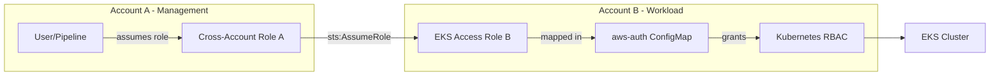

# How to Set Up Cross-Account EKS Cluster Access

Author: [nawazdhandala](https://github.com/nawazdhandala)

Tags: AWS, EKS, IAM, Kubernetes, Security

Description: Learn how to configure cross-account access to Amazon EKS clusters using IAM role assumption, aws-auth ConfigMap, and access entries.

---

In any organization of reasonable size, you'll have multiple AWS accounts - separate accounts for dev, staging, and production, or accounts per team. But your platform engineers need to manage EKS clusters across all of them, and your CI/CD pipelines might need to deploy to clusters in different accounts. Cross-account EKS access makes this possible without duplicating credentials everywhere.

The setup involves IAM role assumption on the AWS side and Kubernetes RBAC on the cluster side. Let's walk through it step by step.

## The Architecture

Here's the typical scenario: users and pipelines in Account A (the "management" account) need to access an EKS cluster in Account B (the "workload" account).



## Step 1: Create an IAM Role in the Workload Account

In Account B (where the EKS cluster lives), create an IAM role that Account A's users can assume:

```json
{
  "Version": "2012-10-17",
  "Statement": [
    {
      "Effect": "Allow",
      "Principal": {
        "AWS": "arn:aws:iam::111111111111:root"
      },
      "Action": "sts:AssumeRole",
      "Condition": {
        "StringEquals": {
          "sts:ExternalId": "eks-cross-account-access"
        }
      }
    }
  ]
}
```

Replace `111111111111` with Account A's ID. The external ID adds an extra layer of security.

```bash
# In Account B: Create the cross-account role
aws iam create-role \
  --role-name EKSCrossAccountAccess \
  --assume-role-policy-document file://trust-policy.json

# Attach the EKS describe permission so the role can update kubeconfig
aws iam attach-role-policy \
  --role-name EKSCrossAccountAccess \
  --policy-arn arn:aws:iam::aws:policy/AmazonEKSClusterPolicy
```

For tighter security, create a minimal custom policy:

```json
{
  "Version": "2012-10-17",
  "Statement": [
    {
      "Effect": "Allow",
      "Action": [
        "eks:DescribeCluster",
        "eks:ListClusters"
      ],
      "Resource": "*"
    }
  ]
}
```

## Step 2: Grant Assume Role Permission in the Management Account

In Account A, give your users or roles permission to assume the cross-account role:

```json
{
  "Version": "2012-10-17",
  "Statement": [
    {
      "Effect": "Allow",
      "Action": "sts:AssumeRole",
      "Resource": "arn:aws:iam::222222222222:role/EKSCrossAccountAccess"
    }
  ]
}
```

```bash
# In Account A: Attach assume-role permissions to users/groups
aws iam put-user-policy \
  --user-name platform-engineer \
  --policy-name AssumeEKSCrossAccountRole \
  --policy-document file://assume-role-policy.json
```

## Step 3: Map the Role in the EKS Cluster

Now you need to tell the EKS cluster to recognize the cross-account role. There are two approaches depending on your EKS version.

### Using aws-auth ConfigMap (Traditional)

Edit the aws-auth ConfigMap to map the IAM role to a Kubernetes group:

```bash
# View the current aws-auth ConfigMap
kubectl get configmap aws-auth -n kube-system -o yaml
```

Add the cross-account role mapping:

```yaml
# aws-auth ConfigMap with cross-account role
apiVersion: v1
kind: ConfigMap
metadata:
  name: aws-auth
  namespace: kube-system
data:
  mapRoles: |
    - rolearn: arn:aws:iam::222222222222:role/EKSCrossAccountAccess
      username: cross-account-admin
      groups:
        - system:masters
    - rolearn: arn:aws:iam::222222222222:role/KarpenterNodeRole-my-cluster
      username: system:node:{{EC2PrivateDNSName}}
      groups:
        - system:bootstrappers
        - system:nodes
```

Be careful editing aws-auth - a mistake can lock you out of the cluster. Use `eksctl` for safer modifications:

```bash
# Safely add IAM role mapping with eksctl
eksctl create iamidentitymapping \
  --cluster my-cluster \
  --arn arn:aws:iam::222222222222:role/EKSCrossAccountAccess \
  --username cross-account-admin \
  --group system:masters
```

### Using EKS Access Entries (Newer Method)

EKS access entries are the newer, recommended approach. They don't require editing the aws-auth ConfigMap:

```bash
# Create an access entry for the cross-account role
aws eks create-access-entry \
  --cluster-name my-cluster \
  --principal-arn arn:aws:iam::222222222222:role/EKSCrossAccountAccess \
  --type STANDARD

# Associate an access policy
aws eks associate-access-policy \
  --cluster-name my-cluster \
  --principal-arn arn:aws:iam::222222222222:role/EKSCrossAccountAccess \
  --policy-arn arn:aws:eks::aws:cluster-access-policy/AmazonEKSClusterAdminPolicy \
  --access-scope type=cluster
```

Access entries are safer because they can't accidentally lock you out and they're managed through the EKS API.

## Step 4: Configure kubectl in the Management Account

From Account A, configure kubectl to use the cross-account role:

```bash
# Configure kubectl with role assumption
aws eks update-kubeconfig \
  --name my-cluster \
  --region us-west-2 \
  --role-arn arn:aws:iam::222222222222:role/EKSCrossAccountAccess
```

This updates your kubeconfig with the role ARN. Every kubectl command will now assume the role before authenticating:

```yaml
# Resulting kubeconfig user section
users:
  - name: arn:aws:eks:us-west-2:222222222222:cluster/my-cluster
    user:
      exec:
        apiVersion: client.authentication.k8s.io/v1beta1
        command: aws
        args:
          - eks
          - get-token
          - --cluster-name
          - my-cluster
          - --region
          - us-west-2
          - --role-arn
          - arn:aws:iam::222222222222:role/EKSCrossAccountAccess
```

Test the connection:

```bash
# Verify cross-account access works
kubectl get nodes
kubectl auth whoami
```

## Fine-Grained RBAC

Mapping to `system:masters` gives full admin access - fine for platform teams, but too broad for most users. Create custom ClusterRoles for specific teams:

```yaml
# read-only-role.yaml - Read-only access for developers
apiVersion: rbac.authorization.k8s.io/v1
kind: ClusterRole
metadata:
  name: developer-read-only
rules:
  - apiGroups: [""]
    resources: ["pods", "services", "configmaps", "events"]
    verbs: ["get", "list", "watch"]
  - apiGroups: ["apps"]
    resources: ["deployments", "replicasets", "statefulsets"]
    verbs: ["get", "list", "watch"]
  - apiGroups: [""]
    resources: ["pods/log"]
    verbs: ["get"]
---
apiVersion: rbac.authorization.k8s.io/v1
kind: ClusterRoleBinding
metadata:
  name: developer-read-only-binding
roleRef:
  apiGroup: rbac.authorization.k8s.io
  kind: ClusterRole
  name: developer-read-only
subjects:
  - kind: Group
    name: developers
    apiGroup: rbac.authorization.k8s.io
```

Then map the cross-account role to the `developers` group instead of `system:masters`.

## CI/CD Pipeline Access

For pipelines in Account A that need to deploy to clusters in Account B, use the same role assumption pattern. In GitHub Actions:

```yaml
# GitHub Actions workflow with cross-account EKS access
jobs:
  deploy:
    runs-on: ubuntu-latest
    permissions:
      id-token: write
      contents: read
    steps:
      - name: Configure AWS credentials
        uses: aws-actions/configure-aws-credentials@v4
        with:
          role-to-assume: arn:aws:iam::222222222222:role/EKSCrossAccountAccess
          aws-region: us-west-2

      - name: Update kubeconfig
        run: aws eks update-kubeconfig --name my-cluster --region us-west-2

      - name: Deploy
        run: kubectl apply -f manifests/
```

For more on configuring kubectl access, see our [kubectl setup guide](https://oneuptime.com/blog/post/configure-kubectl-for-eks/view).

Cross-account EKS access is foundational for multi-account AWS organizations. Get it right, and your teams can manage clusters efficiently without compromising on security boundaries between accounts.
