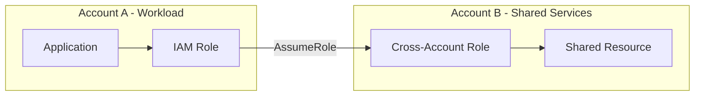

# How to Set Up Cross-Account IAM Roles for Shared Services

Author: [nawazdhandala](https://github.com/nawazdhandala)

Tags: AWS, IAM, Multi-Account, Security

Description: Learn how to set up cross-account IAM roles to securely share services and resources between AWS accounts using trust policies and role assumption.

---

Most organizations end up with multiple AWS accounts - production, staging, development, security, shared services, and more. Cross-account IAM roles let these accounts work together securely. Instead of copying data or creating duplicate infrastructure, you grant controlled access from one account to another.

This guide covers setting up cross-account roles for common shared service patterns: centralized logging, shared CI/CD, cross-account database access, and more.

## The Cross-Account Pattern



Account A's application assumes a role in Account B to access shared resources. Two things are required:

1. **Trust policy** in Account B allows Account A to assume the role
2. **Permission policy** in Account A allows its role to call `sts:AssumeRole` on Account B's role

## Setting Up a Basic Cross-Account Role

### In the Target Account (Account B - Shared Services)

Create a role that Account A can assume:

```bash
# Create the trust policy allowing Account A to assume this role
cat > trust-policy.json << 'EOF'
{
  "Version": "2012-10-17",
  "Statement": [
    {
      "Effect": "Allow",
      "Principal": {
        "AWS": "arn:aws:iam::111111111111:root"
      },
      "Action": "sts:AssumeRole",
      "Condition": {
        "StringEquals": {
          "sts:ExternalId": "shared-services-2026"
        }
      }
    }
  ]
}
EOF

# Create the role
aws iam create-role \
  --role-name CrossAccount-S3Access \
  --assume-role-policy-document file://trust-policy.json \
  --description "Allows Account A to read shared S3 buckets"

# Attach permissions - what the role can do
aws iam put-role-policy \
  --role-name CrossAccount-S3Access \
  --policy-name s3-read-shared \
  --policy-document '{
    "Version": "2012-10-17",
    "Statement": [
      {
        "Effect": "Allow",
        "Action": [
          "s3:GetObject",
          "s3:ListBucket"
        ],
        "Resource": [
          "arn:aws:s3:::shared-config-bucket",
          "arn:aws:s3:::shared-config-bucket/*"
        ]
      }
    ]
  }'
```

### In the Source Account (Account A - Workload)

Grant your application's role permission to assume the cross-account role:

```bash
# Allow the application role to assume the cross-account role
aws iam put-role-policy \
  --role-name MyAppRole \
  --policy-name assume-shared-services \
  --policy-document '{
    "Version": "2012-10-17",
    "Statement": [
      {
        "Effect": "Allow",
        "Action": "sts:AssumeRole",
        "Resource": "arn:aws:iam::222222222222:role/CrossAccount-S3Access"
      }
    ]
  }'
```

### Using the Cross-Account Role

```python
import boto3

def access_shared_service():
    """Access a shared S3 bucket in another account."""
    sts = boto3.client("sts")

    # Assume the cross-account role
    response = sts.assume_role(
        RoleArn="arn:aws:iam::222222222222:role/CrossAccount-S3Access",
        RoleSessionName="app-reading-shared-config",
        ExternalId="shared-services-2026",
        DurationSeconds=3600
    )

    creds = response["Credentials"]

    # Create S3 client with cross-account credentials
    s3 = boto3.client(
        "s3",
        aws_access_key_id=creds["AccessKeyId"],
        aws_secret_access_key=creds["SecretAccessKey"],
        aws_session_token=creds["SessionToken"]
    )

    # Read from the shared bucket
    response = s3.get_object(
        Bucket="shared-config-bucket",
        Key="app-config.json"
    )
    config = response["Body"].read().decode("utf-8")
    return config
```

## Pattern 1: Centralized Logging

A shared logging account collects CloudTrail, VPC Flow Logs, and application logs from all accounts:

```json
{
  "Version": "2012-10-17",
  "Statement": [
    {
      "Effect": "Allow",
      "Principal": {
        "AWS": [
          "arn:aws:iam::111111111111:root",
          "arn:aws:iam::222222222222:root",
          "arn:aws:iam::333333333333:root"
        ]
      },
      "Action": "sts:AssumeRole",
      "Condition": {
        "StringEquals": {
          "aws:PrincipalOrgID": "o-abc123def4"
        }
      }
    }
  ]
}
```

The `aws:PrincipalOrgID` condition ensures only accounts in your AWS Organization can assume the role.

The role's permission policy allows writing to the centralized logging bucket:

```json
{
  "Version": "2012-10-17",
  "Statement": [
    {
      "Effect": "Allow",
      "Action": [
        "s3:PutObject",
        "s3:PutObjectAcl"
      ],
      "Resource": "arn:aws:s3:::central-logs-bucket/${aws:PrincipalAccount}/*"
    }
  ]
}
```

Using `${aws:PrincipalAccount}` in the resource path ensures each account can only write to its own prefix - they can't tamper with other accounts' logs.

## Pattern 2: Shared CI/CD Pipeline

A central DevOps account deploys to all other accounts:

```bash
# In each target account, create a deployment role
cat > deploy-trust.json << 'EOF'
{
  "Version": "2012-10-17",
  "Statement": [
    {
      "Effect": "Allow",
      "Principal": {
        "AWS": "arn:aws:iam::444444444444:role/CICD-PipelineRole"
      },
      "Action": "sts:AssumeRole"
    }
  ]
}
EOF

aws iam create-role \
  --role-name CrossAccount-Deploy \
  --assume-role-policy-document file://deploy-trust.json

# Attach deployment permissions
aws iam attach-role-policy \
  --role-name CrossAccount-Deploy \
  --policy-arn arn:aws:iam::aws:policy/PowerUserAccess
```

In your CI/CD pipeline (e.g., GitHub Actions):

```yaml
# GitHub Actions workflow that deploys to multiple accounts
name: Deploy
on:
  push:
    branches: [main]

jobs:
  deploy-staging:
    runs-on: ubuntu-latest
    permissions:
      id-token: write
      contents: read
    steps:
      - uses: aws-actions/configure-aws-credentials@v4
        with:
          role-to-assume: arn:aws:iam::222222222222:role/CrossAccount-Deploy
          aws-region: us-east-1

      - name: Deploy to staging
        run: |
          aws ecs update-service --cluster staging --service api --force-new-deployment

  deploy-production:
    needs: deploy-staging
    runs-on: ubuntu-latest
    permissions:
      id-token: write
      contents: read
    steps:
      - uses: aws-actions/configure-aws-credentials@v4
        with:
          role-to-assume: arn:aws:iam::333333333333:role/CrossAccount-Deploy
          aws-region: us-east-1

      - name: Deploy to production
        run: |
          aws ecs update-service --cluster prod --service api --force-new-deployment
```

## Pattern 3: Shared Database Access

A central data account has databases that other accounts query:

```python
import boto3

def query_shared_database(query):
    """Query a DynamoDB table in the shared data account."""
    sts = boto3.client("sts")

    # Assume the cross-account role with read-only access
    creds = sts.assume_role(
        RoleArn="arn:aws:iam::555555555555:role/CrossAccount-DBRead",
        RoleSessionName="analytics-query"
    )["Credentials"]

    dynamodb = boto3.client(
        "dynamodb",
        aws_access_key_id=creds["AccessKeyId"],
        aws_secret_access_key=creds["SecretAccessKey"],
        aws_session_token=creds["SessionToken"],
        region_name="us-east-1"
    )

    response = dynamodb.query(
        TableName="shared-users-table",
        KeyConditionExpression="PK = :pk",
        ExpressionAttributeValues={":pk": {"S": query}}
    )

    return response["Items"]
```

## Pattern 4: Security Audit Role

A security account can read (but not modify) resources in all accounts:

```json
{
  "Version": "2012-10-17",
  "Statement": [
    {
      "Effect": "Allow",
      "Principal": {
        "AWS": "arn:aws:iam::666666666666:role/SecurityAuditTeam"
      },
      "Action": "sts:AssumeRole"
    }
  ]
}
```

Attach `SecurityAudit` and `ReadOnlyAccess` managed policies. This is exactly how AWS Security Hub and GuardDuty work when aggregating findings across accounts.

## Using AWS Organizations for Simplified Trust

With AWS Organizations, use SCPs and organization-level conditions:

```json
{
  "Condition": {
    "StringEquals": {
      "aws:PrincipalOrgID": "o-abc123def4"
    }
  }
}
```

This is more secure than listing individual account IDs because:
- New accounts in the org automatically work
- Accounts removed from the org automatically lose access
- You don't need to update the trust policy when accounts are added

## Terraform Module for Cross-Account Roles

Standardize cross-account role creation with a Terraform module:

```hcl
# Module: cross_account_role
variable "role_name" {}
variable "trusted_account_ids" { type = list(string) }
variable "policy_arns" { type = list(string) }
variable "org_id" { default = "" }

resource "aws_iam_role" "cross_account" {
  name               = var.role_name
  assume_role_policy = jsonencode({
    Version = "2012-10-17"
    Statement = [
      {
        Effect    = "Allow"
        Principal = { AWS = [for id in var.trusted_account_ids : "arn:aws:iam::${id}:root"] }
        Action    = "sts:AssumeRole"
        Condition = var.org_id != "" ? {
          StringEquals = { "aws:PrincipalOrgID" = var.org_id }
        } : {}
      }
    ]
  })
}

resource "aws_iam_role_policy_attachment" "policies" {
  for_each   = toset(var.policy_arns)
  role       = aws_iam_role.cross_account.name
  policy_arn = each.value
}

# Usage
module "shared_s3_reader" {
  source              = "./modules/cross_account_role"
  role_name           = "CrossAccount-S3Reader"
  trusted_account_ids = ["111111111111", "222222222222"]
  policy_arns         = ["arn:aws:iam::aws:policy/AmazonS3ReadOnlyAccess"]
  org_id              = "o-abc123def4"
}
```

## Best Practices

1. **Always use ExternalId** for third-party access to prevent confused deputy attacks
2. **Use aws:PrincipalOrgID** when possible instead of listing account IDs
3. **Scope permissions tightly** - the cross-account role should have minimal permissions
4. **Log everything** - CloudTrail records all `AssumeRole` calls with the source account
5. **Set session duration appropriately** - shorter for sensitive operations
6. **Tag cross-account roles** for tracking and automation
7. **Review trust policies regularly** - check who can assume your roles with our guide on [auditing IAM with credential reports](https://oneuptime.com/blog/post/audit-iam-users-roles-credential-reports/view)

Cross-account roles are the backbone of multi-account AWS architectures. Get the patterns right, and you can build a secure, maintainable infrastructure where accounts collaborate without compromising isolation.
