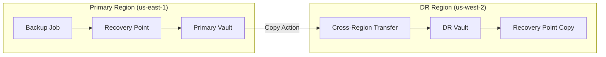

# How to Set Up Cross-Region Backup with AWS Backup

Author: [nawazdhandala](https://github.com/nawazdhandala)

Tags: AWS, Backup, Disaster Recovery, Cross-Region, Data Protection

Description: Configure AWS Backup to automatically copy recovery points to another AWS region for disaster recovery, with step-by-step vault setup and copy action configuration.

---

Having backups in a single region is good. Having backups in multiple regions is what actually saves you during a regional disaster. AWS Backup makes cross-region copying straightforward - you add a copy action to your backup plan, and every time a backup completes, a copy automatically goes to your DR region.

This isn't just for catastrophic scenarios. Cross-region backups also protect you against accidental deletion of regional resources, give you the ability to spin up infrastructure in another region during capacity constraints, and satisfy compliance requirements for geographic data redundancy.

## How Cross-Region Backup Works

When a backup job completes in your primary region, AWS Backup automatically initiates a copy job to your designated destination region. The copy is encrypted in transit and re-encrypted with the destination vault's KMS key on arrival.



## Step 1: Create KMS Keys in Both Regions

Each vault uses its own KMS key for encryption. You need keys in both regions:

```bash
# Create KMS key in primary region
PRIMARY_KEY=$(aws kms create-key \
  --region us-east-1 \
  --description "AWS Backup - Primary Region" \
  --query 'KeyMetadata.KeyId' --output text)

aws kms create-alias \
  --region us-east-1 \
  --alias-name alias/backup-primary \
  --target-key-id "$PRIMARY_KEY"

# Create KMS key in DR region
DR_KEY=$(aws kms create-key \
  --region us-west-2 \
  --description "AWS Backup - DR Region" \
  --query 'KeyMetadata.KeyId' --output text)

aws kms create-alias \
  --region us-west-2 \
  --alias-name alias/backup-dr \
  --target-key-id "$DR_KEY"
```

## Step 2: Create Backup Vaults in Both Regions

```bash
# Create primary vault
aws backup create-backup-vault \
  --region us-east-1 \
  --backup-vault-name "production-primary" \
  --encryption-key-arn "arn:aws:kms:us-east-1:123456789012:key/$PRIMARY_KEY"

# Create DR vault
aws backup create-backup-vault \
  --region us-west-2 \
  --backup-vault-name "production-dr" \
  --encryption-key-arn "arn:aws:kms:us-west-2:123456789012:key/$DR_KEY"
```

## Step 3: Configure Vault Access Policy on DR Vault

The DR vault needs a policy allowing cross-region copies:

```bash
# Set access policy on the DR vault
aws backup put-backup-vault-access-policy \
  --region us-west-2 \
  --backup-vault-name "production-dr" \
  --policy '{
    "Version": "2012-10-17",
    "Statement": [
      {
        "Sid": "AllowCrossRegionCopy",
        "Effect": "Allow",
        "Principal": {
          "AWS": "arn:aws:iam::123456789012:root"
        },
        "Action": "backup:CopyIntoBackupVault",
        "Resource": "*"
      }
    ]
  }'
```

## Step 4: Create Backup Plan with Cross-Region Copy

Now create a backup plan that includes a copy action:

```bash
# Create backup plan with cross-region copy action
aws backup create-backup-plan \
  --region us-east-1 \
  --backup-plan '{
    "BackupPlanName": "cross-region-protection",
    "Rules": [
      {
        "RuleName": "DailyWithDRCopy",
        "TargetBackupVaultName": "production-primary",
        "ScheduleExpression": "cron(0 3 * * ? *)",
        "StartWindowMinutes": 60,
        "CompletionWindowMinutes": 180,
        "Lifecycle": {
          "DeleteAfterDays": 30
        },
        "CopyActions": [
          {
            "DestinationBackupVaultArn": "arn:aws:backup:us-west-2:123456789012:backup-vault:production-dr",
            "Lifecycle": {
              "DeleteAfterDays": 30
            }
          }
        ]
      },
      {
        "RuleName": "WeeklyWithDRCopy",
        "TargetBackupVaultName": "production-primary",
        "ScheduleExpression": "cron(0 5 ? * SUN *)",
        "StartWindowMinutes": 120,
        "CompletionWindowMinutes": 360,
        "Lifecycle": {
          "MoveToColdStorageAfterDays": 30,
          "DeleteAfterDays": 365
        },
        "CopyActions": [
          {
            "DestinationBackupVaultArn": "arn:aws:backup:us-west-2:123456789012:backup-vault:production-dr",
            "Lifecycle": {
              "MoveToColdStorageAfterDays": 30,
              "DeleteAfterDays": 365
            }
          }
        ]
      }
    ]
  }'
```

You can have different lifecycle policies for the primary and DR copies. For example, keep daily backups for 30 days in the primary region but only 14 days in the DR region to save costs.

## Step 5: Assign Resources

Tag your resources for backup:

```bash
# Assign resources using tags
aws backup create-backup-selection \
  --region us-east-1 \
  --backup-plan-id "plan-12345678" \
  --backup-selection '{
    "SelectionName": "AllProductionResources",
    "IamRoleArn": "arn:aws:iam::123456789012:role/AWSBackupServiceRole",
    "ListOfTags": [{
      "ConditionType": "STRINGEQUALS",
      "ConditionKey": "Environment",
      "ConditionValue": "production"
    }]
  }'
```

## Step 6: Monitor Cross-Region Copy Jobs

Copy jobs are separate from backup jobs. Monitor both:

```bash
# List copy jobs in the primary region
aws backup list-copy-jobs \
  --region us-east-1 \
  --by-state COMPLETED \
  --max-results 10

# Check for failed copy jobs
aws backup list-copy-jobs \
  --region us-east-1 \
  --by-state FAILED \
  --by-created-after "$(date -u -d '7 days ago' +%Y-%m-%dT%H:%M:%SZ)"

# Get details of a specific copy job
aws backup describe-copy-job \
  --region us-east-1 \
  --copy-job-id "copy-job-12345678"
```

Set up EventBridge alerts for copy failures:

```bash
# Alert on cross-region copy failures
aws events put-rule \
  --region us-east-1 \
  --name "CrossRegionCopyFailed" \
  --event-pattern '{
    "source": ["aws.backup"],
    "detail-type": ["Copy Job State Change"],
    "detail": {
      "state": ["FAILED"]
    }
  }'

aws events put-targets \
  --region us-east-1 \
  --rule "CrossRegionCopyFailed" \
  --targets '[{
    "Id": "notify-ops",
    "Arn": "arn:aws:sns:us-east-1:123456789012:backup-alerts"
  }]'
```

## Step 7: Verify Recovery Points in DR Region

Periodically verify that recovery points are landing in the DR region:

```bash
# List recovery points in the DR vault
aws backup list-recovery-points-by-backup-vault \
  --region us-west-2 \
  --backup-vault-name "production-dr" \
  --max-results 20 \
  --query 'RecoveryPoints[*].{
    ARN:RecoveryPointArn,
    Resource:ResourceArn,
    Created:CreationDate,
    Status:Status
  }'
```

## Testing DR Restores

Having backups in a DR region is only useful if you can actually restore from them. Test regularly:

```bash
# Restore an RDS instance from a DR recovery point
aws backup start-restore-job \
  --region us-west-2 \
  --recovery-point-arn "arn:aws:backup:us-west-2:123456789012:recovery-point:rp-12345678" \
  --iam-role-arn "arn:aws:iam::123456789012:role/AWSBackupServiceRole" \
  --metadata '{
    "DBInstanceIdentifier": "dr-test-restore",
    "DBInstanceClass": "db.t3.medium",
    "MultiAZ": "false"
  }'

# Check the restore job status
aws backup describe-restore-job \
  --region us-west-2 \
  --restore-job-id "restore-12345678"
```

Test restores are something a lot of teams skip, and then they find out their backups don't work when they actually need them. Schedule monthly DR restore tests and treat any failures as high-priority issues.

## Cost Considerations

Cross-region backup costs include:
- **Cross-region data transfer**: Around $0.02/GB between most US regions
- **Storage in the DR region**: Same rates as the primary region
- **Cold storage transition**: Minimum 90-day charge applies per region independently

To optimize costs:
- Use shorter retention periods in the DR region if you don't need parity
- Move DR copies to cold storage aggressively
- Only copy critical resources cross-region, not everything

```bash
# Example: Different lifecycle for DR copies (shorter retention)
# In the CopyActions of your backup plan rule:
"CopyActions": [{
  "DestinationBackupVaultArn": "arn:aws:backup:us-west-2:123456789012:backup-vault:production-dr",
  "Lifecycle": {
    "MoveToColdStorageAfterDays": 7,
    "DeleteAfterDays": 90
  }
}]
```

## Multi-Region Strategy

For highly critical workloads, consider copying to two or more DR regions:

```bash
# Add multiple copy actions for different regions
"CopyActions": [
  {
    "DestinationBackupVaultArn": "arn:aws:backup:us-west-2:123456789012:backup-vault:dr-west",
    "Lifecycle": {"DeleteAfterDays": 30}
  },
  {
    "DestinationBackupVaultArn": "arn:aws:backup:eu-west-1:123456789012:backup-vault:dr-europe",
    "Lifecycle": {"DeleteAfterDays": 30}
  }
]
```

Cross-region backup is your safety net against the worst-case scenario. It's relatively cheap insurance compared to the cost of data loss, and AWS Backup makes it genuinely easy to set up and maintain.
