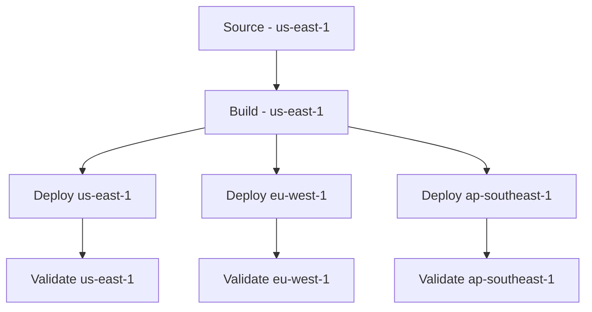
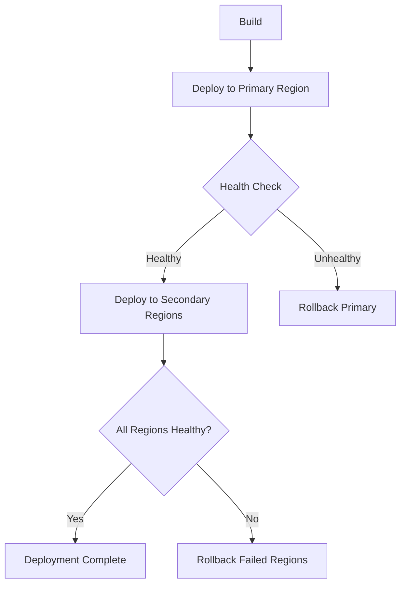

# How to Set Up Cross-Region CodePipeline Actions

Author: [nawazdhandala](https://github.com/nawazdhandala)

Tags: AWS, CodePipeline, Cross-Region, CI/CD, Multi-Region, DevOps

Description: Learn how to set up cross-region actions in AWS CodePipeline to deploy applications across multiple AWS regions from a single pipeline.

---

If your application serves users globally, you probably deploy to multiple AWS regions. Managing separate pipelines for each region quickly becomes a maintenance headache. Cross-region CodePipeline actions let you deploy to any AWS region from a single pipeline, keeping your CI/CD workflow centralized while your infrastructure stays distributed.

This guide covers configuring cross-region actions, setting up the required artifact buckets, handling cross-region deployments for ECS, Lambda, and CloudFormation, and managing the complexity that comes with multi-region deployments.

## Why Cross-Region Pipelines?

Without cross-region actions, your options for multi-region deployment are:

1. **Separate pipelines per region** - Works but creates maintenance overhead. Changes to the pipeline need to be replicated everywhere.
2. **Custom scripts** - Flexible but brittle. You end up reimplementing pipeline logic in bash scripts.
3. **Step Functions** - Possible but overkill for most deployment workflows.

Cross-region CodePipeline actions give you a single pipeline definition that orchestrates deployments across as many regions as you need.

## How It Works



When a pipeline action runs in a different region than the pipeline itself, CodePipeline:

1. Copies artifacts from the pipeline's artifact bucket to an artifact bucket in the target region
2. Executes the action in the target region
3. Returns results back to the pipeline

This means you need an S3 artifact bucket in each region where you have actions.

## Prerequisites

- A CodePipeline in your primary region
- S3 artifact buckets in each target region
- Deployment targets (ECS services, Lambda functions, CloudFormation stacks) in each target region
- IAM roles with cross-region permissions

## Step 1: Create Artifact Buckets in Each Region

Each region that runs pipeline actions needs its own artifact bucket:

```bash
# Create artifact bucket in us-east-1 (primary)
aws s3 mb s3://pipeline-artifacts-us-east-1-123456789012 \
  --region us-east-1

# Create artifact bucket in eu-west-1
aws s3 mb s3://pipeline-artifacts-eu-west-1-123456789012 \
  --region eu-west-1

# Create artifact bucket in ap-southeast-1
aws s3 mb s3://pipeline-artifacts-ap-southeast-1-123456789012 \
  --region ap-southeast-1
```

Enable encryption on all buckets:

```bash
# Apply encryption to each bucket
for BUCKET in \
  pipeline-artifacts-us-east-1-123456789012 \
  pipeline-artifacts-eu-west-1-123456789012 \
  pipeline-artifacts-ap-southeast-1-123456789012; do
  aws s3api put-bucket-encryption \
    --bucket $BUCKET \
    --server-side-encryption-configuration '{
      "Rules": [
        {
          "ApplyServerSideEncryptionByDefault": {
            "SSEAlgorithm": "aws:kms"
          }
        }
      ]
    }'
done
```

## Step 2: Configure the Pipeline with Cross-Region Artifact Stores

When creating or updating your pipeline, specify artifact stores for each region:

```json
{
  "name": "multi-region-pipeline",
  "pipelineType": "V2",
  "roleArn": "arn:aws:iam::123456789012:role/CodePipelineServiceRole",
  "artifactStores": {
    "us-east-1": {
      "type": "S3",
      "location": "pipeline-artifacts-us-east-1-123456789012",
      "encryptionKey": {
        "id": "arn:aws:kms:us-east-1:123456789012:alias/aws/s3",
        "type": "KMS"
      }
    },
    "eu-west-1": {
      "type": "S3",
      "location": "pipeline-artifacts-eu-west-1-123456789012",
      "encryptionKey": {
        "id": "arn:aws:kms:eu-west-1:123456789012:alias/aws/s3",
        "type": "KMS"
      }
    },
    "ap-southeast-1": {
      "type": "S3",
      "location": "pipeline-artifacts-ap-southeast-1-123456789012",
      "encryptionKey": {
        "id": "arn:aws:kms:ap-southeast-1:123456789012:alias/aws/s3",
        "type": "KMS"
      }
    }
  }
}
```

Note that when using `artifactStores` (plural), you replace the singular `artifactStore` field in the pipeline definition.

## Step 3: Add Cross-Region Deploy Actions

Here is a complete pipeline with cross-region ECS deployments:

```bash
# Create the multi-region pipeline
aws codepipeline create-pipeline --pipeline file://pipeline.json
```

```json
{
  "name": "multi-region-service",
  "pipelineType": "V2",
  "executionMode": "QUEUED",
  "roleArn": "arn:aws:iam::123456789012:role/CodePipelineServiceRole",
  "artifactStores": {
    "us-east-1": {
      "type": "S3",
      "location": "pipeline-artifacts-us-east-1-123456789012"
    },
    "eu-west-1": {
      "type": "S3",
      "location": "pipeline-artifacts-eu-west-1-123456789012"
    },
    "ap-southeast-1": {
      "type": "S3",
      "location": "pipeline-artifacts-ap-southeast-1-123456789012"
    }
  },
  "stages": [
    {
      "name": "Source",
      "actions": [
        {
          "name": "Source",
          "actionTypeId": {
            "category": "Source",
            "owner": "AWS",
            "provider": "CodeStarSourceConnection",
            "version": "1"
          },
          "region": "us-east-1",
          "configuration": {
            "ConnectionArn": "arn:aws:codestar-connections:us-east-1:123456789012:connection/abc123",
            "FullRepositoryId": "my-org/my-service",
            "BranchName": "main"
          },
          "outputArtifacts": [{"name": "SourceOutput"}]
        }
      ]
    },
    {
      "name": "Build",
      "actions": [
        {
          "name": "Build",
          "actionTypeId": {
            "category": "Build",
            "owner": "AWS",
            "provider": "CodeBuild",
            "version": "1"
          },
          "region": "us-east-1",
          "configuration": {
            "ProjectName": "my-service-build"
          },
          "inputArtifacts": [{"name": "SourceOutput"}],
          "outputArtifacts": [{"name": "BuildOutput"}]
        }
      ]
    },
    {
      "name": "DeployPrimary",
      "actions": [
        {
          "name": "Deploy-US-East",
          "actionTypeId": {
            "category": "Deploy",
            "owner": "AWS",
            "provider": "ECS",
            "version": "1"
          },
          "region": "us-east-1",
          "configuration": {
            "ClusterName": "production-us",
            "ServiceName": "my-service",
            "FileName": "imagedefinitions.json"
          },
          "inputArtifacts": [{"name": "BuildOutput"}],
          "runOrder": 1
        }
      ]
    },
    {
      "name": "ValidatePrimary",
      "actions": [
        {
          "name": "Validate-US-East",
          "actionTypeId": {
            "category": "Build",
            "owner": "AWS",
            "provider": "CodeBuild",
            "version": "1"
          },
          "region": "us-east-1",
          "configuration": {
            "ProjectName": "my-service-validation",
            "EnvironmentVariables": "[{\"name\":\"TARGET_REGION\",\"value\":\"us-east-1\",\"type\":\"PLAINTEXT\"}]"
          },
          "inputArtifacts": [{"name": "SourceOutput"}]
        }
      ]
    },
    {
      "name": "DeploySecondary",
      "actions": [
        {
          "name": "Deploy-EU-West",
          "actionTypeId": {
            "category": "Deploy",
            "owner": "AWS",
            "provider": "ECS",
            "version": "1"
          },
          "region": "eu-west-1",
          "configuration": {
            "ClusterName": "production-eu",
            "ServiceName": "my-service",
            "FileName": "imagedefinitions.json"
          },
          "inputArtifacts": [{"name": "BuildOutput"}],
          "runOrder": 1
        },
        {
          "name": "Deploy-AP-Southeast",
          "actionTypeId": {
            "category": "Deploy",
            "owner": "AWS",
            "provider": "ECS",
            "version": "1"
          },
          "region": "ap-southeast-1",
          "configuration": {
            "ClusterName": "production-ap",
            "ServiceName": "my-service",
            "FileName": "imagedefinitions.json"
          },
          "inputArtifacts": [{"name": "BuildOutput"}],
          "runOrder": 1
        }
      ]
    }
  ]
}
```

This pipeline deploys to us-east-1 first, validates, then deploys to eu-west-1 and ap-southeast-1 in parallel.

## Step 4: Handle Cross-Region Docker Images

For ECS deployments, your Docker images need to be available in each target region's ECR. Add a cross-region image replication step:

```yaml
# buildspec.yml - Build and replicate Docker image to all regions
version: 0.2

env:
  variables:
    AWS_ACCOUNT_ID: "123456789012"
    IMAGE_NAME: "my-service"
    TARGET_REGIONS: "us-east-1 eu-west-1 ap-southeast-1"

phases:
  pre_build:
    commands:
      # Login to ECR in the build region
      - aws ecr get-login-password --region us-east-1 | docker login --username AWS --password-stdin ${AWS_ACCOUNT_ID}.dkr.ecr.us-east-1.amazonaws.com

  build:
    commands:
      # Build the image
      - IMAGE_TAG=$(echo $CODEBUILD_RESOLVED_SOURCE_VERSION | cut -c 1-7)
      - docker build -t ${IMAGE_NAME}:${IMAGE_TAG} .

      # Push to primary region
      - docker tag ${IMAGE_NAME}:${IMAGE_TAG} ${AWS_ACCOUNT_ID}.dkr.ecr.us-east-1.amazonaws.com/${IMAGE_NAME}:${IMAGE_TAG}
      - docker push ${AWS_ACCOUNT_ID}.dkr.ecr.us-east-1.amazonaws.com/${IMAGE_NAME}:${IMAGE_TAG}

  post_build:
    commands:
      # Replicate to other regions using ECR replication or manual push
      - |
        for REGION in eu-west-1 ap-southeast-1; do
          aws ecr get-login-password --region $REGION | \
            docker login --username AWS --password-stdin ${AWS_ACCOUNT_ID}.dkr.ecr.${REGION}.amazonaws.com
          docker tag ${IMAGE_NAME}:${IMAGE_TAG} \
            ${AWS_ACCOUNT_ID}.dkr.ecr.${REGION}.amazonaws.com/${IMAGE_NAME}:${IMAGE_TAG}
          docker push ${AWS_ACCOUNT_ID}.dkr.ecr.${REGION}.amazonaws.com/${IMAGE_NAME}:${IMAGE_TAG}
        done

      # Generate imagedefinitions.json for ECS
      - printf '[{"name":"myapp","imageUri":"%s"}]' ${AWS_ACCOUNT_ID}.dkr.ecr.us-east-1.amazonaws.com/${IMAGE_NAME}:${IMAGE_TAG} > imagedefinitions.json

artifacts:
  files:
    - imagedefinitions.json
```

A better approach is to use ECR replication rules:

```bash
# Set up ECR cross-region replication
aws ecr put-replication-configuration \
  --replication-configuration '{
    "rules": [
      {
        "destinations": [
          {
            "region": "eu-west-1",
            "registryId": "123456789012"
          },
          {
            "region": "ap-southeast-1",
            "registryId": "123456789012"
          }
        ],
        "repositoryFilters": [
          {
            "filter": "my-service",
            "filterType": "PREFIX_MATCH"
          }
        ]
      }
    ]
  }'
```

With ECR replication, images pushed to us-east-1 are automatically replicated to the other regions.

## Step 5: Cross-Region CloudFormation Deployment

For infrastructure changes, use CloudFormation deploy actions with the region parameter:

```json
{
  "name": "DeployInfra-EU",
  "actionTypeId": {
    "category": "Deploy",
    "owner": "AWS",
    "provider": "CloudFormation",
    "version": "1"
  },
  "region": "eu-west-1",
  "configuration": {
    "ActionMode": "CREATE_UPDATE",
    "StackName": "my-service-infra",
    "TemplatePath": "BuildOutput::infrastructure/template.yaml",
    "Capabilities": "CAPABILITY_IAM,CAPABILITY_AUTO_EXPAND",
    "RoleArn": "arn:aws:iam::123456789012:role/CloudFormationDeployRole",
    "ParameterOverrides": "{\"Environment\": \"production\", \"Region\": \"eu-west-1\"}"
  },
  "inputArtifacts": [{"name": "BuildOutput"}]
}
```

## Deployment Strategy

A common pattern for multi-region deployments is the canary approach:



Deploy to the primary region first, validate it is healthy, then expand to remaining regions. This limits the blast radius if the new version has issues.

## Step 6: IAM Configuration for Cross-Region

The pipeline service role needs permissions in all target regions:

```json
{
  "Version": "2012-10-17",
  "Statement": [
    {
      "Effect": "Allow",
      "Action": [
        "s3:GetObject",
        "s3:PutObject",
        "s3:GetBucketLocation"
      ],
      "Resource": [
        "arn:aws:s3:::pipeline-artifacts-*-123456789012",
        "arn:aws:s3:::pipeline-artifacts-*-123456789012/*"
      ]
    },
    {
      "Effect": "Allow",
      "Action": [
        "codebuild:StartBuild",
        "codebuild:BatchGetBuilds"
      ],
      "Resource": "arn:aws:codebuild:*:123456789012:project/*"
    },
    {
      "Effect": "Allow",
      "Action": [
        "ecs:UpdateService",
        "ecs:DescribeServices",
        "ecs:RegisterTaskDefinition"
      ],
      "Resource": "*"
    },
    {
      "Effect": "Allow",
      "Action": [
        "kms:Decrypt",
        "kms:Encrypt",
        "kms:GenerateDataKey"
      ],
      "Resource": "arn:aws:kms:*:123456789012:key/*"
    }
  ]
}
```

## Best Practices

1. **Deploy to primary region first.** Always validate the deployment in one region before rolling out to others. This is your canary.

2. **Use ECR replication instead of manual image pushes.** It is more reliable and decouples image distribution from the pipeline.

3. **Keep artifact buckets encrypted.** Use KMS encryption on all cross-region artifact buckets.

4. **Add validation between stages.** After deploying to the primary region, run health checks and integration tests before proceeding to secondary regions.

5. **Consider time zones.** Schedule deployments during low-traffic periods for each region. For global deployments, there is no perfect time, so the canary approach becomes even more important.

6. **Monitor all regions.** Make sure your monitoring and alerting covers every region you deploy to. A deployment that succeeds in us-east-1 but fails silently in ap-southeast-1 is a real risk.

## Wrapping Up

Cross-region CodePipeline actions let you manage multi-region deployments from a single pipeline definition. The key is proper setup: artifact buckets in every target region, ECR replication for container images, and IAM roles with cross-region permissions. Combined with a canary deployment strategy that validates in the primary region first, you get a reliable multi-region deployment process that scales without multiplying your pipeline maintenance burden.
