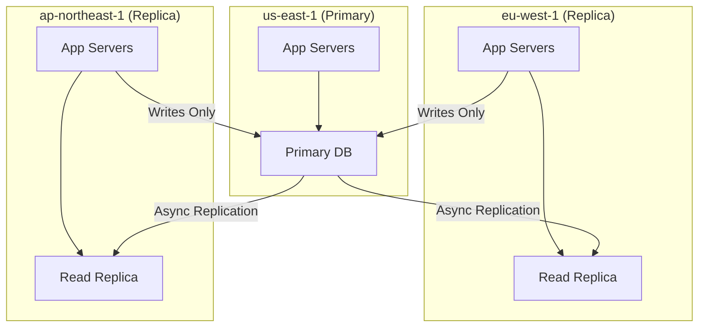

# How to Set Up Cross-Region Database Read Replicas

Author: [nawazdhandala](https://github.com/nawazdhandala)

Tags: AWS, RDS, Aurora, Cross-Region, Read Replicas, High Availability

Description: Step-by-step guide to setting up cross-region read replicas on AWS for lower latency and disaster recovery

---

If your users are spread across the globe, a single-region database means someone is always far from the data. A user in Tokyo hitting a database in us-east-1 will experience 150-200ms of network latency on every query. Multiply that by the number of queries per page load and your application feels sluggish.

Cross-region read replicas solve this by placing a copy of your data closer to users in other regions. Reads go to the local replica. Writes still go to the primary. The replication happens asynchronously behind the scenes.

## When Cross-Region Replicas Make Sense

Cross-region read replicas serve two main purposes:

1. **Lower read latency** for users in remote regions
2. **Disaster recovery** - if your primary region goes down, you can promote a replica to become the new primary

They do come with trade-offs. Replication is asynchronous, so there is always some lag. Reads from replicas might return slightly stale data. For most applications this is acceptable, but if you need strong consistency, reads must go to the primary.



## Option 1: RDS Cross-Region Read Replicas

Standard RDS supports cross-region read replicas for MySQL, MariaDB, PostgreSQL, and Oracle.

### Creating the Replica

```bash
# Create a cross-region read replica of your RDS primary instance
aws rds create-db-instance-read-replica \
  --db-instance-identifier my-eu-replica \
  --source-db-instance-identifier arn:aws:rds:us-east-1:123456789012:db:my-primary-db \
  --db-instance-class db.r6g.large \
  --region eu-west-1 \
  --availability-zone eu-west-1a \
  --storage-type gp3 \
  --kms-key-id arn:aws:kms:eu-west-1:123456789012:key/KEY_ID
```

A few important notes:

- You must use the full ARN of the source instance, not just the identifier, because it is in a different region
- If the source is encrypted, you must specify a KMS key in the target region
- The replica inherits the engine version from the primary
- Cross-region replication uses the database engine's native replication (MySQL binlog, PostgreSQL streaming replication)

### Monitoring Replica Lag

```bash
# Check replication lag on the cross-region replica
aws rds describe-db-instances \
  --db-instance-identifier my-eu-replica \
  --region eu-west-1 \
  --query 'DBInstances[0].{
    Status: DBInstanceStatus,
    ReplicaLag: StatusInfos[?Normal==`false`].Message
  }'
```

You can also monitor `ReplicaLag` through CloudWatch. Set up an alarm if lag exceeds your tolerance:

```bash
# Alarm when replica lag exceeds 30 seconds
aws cloudwatch put-metric-alarm \
  --alarm-name cross-region-replica-lag \
  --namespace AWS/RDS \
  --metric-name ReplicaLag \
  --dimensions Name=DBInstanceIdentifier,Value=my-eu-replica \
  --statistic Maximum \
  --period 300 \
  --evaluation-periods 2 \
  --threshold 30 \
  --comparison-operator GreaterThanThreshold \
  --alarm-actions arn:aws:sns:eu-west-1:123456789012:alerts \
  --region eu-west-1
```

## Option 2: Aurora Global Database

Aurora Global Database is purpose-built for cross-region deployments. It uses dedicated replication infrastructure that is separate from the database engine, resulting in much lower replication lag.

### Key Advantages Over RDS Cross-Region Replicas

- Typical replication lag under 1 second (compared to seconds or minutes with RDS)
- Storage-based replication that does not impact database performance
- Managed failover with RPO of 1 second and RTO under 1 minute
- Up to 5 secondary regions

### Setting Up Aurora Global Database

First, you need an existing Aurora cluster as your primary.

```bash
# Create the global database cluster linking to an existing Aurora cluster
aws rds create-global-cluster \
  --global-cluster-identifier my-global-db \
  --source-db-cluster-identifier arn:aws:rds:us-east-1:123456789012:cluster:my-aurora-cluster \
  --region us-east-1
```

Then add a secondary region:

```bash
# Create the secondary cluster in eu-west-1
aws rds create-db-cluster \
  --db-cluster-identifier my-aurora-eu \
  --global-cluster-identifier my-global-db \
  --engine aurora-postgresql \
  --engine-version 15.4 \
  --region eu-west-1 \
  --db-subnet-group-name my-eu-subnet-group

# Add a reader instance to the secondary cluster
aws rds create-db-instance \
  --db-instance-identifier my-aurora-eu-reader-1 \
  --db-cluster-identifier my-aurora-eu \
  --db-instance-class db.r6g.large \
  --engine aurora-postgresql \
  --region eu-west-1
```

### Monitoring Global Database Lag

Aurora Global Database exposes the `AuroraGlobalDBReplicationLag` metric:

```bash
# Check global database replication lag in the secondary region
aws cloudwatch get-metric-statistics \
  --namespace AWS/RDS \
  --metric-name AuroraGlobalDBReplicationLag \
  --dimensions Name=DBClusterIdentifier,Value=my-aurora-eu \
  --start-time $(date -u -v-1H +%Y-%m-%dT%H:%M:%S) \
  --end-time $(date -u +%Y-%m-%dT%H:%M:%S) \
  --period 60 \
  --statistics Average Maximum \
  --region eu-west-1
```

## Routing Reads to the Nearest Replica

Having replicas in multiple regions is useless if your application does not route reads to the closest one. There are several approaches.

### Using Route 53 Latency-Based Routing

Create DNS records for each replica endpoint with latency-based routing. Route 53 will automatically direct queries to the closest endpoint based on network latency.

```bash
# Create latency-based DNS records for each replica region
aws route53 change-resource-record-sets \
  --hosted-zone-id Z1234567890 \
  --change-batch '{
    "Changes": [
      {
        "Action": "CREATE",
        "ResourceRecordSet": {
          "Name": "db-reader.example.com",
          "Type": "CNAME",
          "SetIdentifier": "us-east-1",
          "Region": "us-east-1",
          "TTL": 60,
          "ResourceRecords": [{"Value": "my-primary-db.abc123.us-east-1.rds.amazonaws.com"}]
        }
      },
      {
        "Action": "CREATE",
        "ResourceRecordSet": {
          "Name": "db-reader.example.com",
          "Type": "CNAME",
          "SetIdentifier": "eu-west-1",
          "Region": "eu-west-1",
          "TTL": 60,
          "ResourceRecords": [{"Value": "my-eu-replica.xyz789.eu-west-1.rds.amazonaws.com"}]
        }
      }
    ]
  }'
```

### Application-Level Routing

For more control, handle routing in your application code:

```python
# Route reads to the nearest replica based on the app's region
import os
import psycopg2

REGION = os.environ.get('AWS_REGION', 'us-east-1')

# Map regions to replica endpoints
READ_ENDPOINTS = {
    'us-east-1': 'primary.abc123.us-east-1.rds.amazonaws.com',
    'eu-west-1': 'replica-eu.xyz789.eu-west-1.rds.amazonaws.com',
    'ap-northeast-1': 'replica-ap.def456.ap-northeast-1.rds.amazonaws.com',
}

WRITE_ENDPOINT = 'primary.abc123.us-east-1.rds.amazonaws.com'

def get_read_connection():
    """Connect to the nearest read replica"""
    endpoint = READ_ENDPOINTS.get(REGION, WRITE_ENDPOINT)
    return psycopg2.connect(host=endpoint, dbname='mydb', user='app', password='secret')

def get_write_connection():
    """Always connect to the primary for writes"""
    return psycopg2.connect(host=WRITE_ENDPOINT, dbname='mydb', user='app', password='secret')
```

## Handling Failover

### Promoting an RDS Cross-Region Replica

If your primary region fails, promote the cross-region replica to a standalone database:

```bash
# Promote the cross-region replica to a standalone primary
aws rds promote-read-replica \
  --db-instance-identifier my-eu-replica \
  --region eu-west-1
```

This breaks the replication link permanently. After promotion, the former replica becomes an independent database that accepts writes. Update your application's write endpoint to point to the promoted instance.

### Aurora Global Database Failover

Aurora Global Database supports managed failover:

```bash
# Initiate planned failover to the secondary region
aws rds failover-global-cluster \
  --global-cluster-identifier my-global-db \
  --target-db-cluster-identifier arn:aws:rds:eu-west-1:123456789012:cluster:my-aurora-eu \
  --region us-east-1
```

Planned failover has zero data loss. For unplanned failover (primary region down), use `switchover-global-cluster` which has RPO of typically under 1 second.

## Cost Considerations

Cross-region replicas incur three categories of cost:

1. **Instance cost** in the target region (same as running any RDS/Aurora instance)
2. **Cross-region data transfer** for replication traffic (currently $0.02/GB between most regions)
3. **Storage** in the target region

For a database with moderate write activity (say 10GB/day of replication data), the cross-region transfer adds about $6/month. The bulk of the cost is the instance itself.

## Connection Pooling

When running replicas across regions, connection pooling becomes even more important. Each region should have its own connection pool. Check out our guide on [implementing database connection pooling on AWS](https://oneuptime.com/blog/post/2026-02-12-implement-database-connection-pooling-on-aws/view) for the details.

## Wrapping Up

Cross-region read replicas are the most effective way to reduce read latency for geographically distributed users. Aurora Global Database is the premium option with sub-second replication lag. Standard RDS cross-region replicas work well for tighter budgets. Either way, plan your routing strategy, monitor replication lag, and have a tested failover procedure ready before you need it.
