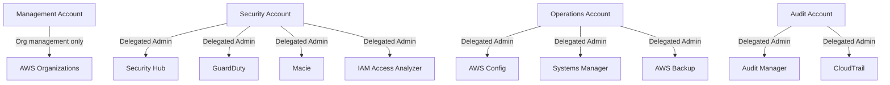

# How to Set Up Delegated Administrator Accounts in AWS Organizations

Author: [nawazdhandala](https://github.com/nawazdhandala)

Tags: AWS, Organizations, Delegated Administrator, Multi-Account, Security, Governance

Description: Learn how to set up delegated administrator accounts in AWS Organizations to distribute management responsibilities without sharing management account access.

---

The management account in AWS Organizations is the most privileged account in your entire AWS estate. It can create and close accounts, apply policies, and manage billing. Best practice says you should limit its usage to only what absolutely requires management account access. But many AWS services need organization-wide visibility or control. The solution is delegated administrator accounts.

Delegated administrators let you designate a member account to manage a specific AWS service on behalf of the organization, without giving that account management account privileges. This guide covers how to set up delegated administrators for common services and manage them effectively.

## Why Use Delegated Administrators?

There are several compelling reasons:

1. **Reduced blast radius.** If a delegated administrator account is compromised, the attacker gets access to one service's organization-wide capabilities, not everything.

2. **Separation of duties.** Your security team manages SecurityHub from their account, your operations team manages Systems Manager from theirs, and nobody needs access to the management account.

3. **Compliance.** Many compliance frameworks require least-privilege access. The management account should not be used for day-to-day operations.

4. **Operational safety.** Fewer people accessing the management account means fewer chances for accidental changes to critical organization settings.

## Which Services Support Delegated Administrator?

The list of services that support delegated administration grows regularly. Here are some of the most commonly used ones:

- AWS Security Hub
- Amazon GuardDuty
- AWS Config
- AWS Firewall Manager
- Amazon Macie
- AWS IAM Access Analyzer
- AWS CloudFormation StackSets
- AWS Backup
- Amazon Detective
- AWS Audit Manager
- AWS Systems Manager

Each service has its own registration process, but the pattern is similar across all of them.

## Prerequisites

- AWS Organizations with all features enabled
- Management account access
- The member account that will become the delegated administrator must already exist in the organization
- The target service must be enabled in the organization

## Step 1: Plan Your Delegated Administrator Strategy

Before diving into the setup, plan which accounts will administer which services. A common pattern looks like this:



Grouping related services into a single delegated administrator account keeps things manageable while still separating concerns.

## Step 2: Register a Delegated Administrator (General Method)

Some services use the Organizations API directly for delegation:

```bash
# Register an account as a delegated administrator for a service
aws organizations register-delegated-administrator \
  --account-id 222222222222 \
  --service-principal config-multiaccountsetup.amazonaws.com
```

Verify the registration:

```bash
# List all delegated administrators
aws organizations list-delegated-administrators

# List services delegated to a specific account
aws organizations list-delegated-services-for-account \
  --account-id 222222222222
```

## Step 3: Set Up Security Hub Delegated Administrator

Security Hub has its own API for delegation:

```bash
# From the management account, designate a delegated admin for Security Hub
aws securityhub enable-organization-admin-account \
  --admin-account-id 222222222222
```

Once registered, the security account can:
- Enable Security Hub across all member accounts automatically
- Configure security standards organization-wide
- Aggregate findings from all accounts
- Create custom actions and automations

```bash
# From the delegated admin account, enable auto-enable for new accounts
aws securityhub update-organization-configuration \
  --auto-enable
```

## Step 4: Set Up GuardDuty Delegated Administrator

```bash
# Designate the security account as GuardDuty delegated admin
aws guardduty enable-organization-admin-account \
  --admin-account-id 222222222222

# From the delegated admin account, get the detector ID
DETECTOR_ID=$(aws guardduty list-detectors --query 'DetectorIds[0]' --output text)

# Enable auto-enrollment for new accounts
aws guardduty update-organization-configuration \
  --detector-id $DETECTOR_ID \
  --auto-enable-organization-members ALL \
  --features '[
    {
      "Name": "S3_DATA_EVENTS",
      "AutoEnable": "ALL"
    },
    {
      "Name": "EKS_AUDIT_LOGS",
      "AutoEnable": "ALL"
    },
    {
      "Name": "RUNTIME_MONITORING",
      "AutoEnable": "ALL"
    }
  ]'
```

## Step 5: Set Up AWS Config Delegated Administrator

```bash
# Register Config delegated administrator
aws organizations register-delegated-administrator \
  --account-id 333333333333 \
  --service-principal config-multiaccountsetup.amazonaws.com

# From the delegated admin, deploy organization Config rules
aws configservice put-organization-config-rule \
  --organization-config-rule-name "required-tags" \
  --organization-managed-rule-metadata '{
    "RuleIdentifier": "REQUIRED_TAGS",
    "InputParameters": "{\"tag1Key\": \"Environment\", \"tag2Key\": \"Owner\"}",
    "ResourceTypesScope": ["AWS::EC2::Instance", "AWS::RDS::DBInstance"]
  }'
```

## Step 6: Set Up CloudFormation StackSets Delegated Administrator

StackSets delegation is particularly useful for operations teams that need to deploy resources across all accounts:

```bash
# Register as delegated admin for CloudFormation StackSets
aws organizations register-delegated-administrator \
  --account-id 333333333333 \
  --service-principal member.org.stacksets.cloudformation.amazonaws.com

# Enable trusted access for StackSets
aws organizations enable-aws-service-access \
  --service-principal member.org.stacksets.cloudformation.amazonaws.com
```

Now the operations account can create StackSets with `SERVICE_MANAGED` permission model:

```bash
# From the delegated admin account, create a StackSet
aws cloudformation create-stack-set \
  --stack-set-name "monitoring-agents" \
  --template-body file://monitoring-agent.yaml \
  --permission-model SERVICE_MANAGED \
  --auto-deployment Enabled=true,RetainStacksOnAccountRemoval=false \
  --call-as DELEGATED_ADMIN
```

Note the `--call-as DELEGATED_ADMIN` flag. This is required when making StackSet calls from a delegated administrator account.

## Step 7: Set Up AWS Backup Delegated Administrator

```bash
# Register Backup delegated administrator
aws organizations register-delegated-administrator \
  --account-id 333333333333 \
  --service-principal backup.amazonaws.com

# From the delegated admin, enable cross-account management
aws backup update-region-settings \
  --resource-type-management-preference '{
    "EBS": true,
    "EC2": true,
    "RDS": true,
    "Aurora": true,
    "DynamoDB": true,
    "S3": true
  }'
```

For more on backup policies, check out our guide on [implementing AWS Organizations backup policies](https://oneuptime.com/blog/post/implement-aws-organizations-backup-policies/view).

## Automating Delegated Admin Setup with CloudFormation

Here is a CloudFormation template that sets up delegated administrators as part of your landing zone:

```yaml
# CloudFormation template for delegated administrator setup
AWSTemplateFormatVersion: '2010-09-09'
Description: Register delegated administrators for AWS services

Parameters:
  SecurityAccountId:
    Type: String
    Description: Account ID for the security account
  OperationsAccountId:
    Type: String
    Description: Account ID for the operations account

Resources:
  SecurityHubDelegatedAdmin:
    Type: AWS::SecurityHub::DelegatedAdmin
    Properties:
      DelegatedAdminAccountId: !Ref SecurityAccountId

  GuardDutyDelegatedAdmin:
    Type: AWS::GuardDuty::Detector
    Properties:
      Enable: true

  # Use a Custom Resource for services without native CloudFormation support
  ConfigDelegatedAdmin:
    Type: Custom::DelegatedAdmin
    Properties:
      ServiceToken: !GetAtt DelegatedAdminFunction.Arn
      AccountId: !Ref OperationsAccountId
      ServicePrincipal: config-multiaccountsetup.amazonaws.com

  DelegatedAdminFunction:
    Type: AWS::Lambda::Function
    Properties:
      FunctionName: register-delegated-admin
      Runtime: python3.12
      Handler: index.handler
      Role: !GetAtt DelegatedAdminRole.Arn
      Code:
        ZipFile: |
          import boto3
          import cfnresponse

          def handler(event, context):
              client = boto3.client('organizations')
              try:
                  if event['RequestType'] in ['Create', 'Update']:
                      client.register_delegated_administrator(
                          AccountId=event['ResourceProperties']['AccountId'],
                          ServicePrincipal=event['ResourceProperties']['ServicePrincipal']
                      )
                  elif event['RequestType'] == 'Delete':
                      client.deregister_delegated_administrator(
                          AccountId=event['ResourceProperties']['AccountId'],
                          ServicePrincipal=event['ResourceProperties']['ServicePrincipal']
                      )
                  cfnresponse.send(event, context, cfnresponse.SUCCESS, {})
              except Exception as e:
                  cfnresponse.send(event, context, cfnresponse.FAILED, {'Error': str(e)})

  DelegatedAdminRole:
    Type: AWS::IAM::Role
    Properties:
      AssumeRolePolicyDocument:
        Version: '2012-10-17'
        Statement:
          - Effect: Allow
            Principal:
              Service: lambda.amazonaws.com
            Action: sts:AssumeRole
      ManagedPolicyArns:
        - arn:aws:iam::aws:policy/service-role/AWSLambdaBasicExecutionRole
      Policies:
        - PolicyName: OrganizationsAccess
          PolicyDocument:
            Version: '2012-10-17'
            Statement:
              - Effect: Allow
                Action:
                  - organizations:RegisterDelegatedAdministrator
                  - organizations:DeregisterDelegatedAdministrator
                Resource: '*'
```

## Limits and Constraints

- Each service can have a limited number of delegated administrators (often just one, but some support up to five)
- A single account can be a delegated administrator for multiple services
- The management account cannot be registered as a delegated administrator
- Some services require trusted access to be enabled before delegation works

## Best Practices

1. **Dedicate accounts for administration.** Do not use accounts running production workloads as delegated administrators. Use purpose-built accounts.

2. **Limit the number of delegated admin accounts.** Two or three accounts (security, operations, audit) covering all services is manageable. Ten separate accounts becomes unwieldy.

3. **Document your delegation map.** Keep a record of which account administers which service. This is critical for incident response.

4. **Apply SCPs to delegated admin accounts.** Just because an account is a delegated administrator does not mean it should have unrestricted access to everything. Use SCPs to limit what it can do outside its administrative role.

5. **Monitor delegated admin changes.** Set up CloudTrail alerts for `RegisterDelegatedAdministrator` and `DeregisterDelegatedAdministrator` API calls.

## Wrapping Up

Delegated administrator accounts are a fundamental building block of a well-architected multi-account strategy. They let you distribute management responsibilities across specialized accounts while keeping the management account locked down for only the most critical operations. Start by identifying your key administrative domains (security, operations, audit), designate accounts for each, and register them as delegated administrators for the relevant services. This approach scales well from a handful of accounts to thousands.
