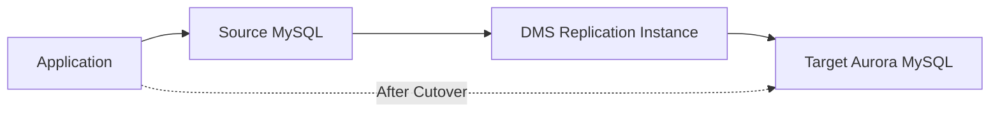

# How to Set Up DMS for MySQL to Aurora Migration

Author: [nawazdhandala](https://github.com/nawazdhandala)

Tags: AWS, DMS, MySQL, Aurora, Database Migration, Replication

Description: Step-by-step guide to using AWS Database Migration Service to migrate from MySQL to Aurora MySQL with minimal downtime using CDC replication.

---

Migrating from MySQL to Aurora MySQL is one of the most common database migrations on AWS. Aurora offers better performance, automatic storage scaling, built-in replication, and lower operational overhead. But the migration itself needs to be handled carefully, especially if you cannot afford significant downtime.

AWS Database Migration Service (DMS) makes this migration manageable by handling the heavy lifting of data replication. It performs a full load of your existing data and then uses Change Data Capture (CDC) to replicate ongoing changes until you are ready to cut over. The result is a migration with minimal downtime, typically measured in seconds to minutes.

## Migration Architecture



DMS reads from the source MySQL database, transforms the data if needed, and writes it to the target Aurora cluster. During the full load phase, it copies all existing data. During the CDC phase, it captures and applies changes in near real-time.

## Prerequisites

Before starting, ensure:

- Your source MySQL is version 5.6 or later
- Binary logging is enabled on the source (`log_bin = ON`, `binlog_format = ROW`)
- The DMS replication instance can reach both source and target
- You have appropriate database credentials on both sides

### Verify Source MySQL Configuration

```sql
-- Check binary logging is enabled (required for CDC)
SHOW VARIABLES LIKE 'log_bin';
-- Should return ON

-- Check binlog format is ROW (required for DMS CDC)
SHOW VARIABLES LIKE 'binlog_format';
-- Should return ROW

-- Check binlog retention
SHOW VARIABLES LIKE 'binlog_expire_logs_seconds';
-- Should be at least 86400 (24 hours) to give DMS time to read changes
```

If binary logging is not configured correctly, update your MySQL configuration.

```ini
# my.cnf changes for DMS compatibility
[mysqld]
server-id = 1
log_bin = mysql-bin
binlog_format = ROW
binlog_row_image = FULL
expire_logs_days = 3
```

## Step 1: Create the Target Aurora Cluster

```bash
# Create an Aurora MySQL cluster as the migration target
aws rds create-db-cluster \
  --db-cluster-identifier mysql-to-aurora-target \
  --engine aurora-mysql \
  --engine-version 8.0.mysql_aurora.3.07.0 \
  --master-username admin \
  --master-user-password 'YourStr0ngP@ss!' \
  --db-subnet-group-name my-db-subnet-group \
  --vpc-security-group-ids sg-0abc123

# Create an instance in the cluster
aws rds create-db-instance \
  --db-instance-identifier mysql-to-aurora-target-instance \
  --db-cluster-identifier mysql-to-aurora-target \
  --db-instance-class db.r6g.large \
  --engine aurora-mysql
```

## Step 2: Create a DMS Replication Instance

The replication instance is the compute that runs the migration.

```bash
# Create a DMS replication instance
aws dms create-replication-instance \
  --replication-instance-identifier mysql-aurora-migration \
  --replication-instance-class dms.r5.large \
  --allocated-storage 100 \
  --vpc-security-group-ids sg-0abc123 \
  --replication-subnet-group-identifier my-dms-subnet-group \
  --multi-az \
  --publicly-accessible false \
  --tags Key=Migration,Value=mysql-to-aurora
```

Size the instance based on your data volume and change rate:
- dms.t3.medium: small databases up to 50 GB
- dms.r5.large: medium databases 50-500 GB
- dms.r5.xlarge: large databases 500 GB+

## Step 3: Create Source and Target Endpoints

### Source Endpoint (MySQL)

```bash
# Create the source endpoint pointing to your MySQL database
aws dms create-endpoint \
  --endpoint-identifier mysql-source \
  --endpoint-type source \
  --engine-name mysql \
  --server-name mysql-primary.example.com \
  --port 3306 \
  --username dms_user \
  --password 'DmsUserP@ss!' \
  --database-name myapp \
  --extra-connection-attributes "initstmt=SET FOREIGN_KEY_CHECKS=0"
```

### Target Endpoint (Aurora)

```bash
# Create the target endpoint pointing to your Aurora cluster
aws dms create-endpoint \
  --endpoint-identifier aurora-target \
  --endpoint-type target \
  --engine-name aurora \
  --server-name mysql-to-aurora-target.cluster-xxxxx.us-east-1.rds.amazonaws.com \
  --port 3306 \
  --username admin \
  --password 'YourStr0ngP@ss!' \
  --database-name myapp \
  --extra-connection-attributes "parallelLoadThreads=8;initstmt=SET FOREIGN_KEY_CHECKS=0"
```

The `parallelLoadThreads` setting speeds up the full load phase by using multiple threads.

### Test the Connections

```bash
# Test source endpoint connection
aws dms test-connection \
  --replication-instance-arn arn:aws:dms:us-east-1:123456789012:rep:mysql-aurora-migration \
  --endpoint-arn arn:aws:dms:us-east-1:123456789012:endpoint:mysql-source

# Test target endpoint connection
aws dms test-connection \
  --replication-instance-arn arn:aws:dms:us-east-1:123456789012:rep:mysql-aurora-migration \
  --endpoint-arn arn:aws:dms:us-east-1:123456789012:endpoint:aurora-target
```

## Step 4: Create Table Mappings

Table mappings define what to migrate and any transformations to apply.

```json
// table-mappings.json - migrate all tables from the myapp database
{
  "rules": [
    {
      "rule-type": "selection",
      "rule-id": "1",
      "rule-name": "migrate-all-tables",
      "object-locator": {
        "schema-name": "myapp",
        "table-name": "%"
      },
      "rule-action": "include"
    },
    {
      "rule-type": "selection",
      "rule-id": "2",
      "rule-name": "exclude-temp-tables",
      "object-locator": {
        "schema-name": "myapp",
        "table-name": "tmp_%"
      },
      "rule-action": "exclude"
    }
  ]
}
```

## Step 5: Create and Start the Migration Task

```bash
# Create the migration task with full load + CDC
aws dms create-replication-task \
  --replication-task-identifier mysql-aurora-full-cdc \
  --source-endpoint-arn arn:aws:dms:us-east-1:123456789012:endpoint:mysql-source \
  --target-endpoint-arn arn:aws:dms:us-east-1:123456789012:endpoint:aurora-target \
  --replication-instance-arn arn:aws:dms:us-east-1:123456789012:rep:mysql-aurora-migration \
  --migration-type full-load-and-cdc \
  --table-mappings file://table-mappings.json \
  --replication-task-settings '{
    "TargetMetadata": {
      "TargetSchema": "",
      "SupportLobs": true,
      "FullLobMode": false,
      "LobChunkSize": 64,
      "LimitedSizeLobMode": true,
      "LobMaxSize": 32768
    },
    "FullLoadSettings": {
      "TargetTablePrepMode": "DROP_AND_CREATE",
      "MaxFullLoadSubTasks": 8,
      "TransactionConsistencyTimeout": 600,
      "CommitRate": 10000
    },
    "Logging": {
      "EnableLogging": true,
      "LogComponents": [
        {"Id": "TRANSFORMATION", "Severity": "LOGGER_SEVERITY_DEFAULT"},
        {"Id": "SOURCE_UNLOAD", "Severity": "LOGGER_SEVERITY_DEFAULT"},
        {"Id": "TARGET_LOAD", "Severity": "LOGGER_SEVERITY_DEFAULT"},
        {"Id": "SOURCE_CAPTURE", "Severity": "LOGGER_SEVERITY_DEFAULT"},
        {"Id": "TARGET_APPLY", "Severity": "LOGGER_SEVERITY_DEFAULT"}
      ]
    }
  }'
```

Start the task.

```bash
# Start the migration task
aws dms start-replication-task \
  --replication-task-arn arn:aws:dms:us-east-1:123456789012:task:mysql-aurora-full-cdc \
  --start-replication-task-type start-replication
```

## Step 6: Monitor the Migration

### Check Task Status

```bash
# Monitor task progress
aws dms describe-replication-tasks \
  --filters Name=replication-task-arn,Values=arn:aws:dms:us-east-1:123456789012:task:mysql-aurora-full-cdc \
  --query 'ReplicationTasks[0].{Status:Status,Progress:ReplicationTaskStats}'
```

### Check Table Statistics

```bash
# See per-table migration statistics
aws dms describe-table-statistics \
  --replication-task-arn arn:aws:dms:us-east-1:123456789012:task:mysql-aurora-full-cdc \
  --query 'TableStatistics[*].{Table:TableName,Inserts:Inserts,Deletes:Deletes,Updates:Updates,FullLoadRows:FullLoadRows,State:TableState}'
```

### Monitor CDC Latency

```bash
# Check CDC replication lag
aws cloudwatch get-metric-statistics \
  --namespace AWS/DMS \
  --metric-name CDCLatencyTarget \
  --dimensions Name=ReplicationInstanceIdentifier,Value=mysql-aurora-migration Name=ReplicationTaskIdentifier,Value=mysql-aurora-full-cdc \
  --start-time $(date -u -d '1 hour ago' +%Y-%m-%dT%H:%M:%S) \
  --end-time $(date -u +%Y-%m-%dT%H:%M:%S) \
  --period 60 \
  --statistics Average
```

## Step 7: Validate the Migration

### Row Count Validation

```python
# Compare row counts between source and target
import pymysql

def get_row_counts(host, port, user, password, database):
    """Get row counts for all tables in a database."""
    conn = pymysql.connect(host=host, port=port, user=user, password=password, database=database)
    cursor = conn.cursor()

    cursor.execute("SHOW TABLES")
    tables = [row[0] for row in cursor.fetchall()]

    counts = {}
    for table in tables:
        cursor.execute(f"SELECT COUNT(*) FROM `{table}`")
        counts[table] = cursor.fetchone()[0]

    conn.close()
    return counts

source_counts = get_row_counts('mysql-primary.example.com', 3306, 'dms_user', 'pass', 'myapp')
target_counts = get_row_counts('mysql-to-aurora-target.cluster-xxxxx.rds.amazonaws.com', 3306, 'admin', 'pass', 'myapp')

print(f"{'Table':<30} {'Source':>10} {'Target':>10} {'Match':>6}")
print("-" * 60)
for table in source_counts:
    source = source_counts.get(table, 0)
    target = target_counts.get(table, 0)
    match = "YES" if source == target else "NO"
    print(f"{table:<30} {source:>10} {target:>10} {match:>6}")
```

### DMS Validation

Enable DMS's built-in data validation.

```bash
# Enable data validation on the task
aws dms modify-replication-task \
  --replication-task-arn arn:aws:dms:us-east-1:123456789012:task:mysql-aurora-full-cdc \
  --replication-task-settings '{
    "ValidationSettings": {
      "EnableValidation": true,
      "ThreadCount": 5
    }
  }'
```

## Step 8: Cutover

When CDC lag is minimal and validation passes:

1. Stop writes to the source MySQL database
2. Wait for CDC lag to reach zero
3. Point your application to the Aurora endpoint
4. Resume writes to Aurora

The actual downtime is the time between stopping writes to MySQL and starting writes to Aurora, which should be seconds to minutes.

```bash
# After cutover, stop the DMS task
aws dms stop-replication-task \
  --replication-task-arn arn:aws:dms:us-east-1:123456789012:task:mysql-aurora-full-cdc
```

## Common Issues and Solutions

**Issue: CDC not capturing changes**
- Verify binlog_format is ROW, not STATEMENT or MIXED
- Check that binlog_row_image is FULL
- Ensure the DMS user has REPLICATION SLAVE privileges

**Issue: Full load too slow**
- Increase `MaxFullLoadSubTasks` to load more tables in parallel
- Use a larger replication instance
- Drop indexes on the target before the load and recreate them after

**Issue: Large LOB columns causing slowness**
- Use limited LOB mode instead of full LOB mode
- Set an appropriate `LobMaxSize` based on your actual data

## Summary

DMS makes MySQL to Aurora migrations straightforward with its full load plus CDC approach. The key to a smooth migration is proper preparation - ensure binary logging is configured correctly, test your endpoints before starting, monitor the replication lag during CDC, and validate data before cutting over. With careful planning, you can complete the migration with minimal downtime.

For more on database migrations, see our guides on [DMS for Oracle to PostgreSQL migration](https://oneuptime.com/blog/post/2026-02-12-set-up-dms-for-oracle-to-postgresql-migration/view) and [DMS for SQL Server to RDS migration](https://oneuptime.com/blog/post/2026-02-12-set-up-dms-for-sql-server-to-rds-migration/view).
