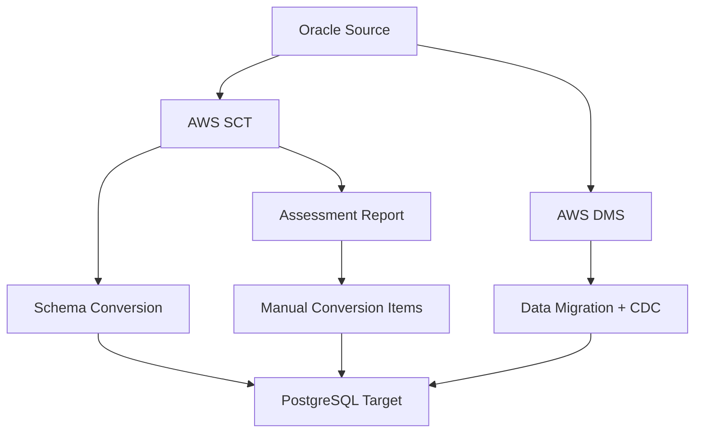

# How to Set Up DMS for Oracle to PostgreSQL Migration

Author: [nawazdhandala](https://github.com/nawazdhandala)

Tags: AWS, DMS, Oracle, PostgreSQL, Database Migration, Schema Conversion

Description: Migrate from Oracle to PostgreSQL using AWS DMS and SCT with practical guidance on schema conversion, data migration, and handling Oracle-specific features.

---

Migrating from Oracle to PostgreSQL is one of the most impactful database migrations you can make. You eliminate expensive Oracle licensing costs and move to an open-source engine that runs well on AWS RDS or Aurora PostgreSQL. But it is also one of the more challenging migrations because Oracle and PostgreSQL have significant differences in SQL dialects, data types, stored procedures, and features.

This guide walks through the complete migration process using AWS Database Migration Service (DMS) for data migration and AWS Schema Conversion Tool (SCT) for schema translation.

## Migration Architecture



The migration involves two parallel workstreams:
1. **Schema conversion** (SCT) - converts Oracle schemas, stored procedures, and functions to PostgreSQL equivalents
2. **Data migration** (DMS) - moves the actual data from Oracle to PostgreSQL

## Step 1: Run the SCT Assessment

Before writing any migration code, run an SCT assessment to understand the scope of work.

### Install and Configure SCT

Download AWS SCT and create a project with your Oracle source and PostgreSQL target connections.

```bash
# The assessment report tells you what percentage of code converts automatically
# Typical results for Oracle to PostgreSQL:
# - Table DDL: 90-95% automatic conversion
# - Simple queries: 85-90% automatic
# - PL/SQL stored procedures: 50-70% automatic (rest needs manual work)
# - Oracle-specific features: Manual conversion required
```

### Common Conversion Challenges

Here are the Oracle features that require the most manual effort:

**Oracle sequences vs PostgreSQL IDENTITY/SERIAL:**
```sql
-- Oracle
CREATE SEQUENCE order_seq START WITH 1 INCREMENT BY 1;
INSERT INTO orders (id, ...) VALUES (order_seq.NEXTVAL, ...);

-- PostgreSQL equivalent
CREATE TABLE orders (
    id BIGINT GENERATED ALWAYS AS IDENTITY,
    ...
);
-- Or use a sequence explicitly
CREATE SEQUENCE order_seq START WITH 1 INCREMENT BY 1;
INSERT INTO orders (id, ...) VALUES (nextval('order_seq'), ...);
```

**Oracle SYSDATE vs PostgreSQL:**
```sql
-- Oracle
SELECT SYSDATE FROM DUAL;
WHERE created_at > SYSDATE - 7;

-- PostgreSQL
SELECT CURRENT_TIMESTAMP;
WHERE created_at > CURRENT_TIMESTAMP - INTERVAL '7 days';
```

**Oracle NVL vs PostgreSQL COALESCE:**
```sql
-- Oracle
SELECT NVL(discount, 0) FROM products;

-- PostgreSQL
SELECT COALESCE(discount, 0) FROM products;
```

**Oracle DECODE vs PostgreSQL CASE:**
```sql
-- Oracle
SELECT DECODE(status, 'A', 'Active', 'I', 'Inactive', 'Unknown') FROM users;

-- PostgreSQL
SELECT CASE status
    WHEN 'A' THEN 'Active'
    WHEN 'I' THEN 'Inactive'
    ELSE 'Unknown'
END FROM users;
```

**PL/SQL to PL/pgSQL:**
```sql
-- Oracle PL/SQL
CREATE OR REPLACE PROCEDURE update_balance(
    p_account_id IN NUMBER,
    p_amount IN NUMBER
) IS
    v_current_balance NUMBER;
BEGIN
    SELECT balance INTO v_current_balance
    FROM accounts WHERE account_id = p_account_id
    FOR UPDATE;

    UPDATE accounts SET balance = v_current_balance + p_amount
    WHERE account_id = p_account_id;

    COMMIT;
EXCEPTION
    WHEN NO_DATA_FOUND THEN
        RAISE_APPLICATION_ERROR(-20001, 'Account not found');
END;

-- PostgreSQL PL/pgSQL equivalent
CREATE OR REPLACE PROCEDURE update_balance(
    p_account_id BIGINT,
    p_amount NUMERIC
)
LANGUAGE plpgsql
AS $$
DECLARE
    v_current_balance NUMERIC;
BEGIN
    SELECT balance INTO STRICT v_current_balance
    FROM accounts WHERE account_id = p_account_id
    FOR UPDATE;

    UPDATE accounts SET balance = v_current_balance + p_amount
    WHERE account_id = p_account_id;

    COMMIT;
EXCEPTION
    WHEN NO_DATA_FOUND THEN
        RAISE EXCEPTION 'Account not found: %', p_account_id;
END;
$$;
```

## Step 2: Create the Target PostgreSQL Database

```bash
# Create an Aurora PostgreSQL cluster as the target
aws rds create-db-cluster \
  --db-cluster-identifier oracle-to-pg-target \
  --engine aurora-postgresql \
  --engine-version 16.4 \
  --master-username postgres \
  --master-user-password 'YourStr0ngP@ss!' \
  --db-subnet-group-name my-db-subnet-group \
  --vpc-security-group-ids sg-0abc123

aws rds create-db-instance \
  --db-instance-identifier oracle-to-pg-target-writer \
  --db-cluster-identifier oracle-to-pg-target \
  --db-instance-class db.r6g.large \
  --engine aurora-postgresql
```

## Step 3: Apply the Converted Schema

Apply the SCT-converted schema to PostgreSQL, then manually fix any items that did not convert automatically.

```bash
# Connect to PostgreSQL and apply the converted schema
psql -h oracle-to-pg-target.cluster-xxxxx.us-east-1.rds.amazonaws.com \
  -U postgres -d myapp \
  -f converted-schema.sql
```

## Step 4: Configure DMS

### Create the Replication Instance

```bash
# Create a DMS replication instance for the migration
aws dms create-replication-instance \
  --replication-instance-identifier oracle-to-pg-migration \
  --replication-instance-class dms.r5.xlarge \
  --allocated-storage 200 \
  --vpc-security-group-ids sg-0abc123 \
  --replication-subnet-group-identifier my-dms-subnet-group \
  --multi-az
```

### Create Source Endpoint (Oracle)

```bash
# Create the Oracle source endpoint
aws dms create-endpoint \
  --endpoint-identifier oracle-source \
  --endpoint-type source \
  --engine-name oracle \
  --server-name oracle-db.example.com \
  --port 1521 \
  --username dms_user \
  --password 'DmsUserP@ss!' \
  --database-name ORCL \
  --extra-connection-attributes "useLogMinerReader=N;useBfile=Y;addSupplementalLogging=Y"
```

The Oracle source requires supplemental logging for CDC. Enable it on the source.

```sql
-- Enable supplemental logging on the Oracle source (run as DBA)
ALTER DATABASE ADD SUPPLEMENTAL LOG DATA;
ALTER DATABASE ADD SUPPLEMENTAL LOG DATA (PRIMARY KEY) COLUMNS;

-- Grant DMS user necessary privileges
GRANT SELECT ANY TABLE TO dms_user;
GRANT SELECT ANY TRANSACTION TO dms_user;
GRANT SELECT ON V_$ARCHIVED_LOG TO dms_user;
GRANT SELECT ON V_$LOG TO dms_user;
GRANT SELECT ON V_$LOGFILE TO dms_user;
GRANT SELECT ON V_$LOGMNR_LOGS TO dms_user;
GRANT SELECT ON V_$LOGMNR_CONTENTS TO dms_user;
GRANT LOGMINING TO dms_user;
```

### Create Target Endpoint (PostgreSQL)

```bash
# Create the PostgreSQL target endpoint
aws dms create-endpoint \
  --endpoint-identifier pg-target \
  --endpoint-type target \
  --engine-name aurora-postgresql \
  --server-name oracle-to-pg-target.cluster-xxxxx.us-east-1.rds.amazonaws.com \
  --port 5432 \
  --username postgres \
  --password 'YourStr0ngP@ss!' \
  --database-name myapp \
  --extra-connection-attributes "maxFileSize=512000;executeTimeout=300"
```

## Step 5: Create Table Mappings with Transformations

Oracle to PostgreSQL often needs data type transformations.

```json
{
  "rules": [
    {
      "rule-type": "selection",
      "rule-id": "1",
      "rule-name": "select-all-tables",
      "object-locator": {
        "schema-name": "MYAPP",
        "table-name": "%"
      },
      "rule-action": "include"
    },
    {
      "rule-type": "transformation",
      "rule-id": "2",
      "rule-name": "lowercase-schema",
      "rule-action": "convert-lowercase",
      "rule-target": "schema",
      "object-locator": {
        "schema-name": "MYAPP"
      }
    },
    {
      "rule-type": "transformation",
      "rule-id": "3",
      "rule-name": "lowercase-tables",
      "rule-action": "convert-lowercase",
      "rule-target": "table",
      "object-locator": {
        "schema-name": "MYAPP",
        "table-name": "%"
      }
    },
    {
      "rule-type": "transformation",
      "rule-id": "4",
      "rule-name": "lowercase-columns",
      "rule-action": "convert-lowercase",
      "rule-target": "column",
      "object-locator": {
        "schema-name": "MYAPP",
        "table-name": "%",
        "column-name": "%"
      }
    }
  ]
}
```

The lowercase transformations are important because Oracle uses uppercase identifiers by default while PostgreSQL uses lowercase.

## Step 6: Create and Run the Migration Task

```bash
# Create the full-load + CDC migration task
aws dms create-replication-task \
  --replication-task-identifier oracle-to-pg-task \
  --source-endpoint-arn arn:aws:dms:us-east-1:123456789012:endpoint:oracle-source \
  --target-endpoint-arn arn:aws:dms:us-east-1:123456789012:endpoint:pg-target \
  --replication-instance-arn arn:aws:dms:us-east-1:123456789012:rep:oracle-to-pg-migration \
  --migration-type full-load-and-cdc \
  --table-mappings file://table-mappings.json \
  --replication-task-settings '{
    "TargetMetadata": {
      "SupportLobs": true,
      "LimitedSizeLobMode": true,
      "LobMaxSize": 32768
    },
    "FullLoadSettings": {
      "TargetTablePrepMode": "TRUNCATE_BEFORE_LOAD",
      "MaxFullLoadSubTasks": 8
    },
    "Logging": {
      "EnableLogging": true
    }
  }'

# Start the task
aws dms start-replication-task \
  --replication-task-arn arn:aws:dms:us-east-1:123456789012:task:oracle-to-pg-task \
  --start-replication-task-type start-replication
```

## Step 7: Monitor and Validate

```bash
# Monitor task progress
aws dms describe-replication-tasks \
  --filters Name=replication-task-arn,Values=arn:aws:dms:us-east-1:123456789012:task:oracle-to-pg-task \
  --query 'ReplicationTasks[0].{Status:Status,FullLoadPercent:ReplicationTaskStats.FullLoadProgressPercent,CDCLatency:ReplicationTaskStats.FreshStartDate}'

# Monitor CDC latency
aws cloudwatch get-metric-statistics \
  --namespace AWS/DMS \
  --metric-name CDCLatencyTarget \
  --dimensions Name=ReplicationTaskIdentifier,Value=oracle-to-pg-task \
  --start-time $(date -u -d '1 hour ago' +%Y-%m-%dT%H:%M:%S) \
  --end-time $(date -u +%Y-%m-%dT%H:%M:%S) \
  --period 60 \
  --statistics Average
```

## Data Type Mapping Reference

Here are the key Oracle to PostgreSQL data type mappings DMS applies:

| Oracle Type | PostgreSQL Type |
|------------|----------------|
| NUMBER | NUMERIC |
| NUMBER(p,0) where p < 5 | SMALLINT |
| NUMBER(p,0) where p < 10 | INTEGER |
| NUMBER(p,0) where p < 19 | BIGINT |
| VARCHAR2(n) | VARCHAR(n) |
| CLOB | TEXT |
| BLOB | BYTEA |
| DATE | TIMESTAMP |
| TIMESTAMP | TIMESTAMP |
| RAW(n) | BYTEA |

## Summary

Migrating from Oracle to PostgreSQL is a multi-step process that involves schema conversion, data migration, and application code changes. AWS SCT handles the schema conversion (with some manual effort for PL/SQL), while DMS handles the data migration with minimal downtime using CDC. The biggest challenge is typically the stored procedure and application code conversion, which cannot be fully automated.

Plan for at least one full test migration before the production cutover. Use the SCT assessment report to estimate the manual conversion effort, and budget time for thorough testing of application queries and stored procedures.

For more on database migrations, see our guides on [DMS for MySQL to Aurora migration](https://oneuptime.com/blog/post/set-up-dms-for-mysql-to-aurora-migration/view) and [DMS for SQL Server to RDS migration](https://oneuptime.com/blog/post/set-up-dms-for-sql-server-to-rds-migration/view).
