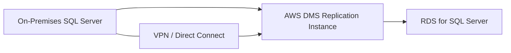

# How to Set Up DMS for SQL Server to RDS Migration

Author: [nawazdhandala](https://github.com/nawazdhandala)

Tags: AWS, DMS, SQL Server, RDS, Database Migration, Replication

Description: Migrate from on-premises SQL Server to Amazon RDS for SQL Server using AWS DMS with full load and CDC for minimal-downtime migration.

---

Moving SQL Server workloads from on-premises to RDS is one of the most common enterprise migrations on AWS. The appeal is clear - eliminate the overhead of managing Windows servers, SQL Server patching, backups, and high availability configuration. RDS handles all of that.

AWS Database Migration Service (DMS) makes this migration possible with minimal downtime by combining a full load of your existing data with Change Data Capture (CDC) to replicate ongoing changes. Your application continues running against the on-premises SQL Server during the entire migration, and you cut over to RDS when the replication is caught up.

## Migration Architecture



The on-premises SQL Server connects to AWS through VPN or Direct Connect. DMS reads from the source, writes to the target, and handles both the initial data copy and ongoing change replication.

## Prerequisites

### Source SQL Server Requirements

DMS uses SQL Server's transaction log for CDC. You need to configure your source database to support this.

```sql
-- Enable MS-CDC on the source database (required for ongoing replication)
USE myapp;
GO

EXEC sys.sp_cdc_enable_db;
GO

-- Verify CDC is enabled
SELECT name, is_cdc_enabled FROM sys.databases WHERE name = 'myapp';
GO
```

Enable CDC on each table you want to replicate.

```sql
-- Enable CDC on specific tables
EXEC sys.sp_cdc_enable_table
    @source_schema = N'dbo',
    @source_name = N'orders',
    @role_name = NULL;
GO

EXEC sys.sp_cdc_enable_table
    @source_schema = N'dbo',
    @source_name = N'customers',
    @role_name = NULL;
GO

EXEC sys.sp_cdc_enable_table
    @source_schema = N'dbo',
    @source_name = N'products',
    @role_name = NULL;
GO
```

If you have many tables, automate the process.

```sql
-- Enable CDC on all user tables in the dbo schema
DECLARE @tableName NVARCHAR(128);

DECLARE table_cursor CURSOR FOR
    SELECT name FROM sys.tables
    WHERE schema_id = SCHEMA_ID('dbo')
      AND is_ms_shipped = 0;

OPEN table_cursor;
FETCH NEXT FROM table_cursor INTO @tableName;

WHILE @@FETCH_STATUS = 0
BEGIN
    EXEC sys.sp_cdc_enable_table
        @source_schema = N'dbo',
        @source_name = @tableName,
        @role_name = NULL;

    PRINT 'Enabled CDC on: ' + @tableName;

    FETCH NEXT FROM table_cursor INTO @tableName;
END;

CLOSE table_cursor;
DEALLOCATE table_cursor;
```

### Create the DMS User

```sql
-- Create a dedicated user for DMS with the required permissions
USE master;
GO

CREATE LOGIN dms_user WITH PASSWORD = 'DmsStr0ngP@ss!';
GO

USE myapp;
GO

CREATE USER dms_user FOR LOGIN dms_user;
GO

-- Grant required permissions for full load
GRANT SELECT ON SCHEMA::dbo TO dms_user;
GO

-- Grant required permissions for CDC
GRANT VIEW DATABASE STATE TO dms_user;
EXEC sp_addrolemember 'db_datareader', 'dms_user';
GO

-- For MS-CDC
USE myapp;
EXEC sys.sp_cdc_enable_db;
EXEC sp_addrolemember 'db_owner', 'dms_user';
GO
```

### Configure SQL Server Agent

CDC depends on SQL Server Agent running. Verify it is active.

```sql
-- Check SQL Server Agent status
EXEC master.dbo.xp_servicecontrol 'QueryState', 'SQLServerAGENT';
```

## Step 1: Create the Target RDS Instance

```bash
# Create an RDS SQL Server instance as the migration target
aws rds create-db-instance \
  --db-instance-identifier sqlserver-rds-target \
  --engine sqlserver-ee \
  --engine-version 15.00.4355.3.v1 \
  --db-instance-class db.m5.xlarge \
  --master-username admin \
  --master-user-password 'YourStr0ngP@ss!' \
  --allocated-storage 200 \
  --storage-type gp3 \
  --vpc-security-group-ids sg-0abc123 \
  --db-subnet-group-name my-db-subnet-group \
  --license-model license-included \
  --backup-retention-period 7 \
  --multi-az
```

## Step 2: Create the DMS Replication Instance

```bash
# Create a DMS replication instance in the same VPC as the RDS target
aws dms create-replication-instance \
  --replication-instance-identifier sqlserver-rds-migration \
  --replication-instance-class dms.r5.large \
  --allocated-storage 150 \
  --vpc-security-group-ids sg-0abc123 \
  --replication-subnet-group-identifier my-dms-subnet-group \
  --multi-az
```

## Step 3: Create Endpoints

### Source Endpoint (On-Premises SQL Server)

```bash
# Create the source endpoint for the on-premises SQL Server
aws dms create-endpoint \
  --endpoint-identifier sqlserver-on-prem-source \
  --endpoint-type source \
  --engine-name sqlserver \
  --server-name 10.0.1.50 \
  --port 1433 \
  --username dms_user \
  --password 'DmsStr0ngP@ss!' \
  --database-name myapp \
  --extra-connection-attributes "safeguardPolicy=RELY_ON_SQL_SERVER_REPLICATION_AGENT"
```

The `safeguardPolicy` setting is important. By default, DMS tries to protect against log truncation, but when you manage the log yourself, `RELY_ON_SQL_SERVER_REPLICATION_AGENT` avoids potential conflicts.

### Target Endpoint (RDS SQL Server)

```bash
# Create the target endpoint for RDS SQL Server
aws dms create-endpoint \
  --endpoint-identifier sqlserver-rds-target \
  --endpoint-type target \
  --engine-name sqlserver \
  --server-name sqlserver-rds-target.xxxxx.us-east-1.rds.amazonaws.com \
  --port 1433 \
  --username admin \
  --password 'YourStr0ngP@ss!' \
  --database-name myapp
```

### Test Connections

```bash
# Test source endpoint connectivity
aws dms test-connection \
  --replication-instance-arn arn:aws:dms:us-east-1:123456789012:rep:sqlserver-rds-migration \
  --endpoint-arn arn:aws:dms:us-east-1:123456789012:endpoint:sqlserver-on-prem-source

# Test target endpoint connectivity
aws dms test-connection \
  --replication-instance-arn arn:aws:dms:us-east-1:123456789012:rep:sqlserver-rds-migration \
  --endpoint-arn arn:aws:dms:us-east-1:123456789012:endpoint:sqlserver-rds-target
```

## Step 4: Create Table Mappings

```json
{
  "rules": [
    {
      "rule-type": "selection",
      "rule-id": "1",
      "rule-name": "select-all-dbo-tables",
      "object-locator": {
        "schema-name": "dbo",
        "table-name": "%"
      },
      "rule-action": "include"
    },
    {
      "rule-type": "selection",
      "rule-id": "2",
      "rule-name": "exclude-staging-tables",
      "object-locator": {
        "schema-name": "dbo",
        "table-name": "staging_%"
      },
      "rule-action": "exclude"
    },
    {
      "rule-type": "selection",
      "rule-id": "3",
      "rule-name": "include-app-schema",
      "object-locator": {
        "schema-name": "app",
        "table-name": "%"
      },
      "rule-action": "include"
    }
  ]
}
```

## Step 5: Create and Start the Migration Task

```bash
# Create the migration task with full load + CDC
aws dms create-replication-task \
  --replication-task-identifier sqlserver-to-rds-task \
  --source-endpoint-arn arn:aws:dms:us-east-1:123456789012:endpoint:sqlserver-on-prem-source \
  --target-endpoint-arn arn:aws:dms:us-east-1:123456789012:endpoint:sqlserver-rds-target \
  --replication-instance-arn arn:aws:dms:us-east-1:123456789012:rep:sqlserver-rds-migration \
  --migration-type full-load-and-cdc \
  --table-mappings file://table-mappings.json \
  --replication-task-settings '{
    "TargetMetadata": {
      "SupportLobs": true,
      "LimitedSizeLobMode": true,
      "LobMaxSize": 32768
    },
    "FullLoadSettings": {
      "TargetTablePrepMode": "DROP_AND_CREATE",
      "MaxFullLoadSubTasks": 8,
      "CommitRate": 10000
    },
    "ChangeProcessingTuning": {
      "BatchApplyEnabled": true,
      "BatchApplyPreserveTransaction": true,
      "BatchSplitSize": 0,
      "BatchApplyTimeoutMin": 1,
      "BatchApplyTimeoutMax": 30,
      "BatchApplyMemoryLimit": 500
    },
    "Logging": {
      "EnableLogging": true,
      "LogComponents": [
        {"Id": "SOURCE_CAPTURE", "Severity": "LOGGER_SEVERITY_DEFAULT"},
        {"Id": "TARGET_APPLY", "Severity": "LOGGER_SEVERITY_DEFAULT"}
      ]
    }
  }'

# Start the task
aws dms start-replication-task \
  --replication-task-arn arn:aws:dms:us-east-1:123456789012:task:sqlserver-to-rds-task \
  --start-replication-task-type start-replication
```

## Step 6: Monitor the Migration

### Task Progress

```bash
# Monitor overall task status and statistics
aws dms describe-replication-tasks \
  --filters Name=replication-task-arn,Values=arn:aws:dms:us-east-1:123456789012:task:sqlserver-to-rds-task \
  --query 'ReplicationTasks[0].{Status:Status,Stats:ReplicationTaskStats}'
```

### Per-Table Statistics

```bash
# Check migration progress for each table
aws dms describe-table-statistics \
  --replication-task-arn arn:aws:dms:us-east-1:123456789012:task:sqlserver-to-rds-task \
  --query 'TableStatistics[*].{Schema:SchemaName,Table:TableName,FullLoadRows:FullLoadRows,Inserts:Inserts,Updates:Updates,Deletes:Deletes,State:TableState}' \
  --output table
```

### CDC Latency Monitoring

```bash
# Monitor CDC replication lag
aws cloudwatch get-metric-statistics \
  --namespace AWS/DMS \
  --metric-name CDCLatencySource \
  --dimensions Name=ReplicationTaskIdentifier,Value=sqlserver-to-rds-task \
  --start-time $(date -u -d '1 hour ago' +%Y-%m-%dT%H:%M:%S) \
  --end-time $(date -u +%Y-%m-%dT%H:%M:%S) \
  --period 60 \
  --statistics Average,Maximum
```

### Set Up Alerts

```bash
# Alert when CDC latency exceeds 5 minutes
aws cloudwatch put-metric-alarm \
  --alarm-name dms-cdc-lag-high \
  --namespace AWS/DMS \
  --metric-name CDCLatencyTarget \
  --dimensions Name=ReplicationTaskIdentifier,Value=sqlserver-to-rds-task \
  --statistic Maximum \
  --period 300 \
  --threshold 300 \
  --comparison-operator GreaterThanThreshold \
  --evaluation-periods 3 \
  --alarm-actions arn:aws:sns:us-east-1:123456789012:MigrationAlerts
```

## Step 7: Post-Migration Tasks

### Recreate Indexes and Constraints

DMS drops non-primary-key indexes during the full load for performance. Recreate them after the full load completes.

```sql
-- Recreate indexes on the RDS target
-- These should match your source database indexes
CREATE NONCLUSTERED INDEX IX_orders_customer_date
ON dbo.orders (customer_id, order_date DESC)
INCLUDE (total_amount, status);

CREATE NONCLUSTERED INDEX IX_customers_email
ON dbo.customers (email);

-- Recreate foreign key constraints
ALTER TABLE dbo.orders
ADD CONSTRAINT FK_orders_customers
FOREIGN KEY (customer_id) REFERENCES dbo.customers(customer_id);
```

### Migrate SQL Server Agent Jobs

SQL Server Agent jobs do not migrate with DMS. You need to recreate them on RDS.

```sql
-- Recreate SQL Server Agent jobs on RDS
USE msdb;
GO

EXEC sp_add_job
    @job_name = 'Daily Maintenance',
    @description = 'Daily index and statistics maintenance';
GO

EXEC sp_add_jobstep
    @job_name = 'Daily Maintenance',
    @step_name = 'Update Statistics',
    @subsystem = 'TSQL',
    @command = N'EXEC sp_updatestats;',
    @database_name = 'myapp';
GO

EXEC sp_add_schedule
    @schedule_name = 'NightlyAt2AM',
    @freq_type = 4,
    @freq_interval = 1,
    @active_start_time = 020000;
GO

EXEC sp_attach_schedule
    @job_name = 'Daily Maintenance',
    @schedule_name = 'NightlyAt2AM';
GO

EXEC sp_add_jobserver
    @job_name = 'Daily Maintenance';
GO
```

### Migrate Linked Servers

If your source uses linked servers, set them up on RDS (or consider using [RDS Custom for SQL Server](https://oneuptime.com/blog/post/2026-02-12-set-up-rds-custom-for-sql-server-workloads/view) if you need linked servers to on-premises databases).

## Step 8: Validate and Cutover

### Enable DMS Validation

```bash
# Enable data validation on the migration task
aws dms modify-replication-task \
  --replication-task-arn arn:aws:dms:us-east-1:123456789012:task:sqlserver-to-rds-task \
  --replication-task-settings '{
    "ValidationSettings": {
      "EnableValidation": true,
      "ThreadCount": 5,
      "ValidationPartialLobSize": 16384,
      "FailureMaxCount": 10000
    }
  }'
```

### Row Count Verification

```python
# Compare row counts between source and target
import pyodbc

def count_rows(connection_string, tables):
    """Count rows in each table."""
    conn = pyodbc.connect(connection_string)
    cursor = conn.cursor()
    counts = {}
    for table in tables:
        cursor.execute(f"SELECT COUNT(*) FROM {table}")
        counts[table] = cursor.fetchone()[0]
    conn.close()
    return counts

tables = ['dbo.orders', 'dbo.customers', 'dbo.products', 'dbo.order_items']

source_counts = count_rows(
    'DRIVER={ODBC Driver 17 for SQL Server};SERVER=10.0.1.50;DATABASE=myapp;UID=dms_user;PWD=pass',
    tables
)

target_counts = count_rows(
    'DRIVER={ODBC Driver 17 for SQL Server};SERVER=sqlserver-rds-target.xxxxx.rds.amazonaws.com;DATABASE=myapp;UID=admin;PWD=pass',
    tables
)

all_match = True
for table in tables:
    match = source_counts[table] == target_counts[table]
    if not match:
        all_match = False
    print(f"{table}: Source={source_counts[table]}, Target={target_counts[table]}, Match={match}")

print(f"\nAll tables match: {all_match}")
```

### Cutover Process

1. Stop application writes to the source SQL Server
2. Wait for DMS CDC latency to reach zero
3. Run final validation
4. Update application connection strings to point to RDS
5. Start application writes to RDS
6. Monitor for errors

The downtime window is typically under 5 minutes for a well-planned cutover.

## Troubleshooting Common Issues

**CDC not capturing changes:**
- Verify MS-CDC is enabled on the source database and individual tables
- Check that SQL Server Agent is running
- Ensure the DMS user has db_owner role in the source database

**Transaction log growing:**
- MS-CDC reads from the transaction log. If CDC falls behind, the log cannot be truncated.
- Monitor log file size and consider adjusting the CDC capture job schedule.

**Large table causing timeout:**
- Increase `CommitRate` in task settings
- Reduce `MaxFullLoadSubTasks` to avoid overwhelming the target
- Use table mappings to split large tables into separate migration tasks

## Summary

Migrating SQL Server to RDS with DMS follows a proven pattern: enable CDC on the source, configure DMS with appropriate endpoints and settings, let the full load complete, monitor CDC replication until it catches up, and then cut over with minimal downtime. The biggest preparation tasks are enabling MS-CDC on all source tables, ensuring SQL Server Agent is running, and planning for the recreation of indexes, jobs, and linked servers on the target.

For more on SQL Server migrations, see our guides on [RDS Custom for SQL Server](https://oneuptime.com/blog/post/2026-02-12-set-up-rds-custom-for-sql-server-workloads/view) and [DMS for Oracle to PostgreSQL migration](https://oneuptime.com/blog/post/2026-02-12-set-up-dms-for-oracle-to-postgresql-migration/view).
