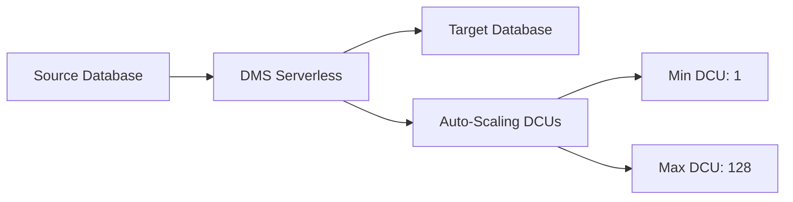

# How to Set Up DMS Serverless for Database Migration

Author: [nawazdhandala](https://github.com/nawazdhandala)

Tags: AWS, DMS, Database Migration, Serverless, Cloud Migration

Description: A practical guide to setting up AWS DMS Serverless for seamless database migrations without managing replication instances

---

Database migrations are one of those things that every team dreads. You need to move data from point A to point B without losing anything, without downtime, and without spending weeks babysitting the process. AWS Database Migration Service (DMS) Serverless takes away a big chunk of that pain by removing the need to provision and manage replication instances yourself.

In this guide, we will walk through setting up DMS Serverless from scratch, covering everything from IAM roles to endpoint configuration to actually running your first migration.

## What Is DMS Serverless?

Traditional DMS requires you to pick an instance size for your replication instance. Too small and your migration crawls. Too big and you are burning money. DMS Serverless handles capacity automatically. It scales up when your migration needs more horsepower and scales down when things are quiet. You pay for what you use.

Under the hood, DMS Serverless uses a concept called DMS Capacity Units (DCUs). You set a minimum and maximum, and AWS handles the rest.



## Prerequisites

Before you start, make sure you have the following in place:

- An AWS account with appropriate permissions
- A source database that DMS supports (MySQL, PostgreSQL, Oracle, SQL Server, MongoDB, etc.)
- A target database already provisioned
- Network connectivity between your VPC and both databases
- The AWS CLI installed and configured

## Step 1: Create the Required IAM Role

DMS needs an IAM role to operate. If you have never used DMS before, you need to create the `dms-vpc-role`.

```json
// IAM trust policy for DMS service role
{
  "Version": "2012-10-17",
  "Statement": [
    {
      "Effect": "Allow",
      "Principal": {
        "Service": "dms.amazonaws.com"
      },
      "Action": "sts:AssumeRole"
    }
  ]
}
```

Attach the `AmazonDMSVPCManagementRole` managed policy to this role. You can do this through the console or CLI.

```bash
# Create the DMS VPC role
aws iam create-role \
  --role-name dms-vpc-role \
  --assume-role-policy-document file://dms-trust-policy.json

# Attach the managed policy
aws iam attach-role-policy \
  --role-name dms-vpc-role \
  --policy-arn arn:aws:iam::aws:policy/service-role/AmazonDMSVPCManagementRole
```

## Step 2: Set Up a Subnet Group

DMS Serverless runs inside your VPC, so it needs a subnet group. Pick subnets in at least two availability zones.

```bash
# Create a replication subnet group with subnets across two AZs
aws dms create-replication-subnet-group \
  --replication-subnet-group-identifier my-dms-subnet-group \
  --replication-subnet-group-description "Subnet group for DMS Serverless" \
  --subnet-ids subnet-0abc1234 subnet-0def5678
```

Make sure the subnets have route table entries that allow connectivity to your source and target databases. If either database is outside your VPC, you will need a NAT gateway or VPN connection.

## Step 3: Create Source and Target Endpoints

Endpoints tell DMS how to connect to your databases. Here is an example for a MySQL source and a PostgreSQL target.

```bash
# Create the source endpoint pointing to a MySQL database
aws dms create-endpoint \
  --endpoint-identifier my-mysql-source \
  --endpoint-type source \
  --engine-name mysql \
  --server-name source-db.example.com \
  --port 3306 \
  --username admin \
  --password 'YourPassword123'

# Create the target endpoint pointing to a PostgreSQL database
aws dms create-endpoint \
  --endpoint-identifier my-postgres-target \
  --endpoint-type target \
  --engine-name postgres \
  --server-name target-db.example.com \
  --port 5432 \
  --username admin \
  --password 'YourPassword123' \
  --database-name mydb
```

For production environments, use AWS Secrets Manager instead of inline passwords. DMS supports Secrets Manager ARNs directly in endpoint configurations.

## Step 4: Create the Serverless Replication Config

This is where DMS Serverless differs from traditional DMS. Instead of creating a replication instance, you create a replication configuration with capacity settings.

```bash
# Create a serverless replication with auto-scaling capacity
aws dms create-replication-config \
  --replication-config-identifier my-serverless-migration \
  --replication-type full-load-and-cdc \
  --source-endpoint-arn arn:aws:dms:us-east-1:123456789012:endpoint:SOURCE_ARN \
  --target-endpoint-arn arn:aws:dms:us-east-1:123456789012:endpoint:TARGET_ARN \
  --compute-config '{
    "MinCapacityUnits": 1,
    "MaxCapacityUnits": 16,
    "MultiAZ": false,
    "ReplicationSubnetGroupId": "my-dms-subnet-group",
    "VpcSecurityGroupIds": ["sg-0abc1234"]
  }' \
  --table-mappings file://table-mappings.json
```

The `replication-type` has three options:

- `full-load` - One-time migration of all existing data
- `cdc` - Only ongoing changes (Change Data Capture)
- `full-load-and-cdc` - Migrate existing data, then keep syncing changes

## Step 5: Define Table Mappings

Table mappings control which tables get migrated and how. Here is a basic example that migrates all tables from a schema.

```json
// Table mapping that selects all tables from the "myschema" schema
{
  "rules": [
    {
      "rule-type": "selection",
      "rule-id": "1",
      "rule-name": "select-all",
      "object-locator": {
        "schema-name": "myschema",
        "table-name": "%"
      },
      "rule-action": "include"
    }
  ]
}
```

You can add transformation rules to rename schemas, tables, or columns during migration. This is particularly useful for heterogeneous migrations.

## Step 6: Start the Replication

Once everything is configured, start the replication.

```bash
# Start the serverless replication
aws dms start-replication \
  --replication-config-arn arn:aws:dms:us-east-1:123456789012:replication-config:MY_CONFIG_ARN \
  --start-replication-type start-replication
```

DMS Serverless will provision the necessary compute, connect to both endpoints, and begin migrating data. The initial provisioning can take a few minutes.

## Monitoring Your Migration

Once the replication is running, you will want to keep an eye on it. Check the replication status with the CLI.

```bash
# Check the current status of your replication
aws dms describe-replications \
  --filters Name=replication-config-arn,Values=arn:aws:dms:us-east-1:123456789012:replication-config:MY_CONFIG_ARN
```

For ongoing monitoring, set up CloudWatch alarms on key metrics like `CDCLatencySource`, `CDCLatencyTarget`, and `CDCThroughputRowsSource`. If you are looking for a more comprehensive monitoring setup, check out our post on [monitoring DMS replication tasks](https://oneuptime.com/blog/post/monitor-dms-replication-tasks/view).

## Common Pitfalls

**Security group misconfigurations** are the number one reason DMS migrations fail to start. Make sure the security group attached to your DMS replication allows outbound traffic to both your source and target databases on the correct ports.

**LOB column handling** can slow migrations dramatically. By default, DMS uses "limited LOB mode" which truncates large objects. If you need full LOB data, switch to "full LOB mode" but expect slower performance.

**Supplemental logging** must be enabled on the source database for CDC to work. For Oracle, this means enabling supplemental log data. For MySQL, you need binary logging in ROW format. For PostgreSQL, set `wal_level` to `logical`.

## Cost Considerations

DMS Serverless pricing is based on DCU-hours. At the time of writing, each DCU-hour costs around $0.018 in us-east-1. A typical migration using 4 DCUs running for 10 hours would cost roughly $0.72. Compare that to running a dedicated `dms.r5.large` replication instance at $0.29/hour and the savings become clear for bursty or short-lived migrations.

For long-running CDC replications that operate 24/7, do the math carefully. A dedicated instance might be cheaper if your load is consistent.

## Wrapping Up

DMS Serverless takes away the capacity planning headache from database migrations. You define your endpoints, set your capacity bounds, and let AWS handle the rest. The auto-scaling capability makes it particularly well-suited for migrations where the data volume is unpredictable or where you want to avoid over-provisioning.

If you are planning a heterogeneous migration (say, Oracle to PostgreSQL), you will also want to look into the [Schema Conversion Tool](https://oneuptime.com/blog/post/use-schema-conversion-tool-for-heterogeneous-migrations/view) to handle schema translation before running DMS.
