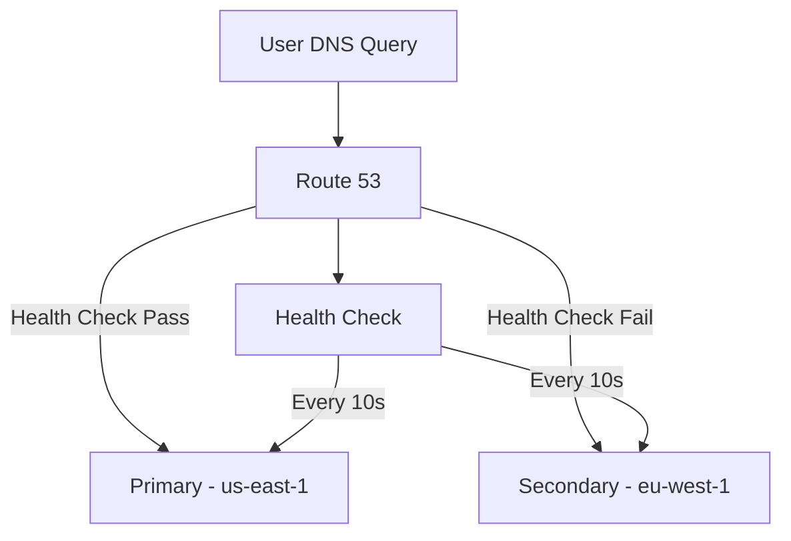

# How to Set Up DNS Failover with Route 53

Author: [nawazdhandala](https://github.com/nawazdhandala)

Tags: AWS, Route 53, DNS, Failover, High Availability

Description: Set up DNS failover with Amazon Route 53 using health checks, failover routing policies, and multi-region active-passive configurations for reliable services.

---

Your application is running in one region. The region goes down. Your users see a blank page. DNS failover prevents this by automatically routing traffic to a healthy backup location when your primary fails.

Route 53, AWS's DNS service, has built-in health checking and failover routing. Let's set it up properly.

## How DNS Failover Works

Route 53 continuously checks the health of your endpoints. When the primary endpoint fails health checks, Route 53 automatically returns the IP address of your secondary endpoint. Users get routed to the backup without anyone pressing a button.



The critical thing to understand: DNS failover isn't instant. TTL values, client caching, and health check intervals all add latency. Typical failover time is 1-3 minutes.

## Setting Up Health Checks

Health checks are the foundation. Route 53 sends requests from multiple locations around the world and considers an endpoint healthy only if enough checkers agree.

```typescript
// CDK setup for Route 53 health checks and failover
import * as cdk from 'aws-cdk-lib';
import * as route53 from 'aws-cdk-lib/aws-route53';

export class DnsFailoverStack extends cdk.Stack {
  constructor(scope: cdk.App, id: string) {
    super(scope, id);

    const hostedZone = route53.HostedZone.fromLookup(this, 'Zone', {
      domainName: 'example.com',
    });

    // Health check for the primary endpoint
    const primaryHealthCheck = new route53.CfnHealthCheck(this, 'PrimaryHealthCheck', {
      healthCheckConfig: {
        type: 'HTTPS',
        fullyQualifiedDomainName: 'app-primary.example.com',
        port: 443,
        resourcePath: '/health',
        requestInterval: 10,           // Check every 10 seconds (fast)
        failureThreshold: 3,           // Fail after 3 consecutive failures
        enableSni: true,
        regions: [                      // Check from these regions
          'us-east-1',
          'eu-west-1',
          'ap-southeast-1',
        ],
      },
    });

    // Health check for the secondary endpoint
    const secondaryHealthCheck = new route53.CfnHealthCheck(this, 'SecondaryHealthCheck', {
      healthCheckConfig: {
        type: 'HTTPS',
        fullyQualifiedDomainName: 'app-secondary.example.com',
        port: 443,
        resourcePath: '/health',
        requestInterval: 10,
        failureThreshold: 3,
        enableSni: true,
      },
    });
  }
}
```

### Health Check Types

Route 53 supports three types of health checks:

1. **Endpoint checks** - Route 53 makes HTTP/HTTPS/TCP requests to your endpoint
2. **Calculated checks** - Combine multiple health checks with AND/OR logic
3. **CloudWatch alarm checks** - Base health on a CloudWatch alarm state

For a comprehensive health check, use a calculated check that combines an endpoint check with a CloudWatch alarm.

```typescript
// CloudWatch-based health check that monitors application metrics
const appHealthAlarm = new cloudwatch.Alarm(this, 'AppHealthAlarm', {
  metric: new cloudwatch.Metric({
    namespace: 'MyApp',
    metricName: 'HealthyEndpoints',
    period: cdk.Duration.minutes(1),
    statistic: 'Minimum',
  }),
  threshold: 1,
  evaluationPeriods: 2,
  comparisonOperator: cloudwatch.ComparisonOperator.LESS_THAN_THRESHOLD,
});

// Health check based on CloudWatch alarm
const cwHealthCheck = new route53.CfnHealthCheck(this, 'CloudWatchHealthCheck', {
  healthCheckConfig: {
    type: 'CLOUDWATCH_METRIC',
    alarmIdentifier: {
      name: appHealthAlarm.alarmName,
      region: 'us-east-1',
    },
    insufficientDataHealthStatus: 'LastKnownStatus',
  },
});

// Calculated health check: both endpoint AND CloudWatch must be healthy
const calculatedCheck = new route53.CfnHealthCheck(this, 'CalculatedHealthCheck', {
  healthCheckConfig: {
    type: 'CALCULATED',
    childHealthChecks: [
      primaryHealthCheck.attrHealthCheckId,
      cwHealthCheck.attrHealthCheckId,
    ],
    healthThreshold: 2, // Both must be healthy
  },
});
```

## Failover Routing Policy

With health checks in place, create DNS records with failover routing.

```typescript
// Primary record - serves traffic when healthy
new route53.CfnRecordSet(this, 'PrimaryRecord', {
  hostedZoneId: hostedZone.hostedZoneId,
  name: 'app.example.com',
  type: 'A',
  setIdentifier: 'primary',
  failover: 'PRIMARY',
  aliasTarget: {
    dnsName: primaryAlb.loadBalancerDnsName,
    hostedZoneId: primaryAlb.loadBalancerCanonicalHostedZoneId,
    evaluateTargetHealth: true,
  },
  healthCheckId: primaryHealthCheck.attrHealthCheckId,
});

// Secondary record - serves traffic when primary is unhealthy
new route53.CfnRecordSet(this, 'SecondaryRecord', {
  hostedZoneId: hostedZone.hostedZoneId,
  name: 'app.example.com',
  type: 'A',
  setIdentifier: 'secondary',
  failover: 'SECONDARY',
  aliasTarget: {
    dnsName: secondaryAlb.loadBalancerDnsName,
    hostedZoneId: secondaryAlb.loadBalancerCanonicalHostedZoneId,
    evaluateTargetHealth: true,
  },
  healthCheckId: secondaryHealthCheck.attrHealthCheckId,
});
```

## Failover to a Static Site

A common pattern is failing over to a static S3-hosted page when your application is down. This gives users a maintenance page instead of an error.

```typescript
// S3 bucket for failover static site
const failoverBucket = new s3.Bucket(this, 'FailoverBucket', {
  bucketName: 'app-failover.example.com',
  websiteIndexDocument: 'index.html',
  publicReadAccess: true,
});

// Upload a maintenance page
new s3deploy.BucketDeployment(this, 'DeployMaintenance', {
  sources: [s3deploy.Source.asset('./maintenance-page')],
  destinationBucket: failoverBucket,
});

// Secondary DNS record pointing to S3
new route53.CfnRecordSet(this, 'FailoverRecord', {
  hostedZoneId: hostedZone.hostedZoneId,
  name: 'app.example.com',
  type: 'A',
  setIdentifier: 'failover',
  failover: 'SECONDARY',
  aliasTarget: {
    dnsName: `s3-website-${cdk.Aws.REGION}.amazonaws.com`,
    hostedZoneId: 'Z3AQBSTGFYJSTF', // S3 website hosted zone ID for us-east-1
    evaluateTargetHealth: false,
  },
});
```

## The Health Check Endpoint

Your health check endpoint matters a lot. A shallow check (just return 200) won't catch real problems. A deep check (verify every dependency) might cause false positives.

```javascript
// Health check endpoint with appropriate depth
app.get('/health', async (req, res) => {
  const start = Date.now();

  try {
    // Check critical dependencies only
    const dbCheck = db.query('SELECT 1').then(() => true).catch(() => false);
    const cacheCheck = redis.ping().then(() => true).catch(() => false);

    const [dbOk, cacheOk] = await Promise.all([dbCheck, cacheCheck]);

    // Database is critical - fail the health check without it
    if (!dbOk) {
      return res.status(503).json({ status: 'unhealthy', reason: 'database' });
    }

    // Cache is degraded but not fatal
    const status = cacheOk ? 'healthy' : 'degraded';
    const httpStatus = cacheOk ? 200 : 200; // Still healthy enough to serve traffic

    res.status(httpStatus).json({
      status,
      latency: Date.now() - start,
      checks: { database: dbOk, cache: cacheOk },
    });
  } catch (error) {
    res.status(503).json({ status: 'unhealthy', error: error.message });
  }
});
```

## TTL Considerations

DNS TTL affects how quickly clients pick up the failover. Lower TTL means faster failover but more DNS queries.

- **60 seconds** is a good balance for most applications
- **30 seconds** for critical services where faster failover matters
- Route 53 alias records have a fixed 60-second TTL

Keep in mind that some clients and recursive resolvers don't respect TTL, so real-world failover might be slower than your TTL setting.

## Monitoring Failover Events

Set up SNS notifications for health check status changes.

```typescript
// SNS topic for health check alerts
const alertTopic = new sns.Topic(this, 'HealthCheckAlerts');
alertTopic.addSubscription(new snsSubscriptions.EmailSubscription('ops@example.com'));

// CloudWatch alarm on health check status
new cloudwatch.Alarm(this, 'PrimaryHealthAlarm', {
  metric: new cloudwatch.Metric({
    namespace: 'AWS/Route53',
    metricName: 'HealthCheckStatus',
    dimensionsMap: {
      HealthCheckId: primaryHealthCheck.attrHealthCheckId,
    },
    period: cdk.Duration.minutes(1),
    statistic: 'Minimum',
  }),
  threshold: 1,
  comparisonOperator: cloudwatch.ComparisonOperator.LESS_THAN_THRESHOLD,
  evaluationPeriods: 1,
  alarmDescription: 'Primary endpoint health check failed',
  actionsEnabled: true,
});
```

For a more comprehensive monitoring setup, check out [building a logging and monitoring stack on AWS](https://oneuptime.com/blog/post/2026-02-12-build-logging-and-monitoring-stack-on-aws/view).

## Testing Failover

Test your failover before you need it. The easiest way is to temporarily make your health check endpoint return a 503.

```bash
# Temporarily fail the health check (through a feature flag or config)
curl -X POST https://app-primary.example.com/admin/force-unhealthy

# Watch Route 53 health check status change
aws route53 get-health-check-status --health-check-id YOUR_CHECK_ID

# Verify DNS resolves to secondary
dig app.example.com

# Restore health
curl -X POST https://app-primary.example.com/admin/restore-health
```

## Summary

DNS failover with Route 53 is your first line of defense against region-level failures. Set up health checks that accurately reflect your application's state, configure failover routing between primary and secondary endpoints, keep TTL values low for faster failover, and test the whole thing regularly. It's not a perfect solution - DNS caching means failover isn't instant - but combined with other techniques like [multi-region deployments](https://oneuptime.com/blog/post/2026-02-12-set-up-multi-region-deployments-for-disaster-recovery/view), it forms the foundation of a resilient architecture.
