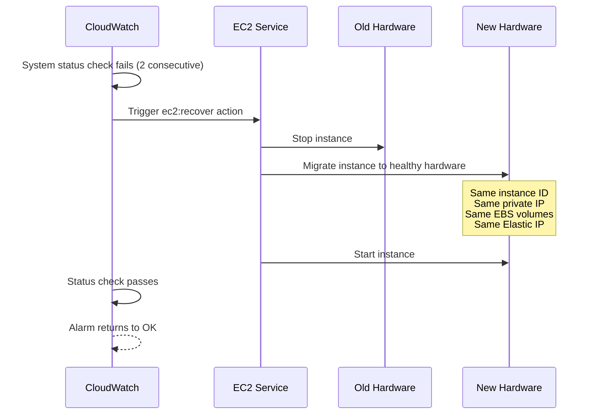

# How to Set Up EC2 Auto Recovery for Instance Health

Author: [nawazdhandala](https://github.com/nawazdhandala)

Tags: AWS, EC2, Auto Recovery, High Availability, CloudWatch, Status Checks

Description: Configure EC2 auto recovery to automatically move instances to healthy hardware when system status checks fail, maintaining uptime without manual intervention.

---

Hardware fails. It doesn't happen often on AWS, but when the physical server under your EC2 instance has a problem, your instance stops working. Normally you'd have to notice the failure, check the status, and manually deal with it. EC2 auto recovery handles this automatically - when a system status check fails, AWS moves your instance to new healthy hardware with the same instance ID, IP addresses, and attached EBS volumes.

## Understanding Status Checks

EC2 runs two types of status checks every minute:

**System status checks** detect problems with the underlying hardware or AWS infrastructure:
- Loss of network connectivity
- Loss of system power
- Software issues on the physical host
- Hardware issues on the physical host

**Instance status checks** detect problems with the instance itself:
- Failed system status check
- Incorrect networking or startup configuration
- Exhausted memory
- Corrupted file system
- Incompatible kernel

Auto recovery only triggers on system status check failures - problems that are AWS's responsibility, not yours. If your instance has a bad kernel or runs out of memory, auto recovery won't help.

## Setting Up Auto Recovery with CloudWatch Alarms

The classic way to set up auto recovery is through a CloudWatch alarm that watches the `StatusCheckFailed_System` metric:

```bash
# Create a CloudWatch alarm that triggers auto recovery
aws cloudwatch put-metric-alarm \
  --alarm-name "auto-recover-i-0abc123" \
  --alarm-description "Recover instance when system status check fails" \
  --namespace AWS/EC2 \
  --metric-name StatusCheckFailed_System \
  --dimensions Name=InstanceId,Value=i-0abc123 \
  --statistic Maximum \
  --period 60 \
  --evaluation-periods 2 \
  --threshold 1 \
  --comparison-operator GreaterThanOrEqualToThreshold \
  --alarm-actions "arn:aws:automate:us-east-1:ec2:recover" \
  --ok-actions "arn:aws:sns:us-east-1:123456789:ops-alerts"
```

Breaking this down:
- `StatusCheckFailed_System` - Monitors only system-level failures
- `period: 60` - Checks every minute
- `evaluation-periods: 2` - Two consecutive failures before triggering
- `arn:aws:automate:...:ec2:recover` - The special action ARN that triggers recovery
- `ok-actions` - Notify when the alarm goes back to OK (instance recovered)

## Simplified Auto Recovery (Default)

Starting in 2022, AWS enabled simplified auto recovery by default on supported instance types. This means new instances automatically recover from system failures without you needing to create a CloudWatch alarm.

You can verify it's enabled:

```bash
# Check if auto recovery is enabled on an instance
aws ec2 describe-instance-status \
  --instance-ids i-0abc123 \
  --query 'InstanceStatuses[0].Events'
```

To explicitly set the maintenance behavior:

```bash
# Set instance to auto-recover on maintenance events
aws ec2 modify-instance-maintenance-options \
  --instance-id i-0abc123 \
  --auto-recovery default
```

However, you should still set up the CloudWatch alarm approach because it gives you notifications and works with the broadest range of scenarios.

## Multi-Instance Setup Script

For fleets of instances, here's a script that sets up auto recovery alarms on all running instances:

```bash
#!/bin/bash
# set-up-auto-recovery.sh
# Creates auto recovery alarms for all running EC2 instances in the current region

REGION=$(aws configure get region)
SNS_TOPIC="arn:aws:sns:${REGION}:$(aws sts get-caller-identity --query Account --output text):ec2-recovery-alerts"

# Get all running instance IDs
INSTANCES=$(aws ec2 describe-instances \
  --filters "Name=instance-state-name,Values=running" \
  --query 'Reservations[*].Instances[*].InstanceId' \
  --output text)

for INSTANCE_ID in $INSTANCES; do
  echo "Setting up auto recovery for $INSTANCE_ID..."

  # Create the recovery alarm
  aws cloudwatch put-metric-alarm \
    --alarm-name "auto-recover-${INSTANCE_ID}" \
    --alarm-description "Auto-recover ${INSTANCE_ID} on system failure" \
    --namespace AWS/EC2 \
    --metric-name StatusCheckFailed_System \
    --dimensions Name=InstanceId,Value=${INSTANCE_ID} \
    --statistic Maximum \
    --period 60 \
    --evaluation-periods 2 \
    --threshold 1 \
    --comparison-operator GreaterThanOrEqualToThreshold \
    --alarm-actions "arn:aws:automate:${REGION}:ec2:recover" ${SNS_TOPIC} \
    --ok-actions ${SNS_TOPIC}

  echo "Done: $INSTANCE_ID"
done
```

## Terraform Configuration

For infrastructure-as-code management:

```hcl
# Terraform: EC2 instance with auto recovery alarm
resource "aws_instance" "app" {
  ami           = "ami-0abc123"
  instance_type = "m5.large"
  subnet_id     = aws_subnet.main.id

  # Auto recovery works with EBS-backed instances
  root_block_device {
    volume_type = "gp3"
    volume_size = 30
  }

  tags = {
    Name = "app-server"
  }
}

# CloudWatch alarm for auto recovery
resource "aws_cloudwatch_metric_alarm" "auto_recover" {
  alarm_name          = "auto-recover-${aws_instance.app.id}"
  alarm_description   = "Recover instance on system status check failure"
  comparison_operator = "GreaterThanOrEqualToThreshold"
  evaluation_periods  = 2
  metric_name         = "StatusCheckFailed_System"
  namespace           = "AWS/EC2"
  period              = 60
  statistic           = "Maximum"
  threshold           = 1

  dimensions = {
    InstanceId = aws_instance.app.id
  }

  alarm_actions = [
    "arn:aws:automate:${data.aws_region.current.name}:ec2:recover",
    aws_sns_topic.alerts.arn
  ]
  ok_actions = [aws_sns_topic.alerts.arn]
}

# Also add an alarm for instance status check failures (not auto-recoverable)
resource "aws_cloudwatch_metric_alarm" "instance_check" {
  alarm_name          = "instance-check-${aws_instance.app.id}"
  alarm_description   = "Instance status check failed - may need manual intervention"
  comparison_operator = "GreaterThanOrEqualToThreshold"
  evaluation_periods  = 3
  metric_name         = "StatusCheckFailed_Instance"
  namespace           = "AWS/EC2"
  period              = 60
  statistic           = "Maximum"
  threshold           = 1

  dimensions = {
    InstanceId = aws_instance.app.id
  }

  alarm_actions = [aws_sns_topic.alerts.arn]
}
```

## What Happens During Recovery

When auto recovery triggers, here's the sequence:



Key things that are preserved:
- Instance ID
- Private IPv4 address
- Elastic IP address
- All instance metadata
- EBS volume attachments
- Placement group membership

Things that are NOT preserved:
- Instance store data (ephemeral storage is lost)
- Data in RAM
- Public IPv4 address (if not using Elastic IP)

## Requirements and Limitations

Auto recovery has specific requirements:

**Supported instance types**: Most current-generation instances (C5, M5, R5, T3, etc.). Check the AWS docs for the full list.

**Must use EBS**: Instance store-only instances can't be recovered because there's nowhere to migrate the data.

**Must be in a VPC**: Classic EC2 instances don't support auto recovery.

**Single instance, not Spot**: Auto recovery doesn't work with Spot instances.

**Encryption**: EBS volumes can be encrypted - that doesn't affect recovery.

## Combining with Other HA Strategies

Auto recovery handles hardware failures, but it's just one piece of a high availability strategy. For application-level failures, you need additional mechanisms:

```hcl
# Complete HA setup: auto recovery + health check + load balancer
resource "aws_instance" "app" {
  count         = 2
  ami           = "ami-0abc123"
  instance_type = "m5.large"
  subnet_id     = element([aws_subnet.az1.id, aws_subnet.az2.id], count.index)

  tags = {
    Name = "app-server-${count.index + 1}"
  }
}

# Auto recovery for each instance
resource "aws_cloudwatch_metric_alarm" "auto_recover" {
  count               = 2
  alarm_name          = "auto-recover-${aws_instance.app[count.index].id}"
  comparison_operator = "GreaterThanOrEqualToThreshold"
  evaluation_periods  = 2
  metric_name         = "StatusCheckFailed_System"
  namespace           = "AWS/EC2"
  period              = 60
  statistic           = "Maximum"
  threshold           = 1

  dimensions = {
    InstanceId = aws_instance.app[count.index].id
  }

  alarm_actions = [
    "arn:aws:automate:${data.aws_region.current.name}:ec2:recover"
  ]
}

# ALB distributes traffic and detects unhealthy instances
resource "aws_lb_target_group_attachment" "app" {
  count            = 2
  target_group_arn = aws_lb_target_group.app.arn
  target_id        = aws_instance.app[count.index].id
}
```

For a more comprehensive approach, look into [multi-AZ deployments for high availability](https://oneuptime.com/blog/post/set-up-multi-az-ec2-deployments-for-high-availability/view).

## Monitoring Recovery Events

Set up EventBridge to capture and act on recovery events:

```bash
# Create an EventBridge rule for EC2 auto recovery events
aws events put-rule \
  --name "ec2-auto-recovery" \
  --event-pattern '{
    "source": ["aws.ec2"],
    "detail-type": ["EC2 Instance State-change Notification"],
    "detail": {
      "state": ["running"],
      "cause": ["auto-recovery"]
    }
  }'

# Add an SNS target for the rule
aws events put-targets \
  --rule "ec2-auto-recovery" \
  --targets "Id=1,Arn=arn:aws:sns:us-east-1:123456789:ops-alerts"
```

This gives you visibility into when recoveries happen, which is useful for tracking hardware reliability trends and understanding the health of your infrastructure.

Auto recovery is one of those features you set up once and forget about until it saves you from an outage at 3 AM. There's no reason not to enable it on every EBS-backed production instance. It costs nothing, requires minimal configuration, and handles hardware failures that would otherwise require manual intervention.
