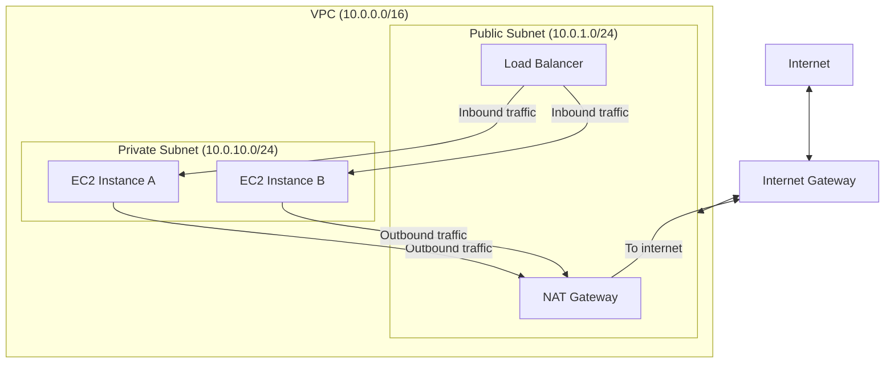

# How to Set Up EC2 Instances in a Private Subnet with NAT

Author: [nawazdhandala](https://github.com/nawazdhandala)

Tags: AWS, EC2, VPC, NAT Gateway, Private Subnet, Networking, Security

Description: Deploy EC2 instances in private subnets with NAT gateway access for outbound internet connectivity while keeping instances unreachable from the public internet.

---

Putting EC2 instances directly on the public internet is asking for trouble. Every instance with a public IP is a potential attack target. The better approach is to place your instances in private subnets - no public IP, no direct internet access - and use a NAT gateway for outbound traffic. Your instances can still download packages, call APIs, and push logs, but nobody on the internet can reach them directly.

## The Architecture



The key idea: inbound traffic reaches instances through the load balancer (public subnet). Outbound traffic from instances goes through the NAT gateway (also in the public subnet). The instances themselves have no public IPs and no direct internet route.

## Building the VPC

Let's build this step by step. Start with the VPC and subnets:

```bash
# Create the VPC
VPC_ID=$(aws ec2 create-vpc \
  --cidr-block 10.0.0.0/16 \
  --query 'Vpc.VpcId' --output text)

aws ec2 modify-vpc-attribute --vpc-id $VPC_ID --enable-dns-support
aws ec2 modify-vpc-attribute --vpc-id $VPC_ID --enable-dns-hostnames

aws ec2 create-tags --resources $VPC_ID --tags Key=Name,Value=app-vpc

# Create a public subnet (for NAT gateway and ALB)
PUB_SUBNET=$(aws ec2 create-subnet \
  --vpc-id $VPC_ID \
  --cidr-block 10.0.1.0/24 \
  --availability-zone us-east-1a \
  --query 'Subnet.SubnetId' --output text)

aws ec2 create-tags --resources $PUB_SUBNET --tags Key=Name,Value=public-subnet-1a

# Create a second public subnet (ALB requires at least two AZs)
PUB_SUBNET_2=$(aws ec2 create-subnet \
  --vpc-id $VPC_ID \
  --cidr-block 10.0.2.0/24 \
  --availability-zone us-east-1b \
  --query 'Subnet.SubnetId' --output text)

aws ec2 create-tags --resources $PUB_SUBNET_2 --tags Key=Name,Value=public-subnet-1b

# Create private subnets (for EC2 instances)
PRIV_SUBNET=$(aws ec2 create-subnet \
  --vpc-id $VPC_ID \
  --cidr-block 10.0.10.0/24 \
  --availability-zone us-east-1a \
  --query 'Subnet.SubnetId' --output text)

aws ec2 create-tags --resources $PRIV_SUBNET --tags Key=Name,Value=private-subnet-1a

PRIV_SUBNET_2=$(aws ec2 create-subnet \
  --vpc-id $VPC_ID \
  --cidr-block 10.0.11.0/24 \
  --availability-zone us-east-1b \
  --query 'Subnet.SubnetId' --output text)

aws ec2 create-tags --resources $PRIV_SUBNET_2 --tags Key=Name,Value=private-subnet-1b
```

## Internet Gateway for Public Subnets

The public subnets need an internet gateway for the NAT gateway to work:

```bash
# Create and attach an internet gateway
IGW_ID=$(aws ec2 create-internet-gateway \
  --query 'InternetGateway.InternetGatewayId' --output text)

aws ec2 attach-internet-gateway \
  --internet-gateway-id $IGW_ID \
  --vpc-id $VPC_ID

# Create a route table for public subnets
PUB_RT=$(aws ec2 create-route-table \
  --vpc-id $VPC_ID \
  --query 'RouteTable.RouteTableId' --output text)

aws ec2 create-tags --resources $PUB_RT --tags Key=Name,Value=public-rt

# Add a route to the internet gateway
aws ec2 create-route \
  --route-table-id $PUB_RT \
  --destination-cidr-block 0.0.0.0/0 \
  --gateway-id $IGW_ID

# Associate public subnets with the public route table
aws ec2 associate-route-table --route-table-id $PUB_RT --subnet-id $PUB_SUBNET
aws ec2 associate-route-table --route-table-id $PUB_RT --subnet-id $PUB_SUBNET_2
```

## Creating the NAT Gateway

NAT gateways need an Elastic IP and must be placed in a public subnet:

```bash
# Allocate an Elastic IP for the NAT gateway
EIP_ALLOC=$(aws ec2 allocate-address \
  --domain vpc \
  --query 'AllocationId' --output text)

# Create the NAT gateway in the public subnet
NAT_GW=$(aws ec2 create-nat-gateway \
  --subnet-id $PUB_SUBNET \
  --allocation-id $EIP_ALLOC \
  --query 'NatGateway.NatGatewayId' --output text)

echo "NAT Gateway: $NAT_GW (this takes 1-2 minutes to become available)"

# Wait for it to be available
aws ec2 wait nat-gateway-available --nat-gateway-ids $NAT_GW
echo "NAT Gateway is ready"
```

## Routing Private Subnets Through NAT

The private subnet route table sends all internet-bound traffic through the NAT gateway:

```bash
# Create a route table for private subnets
PRIV_RT=$(aws ec2 create-route-table \
  --vpc-id $VPC_ID \
  --query 'RouteTable.RouteTableId' --output text)

aws ec2 create-tags --resources $PRIV_RT --tags Key=Name,Value=private-rt

# Route internet traffic through the NAT gateway
aws ec2 create-route \
  --route-table-id $PRIV_RT \
  --destination-cidr-block 0.0.0.0/0 \
  --nat-gateway-id $NAT_GW

# Associate private subnets with the private route table
aws ec2 associate-route-table --route-table-id $PRIV_RT --subnet-id $PRIV_SUBNET
aws ec2 associate-route-table --route-table-id $PRIV_RT --subnet-id $PRIV_SUBNET_2
```

## Security Groups

Create security groups for the instances in private subnets:

```bash
# Security group for application instances (private subnet)
APP_SG=$(aws ec2 create-security-group \
  --group-name app-sg \
  --description "Application instances in private subnet" \
  --vpc-id $VPC_ID \
  --query 'GroupId' --output text)

# Allow HTTP from the ALB security group only
ALB_SG=$(aws ec2 create-security-group \
  --group-name alb-sg \
  --description "Application Load Balancer" \
  --vpc-id $VPC_ID \
  --query 'GroupId' --output text)

# ALB accepts traffic from the internet
aws ec2 authorize-security-group-ingress \
  --group-id $ALB_SG \
  --protocol tcp \
  --port 443 \
  --cidr 0.0.0.0/0

# App instances only accept traffic from the ALB
aws ec2 authorize-security-group-ingress \
  --group-id $APP_SG \
  --protocol tcp \
  --port 80 \
  --source-group $ALB_SG

# Allow all outbound (needed for NAT gateway access)
# This is the default, but being explicit is good practice
aws ec2 authorize-security-group-egress \
  --group-id $APP_SG \
  --protocol -1 \
  --cidr 0.0.0.0/0
```

## Launching Instances in Private Subnets

```bash
# Launch an instance in the private subnet - no public IP
aws ec2 run-instances \
  --image-id ami-0abc123 \
  --instance-type m5.large \
  --subnet-id $PRIV_SUBNET \
  --security-group-ids $APP_SG \
  --no-associate-public-ip-address \
  --iam-instance-profile Name=SSMInstanceProfile \
  --tag-specifications 'ResourceType=instance,Tags=[{Key=Name,Value=app-server-1}]' \
  --user-data '#!/bin/bash
yum update -y
yum install -y httpd
systemctl start httpd
echo "healthy" > /var/www/html/health'
```

Notice the `--iam-instance-profile` with SSM access. Since you can't SSH directly to private instances (no public IP), use Systems Manager Session Manager for access:

```bash
# Connect to the private instance via SSM (no SSH key needed)
aws ssm start-session --target i-0abc123
```

## Complete Terraform Configuration

Here's the full setup in Terraform:

```hcl
# Terraform: Complete private subnet with NAT gateway setup
provider "aws" {
  region = "us-east-1"
}

resource "aws_vpc" "main" {
  cidr_block           = "10.0.0.0/16"
  enable_dns_support   = true
  enable_dns_hostnames = true
  tags = { Name = "app-vpc" }
}

# Public subnets
resource "aws_subnet" "public" {
  count                   = 2
  vpc_id                  = aws_vpc.main.id
  cidr_block              = "10.0.${count.index + 1}.0/24"
  availability_zone       = data.aws_availability_zones.available.names[count.index]
  map_public_ip_on_launch = true
  tags = { Name = "public-${count.index + 1}" }
}

# Private subnets
resource "aws_subnet" "private" {
  count             = 2
  vpc_id            = aws_vpc.main.id
  cidr_block        = "10.0.${count.index + 10}.0/24"
  availability_zone = data.aws_availability_zones.available.names[count.index]
  tags = { Name = "private-${count.index + 1}" }
}

data "aws_availability_zones" "available" {
  state = "available"
}

# Internet gateway
resource "aws_internet_gateway" "main" {
  vpc_id = aws_vpc.main.id
  tags   = { Name = "main-igw" }
}

# Elastic IP for NAT
resource "aws_eip" "nat" {
  domain = "vpc"
  tags   = { Name = "nat-eip" }
}

# NAT gateway
resource "aws_nat_gateway" "main" {
  allocation_id = aws_eip.nat.id
  subnet_id     = aws_subnet.public[0].id
  tags          = { Name = "main-nat" }

  depends_on = [aws_internet_gateway.main]
}

# Public route table
resource "aws_route_table" "public" {
  vpc_id = aws_vpc.main.id

  route {
    cidr_block = "0.0.0.0/0"
    gateway_id = aws_internet_gateway.main.id
  }

  tags = { Name = "public-rt" }
}

# Private route table
resource "aws_route_table" "private" {
  vpc_id = aws_vpc.main.id

  route {
    cidr_block     = "0.0.0.0/0"
    nat_gateway_id = aws_nat_gateway.main.id
  }

  tags = { Name = "private-rt" }
}

# Route table associations
resource "aws_route_table_association" "public" {
  count          = 2
  subnet_id      = aws_subnet.public[count.index].id
  route_table_id = aws_route_table.public.id
}

resource "aws_route_table_association" "private" {
  count          = 2
  subnet_id      = aws_subnet.private[count.index].id
  route_table_id = aws_route_table.private.id
}

# Security groups
resource "aws_security_group" "app" {
  name_prefix = "app-"
  vpc_id      = aws_vpc.main.id

  ingress {
    from_port       = 80
    to_port         = 80
    protocol        = "tcp"
    security_groups = [aws_security_group.alb.id]
  }

  egress {
    from_port   = 0
    to_port     = 0
    protocol    = "-1"
    cidr_blocks = ["0.0.0.0/0"]
  }
}

resource "aws_security_group" "alb" {
  name_prefix = "alb-"
  vpc_id      = aws_vpc.main.id

  ingress {
    from_port   = 443
    to_port     = 443
    protocol    = "tcp"
    cidr_blocks = ["0.0.0.0/0"]
  }

  egress {
    from_port   = 0
    to_port     = 0
    protocol    = "-1"
    cidr_blocks = ["0.0.0.0/0"]
  }
}

# Launch instances in private subnets
resource "aws_instance" "app" {
  count                       = 2
  ami                         = "ami-0abc123"
  instance_type               = "m5.large"
  subnet_id                   = aws_subnet.private[count.index].id
  vpc_security_group_ids      = [aws_security_group.app.id]
  associate_public_ip_address = false
  iam_instance_profile        = aws_iam_instance_profile.ssm.name

  tags = { Name = "app-server-${count.index + 1}" }
}
```

## NAT Gateway Costs and Alternatives

NAT gateways aren't cheap. At $0.045/hour plus $0.045/GB of data processed, a moderately busy NAT gateway can cost $100-500/month.

**Cost reduction strategies:**

1. **VPC endpoints for AWS services**: Instead of routing S3, DynamoDB, and other AWS service traffic through NAT, use VPC endpoints:

```bash
# Create a gateway endpoint for S3 (free, keeps traffic off NAT)
aws ec2 create-vpc-endpoint \
  --vpc-id $VPC_ID \
  --service-name com.amazonaws.us-east-1.s3 \
  --route-table-ids $PRIV_RT

# Create an interface endpoint for CloudWatch (also avoids NAT)
aws ec2 create-vpc-endpoint \
  --vpc-id $VPC_ID \
  --service-name com.amazonaws.us-east-1.monitoring \
  --vpc-endpoint-type Interface \
  --subnet-ids $PRIV_SUBNET \
  --security-group-ids $APP_SG
```

2. **NAT instances**: For dev/test, a t3.micro running NAT is much cheaper than a managed NAT gateway (though less reliable).

3. **Single NAT for non-production**: Use one NAT gateway for all AZs in non-production environments.

## Testing the Setup

Verify that your private instances can reach the internet:

```bash
# Connect to the instance via SSM
aws ssm start-session --target i-0abc123

# Inside the instance, test internet connectivity
curl -s https://checkip.amazonaws.com
# Should return the NAT gateway's Elastic IP

# Test package installation
sudo yum install -y jq
```

If the curl fails, check the route table and NAT gateway status. The [network troubleshooting guide](https://oneuptime.com/blog/post/2026-02-12-troubleshoot-ec2-network-connectivity-issues/view) covers debugging steps in detail.

## High Availability for NAT

For production, deploy a NAT gateway in each AZ:

```bash
# Create NAT gateways in each public subnet
EIP_2=$(aws ec2 allocate-address --domain vpc --query 'AllocationId' --output text)

NAT_GW_2=$(aws ec2 create-nat-gateway \
  --subnet-id $PUB_SUBNET_2 \
  --allocation-id $EIP_2 \
  --query 'NatGateway.NatGatewayId' --output text)

# Create a separate route table for the second AZ
PRIV_RT_2=$(aws ec2 create-route-table --vpc-id $VPC_ID --query 'RouteTable.RouteTableId' --output text)
aws ec2 create-route --route-table-id $PRIV_RT_2 --destination-cidr-block 0.0.0.0/0 --nat-gateway-id $NAT_GW_2
aws ec2 associate-route-table --route-table-id $PRIV_RT_2 --subnet-id $PRIV_SUBNET_2
```

This way, if one AZ goes down, instances in the other AZ still have NAT access through their local NAT gateway.

Private subnets with NAT gateways are the standard pattern for production EC2 deployments. The setup takes more work than just putting everything in public subnets, but the security benefits are substantial. Your instances are shielded from direct internet access while still being able to reach the services they need.
