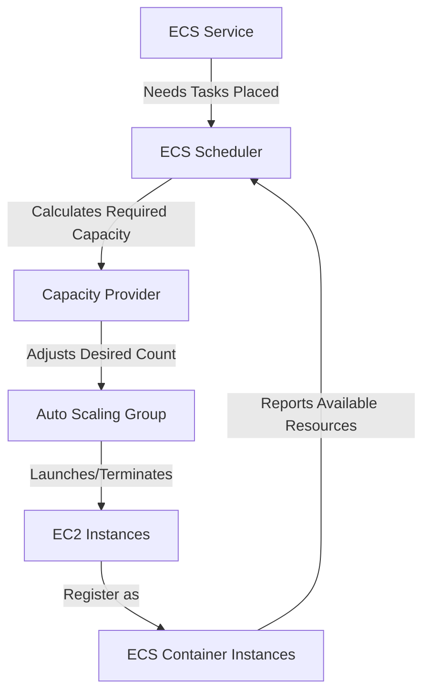
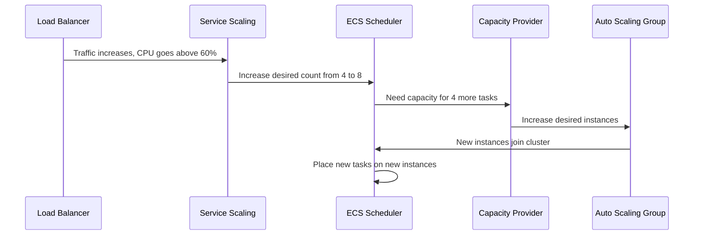

# How to Set Up ECS Cluster Auto Scaling with EC2

Author: [nawazdhandala](https://github.com/nawazdhandala)

Tags: AWS, ECS, Auto Scaling, EC2, Cluster Management, Capacity Planning, Cost Optimization

Description: Complete guide to setting up ECS cluster auto scaling with EC2 instances using capacity providers, ASG configuration, and scaling policies for optimal resource management.

---

One of the biggest operational challenges with ECS on EC2 is keeping the right amount of instance capacity available. Too little and tasks cannot be scheduled. Too much and you are paying for idle servers. ECS cluster auto scaling bridges this gap by automatically adjusting the number of EC2 instances based on the demands of your running services.

This guide covers the full setup from scratch, including the Auto Scaling Group, capacity providers, scaling policies, and the monitoring you need to keep it running smoothly.

## The Architecture

ECS cluster auto scaling involves several components working together:



The flow is:
1. Your ECS service wants to run N tasks
2. ECS calculates how many instances are needed
3. The capacity provider tells the ASG to adjust its desired count
4. The ASG launches or terminates instances
5. New instances register with the ECS cluster
6. Tasks get placed on available instances

## Step 1: Create the Launch Template

```bash
# Find the latest ECS-optimized AMI
ECS_AMI=$(aws ssm get-parameter \
  --name /aws/service/ecs/optimized-ami/amazon-linux-2/recommended/image_id \
  --query 'Parameter.Value' --output text)

echo "Using ECS AMI: $ECS_AMI"

# Create a launch template
aws ec2 create-launch-template \
  --launch-template-name ecs-cluster-lt \
  --launch-template-data '{
    "ImageId": "'$ECS_AMI'",
    "SecurityGroupIds": ["sg-0abc123"],
    "IamInstanceProfile": {
      "Name": "ecsInstanceRole"
    },
    "BlockDeviceMappings": [
      {
        "DeviceName": "/dev/xvda",
        "Ebs": {
          "VolumeSize": 50,
          "VolumeType": "gp3",
          "Encrypted": true
        }
      }
    ],
    "Monitoring": {
      "Enabled": true
    },
    "UserData": "'$(echo '#!/bin/bash
echo ECS_CLUSTER=production-cluster >> /etc/ecs/ecs.config
echo ECS_ENABLE_SPOT_INSTANCE_DRAINING=true >> /etc/ecs/ecs.config
echo ECS_ENABLE_CONTAINER_METADATA=true >> /etc/ecs/ecs.config
echo ECS_CONTAINER_STOP_TIMEOUT=120s >> /etc/ecs/ecs.config' | base64)'"
  }'
```

Key user data settings:

- **ECS_CLUSTER** - Which cluster the instance joins
- **ECS_ENABLE_SPOT_INSTANCE_DRAINING** - Gracefully drains tasks when Spot Instance receives termination notice
- **ECS_CONTAINER_STOP_TIMEOUT** - Gives containers time to shut down gracefully

## Step 2: Create the Auto Scaling Group

```bash
# Create ASG with mixed instance types for flexibility
aws autoscaling create-auto-scaling-group \
  --auto-scaling-group-name ecs-production-asg \
  --mixed-instances-policy '{
    "LaunchTemplate": {
      "LaunchTemplateSpecification": {
        "LaunchTemplateName": "ecs-cluster-lt",
        "Version": "$Latest"
      },
      "Overrides": [
        {"InstanceType": "m5.xlarge"},
        {"InstanceType": "m5a.xlarge"},
        {"InstanceType": "m5d.xlarge"},
        {"InstanceType": "m6i.xlarge"},
        {"InstanceType": "m6a.xlarge"},
        {"InstanceType": "c5.xlarge"},
        {"InstanceType": "c5a.xlarge"},
        {"InstanceType": "c6i.xlarge"}
      ]
    },
    "InstancesDistribution": {
      "OnDemandBaseCapacity": 2,
      "OnDemandPercentageAboveBaseCapacity": 30,
      "SpotAllocationStrategy": "capacity-optimized"
    }
  }' \
  --min-size 2 \
  --max-size 50 \
  --vpc-zone-identifier "subnet-0abc123,subnet-0def456,subnet-0ghi789" \
  --new-instances-protected-from-scale-in \
  --tags '[
    {"Key": "Name", "Value": "ecs-production", "PropagateAtLaunch": true},
    {"Key": "Environment", "Value": "production", "PropagateAtLaunch": true}
  ]'
```

The mixed instances policy gives you cost optimization:
- 2 On-Demand instances as a baseline (always available)
- 30% On-Demand, 70% Spot for additional capacity
- Multiple instance types for better Spot availability

## Step 3: Create Capacity Providers

```bash
# Create the capacity provider
aws ecs create-capacity-provider \
  --name production-cp \
  --auto-scaling-group-provider '{
    "autoScalingGroupArn": "arn:aws:autoscaling:us-east-1:123456789012:autoScalingGroup:abc-123:autoScalingGroupName/ecs-production-asg",
    "managedScaling": {
      "status": "ENABLED",
      "targetCapacity": 80,
      "minimumScalingStepSize": 1,
      "maximumScalingStepSize": 5,
      "instanceWarmupPeriod": 300
    },
    "managedTerminationProtection": "ENABLED"
  }'
```

## Step 4: Create and Configure the ECS Cluster

```bash
# Create the cluster with the capacity provider
aws ecs create-cluster \
  --cluster-name production-cluster \
  --capacity-providers production-cp \
  --default-capacity-provider-strategy '[
    {
      "capacityProvider": "production-cp",
      "weight": 1,
      "base": 2
    }
  ]' \
  --settings '[
    {
      "name": "containerInsights",
      "value": "enabled"
    }
  ]'
```

Container Insights gives you detailed metrics about your cluster, services, and tasks in CloudWatch.

## Step 5: Create ECS Services with Auto Scaling

Now set up both the cluster scaling (capacity providers) and service scaling (application auto scaling).

```bash
# Create an ECS service
aws ecs create-service \
  --cluster production-cluster \
  --service-name web-api \
  --task-definition web-api:latest \
  --desired-count 4 \
  --capacity-provider-strategy '[
    {"capacityProvider": "production-cp", "weight": 1, "base": 2}
  ]' \
  --placement-strategy '[
    {"type": "spread", "field": "attribute:ecs.availability-zone"},
    {"type": "binpack", "field": "memory"}
  ]'
```

For more on placement strategies, see [configuring ECS task placement strategies](https://oneuptime.com/blog/post/2026-02-12-configure-ecs-task-placement-strategies/view).

## Step 6: Set Up Service Auto Scaling

Service auto scaling adjusts the number of tasks. Cluster auto scaling adjusts the number of instances. You need both.

```bash
# Register the service as a scalable target
aws application-autoscaling register-scalable-target \
  --service-namespace ecs \
  --resource-id service/production-cluster/web-api \
  --scalable-dimension ecs:service:DesiredCount \
  --min-capacity 2 \
  --max-capacity 50

# Create a target tracking policy based on CPU utilization
aws application-autoscaling put-scaling-policy \
  --service-namespace ecs \
  --resource-id service/production-cluster/web-api \
  --scalable-dimension ecs:service:DesiredCount \
  --policy-name web-api-cpu-scaling \
  --policy-type TargetTrackingScaling \
  --target-tracking-scaling-policy-configuration '{
    "TargetValue": 60.0,
    "PredefinedMetricSpecification": {
      "PredefinedMetricType": "ECSServiceAverageCPUUtilization"
    },
    "ScaleInCooldown": 300,
    "ScaleOutCooldown": 60
  }'

# Also scale based on memory utilization
aws application-autoscaling put-scaling-policy \
  --service-namespace ecs \
  --resource-id service/production-cluster/web-api \
  --scalable-dimension ecs:service:DesiredCount \
  --policy-name web-api-memory-scaling \
  --policy-type TargetTrackingScaling \
  --target-tracking-scaling-policy-configuration '{
    "TargetValue": 70.0,
    "PredefinedMetricSpecification": {
      "PredefinedMetricType": "ECSServiceAverageMemoryUtilization"
    },
    "ScaleInCooldown": 300,
    "ScaleOutCooldown": 60
  }'
```

The scaling chain works like this:



## Step 7: Configure Scaling for Multiple Services

When multiple services share the cluster, each gets its own service scaling policy, but they all share the cluster capacity through the capacity provider.

```bash
# Second service: background worker
aws ecs create-service \
  --cluster production-cluster \
  --service-name background-worker \
  --task-definition worker:latest \
  --desired-count 8 \
  --capacity-provider-strategy '[
    {"capacityProvider": "production-cp", "weight": 1}
  ]'

# Scale workers based on SQS queue depth
aws application-autoscaling register-scalable-target \
  --service-namespace ecs \
  --resource-id service/production-cluster/background-worker \
  --scalable-dimension ecs:service:DesiredCount \
  --min-capacity 2 \
  --max-capacity 100

# Custom metric for queue-based scaling
aws application-autoscaling put-scaling-policy \
  --service-namespace ecs \
  --resource-id service/production-cluster/background-worker \
  --scalable-dimension ecs:service:DesiredCount \
  --policy-name worker-queue-scaling \
  --policy-type TargetTrackingScaling \
  --target-tracking-scaling-policy-configuration '{
    "TargetValue": 100.0,
    "CustomizedMetricSpecification": {
      "MetricName": "ApproximateNumberOfMessagesVisible",
      "Namespace": "AWS/SQS",
      "Dimensions": [
        {"Name": "QueueName", "Value": "work-queue"}
      ],
      "Statistic": "Average"
    },
    "ScaleInCooldown": 300,
    "ScaleOutCooldown": 30
  }'
```

## Monitoring Cluster Scaling

```bash
# Check cluster capacity
aws ecs describe-clusters \
  --clusters production-cluster \
  --query 'clusters[0].{
    RegisteredInstances: registeredContainerInstancesCount,
    ActiveServices: activeServicesCount,
    RunningTasks: runningTasksCount,
    PendingTasks: pendingTasksCount
  }'

# Check ASG scaling activity
aws autoscaling describe-scaling-activities \
  --auto-scaling-group-name ecs-production-asg \
  --max-items 10 \
  --query 'Activities[*].{Time:StartTime,Status:StatusCode,Cause:Cause}'
```

## Tuning Tips

1. **Target Capacity 80%** - Leave headroom for immediate task placement
2. **Scale Out Fast, Scale In Slowly** - ScaleOutCooldown should be shorter than ScaleInCooldown
3. **Instance Warmup** - Set to at least 300 seconds to avoid oscillation
4. **Mixed Instance Types** - More types means better Spot availability and more flexible bin-packing
5. **Min Size >= 2** - Always keep at least 2 instances for availability across AZs

## Wrapping Up

ECS cluster auto scaling with EC2 is the production-grade way to run containers on AWS with cost efficiency. The capacity provider handles instance scaling, service auto scaling handles task scaling, and together they create a responsive system that matches capacity to demand. The initial setup requires configuring several components, but once in place, the system runs itself. Your cluster grows when load increases and shrinks when it drops, keeping costs aligned with actual usage.
