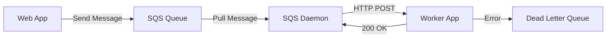

# How to Set Up Elastic Beanstalk Worker Environments

Author: [nawazdhandala](https://github.com/nawazdhandala)

Tags: AWS, Elastic Beanstalk, SQS, Worker, Background Jobs

Description: Learn how to set up Elastic Beanstalk worker environments for processing background tasks with SQS, including dead-letter queues, periodic tasks, and scaling configuration.

---

Not everything in your application should happen in the request-response cycle. Sending emails, processing images, generating reports, running data pipelines - these are all tasks that should happen in the background. Elastic Beanstalk worker environments are designed exactly for this. They pull messages from an SQS queue and POST them to your application as HTTP requests.

The setup is straightforward but there are a few things you need to get right. Let's walk through it.

## How Worker Environments Work

A worker environment sits behind an SQS queue instead of a load balancer. When a message arrives in the queue, Elastic Beanstalk's SQS daemon picks it up and sends it to your application as an HTTP POST request. Your application processes the message and returns a 200 status code to acknowledge it. If it fails, the message goes back to the queue for retry.



## Creating a Worker Environment

You can create a worker environment alongside your existing web environment.

```bash
# Create a worker environment
eb create worker-env \
    --tier worker \
    --instance-type t3.small \
    --platform python-3.11 \
    --region us-east-1
```

The `--tier worker` flag is what differentiates this from a web environment. Elastic Beanstalk automatically creates an SQS queue and configures the daemon.

## Building the Worker Application

Your worker application is just a web server that handles POST requests. The SQS daemon sends messages to `http://localhost/` by default.

Here's a Python Flask worker.

```python
# application.py - Worker application that processes SQS messages
from flask import Flask, request, jsonify
import json
import logging

application = Flask(__name__)
logger = logging.getLogger(__name__)

@application.route('/', methods=['POST'])
def process_message():
    """Handle incoming SQS messages from the EB SQS daemon."""
    try:
        # The message body comes as the POST request body
        message = request.get_json(force=True)
        task_type = message.get('type')

        logger.info(f"Processing task: {task_type}")

        # Route to the appropriate handler
        if task_type == 'send_email':
            handle_email(message)
        elif task_type == 'process_image':
            handle_image_processing(message)
        elif task_type == 'generate_report':
            handle_report_generation(message)
        else:
            logger.warning(f"Unknown task type: {task_type}")

        # Return 200 to acknowledge the message
        return jsonify({'status': 'processed'}), 200

    except Exception as e:
        logger.error(f"Failed to process message: {e}")
        # Return 500 to have the message retried
        return jsonify({'error': str(e)}), 500

def handle_email(message):
    """Send an email notification."""
    recipient = message['recipient']
    subject = message['subject']
    body = message['body']
    logger.info(f"Sending email to {recipient}: {subject}")
    # Your email sending logic here

def handle_image_processing(message):
    """Process and resize an uploaded image."""
    image_key = message['s3_key']
    sizes = message.get('sizes', ['thumbnail', 'medium', 'large'])
    logger.info(f"Processing image: {image_key} into {len(sizes)} sizes")
    # Your image processing logic here

def handle_report_generation(message):
    """Generate a report from data."""
    report_type = message['report_type']
    date_range = message['date_range']
    logger.info(f"Generating {report_type} report for {date_range}")
    # Your report generation logic here

if __name__ == '__main__':
    application.run()
```

## Sending Messages to the Worker

From your web application, send messages to the SQS queue that the worker reads from.

```python
# tasks.py - Send tasks to the worker queue
import boto3
import json

sqs = boto3.client('sqs', region_name='us-east-1')
QUEUE_URL = 'https://sqs.us-east-1.amazonaws.com/123456789/awseb-e-abc123-stack-AWSEBWorkerQueue-xyz'

def send_task(task_type, payload):
    """Send a task to the worker queue."""
    message = {
        'type': task_type,
        **payload
    }

    response = sqs.send_message(
        QueueUrl=QUEUE_URL,
        MessageBody=json.dumps(message)
    )

    return response['MessageId']

# Example: Queue an email task
send_task('send_email', {
    'recipient': 'user@example.com',
    'subject': 'Your report is ready',
    'body': 'Download your report at ...'
})

# Example: Queue image processing
send_task('process_image', {
    's3_key': 'uploads/photo-123.jpg',
    'sizes': ['thumbnail', 'medium']
})
```

You can find the queue URL in the Elastic Beanstalk console under your worker environment's configuration, or programmatically.

```bash
# Get the queue URL from the environment
eb printenv worker-env | grep SQS
```

## Configuring the SQS Daemon

The SQS daemon behavior is configurable through `.ebextensions`.

```yaml
# .ebextensions/worker.config - SQS daemon configuration
option_settings:
  aws:elasticbeanstalk:sqsd:
    # URL path where the daemon sends messages
    HttpPath: /
    # MIME type of the message
    MimeType: application/json
    # Number of messages to pull at once
    HttpConnections: 5
    # Seconds to wait for a response
    ConnectTimeout: 10
    # Maximum time to process a message (seconds)
    InactivityTimeout: 300
    # How long a message stays invisible after being picked up
    VisibilityTimeout: 600
    # How many times to retry before sending to dead-letter queue
    RetentionPeriod: 345600
    # Error visibility timeout (seconds)
    ErrorVisibilityTimeout: 60
```

The key settings to tune:

- **InactivityTimeout**: How long the daemon waits for your app to respond. Set this higher than your longest-running task.
- **VisibilityTimeout**: How long a message stays invisible while being processed. Should be at least 2x your InactivityTimeout.
- **HttpConnections**: Concurrent messages being processed. Tune this based on your instance size.

## Setting Up Dead-Letter Queues

Messages that fail repeatedly should go to a dead-letter queue (DLQ) for investigation instead of being retried forever.

```yaml
# .ebextensions/dlq.config - Dead-letter queue configuration
option_settings:
  aws:elasticbeanstalk:sqsd:
    MaxRetries: 3
```

When a message exceeds MaxRetries, it moves to a dead-letter queue that Elastic Beanstalk creates automatically. You can monitor this queue and set up alerts.

```python
# dlq_monitor.py - Monitor the dead-letter queue for failed messages
import boto3
import json

sqs = boto3.client('sqs', region_name='us-east-1')

def check_dlq(dlq_url):
    """Check for failed messages in the dead-letter queue."""
    response = sqs.get_queue_attributes(
        QueueUrl=dlq_url,
        AttributeNames=['ApproximateNumberOfMessages']
    )

    count = int(response['Attributes']['ApproximateNumberOfMessages'])

    if count > 0:
        print(f"WARNING: {count} messages in dead-letter queue")

        # Retrieve and inspect failed messages
        messages = sqs.receive_message(
            QueueUrl=dlq_url,
            MaxNumberOfMessages=10,
            WaitTimeSeconds=5
        )

        for msg in messages.get('Messages', []):
            body = json.loads(msg['Body'])
            print(f"Failed task: {body.get('type')} - {json.dumps(body)}")

    return count
```

## Periodic Tasks with cron.yaml

Worker environments can also run scheduled tasks using a `cron.yaml` file. This is great for recurring jobs like cleanup, reporting, or data synchronization.

```yaml
# cron.yaml - Scheduled periodic tasks
version: 1
cron:
  - name: "daily-cleanup"
    url: "/tasks/cleanup"
    schedule: "0 2 * * *"

  - name: "hourly-metrics"
    url: "/tasks/metrics"
    schedule: "0 * * * *"

  - name: "weekly-report"
    url: "/tasks/weekly-report"
    schedule: "0 9 * * MON"
```

Your worker application needs endpoints for each scheduled task.

```python
# Periodic task endpoints
@application.route('/tasks/cleanup', methods=['POST'])
def cleanup():
    """Daily cleanup of expired sessions and temp files."""
    logger.info("Running daily cleanup")
    # Cleanup logic here
    return jsonify({'status': 'cleanup complete'}), 200

@application.route('/tasks/metrics', methods=['POST'])
def collect_metrics():
    """Hourly metrics collection and aggregation."""
    logger.info("Collecting hourly metrics")
    # Metrics logic here
    return jsonify({'status': 'metrics collected'}), 200

@application.route('/tasks/weekly-report', methods=['POST'])
def weekly_report():
    """Generate and send weekly report."""
    logger.info("Generating weekly report")
    # Report logic here
    return jsonify({'status': 'report generated'}), 200
```

Elastic Beanstalk uses a leader election mechanism to ensure periodic tasks only run on one instance, even in a scaled-out environment.

## Scaling Worker Environments

Worker environments scale based on the SQS queue depth - more messages means more instances.

```yaml
# .ebextensions/scaling.config - Auto scaling based on queue depth
option_settings:
  aws:autoscaling:asg:
    MinSize: 1
    MaxSize: 10
  aws:autoscaling:trigger:
    MeasureName: ApproximateNumberOfMessagesVisible
    Statistic: Average
    Unit: Count
    UpperThreshold: 100
    LowerThreshold: 10
    UpperBreachScaleIncrement: 2
    LowerBreachScaleIncrement: -1
    BreachDuration: 5
    Period: 5
```

This configuration adds 2 instances when the queue grows beyond 100 messages and removes 1 when it drops below 10. For more on auto scaling configuration, see our guide on [configuring Elastic Beanstalk auto scaling](https://oneuptime.com/blog/post/2026-02-12-configure-elastic-beanstalk-auto-scaling/view).

## Monitoring Workers

Keep an eye on your worker environment with CloudWatch metrics.

```bash
# Check worker environment health
eb health worker-env

# View recent logs
eb logs worker-env
```

Key metrics to watch:

- **ApproximateNumberOfMessagesVisible**: Messages waiting to be processed
- **ApproximateAgeOfOldestMessage**: How long the oldest message has been waiting
- **NumberOfMessagesSent**: Throughput of your producer
- **NumberOfMessagesDeleted**: Throughput of your worker

## Wrapping Up

Worker environments are one of the most underused features in Elastic Beanstalk. They let you offload heavy processing from your web tier without setting up a separate queue consumer infrastructure. The SQS daemon handles the polling, retries, and dead-letter routing - you just write an HTTP endpoint that processes messages.

Start with a single worker instance, tune your timeout and concurrency settings based on actual workload, and scale out as needed. The combination of SQS queue depth scaling and periodic tasks via cron.yaml covers most background processing needs.
