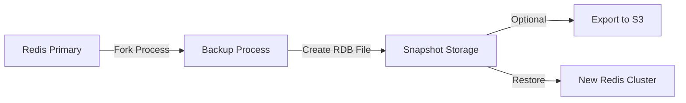

# How to Set Up ElastiCache Redis Backups

Author: [nawazdhandala](https://github.com/nawazdhandala)

Tags: AWS, ElastiCache, Redis, Backups, Disaster Recovery

Description: Learn how to configure automatic and manual backups for ElastiCache Redis, manage snapshot retention, export snapshots to S3, and restore from backups.

---

Redis is often treated as a throw-away cache - if it dies, just rebuild it from the database. But for many real-world use cases (session stores, rate limiters, feature flags, leaderboards), losing Redis data means losing important state. That's why backups matter, even for a caching layer.

ElastiCache Redis supports both automatic daily snapshots and manual snapshots. Let's set them up properly.

## How ElastiCache Redis Backups Work

ElastiCache creates Redis RDB snapshots. These are point-in-time captures of the entire dataset serialized to a file. The backup process forks the Redis process, so there's a brief spike in memory usage during the backup (Redis needs to copy-on-write while the child process dumps the data).



## Enabling Automatic Backups

### During Cluster Creation

The simplest approach is to enable backups when you create the replication group:

```bash
# Create Redis with automatic daily backups
aws elasticache create-replication-group \
  --replication-group-id my-redis-with-backups \
  --replication-group-description "Redis with automatic backups" \
  --engine redis \
  --engine-version 7.0 \
  --cache-node-type cache.r6g.large \
  --num-cache-clusters 3 \
  --automatic-failover-enabled \
  --multi-az-enabled \
  --snapshot-retention-limit 7 \
  --snapshot-window "03:00-04:00" \
  --cache-subnet-group-name my-cache-subnet-group \
  --security-group-ids sg-cache123
```

Key parameters:
- **snapshot-retention-limit**: Number of days to keep automatic snapshots (1-35). Set to 0 to disable.
- **snapshot-window**: The daily time window for automatic backups (UTC). Choose a low-traffic period.

### On an Existing Cluster

You can enable or modify backups on a running cluster:

```bash
# Enable automatic backups on an existing replication group
aws elasticache modify-replication-group \
  --replication-group-id my-redis-cluster \
  --snapshot-retention-limit 7 \
  --snapshot-window "03:00-04:00" \
  --apply-immediately
```

### Terraform Configuration

```hcl
resource "aws_elasticache_replication_group" "redis" {
  replication_group_id = "my-redis-with-backups"
  description          = "Redis with automatic backups"

  engine         = "redis"
  engine_version = "7.0"
  node_type      = "cache.r6g.large"
  num_cache_clusters = 3

  automatic_failover_enabled = true
  multi_az_enabled           = true

  # Backup configuration
  snapshot_retention_limit = 7      # Keep 7 days of backups
  snapshot_window          = "03:00-04:00"  # Backup at 3 AM UTC
  final_snapshot_identifier = "my-redis-final-snapshot"  # Snapshot on deletion

  subnet_group_name  = aws_elasticache_subnet_group.main.name
  security_group_ids = [aws_security_group.redis.id]
}
```

## Creating Manual Snapshots

Manual snapshots are useful before deployments, migrations, or any risky operation. They don't expire with the retention policy.

```bash
# Create a manual snapshot
aws elasticache create-snapshot \
  --replication-group-id my-redis-cluster \
  --snapshot-name my-manual-snapshot-20260212

# Check snapshot status
aws elasticache describe-snapshots \
  --snapshot-name my-manual-snapshot-20260212 \
  --query 'Snapshots[0].{Name:SnapshotName,Status:SnapshotStatus,NodeSize:CacheNodeType,DataSize:NodeSnapshots[0].SnapshotCreateTime}'
```

## Listing and Managing Snapshots

View all snapshots for a replication group:

```bash
# List all snapshots
aws elasticache describe-snapshots \
  --replication-group-id my-redis-cluster \
  --query 'Snapshots[*].{Name:SnapshotName,Status:SnapshotStatus,Source:SnapshotSource,Created:NodeSnapshots[0].SnapshotCreateTime}' \
  --output table
```

Delete an old snapshot:

```bash
# Delete a manual snapshot
aws elasticache delete-snapshot \
  --snapshot-name my-old-snapshot
```

## Exporting Snapshots to S3

You can export snapshots to S3 for long-term archival or cross-region/cross-account access.

### Step 1: Grant ElastiCache Access to S3

Create an S3 bucket and configure the bucket policy:

```bash
# Create the S3 bucket for Redis snapshots
aws s3 mb s3://my-redis-snapshots --region us-east-1

# Add the bucket policy allowing ElastiCache to write
aws s3api put-bucket-policy \
  --bucket my-redis-snapshots \
  --policy '{
    "Version": "2012-10-17",
    "Statement": [
      {
        "Sid": "AllowElastiCacheExport",
        "Effect": "Allow",
        "Principal": {
          "Service": "elasticache.amazonaws.com"
        },
        "Action": [
          "s3:PutObject",
          "s3:GetObject",
          "s3:ListBucket",
          "s3:GetBucketAcl",
          "s3:PutObjectAcl"
        ],
        "Resource": [
          "arn:aws:s3:::my-redis-snapshots",
          "arn:aws:s3:::my-redis-snapshots/*"
        ]
      }
    ]
  }'
```

### Step 2: Copy the Snapshot to S3

```bash
# Export a snapshot to S3
aws elasticache copy-snapshot \
  --source-snapshot-name my-manual-snapshot-20260212 \
  --target-snapshot-name my-snapshot-s3-export \
  --target-bucket my-redis-snapshots
```

## Restoring from a Backup

### Restore to a New Cluster

The most common restore operation is creating a new cluster from a snapshot:

```bash
# Create a new replication group from a snapshot
aws elasticache create-replication-group \
  --replication-group-id my-redis-restored \
  --replication-group-description "Restored from snapshot" \
  --snapshot-name my-manual-snapshot-20260212 \
  --cache-node-type cache.r6g.large \
  --num-cache-clusters 3 \
  --automatic-failover-enabled \
  --multi-az-enabled \
  --cache-subnet-group-name my-cache-subnet-group \
  --security-group-ids sg-cache123
```

You can change the node type during restore, which is useful for scaling up or down.

### Restore from an S3 Export

If you've previously exported a snapshot to S3:

```bash
# Restore from an S3 snapshot
aws elasticache create-replication-group \
  --replication-group-id my-redis-from-s3 \
  --replication-group-description "Restored from S3 snapshot" \
  --snapshot-arns arn:aws:s3:::my-redis-snapshots/my-snapshot-s3-export.rdb \
  --cache-node-type cache.r6g.large \
  --num-cache-clusters 2 \
  --cache-subnet-group-name my-cache-subnet-group \
  --security-group-ids sg-cache123
```

## Automating Snapshot Management

Here's a Lambda function that creates weekly manual snapshots and cleans up old ones:

```python
import boto3
from datetime import datetime, timedelta

def lambda_handler(event, context):
    """
    Create a weekly manual snapshot and delete snapshots older than 30 days.
    """
    elasticache = boto3.client('elasticache')
    cluster_id = 'my-redis-cluster'
    retention_days = 30

    # Create a new manual snapshot
    timestamp = datetime.now().strftime('%Y%m%d-%H%M')
    snapshot_name = f"weekly-{cluster_id}-{timestamp}"

    print(f"Creating snapshot: {snapshot_name}")
    elasticache.create_snapshot(
        ReplicationGroupId=cluster_id,
        SnapshotName=snapshot_name
    )

    # Clean up old manual snapshots
    cutoff = datetime.now() - timedelta(days=retention_days)
    snapshots = elasticache.describe_snapshots(
        ReplicationGroupId=cluster_id,
        SnapshotSource='manual'
    )['Snapshots']

    for snap in snapshots:
        if snap['SnapshotName'].startswith('weekly-'):
            # Check if any node snapshot is older than cutoff
            for node_snap in snap.get('NodeSnapshots', []):
                create_time = node_snap.get('SnapshotCreateTime')
                if create_time and create_time.replace(tzinfo=None) < cutoff:
                    print(f"Deleting old snapshot: {snap['SnapshotName']}")
                    try:
                        elasticache.delete_snapshot(
                            SnapshotName=snap['SnapshotName']
                        )
                    except Exception as e:
                        print(f"Error deleting {snap['SnapshotName']}: {e}")
                    break

    return {'statusCode': 200, 'body': f'Created {snapshot_name}'}
```

## Backup Performance Impact

The backup process forks the Redis process, which requires additional memory due to copy-on-write. The rule of thumb: you need at least 25% free memory beyond your dataset size to handle the backup fork without issues.

Here's how to check memory headroom:

```bash
# Check memory usage before enabling backups
aws cloudwatch get-metric-statistics \
  --namespace AWS/ElastiCache \
  --metric-name DatabaseMemoryUsagePercentage \
  --dimensions Name=CacheClusterId,Value=my-redis-cluster-001 \
  --start-time $(date -u -d '24 hours ago' +%Y-%m-%dT%H:%M:%S) \
  --end-time $(date -u +%Y-%m-%dT%H:%M:%S) \
  --period 3600 \
  --statistics Maximum
```

If memory usage is consistently above 75%, you should scale up before enabling backups. Otherwise, the backup fork might fail or cause an OOM condition.

## Backup Strategy Recommendations

- **Automatic snapshots**: Keep 7 days minimum for operational recovery
- **Manual snapshots**: Create before deployments, schema changes, or data migrations
- **S3 exports**: Keep monthly exports for long-term archival and cross-region DR
- **Snapshot window**: Schedule during your lowest-traffic period to minimize the performance impact of the fork

For comprehensive monitoring of your ElastiCache setup including backup health, check out the guide on [monitoring ElastiCache with CloudWatch](https://oneuptime.com/blog/post/2026-02-12-monitor-elasticache-with-cloudwatch/view).

## Wrapping Up

Backups are cheap insurance. Even if Redis is "just a cache," the time to rebuild a warm cache from cold can severely impact application performance. Set up automatic daily snapshots, create manual snapshots before risky operations, and export to S3 for long-term retention. Your future self will thank you.
