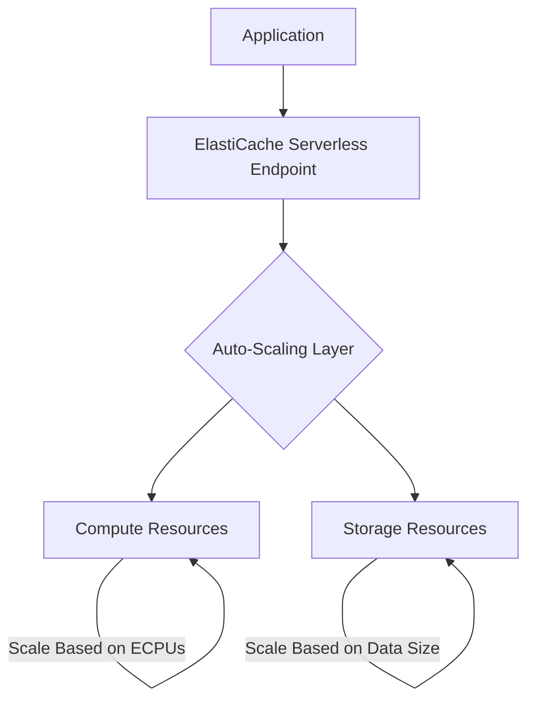

# How to Set Up ElastiCache Serverless

Author: [nawazdhandala](https://github.com/nawazdhandala)

Tags: AWS, ElastiCache, Redis, Memcached, Serverless, Caching

Description: Learn how to set up ElastiCache Serverless to get a fully managed, auto-scaling Redis or Memcached cache without managing nodes or clusters.

---

Managing ElastiCache clusters means choosing node types, deciding how many replicas you need, configuring sharding, and planning capacity for peak traffic. If you guess wrong, you either overpay for idle capacity or your cache buckles under load.

ElastiCache Serverless removes all of that. You create a cache, connect your application, and AWS handles the scaling. It automatically adjusts capacity based on your workload, scaling up in seconds when traffic increases and scaling down when it drops. You pay only for what you use.

## How ElastiCache Serverless Works

Instead of provisioning specific node types and counts, ElastiCache Serverless uses two dimensions for scaling:

- **ElastiCache Processing Units (ECPUs)** - measure the compute used by your cache operations
- **Storage** - the amount of data stored in the cache, measured in GB



The scaling is automatic and transparent. Your application connects to a single endpoint and never needs to know about the underlying infrastructure.

## Creating an ElastiCache Serverless Cache

### Redis Serverless

```bash
# Create a Redis Serverless cache
aws elasticache create-serverless-cache \
  --serverless-cache-name my-app-cache \
  --engine redis \
  --description "Serverless Redis cache for my application" \
  --subnet-ids subnet-0abc123 subnet-0def456 \
  --security-group-ids sg-0abc123 \
  --cache-usage-limits '{
    "DataStorage": {"Maximum": 10, "Unit": "GB"},
    "ECPUPerSecond": {"Maximum": 15000}
  }'
```

The `cache-usage-limits` parameter sets upper bounds on scaling. This is important for cost control - you do not want an unexpected traffic spike to scale your cache (and your bill) infinitely.

### Memcached Serverless

```bash
# Create a Memcached Serverless cache
aws elasticache create-serverless-cache \
  --serverless-cache-name my-session-cache \
  --engine memcached \
  --description "Serverless Memcached for session storage" \
  --subnet-ids subnet-0abc123 subnet-0def456 \
  --security-group-ids sg-0abc123 \
  --cache-usage-limits '{
    "DataStorage": {"Maximum": 5, "Unit": "GB"},
    "ECPUPerSecond": {"Maximum": 10000}
  }'
```

## Connecting Your Application

### Get the Endpoint

```bash
# Get the endpoint for your serverless cache
aws elasticache describe-serverless-caches \
  --serverless-cache-name my-app-cache \
  --query 'ServerlessCaches[0].Endpoint.{Address:Address,Port:Port}'
```

### Python Connection Example

```python
# Connect to ElastiCache Serverless Redis
import redis

# ElastiCache Serverless requires TLS
client = redis.Redis(
    host='my-app-cache-xxxxx.serverless.use1.cache.amazonaws.com',
    port=6379,
    ssl=True,
    decode_responses=True
)

# Basic operations work exactly like regular Redis
def cache_user_profile(user_id, profile_data, ttl=3600):
    """Cache a user profile with a 1-hour TTL."""
    client.setex(f"user:{user_id}", ttl, json.dumps(profile_data))

def get_user_profile(user_id):
    """Get a cached user profile, return None on miss."""
    data = client.get(f"user:{user_id}")
    return json.loads(data) if data else None
```

### Node.js Connection Example

```javascript
// Connect to ElastiCache Serverless from Node.js
const Redis = require('ioredis');

const redis = new Redis({
  host: 'my-app-cache-xxxxx.serverless.use1.cache.amazonaws.com',
  port: 6379,
  tls: {},  // Required for ElastiCache Serverless
});

// Cache API responses
async function getCachedApiResponse(endpoint) {
  const cached = await redis.get(`api:${endpoint}`);
  if (cached) {
    return JSON.parse(cached);
  }

  const response = await fetch(endpoint);
  const data = await response.json();

  // Cache for 5 minutes
  await redis.setex(`api:${endpoint}`, 300, JSON.stringify(data));
  return data;
}
```

### Java Connection Example

```java
// Connect to ElastiCache Serverless using Lettuce
import io.lettuce.core.RedisClient;
import io.lettuce.core.RedisURI;
import io.lettuce.core.api.sync.RedisCommands;

public class CacheService {
    private final RedisCommands<String, String> commands;

    public CacheService() {
        // Build URI with TLS enabled
        RedisURI uri = RedisURI.builder()
            .withHost("my-app-cache-xxxxx.serverless.use1.cache.amazonaws.com")
            .withPort(6379)
            .withSsl(true)
            .build();

        RedisClient client = RedisClient.create(uri);
        this.commands = client.connect().sync();
    }

    public void cacheValue(String key, String value, long ttlSeconds) {
        commands.setex(key, ttlSeconds, value);
    }

    public String getCachedValue(String key) {
        return commands.get(key);
    }
}
```

## Setting Usage Limits

Usage limits protect you from runaway costs. Set them based on your expected workload plus a buffer for spikes.

```bash
# Update usage limits on an existing serverless cache
aws elasticache modify-serverless-cache \
  --serverless-cache-name my-app-cache \
  --cache-usage-limits '{
    "DataStorage": {"Maximum": 20, "Unit": "GB"},
    "ECPUPerSecond": {"Maximum": 25000}
  }'
```

If your workload exceeds these limits, ElastiCache will throttle requests rather than scale beyond the limit. Monitor for throttling and increase limits if needed.

## Monitoring

### Key CloudWatch Metrics

```bash
# Monitor ECPU utilization - shows how close you are to your limit
aws cloudwatch get-metric-statistics \
  --namespace AWS/ElastiCache \
  --metric-name ElastiCacheProcessingUnits \
  --dimensions Name=ServerlessCacheName,Value=my-app-cache \
  --start-time $(date -u -d '1 hour ago' +%Y-%m-%dT%H:%M:%S) \
  --end-time $(date -u +%Y-%m-%dT%H:%M:%S) \
  --period 60 \
  --statistics Sum
```

```bash
# Monitor storage usage
aws cloudwatch get-metric-statistics \
  --namespace AWS/ElastiCache \
  --metric-name BytesUsedForCache \
  --dimensions Name=ServerlessCacheName,Value=my-app-cache \
  --start-time $(date -u -d '24 hours ago' +%Y-%m-%dT%H:%M:%S) \
  --end-time $(date -u +%Y-%m-%dT%H:%M:%S) \
  --period 3600 \
  --statistics Maximum
```

### Set Up Alerts

```bash
# Alert when ECPU usage approaches the limit
aws cloudwatch put-metric-alarm \
  --alarm-name serverless-cache-ecpu-high \
  --namespace AWS/ElastiCache \
  --metric-name ElastiCacheProcessingUnits \
  --dimensions Name=ServerlessCacheName,Value=my-app-cache \
  --statistic Sum \
  --period 60 \
  --threshold 12000 \
  --comparison-operator GreaterThanThreshold \
  --evaluation-periods 5 \
  --alarm-actions arn:aws:sns:us-east-1:123456789012:CacheAlerts

# Alert when throttling occurs
aws cloudwatch put-metric-alarm \
  --alarm-name serverless-cache-throttled \
  --namespace AWS/ElastiCache \
  --metric-name ThrottledRequests \
  --dimensions Name=ServerlessCacheName,Value=my-app-cache \
  --statistic Sum \
  --period 60 \
  --threshold 100 \
  --comparison-operator GreaterThanThreshold \
  --evaluation-periods 1 \
  --alarm-actions arn:aws:sns:us-east-1:123456789012:CacheAlerts
```

## Snapshots and Backups

ElastiCache Serverless supports automatic daily snapshots.

```bash
# Configure daily snapshots with 7-day retention
aws elasticache modify-serverless-cache \
  --serverless-cache-name my-app-cache \
  --snapshot-retention-limit 7 \
  --daily-snapshot-time "03:00"
```

Create a manual snapshot before major changes.

```bash
# Create a manual snapshot
aws elasticache create-serverless-cache-snapshot \
  --serverless-cache-name my-app-cache \
  --serverless-cache-snapshot-name pre-migration-snapshot
```

## Serverless vs. Provisioned: When to Choose Each

Choose **ElastiCache Serverless** when:
- Your workload has unpredictable or variable traffic patterns
- You want to minimize operational overhead
- You are starting a new project and do not know your capacity needs yet
- You have a development or staging environment that only runs during business hours

Choose **provisioned ElastiCache** when:
- Your workload is steady and predictable
- You need maximum cost efficiency with Reserved Instances
- You need specific node types for compliance or performance testing
- You require features not yet supported by Serverless (check the latest documentation)

## Migrating from Provisioned to Serverless

If you have an existing provisioned cluster, you can migrate by creating a snapshot and restoring it to a serverless cache.

```bash
# Take a snapshot of your existing cluster
aws elasticache create-snapshot \
  --replication-group-id my-existing-cluster \
  --snapshot-name migration-snapshot

# Create a serverless cache from the snapshot
aws elasticache create-serverless-cache \
  --serverless-cache-name my-app-cache-serverless \
  --engine redis \
  --snapshot-arns-to-restore arn:aws:elasticache:us-east-1:123456789012:snapshot:migration-snapshot \
  --subnet-ids subnet-0abc123 subnet-0def456 \
  --security-group-ids sg-0abc123
```

## Summary

ElastiCache Serverless is the easiest way to get a production-ready cache on AWS. No node types to choose, no cluster sizing to worry about, and no capacity planning needed. It auto-scales on two dimensions - compute and storage - and you pay only for what you use. Set usage limits to control costs, monitor for throttling, and let AWS handle the rest.

For more on caching, check out our guides on [configuring ElastiCache Global Datastore for multi-Region](https://oneuptime.com/blog/post/configure-elasticache-global-datastore-for-multi-region/view) and [Redis data tiering](https://oneuptime.com/blog/post/configure-elasticache-redis-data-tiering/view).
