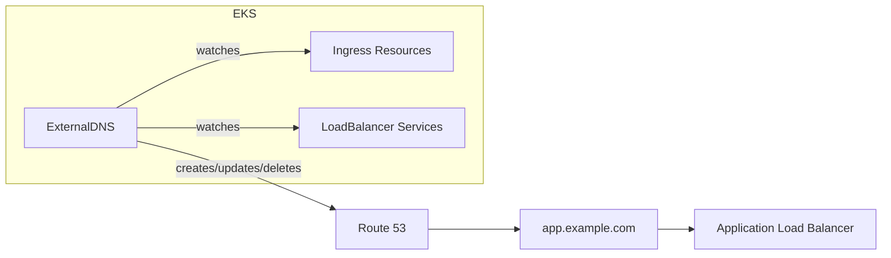

# How to Set Up External DNS on EKS with Route 53

Author: [nawazdhandala](https://github.com/nawazdhandala)

Tags: AWS, EKS, Kubernetes, Route 53, DNS

Description: Learn how to install and configure ExternalDNS on Amazon EKS to automatically manage Route 53 DNS records for your Kubernetes services and ingresses.

---

Every time you create an Ingress or LoadBalancer service in Kubernetes, you get a DNS name - something like `k8s-default-samplein-abc123-1234567890.us-west-2.elb.amazonaws.com`. Nobody wants to put that in a browser. You need a real domain name pointing to it, and manually creating Route 53 records every time you deploy a service is tedious and error-prone.

ExternalDNS solves this by watching your Kubernetes resources and automatically creating, updating, and deleting DNS records in Route 53. Deploy a new service with a hostname annotation, and within minutes you've got a working DNS record.

## How It Works

ExternalDNS runs as a deployment in your cluster. It periodically scans Ingress resources, Services of type LoadBalancer, and other supported resources for hostname annotations. When it finds one, it creates the corresponding DNS record in Route 53. When the resource is deleted, it removes the record.



## Prerequisites

- An EKS cluster with kubectl configured
- A Route 53 hosted zone for your domain
- An OIDC provider set up for [IRSA](https://oneuptime.com/blog/post/2026-02-12-set-up-iam-roles-for-eks-service-accounts-irsa/view)

## Step 1: Create the IAM Policy

ExternalDNS needs permission to list hosted zones and manage records in Route 53:

```json
{
  "Version": "2012-10-17",
  "Statement": [
    {
      "Effect": "Allow",
      "Action": [
        "route53:ChangeResourceRecordSets"
      ],
      "Resource": [
        "arn:aws:route53:::hostedzone/*"
      ]
    },
    {
      "Effect": "Allow",
      "Action": [
        "route53:ListHostedZones",
        "route53:ListResourceRecordSets",
        "route53:ListTagsForResource"
      ],
      "Resource": ["*"]
    }
  ]
}
```

Save this as `external-dns-policy.json` and create the policy:

```bash
# Create the IAM policy for ExternalDNS
aws iam create-policy \
  --policy-name ExternalDNSPolicy \
  --policy-document file://external-dns-policy.json
```

For tighter security, restrict the first statement to your specific hosted zone:

```json
"Resource": ["arn:aws:route53:::hostedzone/Z1234567890ABC"]
```

## Step 2: Create the IRSA Service Account

```bash
# Create IRSA for ExternalDNS
eksctl create iamserviceaccount \
  --cluster my-cluster \
  --namespace kube-system \
  --name external-dns \
  --attach-policy-arn arn:aws:iam::123456789012:policy/ExternalDNSPolicy \
  --approve
```

## Step 3: Deploy ExternalDNS

You can deploy with Helm or a manifest. Here's the Helm approach:

```bash
# Add the ExternalDNS Helm repo
helm repo add external-dns https://kubernetes-sigs.github.io/external-dns/
helm repo update
```

Create a values file:

```yaml
# external-dns-values.yaml - ExternalDNS configuration
provider: aws

env:
  - name: AWS_DEFAULT_REGION
    value: us-west-2

serviceAccount:
  create: false
  name: external-dns

domainFilters:
  - example.com  # Only manage records for this domain

policy: sync  # sync will create and delete records; upsert-only won't delete

txtOwnerId: my-cluster  # Unique identifier to prevent conflicts with other clusters

sources:
  - ingress
  - service

extraArgs:
  - --aws-zone-type=public  # Only manage public hosted zones
```

Install:

```bash
# Install ExternalDNS with Helm
helm install external-dns external-dns/external-dns \
  -n kube-system \
  -f external-dns-values.yaml
```

Verify it's running:

```bash
# Check ExternalDNS pod
kubectl get pods -n kube-system -l app.kubernetes.io/name=external-dns

# Check logs for successful startup
kubectl logs -n kube-system -l app.kubernetes.io/name=external-dns --tail=30
```

## Step 4: Use ExternalDNS with Ingress

Now when you create an Ingress with a host field, ExternalDNS automatically creates the DNS record:

```yaml
# ingress-with-dns.yaml - Ingress that creates a Route 53 record
apiVersion: networking.k8s.io/v1
kind: Ingress
metadata:
  name: my-app
  annotations:
    kubernetes.io/ingress.class: alb
    alb.ingress.kubernetes.io/scheme: internet-facing
    alb.ingress.kubernetes.io/target-type: ip
    external-dns.alpha.kubernetes.io/hostname: app.example.com
spec:
  rules:
    - host: app.example.com
      http:
        paths:
          - path: /
            pathType: Prefix
            backend:
              service:
                name: my-app
                port:
                  number: 80
```

ExternalDNS picks up the hostname from either the `external-dns.alpha.kubernetes.io/hostname` annotation or the `spec.rules[].host` field.

For more on ALB Ingress, see our [ALB setup guide](https://oneuptime.com/blog/post/2026-02-12-set-up-ingress-with-alb-on-eks/view).

## Step 5: Use ExternalDNS with Services

LoadBalancer services also work:

```yaml
# service-with-dns.yaml - Service that creates a Route 53 record
apiVersion: v1
kind: Service
metadata:
  name: my-api
  annotations:
    external-dns.alpha.kubernetes.io/hostname: api.example.com
    external-dns.alpha.kubernetes.io/ttl: "300"
spec:
  type: LoadBalancer
  selector:
    app: my-api
  ports:
    - port: 443
      targetPort: 8443
```

## Managing Multiple Subdomains

You can create multiple DNS records for a single resource:

```yaml
# Multiple hostnames for one ingress
annotations:
  external-dns.alpha.kubernetes.io/hostname: "app.example.com,www.example.com"
```

## TXT Record Ownership

ExternalDNS creates TXT records alongside your A/CNAME records to track ownership. This prevents it from modifying records it didn't create. The TXT records look like:

```
_externaldns.app.example.com  TXT  "heritage=external-dns,external-dns/owner=my-cluster,external-dns/resource=ingress/default/my-app"
```

The `txtOwnerId` in the configuration ensures that multiple EKS clusters managing the same hosted zone don't interfere with each other.

## Private Hosted Zones

For internal services, use a private hosted zone:

```yaml
# external-dns-values.yaml for private zones
extraArgs:
  - --aws-zone-type=private

domainFilters:
  - internal.example.com
```

## Troubleshooting

If records aren't being created, check the ExternalDNS logs first:

```bash
# Check ExternalDNS logs for errors
kubectl logs -n kube-system -l app.kubernetes.io/name=external-dns --tail=100
```

Common issues:

- **"No matching hosted zone"** - your domain filter doesn't match any hosted zone, or the hosted zone hasn't been created in Route 53
- **"AccessDenied"** - IAM permissions are wrong, check the IRSA setup
- **Records not updating** - ExternalDNS has a sync interval (default 1 minute), give it time
- **Duplicate records** - make sure the txtOwnerId is unique per cluster

```bash
# Verify Route 53 records were created
aws route53 list-resource-record-sets \
  --hosted-zone-id Z1234567890ABC \
  --query "ResourceRecordSets[?Name=='app.example.com.']"
```

## DNS Propagation

After ExternalDNS creates a record, it takes time for DNS to propagate. Route 53 is fast - usually under 60 seconds - but cached DNS entries on client machines might take longer depending on TTL values.

ExternalDNS paired with the [ALB Ingress Controller](https://oneuptime.com/blog/post/2026-02-12-set-up-ingress-with-alb-on-eks/view) and [cert-manager](https://oneuptime.com/blog/post/2026-02-12-set-up-cert-manager-on-eks-with-acm/view) gives you a fully automated path from deployment to a working HTTPS endpoint with a proper domain name. It's one of those tools that, once set up, you never have to think about again.
