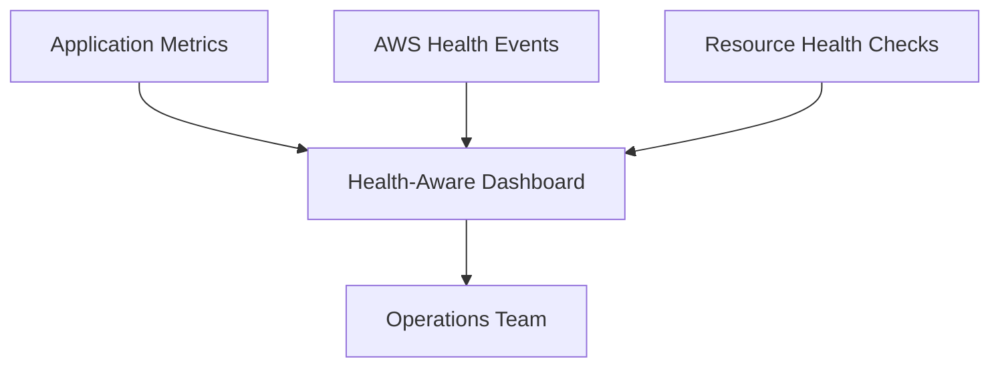

# How to Set Up Health-Aware Dashboards on AWS

Author: [nawazdhandala](https://github.com/nawazdhandala)

Tags: AWS, Health, Dashboards, CloudWatch, Monitoring, Incident Management

Description: Build health-aware dashboards on AWS that combine service health events, resource status, and operational metrics into a single operational view.

---

AWS dashboards typically show you metrics like CPU, memory, and error rates. But they miss a critical dimension: AWS service health. When an AWS region is having issues, your dashboards might show symptoms (elevated latency, failed deployments) without telling you the root cause is on AWS's side. Health-aware dashboards combine your application metrics with AWS Health events and resource status, giving your operations team the full picture.

This guide shows you how to build dashboards that know when AWS itself is the problem.

## What Makes a Dashboard Health-Aware

A health-aware dashboard integrates three data sources:

1. **Application metrics**: Your standard CloudWatch metrics (CPU, memory, errors, latency)
2. **AWS Health events**: Service disruptions, scheduled maintenance, and account-specific notifications
3. **Resource health**: Individual resource status from services like EC2, RDS, and ELB



When all three are on the same screen, your team can instantly tell whether an issue is in your code, your infrastructure, or AWS itself.

## Prerequisites

- CloudWatch access with dashboard creation permissions
- AWS Health API access (available in all accounts, full API requires Business or Enterprise Support)
- An application with CloudWatch metrics already flowing

## Step 1: Set Up AWS Health Event Forwarding

AWS Health events are available through EventBridge. Create a rule that captures health events and stores them as CloudWatch custom metrics for dashboard visualization.

```bash
# Create EventBridge rule for AWS Health events
aws events put-rule \
  --name aws-health-events \
  --event-pattern '{
    "source": ["aws.health"],
    "detail-type": ["AWS Health Event"]
  }' \
  --description "Capture all AWS Health events"
```

Now create a Lambda function that converts health events into CloudWatch custom metrics:

```python
# Lambda function to convert AWS Health events to CloudWatch metrics
import json
import boto3
from datetime import datetime

cloudwatch = boto3.client('cloudwatch')

def handler(event, context):
    detail = event['detail']
    service = detail.get('service', 'unknown')
    event_type = detail.get('eventTypeCategory', 'unknown')
    region = detail.get('affectedRegion', event.get('region', 'unknown'))
    status = detail.get('statusCode', 'unknown')

    # Map event category to a numeric value for the metric
    category_values = {
        'issue': 3,           # Active service issue
        'accountNotification': 1,  # Informational
        'scheduledChange': 2       # Planned maintenance
    }

    metric_value = category_values.get(event_type, 0)

    # Publish a custom metric for the health event
    cloudwatch.put_metric_data(
        Namespace='AWS/HealthEvents',
        MetricData=[
            {
                'MetricName': 'HealthEventSeverity',
                'Dimensions': [
                    {'Name': 'Service', 'Value': service},
                    {'Name': 'Region', 'Value': region},
                    {'Name': 'Category', 'Value': event_type}
                ],
                'Value': metric_value,
                'Unit': 'None',
                'Timestamp': datetime.utcnow()
            },
            {
                'MetricName': 'ActiveHealthEvents',
                'Dimensions': [
                    {'Name': 'Service', 'Value': service}
                ],
                'Value': 1 if status == 'open' else 0,
                'Unit': 'Count',
                'Timestamp': datetime.utcnow()
            }
        ]
    )

    print(f"Published health metric: {service} - {event_type} - {status}")
    return {'statusCode': 200}
```

```bash
# Connect the EventBridge rule to the Lambda function
aws events put-targets \
  --rule aws-health-events \
  --targets '[{
    "Id": "health-to-metrics",
    "Arn": "arn:aws:lambda:us-east-1:123456789012:function:health-event-to-metric"
  }]'
```

## Step 2: Create Resource Health Metrics

Beyond AWS-wide service health, you want to track the health of your specific resources. Many AWS services publish health-related metrics, but some need custom collection.

### EC2 Instance Status Checks

EC2 publishes `StatusCheckFailed` metrics that indicate hardware or software issues on the instance.

### RDS Health

RDS provides metrics like `DatabaseConnections`, `FreeStorageSpace`, and specific event notifications for failovers and maintenance.

### ELB Target Health

Application Load Balancers publish `HealthyHostCount` and `UnHealthyHostCount` metrics per target group.

Create a Lambda function that periodically collects resource health status:

```python
# Lambda to collect resource health status as custom metrics
import boto3

cloudwatch = boto3.client('cloudwatch')
ec2 = boto3.client('ec2')
elbv2 = boto3.client('elbv2')

def handler(event, context):
    # Check EC2 instance statuses
    response = ec2.describe_instance_status(
        Filters=[{'Name': 'instance-state-name', 'Values': ['running']}]
    )

    impaired_count = 0
    for status in response['InstanceStatuses']:
        instance_status = status['InstanceStatus']['Status']
        system_status = status['SystemStatus']['Status']
        if instance_status != 'ok' or system_status != 'ok':
            impaired_count += 1

    cloudwatch.put_metric_data(
        Namespace='Custom/ResourceHealth',
        MetricData=[{
            'MetricName': 'ImpairedEC2Instances',
            'Value': impaired_count,
            'Unit': 'Count'
        }]
    )

    # Check ALB target group health
    target_groups = elbv2.describe_target_groups()
    for tg in target_groups['TargetGroups']:
        health = elbv2.describe_target_health(
            TargetGroupArn=tg['TargetGroupArn']
        )
        healthy = sum(1 for t in health['TargetHealthDescriptions']
                     if t['TargetHealth']['State'] == 'healthy')
        unhealthy = sum(1 for t in health['TargetHealthDescriptions']
                       if t['TargetHealth']['State'] == 'unhealthy')

        cloudwatch.put_metric_data(
            Namespace='Custom/ResourceHealth',
            MetricData=[
                {
                    'MetricName': 'HealthyTargets',
                    'Dimensions': [{'Name': 'TargetGroup', 'Value': tg['TargetGroupName']}],
                    'Value': healthy,
                    'Unit': 'Count'
                },
                {
                    'MetricName': 'UnhealthyTargets',
                    'Dimensions': [{'Name': 'TargetGroup', 'Value': tg['TargetGroupName']}],
                    'Value': unhealthy,
                    'Unit': 'Count'
                }
            ]
        )

    return {'statusCode': 200}
```

Schedule this with an EventBridge rule to run every 5 minutes:

```bash
# Schedule resource health collection every 5 minutes
aws events put-rule \
  --name collect-resource-health \
  --schedule-expression "rate(5 minutes)"

aws events put-targets \
  --rule collect-resource-health \
  --targets '[{
    "Id": "resource-health-collector",
    "Arn": "arn:aws:lambda:us-east-1:123456789012:function:collect-resource-health"
  }]'
```

## Step 3: Build the Dashboard

Now put it all together in a CloudWatch dashboard. The dashboard has three sections: a health status banner at the top, application metrics in the middle, and resource health at the bottom.

```json
// CloudWatch dashboard body for health-aware monitoring
{
  "widgets": [
    {
      "type": "text",
      "x": 0,
      "y": 0,
      "width": 24,
      "height": 2,
      "properties": {
        "markdown": "# System Health Dashboard\nThis dashboard combines application metrics, AWS Health events, and resource health status."
      }
    },
    {
      "type": "metric",
      "x": 0,
      "y": 2,
      "width": 8,
      "height": 4,
      "properties": {
        "metrics": [
          ["AWS/HealthEvents", "ActiveHealthEvents", "Service", "EC2"],
          ["AWS/HealthEvents", "ActiveHealthEvents", "Service", "RDS"],
          ["AWS/HealthEvents", "ActiveHealthEvents", "Service", "LAMBDA"]
        ],
        "view": "singleValue",
        "title": "Active AWS Health Events",
        "period": 300,
        "stat": "Maximum"
      }
    },
    {
      "type": "metric",
      "x": 8,
      "y": 2,
      "width": 8,
      "height": 4,
      "properties": {
        "metrics": [
          ["Custom/ResourceHealth", "ImpairedEC2Instances"]
        ],
        "view": "singleValue",
        "title": "Impaired EC2 Instances",
        "period": 300
      }
    },
    {
      "type": "metric",
      "x": 16,
      "y": 2,
      "width": 8,
      "height": 4,
      "properties": {
        "metrics": [
          ["Custom/ResourceHealth", "UnhealthyTargets", "TargetGroup", "my-app-tg"]
        ],
        "view": "singleValue",
        "title": "Unhealthy ALB Targets",
        "period": 300
      }
    },
    {
      "type": "metric",
      "x": 0,
      "y": 6,
      "width": 12,
      "height": 6,
      "properties": {
        "metrics": [
          ["AWS/ApplicationELB", "HTTPCode_Target_5XX_Count", "LoadBalancer", "app/my-alb/abc123"],
          ["AWS/ApplicationELB", "HTTPCode_Target_2XX_Count", "LoadBalancer", "app/my-alb/abc123"]
        ],
        "view": "timeSeries",
        "title": "Application HTTP Responses",
        "period": 60
      }
    },
    {
      "type": "metric",
      "x": 12,
      "y": 6,
      "width": 12,
      "height": 6,
      "properties": {
        "metrics": [
          ["AWS/ApplicationELB", "TargetResponseTime", "LoadBalancer", "app/my-alb/abc123", {"stat": "p99"}],
          ["AWS/ApplicationELB", "TargetResponseTime", "LoadBalancer", "app/my-alb/abc123", {"stat": "p50"}]
        ],
        "view": "timeSeries",
        "title": "Application Latency (p50/p99)",
        "period": 60
      }
    }
  ]
}
```

```bash
# Create the dashboard
aws cloudwatch put-dashboard \
  --dashboard-name health-aware-overview \
  --dashboard-body file://dashboard.json
```

## Step 4: Add Alarm Status Widgets

Consolidate all your CloudWatch alarms into a single widget for an at-a-glance view:

```json
// Alarm status widget
{
  "type": "alarm",
  "x": 0,
  "y": 12,
  "width": 24,
  "height": 4,
  "properties": {
    "title": "Alarm Status - All Critical",
    "alarms": [
      "arn:aws:cloudwatch:us-east-1:123456789012:alarm:high-cpu",
      "arn:aws:cloudwatch:us-east-1:123456789012:alarm:high-error-rate",
      "arn:aws:cloudwatch:us-east-1:123456789012:alarm:low-disk-space",
      "arn:aws:cloudwatch:us-east-1:123456789012:alarm:unhealthy-hosts"
    ]
  }
}
```

## Step 5: Integrate with AWS Health Dashboard API

For accounts with Business or Enterprise Support, the Health API provides programmatic access to both public and account-specific health events.

```bash
# Query current health events affecting your account
aws health describe-events \
  --filter '{
    "eventStatusCodes": ["open", "upcoming"],
    "eventTypeCategories": ["issue", "scheduledChange"]
  }' \
  --region us-east-1
```

You can build a scheduled Lambda that checks for active health events and updates a dashboard annotation or custom metric accordingly.

## Best Practices

**Color-code severity**: Use red for active issues, yellow for scheduled changes, and green for healthy. CloudWatch dashboard widgets support color thresholds.

**Keep it focused**: Do not put every metric on the health dashboard. Focus on the top 5-10 most critical indicators plus the health status.

**Set up auto-refresh**: Configure the dashboard to auto-refresh every 1-5 minutes so the on-call engineer always sees current data.

**Add runbook links**: Use text widgets with markdown links to your incident runbooks. When something goes red, the team should know exactly what to do next.

**Test with synthetic events**: Periodically generate test health events to verify your Lambda functions and dashboard widgets are working correctly.

## Wrapping Up

A health-aware dashboard transforms your monitoring from "what is my application doing?" to "what is happening across my entire stack, including AWS?" When AWS itself has issues, your team knows immediately instead of spending 30 minutes debugging something they cannot fix.

For more on CloudWatch dashboards across multiple accounts, see [CloudWatch cross-account dashboards](https://oneuptime.com/blog/post/use-cloudwatch-cross-account-dashboards/view). And for centralizing monitoring across your organization, check out [centralized monitoring for multi-account AWS](https://oneuptime.com/blog/post/set-up-centralized-monitoring-for-multi-account-aws/view).
