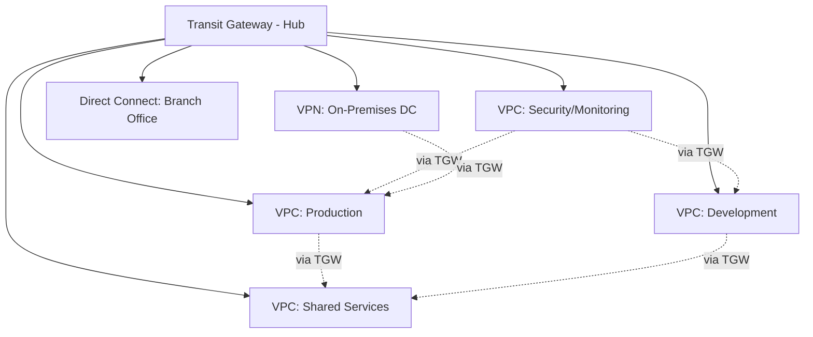
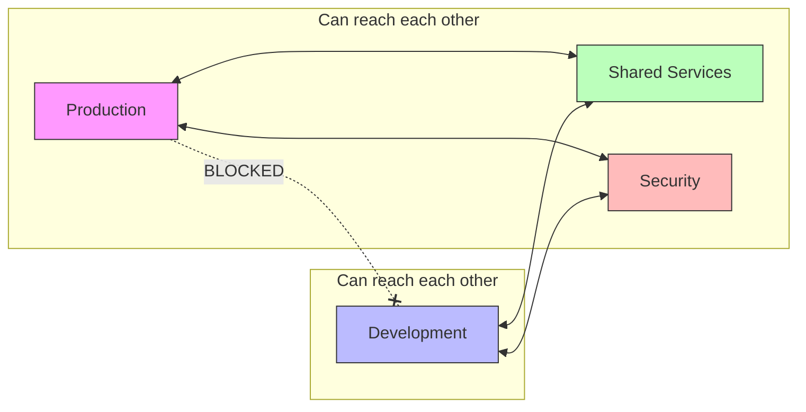

# How to Set Up Hub-and-Spoke VPC Architecture with Transit Gateway

Author: [nawazdhandala](https://github.com/nawazdhandala)

Tags: AWS, Transit Gateway, VPC, Networking, Hub-and-Spoke, Architecture

Description: Complete guide to building a hub-and-spoke VPC architecture using AWS Transit Gateway including route tables, attachments, and security segmentation.

---

As your AWS environment grows past a handful of VPCs, point-to-point VPC peering becomes unmanageable. With 10 VPCs, you need 45 peering connections. With 20, you need 190. Transit Gateway replaces that mesh with a hub-and-spoke model where every VPC connects to a central hub, and routing is managed centrally.

## Hub-and-Spoke Architecture

In a hub-and-spoke design, the Transit Gateway is the hub. Every VPC, VPN connection, and Direct Connect gateway attaches to it as a spoke. Traffic between any two spokes routes through the hub.



## Why Transit Gateway Over VPC Peering?

| Feature | VPC Peering | Transit Gateway |
|---------|------------|-----------------|
| Topology | Mesh (N*(N-1)/2 connections) | Hub-and-spoke (N connections) |
| Transitive routing | No | Yes |
| Centralized routing | No | Yes |
| VPN support | No | Yes |
| Direct Connect | No | Yes |
| Cross-region | Yes (1:1) | Yes (TGW peering) |
| Max VPCs | ~125 (peering limit) | 5,000 per TGW |
| Route management | Per peering connection | Centralized route tables |

## Step 1: Create the Transit Gateway

```bash
# Create the Transit Gateway
aws ec2 create-transit-gateway \
    --description "Central hub for all VPC connectivity" \
    --options '{
        "AmazonSideAsn": 64512,
        "AutoAcceptSharedAttachments": "enable",
        "DefaultRouteTableAssociation": "disable",
        "DefaultRouteTablePropagation": "disable",
        "DnsSupport": "enable",
        "VpnEcmpSupport": "enable"
    }' \
    --tag-specifications 'ResourceType=transit-gateway,Tags=[{Key=Name,Value=central-hub-tgw}]'

# Note the Transit Gateway ID
# Example: tgw-0123456789abcdef0
```

Important settings:
- **DefaultRouteTableAssociation: disable** - We want to manage route tables explicitly for segmentation
- **DefaultRouteTablePropagation: disable** - Same reason; we will control which routes propagate where
- **DnsSupport: enable** - Allows VPCs to resolve private DNS across the Transit Gateway

## Step 2: Create Route Tables for Segmentation

Create separate route tables for different security zones. This is what gives you network segmentation.

```bash
# Production route table - controls what production VPCs can reach
aws ec2 create-transit-gateway-route-table \
    --transit-gateway-id tgw-0123456789abcdef0 \
    --tag-specifications 'ResourceType=transit-gateway-route-table,Tags=[{Key=Name,Value=production-rt}]'

# Development route table - isolated from production
aws ec2 create-transit-gateway-route-table \
    --transit-gateway-id tgw-0123456789abcdef0 \
    --tag-specifications 'ResourceType=transit-gateway-route-table,Tags=[{Key=Name,Value=development-rt}]'

# Shared services route table - accessible from all VPCs
aws ec2 create-transit-gateway-route-table \
    --transit-gateway-id tgw-0123456789abcdef0 \
    --tag-specifications 'ResourceType=transit-gateway-route-table,Tags=[{Key=Name,Value=shared-services-rt}]'
```

## Step 3: Attach VPCs to the Transit Gateway

Each VPC attaches to the Transit Gateway through subnets you designate.

```bash
# Attach Production VPC
aws ec2 create-transit-gateway-vpc-attachment \
    --transit-gateway-id tgw-0123456789abcdef0 \
    --vpc-id vpc-production \
    --subnet-ids subnet-prod-tgw-1a subnet-prod-tgw-1b \
    --tag-specifications 'ResourceType=transit-gateway-attachment,Tags=[{Key=Name,Value=production-attachment},{Key=Environment,Value=production}]'

# Attach Development VPC
aws ec2 create-transit-gateway-vpc-attachment \
    --transit-gateway-id tgw-0123456789abcdef0 \
    --vpc-id vpc-development \
    --subnet-ids subnet-dev-tgw-1a subnet-dev-tgw-1b \
    --tag-specifications 'ResourceType=transit-gateway-attachment,Tags=[{Key=Name,Value=development-attachment},{Key=Environment,Value=development}]'

# Attach Shared Services VPC
aws ec2 create-transit-gateway-vpc-attachment \
    --transit-gateway-id tgw-0123456789abcdef0 \
    --vpc-id vpc-shared-services \
    --subnet-ids subnet-shared-tgw-1a subnet-shared-tgw-1b \
    --tag-specifications 'ResourceType=transit-gateway-attachment,Tags=[{Key=Name,Value=shared-services-attachment},{Key=Environment,Value=shared}]'

# Attach Security/Monitoring VPC
aws ec2 create-transit-gateway-vpc-attachment \
    --transit-gateway-id tgw-0123456789abcdef0 \
    --vpc-id vpc-security \
    --subnet-ids subnet-sec-tgw-1a subnet-sec-tgw-1b \
    --tag-specifications 'ResourceType=transit-gateway-attachment,Tags=[{Key=Name,Value=security-attachment},{Key=Environment,Value=security}]'
```

**Best practice**: Use dedicated subnets for Transit Gateway attachments. These subnets should be small (/28) and not shared with application resources. This makes routing and security group management cleaner.

## Step 4: Associate Attachments with Route Tables

This determines which route table each VPC uses for outbound routing through the Transit Gateway.

```bash
# Associate production VPC with production route table
aws ec2 associate-transit-gateway-route-table \
    --transit-gateway-route-table-id tgw-rtb-production \
    --transit-gateway-attachment-id tgw-attach-production

# Associate development VPC with development route table
aws ec2 associate-transit-gateway-route-table \
    --transit-gateway-route-table-id tgw-rtb-development \
    --transit-gateway-attachment-id tgw-attach-development

# Associate shared services with shared services route table
aws ec2 associate-transit-gateway-route-table \
    --transit-gateway-route-table-id tgw-rtb-shared \
    --transit-gateway-attachment-id tgw-attach-shared-services

# Associate security VPC with shared services route table (sees everything)
aws ec2 associate-transit-gateway-route-table \
    --transit-gateway-route-table-id tgw-rtb-shared \
    --transit-gateway-attachment-id tgw-attach-security
```

## Step 5: Configure Route Propagation

Route propagation controls which VPC CIDRs appear in which route tables. This is where you implement network segmentation.

```bash
# Production route table: can reach shared services, security, and on-premises
# But NOT development
aws ec2 enable-transit-gateway-route-table-propagation \
    --transit-gateway-route-table-id tgw-rtb-production \
    --transit-gateway-attachment-id tgw-attach-shared-services

aws ec2 enable-transit-gateway-route-table-propagation \
    --transit-gateway-route-table-id tgw-rtb-production \
    --transit-gateway-attachment-id tgw-attach-security

# Development route table: can reach shared services and security
# But NOT production
aws ec2 enable-transit-gateway-route-table-propagation \
    --transit-gateway-route-table-id tgw-rtb-development \
    --transit-gateway-attachment-id tgw-attach-shared-services

aws ec2 enable-transit-gateway-route-table-propagation \
    --transit-gateway-route-table-id tgw-rtb-development \
    --transit-gateway-attachment-id tgw-attach-security

# Shared services route table: can reach everything
aws ec2 enable-transit-gateway-route-table-propagation \
    --transit-gateway-route-table-id tgw-rtb-shared \
    --transit-gateway-attachment-id tgw-attach-production

aws ec2 enable-transit-gateway-route-table-propagation \
    --transit-gateway-route-table-id tgw-rtb-shared \
    --transit-gateway-attachment-id tgw-attach-development

aws ec2 enable-transit-gateway-route-table-propagation \
    --transit-gateway-route-table-id tgw-rtb-shared \
    --transit-gateway-attachment-id tgw-attach-shared-services

aws ec2 enable-transit-gateway-route-table-propagation \
    --transit-gateway-route-table-id tgw-rtb-shared \
    --transit-gateway-attachment-id tgw-attach-security
```

The resulting network segmentation:



## Step 6: Update VPC Route Tables

Each VPC needs routes pointing to the Transit Gateway for cross-VPC traffic.

```bash
# In the Production VPC route table, add routes to other VPCs via TGW
aws ec2 create-route \
    --route-table-id rtb-production-private \
    --destination-cidr-block 10.1.0.0/16 \
    --transit-gateway-id tgw-0123456789abcdef0

# Route to shared services CIDR
aws ec2 create-route \
    --route-table-id rtb-production-private \
    --destination-cidr-block 10.2.0.0/16 \
    --transit-gateway-id tgw-0123456789abcdef0

# Route to on-premises via TGW (if VPN is attached)
aws ec2 create-route \
    --route-table-id rtb-production-private \
    --destination-cidr-block 172.16.0.0/12 \
    --transit-gateway-id tgw-0123456789abcdef0
```

Repeat for each VPC, adding routes for the CIDRs that VPC should be able to reach.

## Step 7: Add VPN Connectivity (Optional)

Attach on-premises connectivity through a Site-to-Site VPN.

```bash
# Create a customer gateway
aws ec2 create-customer-gateway \
    --type ipsec.1 \
    --bgp-asn 65000 \
    --public-ip 203.0.113.1 \
    --tag-specifications 'ResourceType=customer-gateway,Tags=[{Key=Name,Value=dc-east-cgw}]'

# Create a VPN connection attached to the Transit Gateway
aws ec2 create-vpn-connection \
    --type ipsec.1 \
    --customer-gateway-id cgw-0123456789abcdef0 \
    --transit-gateway-id tgw-0123456789abcdef0 \
    --options '{"StaticRoutesOnly": false}' \
    --tag-specifications 'ResourceType=vpn-connection,Tags=[{Key=Name,Value=dc-east-vpn}]'

# Propagate on-premises routes to the appropriate route tables
aws ec2 enable-transit-gateway-route-table-propagation \
    --transit-gateway-route-table-id tgw-rtb-production \
    --transit-gateway-attachment-id tgw-attach-vpn-dc-east
```

## Monitoring and Troubleshooting

### Check Route Tables

```bash
# View routes in a Transit Gateway route table
aws ec2 search-transit-gateway-routes \
    --transit-gateway-route-table-id tgw-rtb-production \
    --filters 'Name=state,Values=active' \
    --query 'Routes[].{CIDR:DestinationCidrBlock,Type:Type,Attachment:TransitGatewayAttachments[0].TransitGatewayAttachmentId}' \
    --output table
```

### Verify Attachments

```bash
# List all attachments and their status
aws ec2 describe-transit-gateway-attachments \
    --filters 'Name=transit-gateway-id,Values=tgw-0123456789abcdef0' \
    --query 'TransitGatewayAttachments[].{
        Id:TransitGatewayAttachmentId,
        Type:ResourceType,
        State:State,
        Association:Association.State
    }' \
    --output table
```

### Enable Flow Logs

```bash
# Enable flow logs on the Transit Gateway for visibility
aws ec2 create-flow-log \
    --resource-type TransitGateway \
    --resource-ids tgw-0123456789abcdef0 \
    --traffic-type ALL \
    --log-destination-type cloud-watch-logs \
    --log-group-name /aws/tgw/flow-logs \
    --deliver-logs-permission-arn arn:aws:iam::123456789012:role/flow-logs-role
```

## Terraform Example

```hcl
resource "aws_ec2_transit_gateway" "main" {
  description                     = "Central hub"
  amazon_side_asn                 = 64512
  auto_accept_shared_attachments  = "enable"
  default_route_table_association = "disable"
  default_route_table_propagation = "disable"
  dns_support                     = "enable"

  tags = {
    Name = "central-hub-tgw"
  }
}

resource "aws_ec2_transit_gateway_route_table" "production" {
  transit_gateway_id = aws_ec2_transit_gateway.main.id
  tags = { Name = "production-rt" }
}

resource "aws_ec2_transit_gateway_vpc_attachment" "production" {
  transit_gateway_id = aws_ec2_transit_gateway.main.id
  vpc_id             = aws_vpc.production.id
  subnet_ids         = [aws_subnet.prod_tgw_1a.id, aws_subnet.prod_tgw_1b.id]
  tags = { Name = "production-attachment" }
}

resource "aws_ec2_transit_gateway_route_table_association" "production" {
  transit_gateway_attachment_id  = aws_ec2_transit_gateway_vpc_attachment.production.id
  transit_gateway_route_table_id = aws_ec2_transit_gateway_route_table.production.id
}
```

## Cost Considerations

Transit Gateway charges per attachment per hour plus per GB of data processed. For a typical setup with 5 VPCs and moderate traffic:

- 5 attachments * $0.05/hour = $0.25/hour = ~$180/month
- Data processing: $0.02/GB

Compare this to the operational cost of managing 10 VPC peering connections, and the Transit Gateway usually wins, especially as you add more VPCs.

For a broader view of networking options, check our guide on [using AWS Global Networks (Cloud WAN) for multi-region](https://oneuptime.com/blog/post/use-aws-global-networks-cloud-wan-for-multi-region/view), which provides a policy-driven alternative to manual Transit Gateway management.

## Conclusion

Transit Gateway with a hub-and-spoke architecture brings order to multi-VPC environments. Centralized routing, built-in segmentation through route tables, and support for VPN and Direct Connect make it the standard approach for AWS networking at scale. Start with clear network segmentation (production cannot reach development), use dedicated Transit Gateway subnets, and monitor with flow logs. As your environment grows, the centralized management pays for itself many times over.
