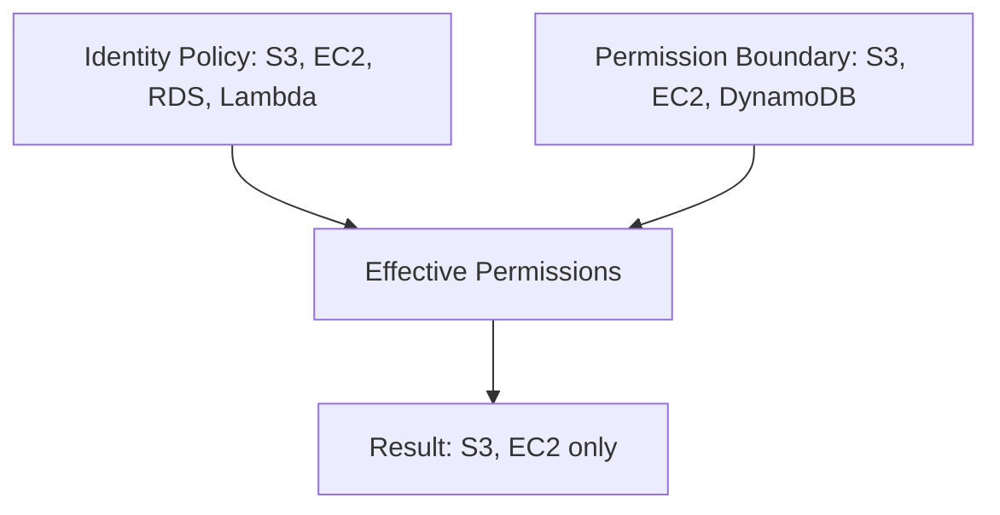
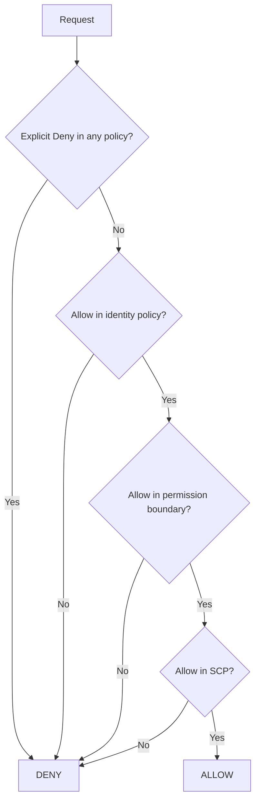

# How to Set Up IAM Permission Boundaries

Author: [nawazdhandala](https://github.com/nawazdhandala)

Tags: AWS, IAM, Security, Governance

Description: Learn how to use IAM permission boundaries to delegate IAM administration safely, limiting the maximum permissions that users and roles can have.

---

Permission boundaries solve a tricky problem in AWS: how do you let developers create their own IAM roles without giving them the ability to create roles more powerful than themselves? Without boundaries, a developer with `iam:CreateRole` permission can create a role with `AdministratorAccess` and escalate their own privileges.

Permission boundaries set a ceiling on what any role or user can do, regardless of what policies are attached to them. Let's go through how they work, how to set them up, and the practical patterns you'll use.

## How Permission Boundaries Work

A permission boundary is an IAM policy that you attach to a user or role as a "boundary." The effective permissions of that user or role become the intersection of their identity-based policies AND the permission boundary.



Even if a policy grants S3, EC2, RDS, and Lambda access, a permission boundary that only allows S3, EC2, and DynamoDB means the effective permissions are only S3 and EC2 (the overlap).

This is different from a regular deny. A permission boundary doesn't explicitly deny actions - it simply doesn't include them, so they're implicitly denied.

## Creating a Permission Boundary Policy

First, create the policy that will serve as the boundary:

```json
{
    "Version": "2012-10-17",
    "Statement": [
        {
            "Sid": "AllowedServices",
            "Effect": "Allow",
            "Action": [
                "s3:*",
                "dynamodb:*",
                "sqs:*",
                "sns:*",
                "lambda:*",
                "logs:*",
                "cloudwatch:*",
                "xray:*",
                "ec2:Describe*"
            ],
            "Resource": "*"
        },
        {
            "Sid": "AllowIAMForOwnRole",
            "Effect": "Allow",
            "Action": [
                "iam:GetRole",
                "iam:GetRolePolicy",
                "iam:ListRolePolicies",
                "iam:ListAttachedRolePolicies",
                "iam:PassRole"
            ],
            "Resource": "arn:aws:iam::*:role/app-*"
        },
        {
            "Sid": "DenyBoundaryModification",
            "Effect": "Deny",
            "Action": [
                "iam:DeleteRolePermissionsBoundary",
                "iam:DeleteUserPermissionsBoundary"
            ],
            "Resource": "*"
        }
    ]
}
```

Create it in IAM:

```bash
# Create the permission boundary policy
aws iam create-policy \
  --policy-name DeveloperBoundary \
  --policy-document file://boundary-policy.json \
  --description "Permission boundary for developer-created roles"
```

The `DenyBoundaryModification` statement is critical. Without it, a user could remove their own boundary and escalate privileges.

## Attaching the Boundary to a User

```bash
# Attach the permission boundary to an IAM user
aws iam put-user-permissions-boundary \
  --user-name alice \
  --permissions-boundary arn:aws:iam::123456789012:policy/DeveloperBoundary
```

Now, no matter what policies are attached to alice (or what policies she attaches to roles she creates), the effective permissions can never exceed what the DeveloperBoundary allows.

## Delegating Role Creation with Boundaries

The real power is in letting developers create their own IAM roles while requiring the boundary. Here's a policy that allows creating roles only if they have the boundary attached:

```json
{
    "Version": "2012-10-17",
    "Statement": [
        {
            "Sid": "AllowCreateRoleWithBoundary",
            "Effect": "Allow",
            "Action": "iam:CreateRole",
            "Resource": "arn:aws:iam::123456789012:role/app-*",
            "Condition": {
                "StringEquals": {
                    "iam:PermissionsBoundary": "arn:aws:iam::123456789012:policy/DeveloperBoundary"
                }
            }
        },
        {
            "Sid": "AllowAttachPoliciesWithBoundary",
            "Effect": "Allow",
            "Action": [
                "iam:AttachRolePolicy",
                "iam:DetachRolePolicy",
                "iam:PutRolePolicy",
                "iam:DeleteRolePolicy"
            ],
            "Resource": "arn:aws:iam::123456789012:role/app-*"
        },
        {
            "Sid": "AllowPassRole",
            "Effect": "Allow",
            "Action": "iam:PassRole",
            "Resource": "arn:aws:iam::123456789012:role/app-*",
            "Condition": {
                "StringEquals": {
                    "iam:PassedToService": [
                        "lambda.amazonaws.com",
                        "ec2.amazonaws.com"
                    ]
                }
            }
        },
        {
            "Sid": "DenyBoundaryRemoval",
            "Effect": "Deny",
            "Action": [
                "iam:DeleteRolePermissionsBoundary",
                "iam:PutRolePermissionsBoundary"
            ],
            "Resource": "arn:aws:iam::123456789012:role/app-*",
            "Condition": {
                "StringNotEquals": {
                    "iam:PermissionsBoundary": "arn:aws:iam::123456789012:policy/DeveloperBoundary"
                }
            }
        },
        {
            "Sid": "DenyBoundaryPolicyModification",
            "Effect": "Deny",
            "Action": [
                "iam:CreatePolicyVersion",
                "iam:DeletePolicy",
                "iam:SetDefaultPolicyVersion"
            ],
            "Resource": "arn:aws:iam::123456789012:policy/DeveloperBoundary"
        }
    ]
}
```

Let me break down the key parts:

- `AllowCreateRoleWithBoundary` - Developers can create roles, but ONLY if the DeveloperBoundary is attached. The role name must start with "app-".
- `AllowAttachPoliciesWithBoundary` - Developers can attach any policy to their app roles. The boundary limits what actually takes effect.
- `AllowPassRole` - Developers can pass their roles to Lambda and EC2 only.
- `DenyBoundaryRemoval` - Prevents removing or changing the boundary on existing roles.
- `DenyBoundaryPolicyModification` - Prevents modifying the boundary policy itself.

## How a Developer Uses This

With this setup, a developer can:

```bash
# Create a Lambda execution role with the required boundary
aws iam create-role \
  --role-name app-my-lambda-role \
  --assume-role-policy-document '{
    "Version": "2012-10-17",
    "Statement": [{
      "Effect": "Allow",
      "Principal": {"Service": "lambda.amazonaws.com"},
      "Action": "sts:AssumeRole"
    }]
  }' \
  --permissions-boundary arn:aws:iam::123456789012:policy/DeveloperBoundary

# Attach whatever policies they need
aws iam attach-role-policy \
  --role-name app-my-lambda-role \
  --policy-arn arn:aws:iam::aws:policy/AmazonS3FullAccess

# Even though S3FullAccess is attached, the boundary limits actual access
```

If they try to create a role without the boundary:

```bash
# This fails because the boundary is required
aws iam create-role \
  --role-name app-my-sneaky-role \
  --assume-role-policy-document '...'
# Error: Access Denied
```

If they try to create a role with AdministratorAccess:

```bash
# They can attach AdminAccess, but it's limited by the boundary
aws iam attach-role-policy \
  --role-name app-my-lambda-role \
  --policy-arn arn:aws:iam::aws:policy/AdministratorAccess
# Succeeds, but the role can still only use services in the boundary
```

## Terraform Implementation

```hcl
# Create the permission boundary policy
resource "aws_iam_policy" "developer_boundary" {
  name = "DeveloperBoundary"

  policy = jsonencode({
    Version = "2012-10-17"
    Statement = [
      {
        Sid    = "AllowedServices"
        Effect = "Allow"
        Action = [
          "s3:*",
          "dynamodb:*",
          "sqs:*",
          "sns:*",
          "lambda:*",
          "logs:*",
          "cloudwatch:*"
        ]
        Resource = "*"
      },
      {
        Sid    = "DenyBoundaryModification"
        Effect = "Deny"
        Action = [
          "iam:DeleteRolePermissionsBoundary",
          "iam:DeleteUserPermissionsBoundary"
        ]
        Resource = "*"
      }
    ]
  })
}

# Attach boundary to an IAM user
resource "aws_iam_user" "developer" {
  name                 = "alice"
  permissions_boundary = aws_iam_policy.developer_boundary.arn
}

# Policy allowing the user to create bounded roles
resource "aws_iam_policy" "allow_create_bounded_roles" {
  name = "AllowCreateBoundedRoles"

  policy = jsonencode({
    Version = "2012-10-17"
    Statement = [
      {
        Sid      = "AllowCreateRoleWithBoundary"
        Effect   = "Allow"
        Action   = "iam:CreateRole"
        Resource = "arn:aws:iam::*:role/app-*"
        Condition = {
          StringEquals = {
            "iam:PermissionsBoundary" = aws_iam_policy.developer_boundary.arn
          }
        }
      },
      {
        Sid    = "AllowManageRolePolicies"
        Effect = "Allow"
        Action = [
          "iam:AttachRolePolicy",
          "iam:DetachRolePolicy",
          "iam:PutRolePolicy",
          "iam:DeleteRolePolicy"
        ]
        Resource = "arn:aws:iam::*:role/app-*"
      }
    ]
  })
}
```

## The Evaluation Logic

When AWS evaluates permissions for a principal with a permission boundary, it follows this logic:



The permission boundary acts as another gate. The request must be allowed by ALL of: identity policies, permission boundary, and SCPs (if using Organizations).

## Common Mistakes

**Forgetting to prevent boundary removal.** Always include a deny statement that prevents removing or changing the boundary. Otherwise, the user can just remove their boundary and do whatever they want.

**Not restricting the boundary policy itself.** If users can modify the boundary policy (create new versions), they can expand their own permissions. Deny `iam:CreatePolicyVersion` on the boundary policy ARN.

**Overly restrictive boundaries.** If the boundary is too tight, developers spend more time requesting permission changes than building features. Include common services like CloudWatch Logs, X-Ray, and CloudWatch in the boundary.

## Wrapping Up

Permission boundaries are the key to safe IAM delegation. They let you give teams autonomy to create and manage their own roles while guaranteeing they can't exceed the permissions you've defined. The pattern is: create a boundary, require it on all new roles, prevent its removal or modification, and restrict role names to a namespace. This gives you security guardrails without bottlenecking every IAM change through a central team. For organization-wide guardrails that complement boundaries, check out our guide on [using Service Control Policies in AWS Organizations](https://oneuptime.com/blog/post/2026-02-12-use-service-control-policies-scps-in-aws-organizations/view).
