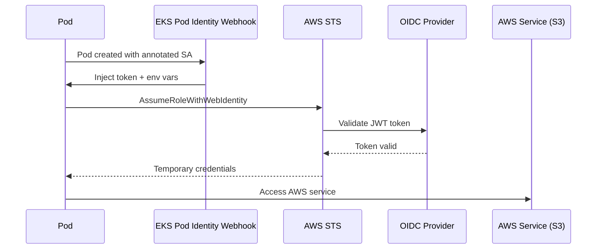

# How to Set Up IAM Roles for EKS Service Accounts (IRSA)

Author: [nawazdhandala](https://github.com/nawazdhandala)

Tags: AWS, EKS, IAM, Kubernetes, Security

Description: Complete guide to configuring IAM Roles for Service Accounts (IRSA) on Amazon EKS for secure, fine-grained AWS permissions for your Kubernetes pods.

---

In the early days of EKS, if your pods needed to access AWS services like S3 or DynamoDB, you'd attach IAM policies to the node's instance profile. That meant every pod on that node got the same permissions - a security nightmare. IAM Roles for Service Accounts (IRSA) fixes this by letting you assign specific IAM roles to individual Kubernetes service accounts. Each pod gets exactly the permissions it needs, nothing more.

This guide covers setting up IRSA from scratch, including the OIDC provider configuration, role creation, and troubleshooting.

## How IRSA Works

The mechanism behind IRSA is clever. When a pod with an annotated service account starts, the EKS Pod Identity webhook injects AWS credentials as environment variables and mounts a projected service account token. This token is a JWT that AWS STS can validate through the cluster's OIDC provider.



## Prerequisites

You'll need:

- An EKS cluster (see our [cluster creation guide](https://oneuptime.com/blog/post/create-eks-cluster-with-eksctl/view))
- AWS CLI v2 and kubectl configured
- eksctl installed (makes IRSA setup much simpler)

## Step 1: Create an OIDC Provider

Every EKS cluster has an OIDC issuer URL, but you need to create an IAM OIDC identity provider that links it to your AWS account.

Check if one already exists:

```bash
# Check if OIDC provider exists for your cluster
aws eks describe-cluster --name my-cluster --query "cluster.identity.oidc.issuer" --output text
```

This returns something like `https://oidc.eks.us-west-2.amazonaws.com/id/ABCDEF1234567890`. Now check if the provider is already created:

```bash
# List existing OIDC providers and look for your cluster's ID
aws iam list-open-id-connect-providers | grep ABCDEF1234567890
```

If it's not there, create it:

```bash
# Create the OIDC provider using eksctl
eksctl utils associate-iam-oidc-provider --cluster my-cluster --approve
```

Or create it manually with the AWS CLI:

```bash
# Get the OIDC issuer URL
OIDC_URL=$(aws eks describe-cluster --name my-cluster --query "cluster.identity.oidc.issuer" --output text)

# Get the thumbprint
THUMBPRINT=$(openssl s_client -connect oidc.eks.us-west-2.amazonaws.com:443 -servername oidc.eks.us-west-2.amazonaws.com 2>/dev/null | openssl x509 -fingerprint -noout | sed 's/://g' | cut -d= -f2)

# Create the OIDC provider
aws iam create-open-id-connect-provider \
  --url "${OIDC_URL}" \
  --client-id-list sts.amazonaws.com \
  --thumbprint-list "${THUMBPRINT}"
```

## Step 2: Create an IAM Role

Now create an IAM role with a trust policy that allows your specific service account to assume it. The trust policy is where the magic happens - it restricts which service accounts in which namespaces can use this role.

```bash
# Get your OIDC provider ID
OIDC_PROVIDER=$(aws eks describe-cluster --name my-cluster --query "cluster.identity.oidc.issuer" --output text | sed 's|https://||')
AWS_ACCOUNT_ID=$(aws sts get-caller-identity --query Account --output text)
```

Create the trust policy:

```json
{
  "Version": "2012-10-17",
  "Statement": [
    {
      "Effect": "Allow",
      "Principal": {
        "Federated": "arn:aws:iam::ACCOUNT_ID:oidc-provider/OIDC_PROVIDER"
      },
      "Action": "sts:AssumeRoleWithWebIdentity",
      "Condition": {
        "StringEquals": {
          "OIDC_PROVIDER:sub": "system:serviceaccount:NAMESPACE:SERVICE_ACCOUNT_NAME",
          "OIDC_PROVIDER:aud": "sts.amazonaws.com"
        }
      }
    }
  ]
}
```

Replace the placeholders with your actual values, then create the role:

```bash
# Create the IAM role with the trust policy
aws iam create-role \
  --role-name my-app-s3-role \
  --assume-role-policy-document file://trust-policy.json

# Attach the permissions policy
aws iam attach-role-policy \
  --role-name my-app-s3-role \
  --policy-arn arn:aws:iam::aws:policy/AmazonS3ReadOnlyAccess
```

## The Easy Way with eksctl

If that felt like a lot of steps, eksctl can do it all in one command:

```bash
# Create IRSA role and service account in one step
eksctl create iamserviceaccount \
  --cluster my-cluster \
  --namespace default \
  --name my-app-sa \
  --attach-policy-arn arn:aws:iam::aws:policy/AmazonS3ReadOnlyAccess \
  --approve
```

This creates the IAM role, sets up the trust policy, creates the Kubernetes service account, and annotates it - all automatically.

## Step 3: Create or Annotate the Service Account

If you created the role manually, you need to create a Kubernetes service account with the right annotation:

```yaml
# service-account.yaml - SA annotated with IAM role
apiVersion: v1
kind: ServiceAccount
metadata:
  name: my-app-sa
  namespace: default
  annotations:
    eks.amazonaws.com/role-arn: arn:aws:iam::123456789012:role/my-app-s3-role
```

```bash
# Apply the service account
kubectl apply -f service-account.yaml
```

If the service account already exists, annotate it:

```bash
# Add the IAM role annotation to an existing service account
kubectl annotate serviceaccount my-app-sa \
  -n default \
  eks.amazonaws.com/role-arn=arn:aws:iam::123456789012:role/my-app-s3-role
```

## Step 4: Use the Service Account in Your Pods

Reference the service account in your pod or deployment spec:

```yaml
# deployment.yaml - Using the IRSA-enabled service account
apiVersion: apps/v1
kind: Deployment
metadata:
  name: my-app
  namespace: default
spec:
  replicas: 2
  selector:
    matchLabels:
      app: my-app
  template:
    metadata:
      labels:
        app: my-app
    spec:
      serviceAccountName: my-app-sa
      containers:
        - name: my-app
          image: my-app:latest
          env:
            - name: AWS_DEFAULT_REGION
              value: "us-west-2"
```

When this pod starts, the webhook automatically injects:
- `AWS_ROLE_ARN` environment variable
- `AWS_WEB_IDENTITY_TOKEN_FILE` environment variable (points to `/var/run/secrets/eks.amazonaws.com/serviceaccount/token`)
- A projected volume mount with the service account token

## Step 5: Verify It Works

Deploy a test pod and verify that IRSA is working:

```bash
# Run a test pod with the service account
kubectl run aws-test --image=amazon/aws-cli \
  --overrides='{"spec":{"serviceAccountName":"my-app-sa"}}' \
  --rm -it -- sts get-caller-identity
```

You should see output showing the assumed role ARN, not the node's instance profile.

You can also check that the environment variables are injected:

```bash
# Verify environment variables are set in a running pod
kubectl exec -it my-app-pod -- env | grep AWS
```

## Scoping Permissions Tightly

One of IRSA's biggest advantages is granular permissions. Don't give your pod `AmazonS3FullAccess` when it only needs to read from one bucket. Create custom policies:

```json
{
  "Version": "2012-10-17",
  "Statement": [
    {
      "Effect": "Allow",
      "Action": [
        "s3:GetObject",
        "s3:ListBucket"
      ],
      "Resource": [
        "arn:aws:s3:::my-specific-bucket",
        "arn:aws:s3:::my-specific-bucket/*"
      ]
    }
  ]
}
```

## Troubleshooting

**Pod doesn't get credentials** - Check that the service account annotation is correct and the pod spec references the service account. Also verify the OIDC provider exists.

**AccessDenied on AssumeRoleWithWebIdentity** - The trust policy is likely wrong. Double-check the namespace and service account name in the condition. They must match exactly.

**Credentials work in one namespace but not another** - The trust policy is namespace-scoped. If you need the same role in multiple namespaces, use a wildcard condition or create separate trust relationships.

```json
{
  "StringLike": {
    "OIDC_PROVIDER:sub": "system:serviceaccount:*:my-app-sa"
  }
}
```

IRSA is a fundamental security practice for EKS. Every pod that accesses AWS services should use IRSA rather than node-level permissions. It's a bit more setup upfront, but it gives you the kind of least-privilege access control that makes security auditors happy.
