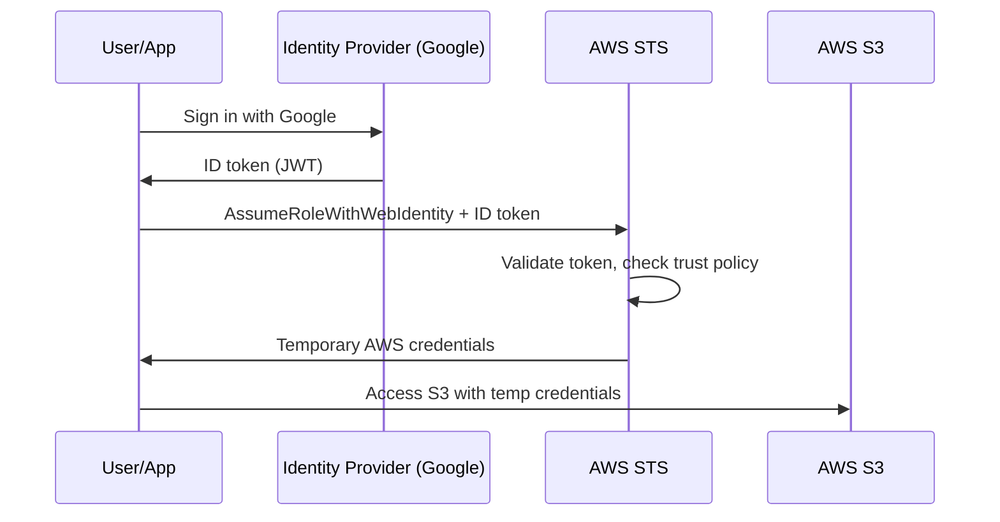

# How to Set Up IAM Roles for Web Identity Federation

Author: [nawazdhandala](https://github.com/nawazdhandala)

Tags: AWS, IAM, OIDC, Security, Cognito

Description: Learn how to configure web identity federation in AWS so users authenticated by external providers like Google, Facebook, or Cognito can access AWS resources securely.

---

Web identity federation lets users who've authenticated with an external identity provider - Google, Facebook, Amazon, or any OpenID Connect (OIDC) provider - access AWS resources through temporary credentials. This is how mobile apps and single-page applications get access to AWS services like S3 or DynamoDB without embedding long-term credentials in client code.

Let's go through the setup, from configuring the identity provider to writing policies that scope access appropriately.

## How Web Identity Federation Works

The flow starts in your application. The user signs in with their identity provider (say, Google). Your app gets an identity token. That token is exchanged with AWS STS for temporary AWS credentials.



## Option 1: Using Amazon Cognito (Recommended)

Amazon Cognito simplifies web identity federation by acting as a broker between identity providers and AWS. Instead of configuring each IdP directly with IAM, you configure them in Cognito and point your IAM role at Cognito.

### Setting Up a Cognito Identity Pool

```bash
# Create a Cognito Identity Pool
aws cognito-identity create-identity-pool \
  --identity-pool-name MyAppUsers \
  --allow-unauthenticated-identities false \
  --supported-login-providers \
    "accounts.google.com=YOUR_GOOGLE_CLIENT_ID" \
    "graph.facebook.com=YOUR_FACEBOOK_APP_ID"
```

### Creating the IAM Role for Cognito

```json
{
    "Version": "2012-10-17",
    "Statement": [
        {
            "Effect": "Allow",
            "Principal": {
                "Federated": "cognito-identity.amazonaws.com"
            },
            "Action": "sts:AssumeRoleWithWebIdentity",
            "Condition": {
                "StringEquals": {
                    "cognito-identity.amazonaws.com:aud": "us-east-1:a1b2c3d4-e5f6-7890-abcd-example"
                },
                "ForAnyValue:StringLike": {
                    "cognito-identity.amazonaws.com:amr": "authenticated"
                }
            }
        }
    ]
}
```

The `aud` condition matches your identity pool ID. The `amr` condition ensures only authenticated (not unauthenticated) users can assume the role.

Create the role and attach permissions:

```bash
# Create the authenticated user role
aws iam create-role \
  --role-name CognitoAuthenticatedRole \
  --assume-role-policy-document file://cognito-trust-policy.json

# Attach a policy giving users access to their own data
aws iam put-role-policy \
  --role-name CognitoAuthenticatedRole \
  --policy-name UserDataAccess \
  --policy-document '{
    "Version": "2012-10-17",
    "Statement": [
        {
            "Sid": "AllowUserOwnData",
            "Effect": "Allow",
            "Action": [
                "s3:GetObject",
                "s3:PutObject"
            ],
            "Resource": "arn:aws:s3:::my-app-user-data/${cognito-identity.amazonaws.com:sub}/*"
        },
        {
            "Sid": "AllowUserDynamoDB",
            "Effect": "Allow",
            "Action": [
                "dynamodb:GetItem",
                "dynamodb:PutItem",
                "dynamodb:UpdateItem",
                "dynamodb:Query"
            ],
            "Resource": "arn:aws:dynamodb:us-east-1:123456789012:table/UserData",
            "Condition": {
                "ForAllValues:StringEquals": {
                    "dynamodb:LeadingKeys": ["${cognito-identity.amazonaws.com:sub}"]
                }
            }
        }
    ]
  }'
```

Notice the `${cognito-identity.amazonaws.com:sub}` variable. This resolves to the Cognito identity ID of the authenticated user. Each user can only access their own data in S3 and DynamoDB.

### Set the Role on the Identity Pool

```bash
# Associate the role with the identity pool
aws cognito-identity set-identity-pool-roles \
  --identity-pool-id us-east-1:a1b2c3d4-e5f6-7890-abcd-example \
  --roles authenticated=arn:aws:iam::123456789012:role/CognitoAuthenticatedRole
```

### Using It in Your Application

Here's how a JavaScript application uses Cognito for federation:

```javascript
// Initialize the Cognito credentials provider
import { CognitoIdentityClient } from "@aws-sdk/client-cognito-identity";
import { fromCognitoIdentityPool } from "@aws-sdk/credential-provider-cognito-identity";
import { S3Client, GetObjectCommand } from "@aws-sdk/client-s3";

// After user signs in with Google and you have the token
const s3Client = new S3Client({
  region: "us-east-1",
  credentials: fromCognitoIdentityPool({
    client: new CognitoIdentityClient({ region: "us-east-1" }),
    identityPoolId: "us-east-1:a1b2c3d4-e5f6-7890-abcd-example",
    logins: {
      "accounts.google.com": googleIdToken,
    },
  }),
});

// Now you can access AWS resources
const response = await s3Client.send(
  new GetObjectCommand({
    Bucket: "my-app-user-data",
    Key: `${cognitoIdentityId}/profile.json`,
  })
);
```

The SDK handles credential exchange and refresh automatically.

## Option 2: Direct Web Identity Federation

If you don't want to use Cognito, you can federate directly with OIDC providers.

### Create an OIDC Provider in IAM

```bash
# Register Google as an OIDC provider
aws iam create-open-id-connect-provider \
  --url https://accounts.google.com \
  --client-id-list YOUR_GOOGLE_CLIENT_ID \
  --thumbprint-list "your-provider-thumbprint"
```

### Create the Trust Policy

```json
{
    "Version": "2012-10-17",
    "Statement": [
        {
            "Effect": "Allow",
            "Principal": {
                "Federated": "arn:aws:iam::123456789012:oidc-provider/accounts.google.com"
            },
            "Action": "sts:AssumeRoleWithWebIdentity",
            "Condition": {
                "StringEquals": {
                    "accounts.google.com:aud": "YOUR_GOOGLE_CLIENT_ID"
                }
            }
        }
    ]
}
```

### Assume the Role from Your App

```javascript
// Direct web identity federation without Cognito
import { STSClient, AssumeRoleWithWebIdentityCommand } from "@aws-sdk/client-sts";

const stsClient = new STSClient({ region: "us-east-1" });

// Exchange the Google ID token for AWS credentials
const response = await stsClient.send(
  new AssumeRoleWithWebIdentityCommand({
    RoleArn: "arn:aws:iam::123456789012:role/GoogleFederatedRole",
    RoleSessionName: "web-app-session",
    WebIdentityToken: googleIdToken,
    DurationSeconds: 3600,
  })
);

// Use the temporary credentials
const credentials = response.Credentials;
```

## OIDC Federation for CI/CD (GitHub Actions)

A increasingly popular use case is using OIDC to let GitHub Actions deploy to AWS without storing access keys:

```json
{
    "Version": "2012-10-17",
    "Statement": [
        {
            "Effect": "Allow",
            "Principal": {
                "Federated": "arn:aws:iam::123456789012:oidc-provider/token.actions.githubusercontent.com"
            },
            "Action": "sts:AssumeRoleWithWebIdentity",
            "Condition": {
                "StringEquals": {
                    "token.actions.githubusercontent.com:aud": "sts.amazonaws.com"
                },
                "StringLike": {
                    "token.actions.githubusercontent.com:sub": "repo:my-org/my-repo:ref:refs/heads/main"
                }
            }
        }
    ]
}
```

The `sub` condition restricts which repository and branch can assume the role. Only pushes to main on the specific repo get access.

In your GitHub Actions workflow:

```yaml
# GitHub Actions workflow using OIDC federation
permissions:
  id-token: write
  contents: read

jobs:
  deploy:
    runs-on: ubuntu-latest
    steps:
      - uses: aws-actions/configure-aws-credentials@v4
        with:
          role-to-assume: arn:aws:iam::123456789012:role/GitHubActionsRole
          aws-region: us-east-1

      - run: aws s3 cp build/ s3://my-app-bucket/ --recursive
```

No access keys stored in GitHub secrets. The OIDC token is generated fresh for each workflow run.

## Terraform Configuration

```hcl
# Set up OIDC provider for GitHub Actions
resource "aws_iam_openid_connect_provider" "github" {
  url             = "https://token.actions.githubusercontent.com"
  client_id_list  = ["sts.amazonaws.com"]
  thumbprint_list = ["6938fd4d98bab03faadb97b34396831e3780aea1"]
}

# Create the role for GitHub Actions
resource "aws_iam_role" "github_actions" {
  name = "GitHubActionsDeployRole"

  assume_role_policy = jsonencode({
    Version = "2012-10-17"
    Statement = [
      {
        Effect = "Allow"
        Principal = {
          Federated = aws_iam_openid_connect_provider.github.arn
        }
        Action = "sts:AssumeRoleWithWebIdentity"
        Condition = {
          StringEquals = {
            "token.actions.githubusercontent.com:aud" = "sts.amazonaws.com"
          }
          StringLike = {
            "token.actions.githubusercontent.com:sub" = "repo:my-org/my-repo:*"
          }
        }
      }
    ]
  })
}
```

## Wrapping Up

Web identity federation eliminates embedded credentials in client applications. Use Cognito when you need to support multiple identity providers or need user management features. Use direct OIDC federation for simpler cases like CI/CD pipelines. Always scope the trust policy with conditions on audience and subject to prevent misuse, and use policy variables to isolate each user's data. For SAML-based enterprise federation, check our guide on [using IAM roles with external identity providers](https://oneuptime.com/blog/post/2026-02-12-use-iam-roles-with-external-identity-providers-saml/view).
