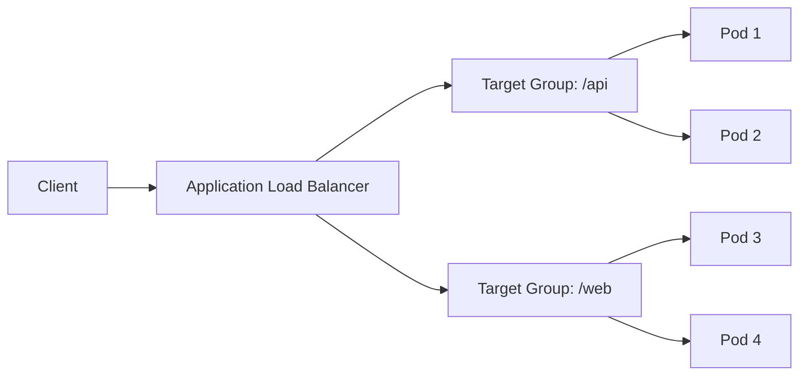

# How to Set Up Ingress with ALB on EKS

Author: [nawazdhandala](https://github.com/nawazdhandala)

Tags: AWS, EKS, Kubernetes, ALB, Networking

Description: Learn how to configure the AWS Load Balancer Controller and set up Application Load Balancer ingress for your EKS applications.

---

Exposing your Kubernetes services to the internet on EKS typically means using an Application Load Balancer (ALB). The AWS Load Balancer Controller watches for Ingress resources and automatically provisions and configures ALBs to route traffic to your services. It's the standard way to handle HTTP/HTTPS traffic in EKS, and it integrates neatly with other AWS services like ACM for SSL certificates and WAF for security.

This guide walks through installing the controller, creating Ingress resources, and configuring common patterns like path-based routing and SSL termination.

## How It Works

The AWS Load Balancer Controller runs as a Kubernetes deployment in your cluster. When you create an Ingress resource with the right annotations, the controller provisions an ALB, configures target groups, sets up listeners, and registers your pod IPs as targets. It supports two traffic modes:

- **Instance mode** - routes traffic to NodePort services (traditional approach)
- **IP mode** - routes traffic directly to pod IPs using VPC networking (recommended, lower latency)



## Prerequisites

You'll need:

- An EKS cluster with the VPC CNI plugin (default)
- kubectl and Helm installed
- Subnets tagged for ALB discovery
- An OIDC provider configured for IRSA (see our [IRSA guide](https://oneuptime.com/blog/post/set-up-iam-roles-for-eks-service-accounts-irsa/view))

## Step 1: Tag Your Subnets

The Load Balancer Controller needs to know which subnets to use. Tag your public subnets for internet-facing ALBs and private subnets for internal ALBs.

```bash
# Tag public subnets for internet-facing ALBs
aws ec2 create-tags --resources subnet-0abc123 subnet-0def456 \
  --tags Key=kubernetes.io/role/elb,Value=1

# Tag private subnets for internal ALBs
aws ec2 create-tags --resources subnet-0ghi789 subnet-0jkl012 \
  --tags Key=kubernetes.io/role/internal-elb,Value=1
```

## Step 2: Create the IAM Policy and Role

Download the IAM policy for the controller:

```bash
# Download the IAM policy document for the AWS Load Balancer Controller
curl -o iam-policy.json https://raw.githubusercontent.com/kubernetes-sigs/aws-load-balancer-controller/v2.7.1/docs/install/iam_policy.json

# Create the IAM policy
aws iam create-policy \
  --policy-name AWSLoadBalancerControllerIAMPolicy \
  --policy-document file://iam-policy.json
```

Create the service account with IRSA:

```bash
# Create the IRSA service account for the load balancer controller
eksctl create iamserviceaccount \
  --cluster=my-cluster \
  --namespace=kube-system \
  --name=aws-load-balancer-controller \
  --attach-policy-arn=arn:aws:iam::123456789012:policy/AWSLoadBalancerControllerIAMPolicy \
  --approve
```

## Step 3: Install the Controller with Helm

Add the EKS Helm repository and install:

```bash
# Add the EKS charts repository
helm repo add eks https://aws.github.io/eks-charts
helm repo update

# Install the AWS Load Balancer Controller
helm install aws-load-balancer-controller eks/aws-load-balancer-controller \
  -n kube-system \
  --set clusterName=my-cluster \
  --set serviceAccount.create=false \
  --set serviceAccount.name=aws-load-balancer-controller
```

Verify the controller is running:

```bash
# Check the controller pods are healthy
kubectl get deployment -n kube-system aws-load-balancer-controller
kubectl get pods -n kube-system -l app.kubernetes.io/name=aws-load-balancer-controller
```

## Step 4: Create a Basic Ingress

Now let's create an Ingress that provisions an ALB. First, deploy a sample application:

```yaml
# sample-app.yaml - A simple web application
apiVersion: apps/v1
kind: Deployment
metadata:
  name: sample-app
  namespace: default
spec:
  replicas: 3
  selector:
    matchLabels:
      app: sample-app
  template:
    metadata:
      labels:
        app: sample-app
    spec:
      containers:
        - name: nginx
          image: nginx:1.25
          ports:
            - containerPort: 80
---
apiVersion: v1
kind: Service
metadata:
  name: sample-app
  namespace: default
spec:
  type: ClusterIP
  selector:
    app: sample-app
  ports:
    - port: 80
      targetPort: 80
```

Create the Ingress resource:

```yaml
# ingress.yaml - ALB Ingress configuration
apiVersion: networking.k8s.io/v1
kind: Ingress
metadata:
  name: sample-ingress
  namespace: default
  annotations:
    kubernetes.io/ingress.class: alb
    alb.ingress.kubernetes.io/scheme: internet-facing
    alb.ingress.kubernetes.io/target-type: ip
    alb.ingress.kubernetes.io/listen-ports: '[{"HTTP": 80}]'
spec:
  rules:
    - http:
        paths:
          - path: /
            pathType: Prefix
            backend:
              service:
                name: sample-app
                port:
                  number: 80
```

Apply both:

```bash
# Deploy the sample app and its ingress
kubectl apply -f sample-app.yaml
kubectl apply -f ingress.yaml

# Wait for the ALB to be provisioned and get the DNS name
kubectl get ingress sample-ingress -w
```

It takes a couple of minutes for the ALB to become active. Once the ADDRESS field is populated, you can access your application through that URL.

## Setting Up SSL/TLS

For production, you'll want HTTPS. Request or import a certificate in AWS Certificate Manager (ACM), then reference it in your Ingress:

```yaml
# ingress-ssl.yaml - ALB with SSL termination
apiVersion: networking.k8s.io/v1
kind: Ingress
metadata:
  name: sample-ingress
  namespace: default
  annotations:
    kubernetes.io/ingress.class: alb
    alb.ingress.kubernetes.io/scheme: internet-facing
    alb.ingress.kubernetes.io/target-type: ip
    alb.ingress.kubernetes.io/listen-ports: '[{"HTTPS": 443}]'
    alb.ingress.kubernetes.io/certificate-arn: arn:aws:acm:us-west-2:123456789012:certificate/abc-123
    alb.ingress.kubernetes.io/ssl-redirect: "443"
spec:
  rules:
    - host: app.example.com
      http:
        paths:
          - path: /
            pathType: Prefix
            backend:
              service:
                name: sample-app
                port:
                  number: 80
```

For automatic certificate management, look at our guide on [cert-manager with ACM on EKS](https://oneuptime.com/blog/post/set-up-cert-manager-on-eks-with-acm/view).

## Path-Based Routing

ALBs excel at routing different URL paths to different services:

```yaml
# multi-path-ingress.yaml - Route traffic based on URL path
apiVersion: networking.k8s.io/v1
kind: Ingress
metadata:
  name: multi-service-ingress
  annotations:
    kubernetes.io/ingress.class: alb
    alb.ingress.kubernetes.io/scheme: internet-facing
    alb.ingress.kubernetes.io/target-type: ip
spec:
  rules:
    - host: app.example.com
      http:
        paths:
          - path: /api
            pathType: Prefix
            backend:
              service:
                name: api-service
                port:
                  number: 8080
          - path: /
            pathType: Prefix
            backend:
              service:
                name: web-frontend
                port:
                  number: 80
```

## Health Checks

Customize ALB health checks through annotations:

```yaml
# Health check configuration annotations
annotations:
  alb.ingress.kubernetes.io/healthcheck-path: /healthz
  alb.ingress.kubernetes.io/healthcheck-interval-seconds: "15"
  alb.ingress.kubernetes.io/healthcheck-timeout-seconds: "5"
  alb.ingress.kubernetes.io/healthy-threshold-count: "2"
  alb.ingress.kubernetes.io/unhealthy-threshold-count: "3"
```

## WAF Integration

You can attach an AWS WAF WebACL to your ALB for additional security:

```yaml
# Attach WAF to ALB
annotations:
  alb.ingress.kubernetes.io/waf-acl-id: "web-acl-id-here"
```

## Troubleshooting

If your ALB isn't being created, check the controller logs:

```bash
# Check controller logs for errors
kubectl logs -n kube-system -l app.kubernetes.io/name=aws-load-balancer-controller --tail=100
```

Common issues include missing subnet tags, incorrect IAM permissions, and using the wrong ingress class annotation. The logs are generally quite descriptive about what went wrong.

If the ALB is created but targets show unhealthy, verify your pods are running and the health check path returns a 200 response. Also make sure the security groups allow traffic from the ALB to your pods.

The ALB Ingress Controller handles most of the heavy lifting for getting traffic into your EKS cluster. Combined with [External DNS](https://oneuptime.com/blog/post/set-up-external-dns-on-eks-with-route-53/view) for automatic DNS management, it creates a fully automated path from domain name to pod.
