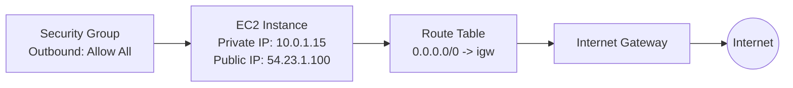

# How to Set Up an Internet Gateway for Public Subnet Access

Author: [nawazdhandala](https://github.com/nawazdhandala)

Tags: AWS, VPC, Networking

Description: Step-by-step guide to creating and configuring an internet gateway in AWS to provide public subnet resources with direct internet access.

---

An internet gateway is the bridge between your VPC and the public internet. Without one, nothing in your VPC can reach the internet and nothing from the internet can reach your VPC. It's one of the simplest AWS resources, but it's also one of the most misunderstood. People create it, attach it, and still wonder why their EC2 instance can't get online.

The internet gateway itself is just one piece. You also need a route table pointing to it, a public IP on your resource, and security group rules allowing the traffic. Miss any one of those, and it won't work.

## What an Internet Gateway Does

The internet gateway performs two functions:

1. **NAT for public IPs**: When an instance with a public IP sends traffic to the internet, the IGW translates the private IP to the public IP (and vice versa for return traffic).

2. **Route target**: Route tables reference the IGW as the target for internet-bound traffic. The `0.0.0.0/0` route pointing to the IGW is what makes a subnet "public."

An IGW is horizontally scaled, redundant, and highly available by default. You don't need to worry about bandwidth limits or single points of failure. AWS handles all of that.

## Creating an Internet Gateway

The process has three steps: create the gateway, attach it to your VPC, and create a route.

```bash
# Step 1: Create the internet gateway
IGW_ID=$(aws ec2 create-internet-gateway \
  --tag-specifications 'ResourceType=internet-gateway,Tags=[{Key=Name,Value=production-igw}]' \
  --query 'InternetGateway.InternetGatewayId' \
  --output text)

echo "Created IGW: $IGW_ID"
```

```bash
# Step 2: Attach it to your VPC
aws ec2 attach-internet-gateway \
  --internet-gateway-id $IGW_ID \
  --vpc-id $VPC_ID

echo "Attached $IGW_ID to $VPC_ID"
```

A VPC can only have one internet gateway, and an internet gateway can only be attached to one VPC. It's a one-to-one relationship.

```bash
# Step 3: Add a route to the public route table
aws ec2 create-route \
  --route-table-id $PUBLIC_RT_ID \
  --destination-cidr-block 0.0.0.0/0 \
  --gateway-id $IGW_ID
```

That `0.0.0.0/0` route means "all traffic not destined for the VPC's own CIDR should go to the internet gateway." This is what turns a regular subnet into a public subnet.

## The Complete Picture

Creating the IGW alone isn't enough. Here's everything that needs to be in place for an instance to reach the internet:



1. The instance must be in a subnet associated with a route table that has a `0.0.0.0/0 -> igw` route
2. The instance must have a public IPv4 address (or an Elastic IP)
3. The security group must allow outbound traffic
4. The network ACL must allow both inbound and outbound traffic

Let's make sure all of these are configured.

## Ensuring Public IPs

Instances in public subnets need public IP addresses. You can enable auto-assign at the subnet level:

```bash
# Enable auto-assign public IP for the subnet
aws ec2 modify-subnet-attribute \
  --subnet-id $PUBLIC_SUBNET_ID \
  --map-public-ip-on-launch
```

Or assign an Elastic IP to a specific instance:

```bash
# Allocate an Elastic IP
EIP_ALLOC=$(aws ec2 allocate-address \
  --domain vpc \
  --query 'AllocationId' \
  --output text)

# Associate it with an instance
aws ec2 associate-address \
  --allocation-id $EIP_ALLOC \
  --instance-id $INSTANCE_ID
```

Elastic IPs persist through instance stops and starts, while auto-assigned public IPs change every time you stop and start an instance.

## CloudFormation Template

Here's a CloudFormation snippet for the complete IGW setup:

```yaml
Resources:
  # Create the internet gateway
  InternetGateway:
    Type: AWS::EC2::InternetGateway
    Properties:
      Tags:
        - Key: Name
          Value: production-igw

  # Attach it to the VPC
  GatewayAttachment:
    Type: AWS::EC2::VPCGatewayAttachment
    Properties:
      VpcId: !Ref VPC
      InternetGatewayId: !Ref InternetGateway

  # Create a public route table
  PublicRouteTable:
    Type: AWS::EC2::RouteTable
    Properties:
      VpcId: !Ref VPC
      Tags:
        - Key: Name
          Value: public-rt

  # Add the default route to the internet gateway
  PublicRoute:
    Type: AWS::EC2::Route
    # Must wait for the gateway to be attached
    DependsOn: GatewayAttachment
    Properties:
      RouteTableId: !Ref PublicRouteTable
      DestinationCidrBlock: 0.0.0.0/0
      GatewayId: !Ref InternetGateway

  # Associate public subnets
  PublicSubnet1RouteAssociation:
    Type: AWS::EC2::SubnetRouteTableAssociation
    Properties:
      SubnetId: !Ref PublicSubnet1
      RouteTableId: !Ref PublicRouteTable

  # Public subnet with auto-assign public IP
  PublicSubnet1:
    Type: AWS::EC2::Subnet
    Properties:
      VpcId: !Ref VPC
      CidrBlock: 10.0.1.0/24
      AvailabilityZone: !Select [0, !GetAZs '']
      MapPublicIpOnLaunch: true
      Tags:
        - Key: Name
          Value: public-subnet-1
```

The `DependsOn: GatewayAttachment` is critical. Without it, CloudFormation might try to create the route before the gateway is attached, causing a deployment failure.

## Terraform Alternative

If you're a Terraform shop, here's the equivalent:

```hcl
# Create the internet gateway
resource "aws_internet_gateway" "main" {
  vpc_id = aws_vpc.main.id

  tags = {
    Name = "production-igw"
  }
}

# Add route to the public route table
resource "aws_route" "public_internet" {
  route_table_id         = aws_route_table.public.id
  destination_cidr_block = "0.0.0.0/0"
  gateway_id             = aws_internet_gateway.main.id
}

# Associate public subnets with the public route table
resource "aws_route_table_association" "public_1" {
  subnet_id      = aws_subnet.public_1.id
  route_table_id = aws_route_table.public.id
}
```

## Security Considerations

Having an internet gateway doesn't mean everything in your VPC is exposed. Only resources that meet ALL of these conditions are reachable from the internet:

1. In a subnet with an IGW route
2. Have a public IP
3. Have security group rules allowing inbound traffic
4. Have NACL rules allowing inbound traffic

Keep your security groups tight. Don't open `0.0.0.0/0` on port 22 unless you want bots hammering your SSH server within minutes. Use specific IP ranges or, better yet, use Systems Manager Session Manager and skip SSH entirely.

## IPv6 Support

If you're using IPv6, the internet gateway handles it natively. You don't need a separate gateway:

```bash
# Associate an IPv6 CIDR block with your VPC
aws ec2 associate-vpc-cidr-block \
  --vpc-id $VPC_ID \
  --amazon-provided-ipv6-cidr-block

# Add an IPv6 route to the internet gateway
aws ec2 create-route \
  --route-table-id $PUBLIC_RT_ID \
  --destination-ipv6-cidr-block ::/0 \
  --gateway-id $IGW_ID
```

For private subnets that need IPv6 outbound access without being publicly reachable, use an egress-only internet gateway instead.

## Troubleshooting

When things don't work, check in this order:

```bash
# 1. Verify the IGW is attached
aws ec2 describe-internet-gateways \
  --internet-gateway-ids $IGW_ID \
  --query 'InternetGateways[0].Attachments'

# 2. Verify the route exists
aws ec2 describe-route-tables \
  --route-table-ids $PUBLIC_RT_ID \
  --query 'RouteTables[0].Routes'

# 3. Verify the subnet is associated with the right route table
aws ec2 describe-route-tables \
  --filters "Name=association.subnet-id,Values=$SUBNET_ID"

# 4. Check if the instance has a public IP
aws ec2 describe-instances \
  --instance-ids $INSTANCE_ID \
  --query 'Reservations[0].Instances[0].{PublicIp:PublicIpAddress,PrivateIp:PrivateIpAddress}'
```

Nine times out of ten, the problem is either a missing route table association or a missing public IP address.

For the full VPC setup guide including subnets and NAT gateways, see [creating a VPC from scratch](https://oneuptime.com/blog/post/create-vpc-from-scratch-in-aws/view). For private subnet internet access without exposing resources publicly, see [setting up a NAT gateway](https://oneuptime.com/blog/post/set-up-nat-gateway-for-private-subnet-internet-access/view).

## Wrapping Up

The internet gateway is the front door to your VPC. Setting it up is straightforward - create, attach, route. The nuance is in the surrounding configuration: public IPs, route table associations, security groups, and NACLs all need to align. Get those right, and your public-facing resources will have reliable, high-performance internet connectivity.
