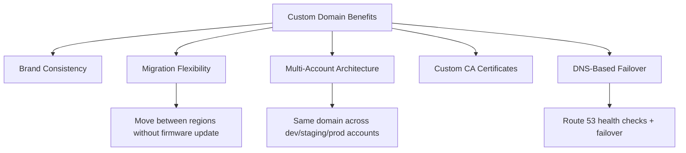

# How to Set Up IoT Core Custom Domains

Author: [nawazdhandala](https://github.com/nawazdhandala)

Tags: AWS, IoT, IoT Core, Custom Domains, TLS, DNS, Security

Description: Configure custom domain names for AWS IoT Core endpoints so your devices connect to branded, meaningful hostnames with your own TLS certificates.

---

By default, AWS IoT Core gives you an endpoint that looks something like `a1b2c3d4e5f6g7.iot.us-east-1.amazonaws.com`. That works fine technically, but there are good reasons to use a custom domain instead. Maybe you want devices to connect to `iot.yourcompany.com` for branding consistency. Maybe you need the flexibility to migrate between AWS accounts or regions without updating device firmware. Or maybe your security team requires that all endpoints use certificates issued by a specific certificate authority.

AWS IoT Core configurable endpoints let you set up custom domains with your own server certificates. Here is how to do it end to end.

## Why Custom Domains Matter

The default IoT Core endpoint has a few limitations that custom domains solve:



**Migration flexibility** is the big one. If your devices are hardcoded to connect to the default AWS endpoint and you need to move to a different account or region, you have to update every device. With a custom domain, you just update the DNS record.

**Multi-account architecture** lets you use the same domain across environments. Your devices connect to `iot.yourcompany.com` and you use DNS to route dev devices to one account and production devices to another.

## Prerequisites

Before you start, you need:

1. A domain name you control (e.g., `yourcompany.com`)
2. A server certificate for your custom domain issued by a CA that your devices trust
3. The private key for that certificate
4. Access to manage DNS records for your domain

## Step 1: Create or Import a Server Certificate

You have two options for the server certificate: use AWS Certificate Manager (ACM) to get one, or import your own.

### Option A: Request from ACM (recommended for simplicity)

```bash
# Request a certificate from ACM for your IoT domain
aws acm request-certificate \
  --domain-name "iot.yourcompany.com" \
  --validation-method DNS \
  --region us-east-1
```

ACM will give you DNS validation records to add. Once validated, note the certificate ARN.

### Option B: Import your own certificate

If your devices trust a specific CA (common in industrial IoT), import that CA's certificate:

```bash
# Import your own server certificate
aws acm import-certificate \
  --certificate fileb://server-cert.pem \
  --private-key fileb://server-key.pem \
  --certificate-chain fileb://ca-chain.pem \
  --region us-east-1
```

## Step 2: Create a Domain Configuration

The domain configuration is the IoT Core resource that ties your custom domain to a server certificate.

```bash
# Create the IoT Core domain configuration
aws iot create-domain-configuration \
  --domain-configuration-name "CustomIoTDomain" \
  --domain-name "iot.yourcompany.com" \
  --server-certificate-arns "arn:aws:acm:us-east-1:123456789012:certificate/abc123-def456" \
  --service-type "DATA" \
  --tls-config '{
    "securityPolicy": "IotSecurityPolicy_TLS13_1_3_2022_10"
  }'
```

A few notes on the parameters:

- **service-type** can be `DATA` (for MQTT connections), `CREDENTIAL_PROVIDER` (for credential provider endpoints), or `JOBS` (for jobs endpoints). For most use cases, `DATA` is what you want.
- **securityPolicy** controls which TLS versions and cipher suites are supported. Use the TLS 1.3 policy for new deployments unless your devices cannot support it.

## Step 3: Enable the Domain Configuration

Domain configurations are created in a disabled state. Enable it:

```bash
# Enable the domain configuration
aws iot update-domain-configuration \
  --domain-configuration-name "CustomIoTDomain" \
  --domain-configuration-status "ENABLED"
```

## Step 4: Get the CNAME Target

After creating the domain configuration, you need to find the target for your DNS CNAME record:

```bash
# Describe the domain configuration to get the CNAME target
aws iot describe-domain-configuration \
  --domain-configuration-name "CustomIoTDomain"
```

The response will include a `domainName` field with the target endpoint. It will look something like `d-abc123.iot.us-east-1.amazonaws.com`.

## Step 5: Configure DNS

Create a CNAME record in your DNS that points your custom domain to the IoT Core endpoint:

```bash
# Using Route 53 to create the CNAME record
aws route53 change-resource-record-sets \
  --hosted-zone-id "Z1234567890" \
  --change-batch '{
    "Changes": [
      {
        "Action": "CREATE",
        "ResourceRecordSet": {
          "Name": "iot.yourcompany.com",
          "Type": "CNAME",
          "TTL": 300,
          "ResourceRecords": [
            {
              "Value": "d-abc123.iot.us-east-1.amazonaws.com"
            }
          ]
        }
      }
    ]
  }'
```

If you are using Route 53, you can also use an Alias record instead of CNAME, which has better performance characteristics.

## Step 6: Test the Connection

Verify that devices can connect through your custom domain:

```bash
# Test MQTT connection using mosquitto client
mosquitto_pub \
  --host iot.yourcompany.com \
  --port 8883 \
  --cafile AmazonRootCA1.pem \
  --cert device-cert.pem \
  --key device-key.pem \
  --topic "test/custom-domain" \
  --message '{"test": "custom domain connection"}' \
  -d

# Or test with the AWS CLI
aws iot-data publish \
  --endpoint-url "https://iot.yourcompany.com:8443" \
  --topic "test/custom-domain" \
  --payload '{"test": "custom domain connection"}'
```

## Configuring an Authorizer with Custom Domains

If you are using custom authentication (not mutual TLS), you can associate a custom authorizer with your domain configuration:

```bash
# Update domain configuration with a custom authorizer
aws iot update-domain-configuration \
  --domain-configuration-name "CustomIoTDomain" \
  --authorizer-config '{
    "defaultAuthorizerName": "MyCustomAuthorizer",
    "allowAuthorizerOverride": true
  }'
```

This is useful for scenarios where devices authenticate with tokens or API keys instead of X.509 certificates.

## Multi-Region Setup with DNS Failover

One of the most powerful patterns with custom domains is DNS-based failover. You can set up IoT Core in multiple regions with the same custom domain and use Route 53 health checks to automatically failover:

```bash
# Create health check for primary region
aws route53 create-health-check \
  --caller-reference "iot-primary-$(date +%s)" \
  --health-check-config '{
    "Type": "TCP",
    "Port": 8883,
    "FullyQualifiedDomainName": "d-abc123.iot.us-east-1.amazonaws.com",
    "RequestInterval": 30,
    "FailureThreshold": 3
  }'

# Create failover routing records
# Primary record
aws route53 change-resource-record-sets \
  --hosted-zone-id "Z1234567890" \
  --change-batch '{
    "Changes": [{
      "Action": "UPSERT",
      "ResourceRecordSet": {
        "Name": "iot.yourcompany.com",
        "Type": "CNAME",
        "SetIdentifier": "primary",
        "Failover": "PRIMARY",
        "TTL": 60,
        "HealthCheckId": "health-check-id-here",
        "ResourceRecords": [{
          "Value": "d-abc123.iot.us-east-1.amazonaws.com"
        }]
      }
    }]
  }'
```

This pattern gives you high availability without any device-side changes. Devices just connect to `iot.yourcompany.com` and DNS handles the rest.

## Certificate Rotation

Server certificates expire, and you need to rotate them before they do. IoT Core supports up to four server certificates on a domain configuration, allowing you to add a new certificate before removing the old one.

```bash
# Add a new certificate to the domain configuration
aws iot update-domain-configuration \
  --domain-configuration-name "CustomIoTDomain" \
  --server-certificate-arns \
    "arn:aws:acm:us-east-1:123456789012:certificate/new-cert-arn" \
    "arn:aws:acm:us-east-1:123456789012:certificate/old-cert-arn"

# After verifying the new certificate works, remove the old one
aws iot update-domain-configuration \
  --domain-configuration-name "CustomIoTDomain" \
  --server-certificate-arns \
    "arn:aws:acm:us-east-1:123456789012:certificate/new-cert-arn"
```

Set up a CloudWatch alarm to warn you when certificates are approaching expiration. If you use ACM-issued certificates, ACM handles renewal automatically.

## Wrapping Up

Custom domains for IoT Core are a small configuration investment that pays off significantly in operational flexibility. The ability to redirect your entire device fleet to a different backend just by changing a DNS record is incredibly powerful, especially for disaster recovery and migration scenarios. Set it up early in your project before devices are deployed in the field with hardcoded default endpoints.
