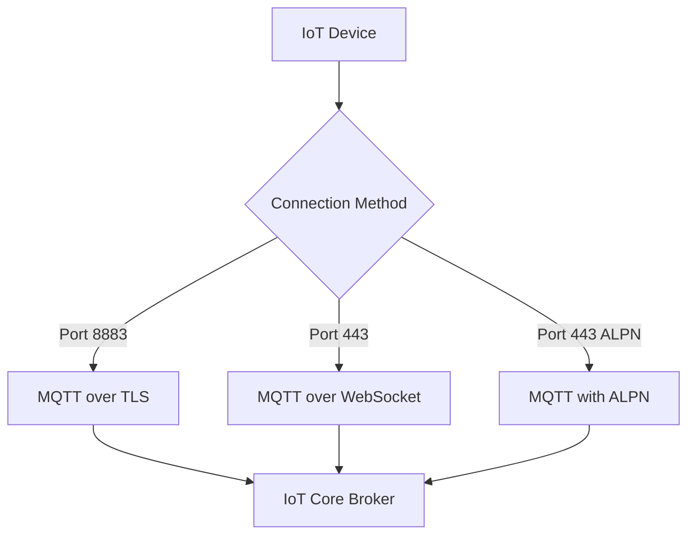

# How to Set Up IoT Core MQTT Connections

Author: [nawazdhandala](https://github.com/nawazdhandala)

Tags: AWS, IoT Core, MQTT, Networking, Security

Description: Detailed guide to establishing and managing MQTT connections with AWS IoT Core, covering connection options, QoS levels, persistent sessions, and troubleshooting connectivity issues.

---

MQTT is the backbone of IoT Core communication. It's a lightweight publish-subscribe protocol designed for constrained devices and unreliable networks - exactly the conditions you deal with in IoT deployments. Getting the MQTT connection right is critical because everything else - shadows, rules, jobs - depends on it.

This guide goes deep on MQTT connections with IoT Core, covering all the protocol options, authentication methods, connection management, and the details that matter when you're running thousands of devices in production.

## MQTT Protocol Options

IoT Core supports three ways to connect over MQTT:

1. **MQTT over TLS (port 8883)** - Standard MQTT with TLS 1.2 encryption
2. **MQTT over WebSocket (port 443)** - MQTT tunneled through WebSocket, useful for browser-based clients
3. **MQTT over ALPN (port 443)** - MQTT with TLS using ALPN extension, useful when port 8883 is blocked



## Connecting with X.509 Certificates

The most secure and recommended method. Each device has its own certificate.

```python
# mqtt_x509.py - MQTT connection with X.509 certificate authentication
from awscrt import mqtt, io, auth
from awsiot import mqtt_connection_builder
import time

# TLS and event loop setup
event_loop_group = io.EventLoopGroup(1)
host_resolver = io.DefaultHostResolver(event_loop_group)
client_bootstrap = io.ClientBootstrap(event_loop_group, host_resolver)

# Build the connection
connection = mqtt_connection_builder.mtls_from_path(
    endpoint="abc123-ats.iot.us-east-1.amazonaws.com",
    port=8883,
    cert_filepath="device-cert.pem",
    pri_key_filepath="private-key.pem",
    ca_filepath="AmazonRootCA1.pem",
    client_bootstrap=client_bootstrap,
    client_id="sensor-001",
    clean_session=False,
    keep_alive_secs=30,
    on_connection_interrupted=on_connection_interrupted,
    on_connection_resumed=on_connection_resumed
)

def on_connection_interrupted(connection, error, **kwargs):
    """Called when the MQTT connection is unexpectedly lost."""
    print(f"Connection interrupted: {error}")

def on_connection_resumed(connection, return_code, session_present, **kwargs):
    """Called when an interrupted connection is re-established."""
    print(f"Connection resumed. Session present: {session_present}")
    if not session_present:
        # Re-subscribe to topics if the session was lost
        resubscribe()

# Connect
connect_future = connection.connect()
connect_future.result()
print("Connected successfully")
```

## Connecting with WebSockets

WebSocket connections use IAM credentials (Signature V4) instead of certificates. This is useful for browser-based applications or when certificate management isn't practical.

```python
# mqtt_websocket.py - MQTT connection over WebSocket with IAM auth
from awscrt import mqtt, io, auth
from awsiot import mqtt_connection_builder

# Use default credentials provider (reads from environment, profile, or EC2 role)
credentials_provider = auth.AwsCredentialsProvider.new_default_chain(
    client_bootstrap=client_bootstrap
)

connection = mqtt_connection_builder.websockets_with_default_aws_signing(
    endpoint="abc123-ats.iot.us-east-1.amazonaws.com",
    region="us-east-1",
    credentials_provider=credentials_provider,
    client_bootstrap=client_bootstrap,
    client_id="web-client-001",
    clean_session=True,
    keep_alive_secs=30
)

connect_future = connection.connect()
connect_future.result()
print("Connected via WebSocket")
```

For JavaScript browser clients, it looks like this.

```javascript
// browser_mqtt.js - MQTT connection from a browser
import { mqtt, iot } from 'aws-iot-device-sdk-v2';

async function connectBrowser() {
    // Get temporary credentials from your backend
    const credentials = await fetch('/api/iot-credentials').then(r => r.json());

    const config = iot.AwsIotMqttConnectionConfigBuilder
        .new_with_websockets({
            region: 'us-east-1',
            credentials_provider: /* ... */
        })
        .with_endpoint('abc123-ats.iot.us-east-1.amazonaws.com')
        .with_client_id(`browser-${Date.now()}`)
        .with_clean_session(true)
        .build();

    const client = new mqtt.MqttClient();
    const connection = client.new_connection(config);

    connection.on('connect', () => console.log('Connected'));
    connection.on('disconnect', () => console.log('Disconnected'));
    connection.on('error', (error) => console.error('Error:', error));

    await connection.connect();
    return connection;
}
```

## QoS Levels

MQTT defines three Quality of Service levels. IoT Core supports QoS 0 and QoS 1.

**QoS 0 (At most once)**: Fire and forget. The message is sent once with no acknowledgment. Fast but messages can be lost.

**QoS 1 (At least once)**: The broker acknowledges receipt. If no acknowledgment is received, the message is resent. Messages are guaranteed to arrive but may arrive multiple times.

```python
# Publishing with different QoS levels

# QoS 0 - Best for frequent, non-critical data like sensor readings
connection.publish(
    topic="sensors/001/data",
    payload=json.dumps({"temp": 22.5}),
    qos=mqtt.QoS.AT_MOST_ONCE  # QoS 0
)

# QoS 1 - Use for important data like alerts or commands
connection.publish(
    topic="alerts/001/critical",
    payload=json.dumps({"error": "overheating"}),
    qos=mqtt.QoS.AT_LEAST_ONCE  # QoS 1
)
```

Choose QoS 0 for high-frequency telemetry where losing an occasional reading is acceptable. Use QoS 1 for commands, alerts, and any data you can't afford to lose.

## Persistent Sessions

When `clean_session` is set to `False`, IoT Core maintains the session state between connections. This means:

- Subscriptions persist across disconnections
- QoS 1 messages published while the device was offline are queued and delivered when it reconnects

```python
# Persistent session - subscriptions survive disconnections
connection = mqtt_connection_builder.mtls_from_path(
    endpoint=ENDPOINT,
    cert_filepath="device-cert.pem",
    pri_key_filepath="private-key.pem",
    ca_filepath="AmazonRootCA1.pem",
    client_id="sensor-001",
    clean_session=False,  # Persistent session
    keep_alive_secs=30
)
```

IoT Core stores queued messages for up to 1 hour. If the device doesn't reconnect within that window, the messages are dropped. The queue holds up to 10 QoS 1 messages per subscription.

## Keep-Alive and Connection Management

The keep-alive interval tells the broker how often to expect a heartbeat from the device. If no message arrives within 1.5x the keep-alive interval, the broker considers the connection dead.

```python
# Configure keep-alive and timeouts
connection = mqtt_connection_builder.mtls_from_path(
    endpoint=ENDPOINT,
    cert_filepath="device-cert.pem",
    pri_key_filepath="private-key.pem",
    ca_filepath="AmazonRootCA1.pem",
    client_id="sensor-001",
    clean_session=False,
    keep_alive_secs=60,  # Ping every 60 seconds
    ping_timeout_ms=10000,  # Wait 10s for ping response
    connect_timeout_ms=10000  # Wait 10s for initial connection
)
```

For battery-powered devices, use a longer keep-alive to reduce network activity. For mains-powered devices that need quick failure detection, use a shorter interval.

## Last Will and Testament

MQTT's Last Will and Testament (LWT) feature lets you specify a message that the broker publishes when a device disconnects unexpectedly. This is perfect for detecting device failures.

```python
# Configure Last Will and Testament
will_topic = "devices/sensor-001/status"
will_payload = json.dumps({
    "device_id": "sensor-001",
    "status": "offline",
    "timestamp": int(time.time())
})

connection = mqtt_connection_builder.mtls_from_path(
    endpoint=ENDPOINT,
    cert_filepath="device-cert.pem",
    pri_key_filepath="private-key.pem",
    ca_filepath="AmazonRootCA1.pem",
    client_id="sensor-001",
    clean_session=False,
    keep_alive_secs=30,
    will=mqtt.Will(
        topic=will_topic,
        payload=will_payload,
        qos=mqtt.QoS.AT_LEAST_ONCE,
        retain=False
    )
)

# Publish online status when connected
connection.connect().result()
connection.publish(
    topic="devices/sensor-001/status",
    payload=json.dumps({"device_id": "sensor-001", "status": "online"}),
    qos=mqtt.QoS.AT_LEAST_ONCE
)
```

## Topic Design Best Practices

Well-designed topics make rules and subscriptions easier to manage.

```
# Good topic hierarchy
sensors/{device-id}/data          # Telemetry data
sensors/{device-id}/status        # Device status
commands/{device-id}/firmware     # Firmware update commands
commands/{device-id}/config       # Configuration commands
alerts/{severity}/{device-id}     # Alerts by severity

# Use wildcards for subscriptions
sensors/+/data                    # All device telemetry
sensors/warehouse-a/#             # Everything from warehouse A
alerts/critical/+                 # All critical alerts
```

## Connection Limits

IoT Core has connection limits you need to be aware of:

- **Maximum concurrent connections**: Soft limit of 500,000 per account (can be increased)
- **Connection rate**: 500 connections per second per account
- **Subscriptions per connection**: 50
- **Publish rate**: 100 messages per second per connection
- **Maximum message size**: 128 KB

If you're hitting the connection rate limit during fleet restarts, implement exponential backoff.

```python
# Reconnection with exponential backoff
import random

def connect_with_backoff(max_retries=10):
    base_delay = 1  # Starting delay in seconds
    max_delay = 300  # Maximum delay of 5 minutes

    for attempt in range(max_retries):
        try:
            connection.connect().result()
            print("Connected successfully")
            return True
        except Exception as e:
            delay = min(base_delay * (2 ** attempt), max_delay)
            jitter = random.uniform(0, delay * 0.1)
            total_delay = delay + jitter
            print(f"Connection attempt {attempt + 1} failed: {e}")
            print(f"Retrying in {total_delay:.1f} seconds")
            time.sleep(total_delay)

    print("Failed to connect after all retries")
    return False
```

## Troubleshooting Connections

When devices can't connect, enable IoT Core logging and check CloudWatch.

```bash
# Enable detailed logging
aws iot set-v2-logging-options \
    --role-arn "arn:aws:iam::123456789:role/IoTLoggingRole" \
    --default-log-level DEBUG

# Check CloudWatch logs
aws logs filter-log-events \
    --log-group-name "AWSIotLogsV2" \
    --filter-pattern "CONNECT"
```

Common connection issues:

- **Certificate not activated**: Make sure the certificate status is ACTIVE
- **Policy not attached**: Certificate must have an IoT policy attached
- **Wrong endpoint**: Use the ATS endpoint, not the legacy one
- **Client ID conflict**: Two devices with the same client ID will fight for the connection

## Wrapping Up

A reliable MQTT connection is the foundation of any IoT deployment. Get the basics right - proper certificate management, appropriate QoS levels, persistent sessions for important devices, and exponential backoff for reconnections. Then layer on Last Will and Testament for device health monitoring and well-structured topics for clean data routing.

For handling the data that flows over these connections, check out our guide on the [IoT Core Rules Engine](https://oneuptime.com/blog/post/2026-02-12-use-iot-core-rules-engine/view).
