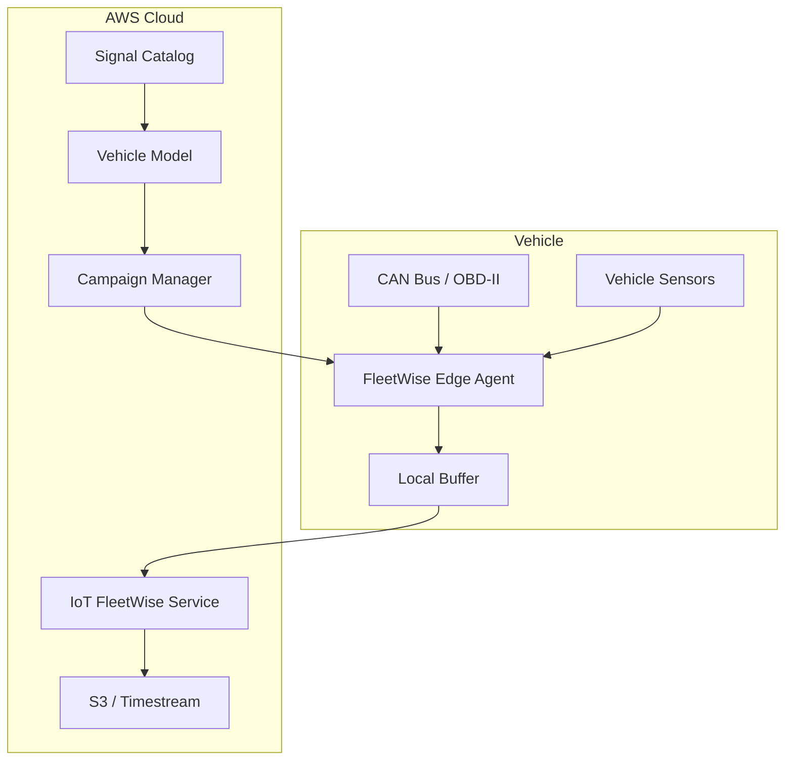

# How to Set Up IoT FleetWise for Vehicle Data Collection

Author: [nawazdhandala](https://github.com/nawazdhandala)

Tags: AWS, IoT, IoT FleetWise, Vehicle Data, Fleet Management, Edge Computing

Description: Step-by-step guide to setting up AWS IoT FleetWise for collecting, transforming, and transferring vehicle data from connected vehicle fleets to the cloud.

---

Connected vehicles generate enormous amounts of data. A modern car can produce gigabytes of telemetry per hour from hundreds of sensors, ECUs, and onboard systems. Shipping all of that to the cloud would be expensive and wasteful. Most of it is routine, and you only care about specific signals under specific conditions.

AWS IoT FleetWise solves this by letting you define what data you want, when you want it, and having the vehicle-side agent collect only that. It handles the messy parts of vehicle data collection - CAN bus decoding, signal extraction, conditional collection, and efficient cloud transfer.

## How FleetWise Works

The architecture has three main components:



The **Edge Agent** runs on the vehicle's gateway hardware. It reads signals from the vehicle bus, applies collection schemes defined by campaigns, buffers data locally, and sends it to the cloud when connected.

The **Signal Catalog** is your master dictionary of vehicle signals. It maps raw CAN bus signals to named, typed attributes with units.

**Campaigns** define what data to collect and when, using either time-based or condition-based collection.

## Step 1: Create a Signal Catalog

The signal catalog is the foundation. It defines every signal you might want to collect across your fleet. Think of it as a universal data dictionary for your vehicles.

```bash
# Create a signal catalog for your fleet
aws iotfleetwise create-signal-catalog \
  --name "ConnectedVehicleCatalog" \
  --description "Master signal catalog for fleet telemetry" \
  --nodes '[
    {
      "sensor": {
        "fullyQualifiedName": "Vehicle.Speed",
        "dataType": "DOUBLE",
        "unit": "km/h",
        "description": "Current vehicle speed"
      }
    },
    {
      "sensor": {
        "fullyQualifiedName": "Vehicle.Engine.RPM",
        "dataType": "DOUBLE",
        "unit": "rpm",
        "description": "Engine revolutions per minute"
      }
    },
    {
      "sensor": {
        "fullyQualifiedName": "Vehicle.Engine.CoolantTemperature",
        "dataType": "DOUBLE",
        "unit": "celsius",
        "description": "Engine coolant temperature"
      }
    },
    {
      "sensor": {
        "fullyQualifiedName": "Vehicle.Fuel.Level",
        "dataType": "DOUBLE",
        "unit": "percent",
        "description": "Fuel tank level percentage"
      }
    },
    {
      "sensor": {
        "fullyQualifiedName": "Vehicle.OBD.DTCCount",
        "dataType": "INT32",
        "description": "Number of active diagnostic trouble codes"
      }
    },
    {
      "sensor": {
        "fullyQualifiedName": "Vehicle.Location.Latitude",
        "dataType": "DOUBLE",
        "unit": "degrees",
        "description": "GPS latitude"
      }
    },
    {
      "sensor": {
        "fullyQualifiedName": "Vehicle.Location.Longitude",
        "dataType": "DOUBLE",
        "unit": "degrees",
        "description": "GPS longitude"
      }
    }
  ]'
```

The fully qualified names follow a hierarchical convention (Vehicle.System.Signal) that keeps things organized as your catalog grows. A production fleet catalog might have thousands of signals.

## Step 2: Create a Vehicle Model (Model Manifest)

A vehicle model defines which signals from the catalog apply to a specific type of vehicle. Not every vehicle in your fleet has the same sensors, so models let you map the right signals to the right vehicles.

```bash
# Create a vehicle model for a specific vehicle type
aws iotfleetwise create-model-manifest \
  --name "ModelX2025" \
  --signal-catalog-arn "arn:aws:iotfleetwise:us-east-1:123456789012:signal-catalog/ConnectedVehicleCatalog" \
  --description "Model manifest for 2025 ModelX vehicles" \
  --nodes '[
    "Vehicle.Speed",
    "Vehicle.Engine.RPM",
    "Vehicle.Engine.CoolantTemperature",
    "Vehicle.Fuel.Level",
    "Vehicle.OBD.DTCCount",
    "Vehicle.Location.Latitude",
    "Vehicle.Location.Longitude"
  ]'

# Activate the model manifest so it can be used
aws iotfleetwise update-model-manifest \
  --name "ModelX2025" \
  --status "ACTIVE"
```

## Step 3: Create a Decoder Manifest

The decoder manifest maps physical vehicle bus signals to the logical signals in your model. This is where you tell FleetWise how to extract a signal like "Vehicle.Speed" from a specific CAN bus message ID and byte position.

```bash
# Create a decoder manifest that maps CAN signals to the model
aws iotfleetwise create-decoder-manifest \
  --name "ModelX2025Decoder" \
  --model-manifest-arn "arn:aws:iotfleetwise:us-east-1:123456789012:model-manifest/ModelX2025" \
  --signal-decoders '[
    {
      "fullyQualifiedName": "Vehicle.Speed",
      "type": "CAN_SIGNAL",
      "canSignal": {
        "messageId": 1024,
        "isBigEndian": false,
        "isSigned": false,
        "startBit": 0,
        "length": 16,
        "factor": 0.01,
        "offset": 0
      }
    },
    {
      "fullyQualifiedName": "Vehicle.Engine.RPM",
      "type": "CAN_SIGNAL",
      "canSignal": {
        "messageId": 1025,
        "isBigEndian": false,
        "isSigned": false,
        "startBit": 0,
        "length": 16,
        "factor": 0.25,
        "offset": 0
      }
    }
  ]' \
  --network-interfaces '[
    {
      "interfaceId": "can0",
      "type": "CAN_INTERFACE",
      "canInterface": {
        "name": "can0",
        "protocolName": "CAN",
        "protocolVersion": "2.0B"
      }
    }
  ]'

# Activate the decoder manifest
aws iotfleetwise update-decoder-manifest \
  --name "ModelX2025Decoder" \
  --status "ACTIVE"
```

## Step 4: Register Vehicles

Each vehicle in your fleet gets registered as a resource in FleetWise, associated with a model manifest and decoder manifest.

```bash
# Register a vehicle
aws iotfleetwise create-vehicle \
  --vehicle-name "VIN-1HGCM82633A004352" \
  --model-manifest-arn "arn:aws:iotfleetwise:us-east-1:123456789012:model-manifest/ModelX2025" \
  --decoder-manifest-arn "arn:aws:iotfleetwise:us-east-1:123456789012:decoder-manifest/ModelX2025Decoder" \
  --attributes '{"region": "us-west", "depot": "seattle-01"}'
```

For large fleets, you can create fleet resources and associate vehicles with them for easier campaign targeting:

```bash
# Create a fleet and associate vehicles
aws iotfleetwise create-fleet \
  --fleet-id "seattle-fleet" \
  --signal-catalog-arn "arn:aws:iotfleetwise:us-east-1:123456789012:signal-catalog/ConnectedVehicleCatalog" \
  --description "All vehicles based at Seattle depot"

aws iotfleetwise associate-vehicle-fleet \
  --vehicle-name "VIN-1HGCM82633A004352" \
  --fleet-id "seattle-fleet"
```

## Step 5: Create Data Collection Campaigns

Campaigns are the heart of FleetWise. They define what data to collect, when, and where to send it. You have two collection strategies:

**Time-based** - collect signals at a fixed interval, good for routine monitoring.

**Condition-based** - collect signals only when a condition is met, good for event-driven diagnostics.

```bash
# Create a condition-based campaign that collects data when engine temp is high
aws iotfleetwise create-campaign \
  --name "HighTempDiagnostics" \
  --signal-catalog-arn "arn:aws:iotfleetwise:us-east-1:123456789012:signal-catalog/ConnectedVehicleCatalog" \
  --target-arn "arn:aws:iotfleetwise:us-east-1:123456789012:fleet/seattle-fleet" \
  --collection-scheme '{
    "conditionBasedCollectionScheme": {
      "expression": "$Vehicle.Engine.CoolantTemperature > 105",
      "minimumTriggerIntervalMs": 5000,
      "triggerMode": "ALWAYS",
      "conditionLanguageVersion": 1
    }
  }' \
  --signals-to-collect '[
    {"name": "Vehicle.Speed", "maxSampleCount": 100},
    {"name": "Vehicle.Engine.RPM", "maxSampleCount": 100},
    {"name": "Vehicle.Engine.CoolantTemperature", "maxSampleCount": 100},
    {"name": "Vehicle.Location.Latitude", "maxSampleCount": 10},
    {"name": "Vehicle.Location.Longitude", "maxSampleCount": 10}
  ]' \
  --data-destination-configs '[
    {
      "s3Config": {
        "bucketArn": "arn:aws:s3:::my-vehicle-data",
        "prefix": "diagnostics/high-temp/",
        "dataFormat": "PARQUET"
      }
    }
  ]'

# Approve and start the campaign
aws iotfleetwise update-campaign \
  --name "HighTempDiagnostics" \
  --action "APPROVE"
```

This campaign only collects data when the coolant temperature exceeds 105 degrees Celsius, capturing a snapshot of vehicle state during overheating events. The data lands in S3 in Parquet format, ready for analysis.

## Step 6: Install the Edge Agent

The FleetWise Edge Agent runs on vehicle gateway hardware. AWS provides reference implementations for common platforms. You deploy it along with the decoder manifest configuration.

The agent communicates with the FleetWise cloud service over MQTT through IoT Core. It receives campaign updates, collects data according to the active campaigns, buffers it locally, and uploads when connectivity is available. For more about configuring IoT Core connections, see our post on [setting up IoT Core custom domains](https://oneuptime.com/blog/post/set-up-iot-core-custom-domains/view).

## Monitoring Your Fleet

Once campaigns are running, you should monitor collection health:

```bash
# Check campaign status
aws iotfleetwise get-campaign --name "HighTempDiagnostics"

# List vehicles and their status
aws iotfleetwise list-vehicles

# Get vehicle status within a fleet
aws iotfleetwise list-fleet-vehicles --fleet-id "seattle-fleet"
```

Setting up CloudWatch alarms for campaign errors and edge agent connectivity is strongly recommended for production deployments.

## Wrapping Up

AWS IoT FleetWise takes the pain out of vehicle data collection at scale. The signal catalog and decoder manifest system cleanly separates the logical data model from the physical bus implementation, which means you can write campaigns against meaningful signal names without worrying about CAN message IDs and bit offsets. The condition-based collection is particularly valuable for keeping data transfer costs reasonable while still capturing the events that matter.
