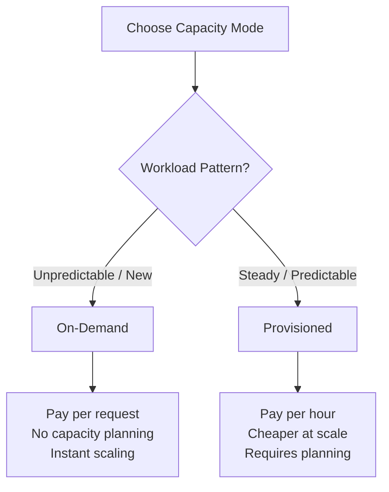

# How to Set Up Keyspaces On-Demand vs Provisioned Capacity

Author: [nawazdhandala](https://github.com/nawazdhandala)

Tags: AWS, Keyspaces, Cassandra, Database, Capacity Planning, Cost Optimization

Description: Understand the differences between on-demand and provisioned capacity modes in Amazon Keyspaces and learn when to use each for optimal cost and performance.

---

Amazon Keyspaces (for Apache Cassandra) offers two capacity modes that fundamentally change how you pay for and manage throughput: on-demand and provisioned. Choosing the wrong mode can mean either overpaying for unused capacity or getting throttled during traffic spikes. The right choice depends on your workload pattern.

This guide breaks down both modes, shows you how to configure each, and gives you a framework for deciding which one to use.

## On-Demand vs Provisioned: The Quick Version



**On-demand mode:**
- Pay per read and write request
- No capacity planning needed
- Instantly accommodates traffic spikes
- Best for: new tables, unpredictable workloads, development environments

**Provisioned mode:**
- Reserve a specific amount of read/write capacity
- Lower per-request cost at steady-state workloads
- Supports auto-scaling
- Best for: predictable workloads, cost optimization

## Setting Up On-Demand Mode

### Create a Table with On-Demand Capacity

```bash
# Create a Keyspaces table with on-demand capacity mode
aws keyspaces create-table \
  --keyspace-name my_application \
  --table-name user_events \
  --schema-definition '{
    "allColumns": [
      {"name": "user_id", "type": "text"},
      {"name": "event_time", "type": "timestamp"},
      {"name": "event_type", "type": "text"},
      {"name": "payload", "type": "text"}
    ],
    "partitionKeys": [
      {"name": "user_id"}
    ],
    "clusteringKeys": [
      {"name": "event_time", "orderBy": "DESC"}
    ]
  }' \
  --capacity-specification '{"throughputMode": "PAY_PER_REQUEST"}'
```

That is it. No capacity to configure, no auto-scaling rules to set up. Keyspaces handles everything.

### Querying with On-Demand

```python
# Connect to Keyspaces and query with on-demand - no throttling concerns
from cassandra.cluster import Cluster
from ssl import SSLContext, PROTOCOL_TLS, CERT_REQUIRED
from cassandra.auth import PlainTextAuthProvider
from cassandra_sigv4.auth import SigV4AuthProvider

import boto3

# Use SigV4 authentication
boto_session = boto3.Session()
auth_provider = SigV4AuthProvider(boto_session)

ssl_context = SSLContext(PROTOCOL_TLS)
ssl_context.verify_mode = CERT_REQUIRED
ssl_context.load_verify_locations('sf-class2-root.crt')

cluster = Cluster(
    ['cassandra.us-east-1.amazonaws.com'],
    port=9142,
    auth_provider=auth_provider,
    ssl_context=ssl_context
)

session = cluster.connect('my_application')

# Write data - on-demand handles any burst without throttling
insert_stmt = session.prepare("""
    INSERT INTO user_events (user_id, event_time, event_type, payload)
    VALUES (?, ?, ?, ?)
""")

session.execute(insert_stmt, ['user-123', datetime.utcnow(), 'page_view', '{"url": "/home"}'])
```

## Setting Up Provisioned Mode

### Create a Table with Provisioned Capacity

```bash
# Create a Keyspaces table with provisioned capacity
aws keyspaces create-table \
  --keyspace-name my_application \
  --table-name orders \
  --schema-definition '{
    "allColumns": [
      {"name": "order_id", "type": "uuid"},
      {"name": "customer_id", "type": "text"},
      {"name": "created_at", "type": "timestamp"},
      {"name": "total_amount", "type": "decimal"},
      {"name": "status", "type": "text"},
      {"name": "items", "type": "text"}
    ],
    "partitionKeys": [
      {"name": "customer_id"}
    ],
    "clusteringKeys": [
      {"name": "created_at", "orderBy": "DESC"}
    ]
  }' \
  --capacity-specification '{
    "throughputMode": "PROVISIONED",
    "readCapacityUnits": 100,
    "writeCapacityUnits": 50
  }'
```

### Enable Auto-Scaling

Provisioned mode without auto-scaling is risky. Always enable auto-scaling to handle traffic variations.

```bash
# Register the table as a scalable target for reads
aws application-autoscaling register-scalable-target \
  --service-namespace cassandra \
  --resource-id "keyspace/my_application/table/orders" \
  --scalable-dimension "cassandra:table:ReadCapacityUnits" \
  --min-capacity 10 \
  --max-capacity 1000

# Register for writes
aws application-autoscaling register-scalable-target \
  --service-namespace cassandra \
  --resource-id "keyspace/my_application/table/orders" \
  --scalable-dimension "cassandra:table:WriteCapacityUnits" \
  --min-capacity 10 \
  --max-capacity 500
```

Now create the scaling policies.

```bash
# Create target tracking scaling policy for reads
# Maintain 70% utilization of provisioned read capacity
aws application-autoscaling put-scaling-policy \
  --service-namespace cassandra \
  --resource-id "keyspace/my_application/table/orders" \
  --scalable-dimension "cassandra:table:ReadCapacityUnits" \
  --policy-name orders-read-scaling \
  --policy-type TargetTrackingScaling \
  --target-tracking-scaling-policy-configuration '{
    "TargetValue": 70.0,
    "PredefinedMetricSpecification": {
      "PredefinedMetricType": "CassandraReadCapacityUtilization"
    },
    "ScaleInCooldown": 60,
    "ScaleOutCooldown": 60
  }'

# Create target tracking scaling policy for writes
aws application-autoscaling put-scaling-policy \
  --service-namespace cassandra \
  --resource-id "keyspace/my_application/table/orders" \
  --scalable-dimension "cassandra:table:WriteCapacityUnits" \
  --policy-name orders-write-scaling \
  --policy-type TargetTrackingScaling \
  --target-tracking-scaling-policy-configuration '{
    "TargetValue": 70.0,
    "PredefinedMetricSpecification": {
      "PredefinedMetricType": "CassandraWriteCapacityUtilization"
    },
    "ScaleInCooldown": 60,
    "ScaleOutCooldown": 60
  }'
```

## Cost Comparison

Let's compare costs for different workload patterns.

### Steady Workload (1000 RCU, 500 WCU constant)

```
On-demand:
  Reads:  1000 reads/sec x 86,400 sec/day x 30 days = 2.592B reads
  Cost:   2.592B / 1M x $0.25 = $648/month for reads
  Writes: 500 writes/sec x 86,400 x 30 = 1.296B writes
  Cost:   1.296B / 1M x $1.25 = $1,620/month for writes
  Total:  ~$2,268/month

Provisioned:
  Reads:  1000 RCU x $0.00013/RCU/hour x 730 hours = $94.90/month
  Writes: 500 WCU x $0.00065/WCU/hour x 730 hours = $237.25/month
  Total:  ~$332/month
```

For a steady workload, provisioned is almost 7 times cheaper.

### Spiky Workload (100 RCU baseline, 5000 RCU peak for 2 hours/day)

```
On-demand:
  Baseline: 100/sec x 79,200 sec (22 hours) = 7.92M reads
  Peak:     5000/sec x 7,200 sec (2 hours) = 36M reads
  Daily reads: 43.92M x 30 = 1.318B
  Cost: 1.318B / 1M x $0.25 = $329/month (reads only)

Provisioned (with auto-scaling):
  Baseline: 100 RCU x 22 hours x 30 = $0.00013 x 100 x 660 = $8.58
  Peak:     5000 RCU x 2 hours x 30 = $0.00013 x 5000 x 60 = $39.00
  Total: ~$47.58/month (reads only)
```

Even with spiky workloads, provisioned with auto-scaling is cheaper if the spikes are predictable.

## Switching Between Modes

You can switch capacity modes on existing tables.

```bash
# Switch from provisioned to on-demand
aws keyspaces update-table \
  --keyspace-name my_application \
  --table-name orders \
  --capacity-specification '{"throughputMode": "PAY_PER_REQUEST"}'
```

```bash
# Switch from on-demand to provisioned
aws keyspaces update-table \
  --keyspace-name my_application \
  --table-name orders \
  --capacity-specification '{
    "throughputMode": "PROVISIONED",
    "readCapacityUnits": 100,
    "writeCapacityUnits": 50
  }'
```

Note: You can switch modes once every 24 hours.

## Monitoring Capacity Usage

### Check Current Table Settings

```bash
# Check the current capacity mode and provisioned values
aws keyspaces get-table \
  --keyspace-name my_application \
  --table-name orders \
  --query '{Mode:capacitySpecification.throughputMode,ReadCU:capacitySpecification.readCapacityUnits,WriteCU:capacitySpecification.writeCapacityUnits}'
```

### CloudWatch Metrics

```bash
# Monitor consumed read capacity
aws cloudwatch get-metric-statistics \
  --namespace AWS/Cassandra \
  --metric-name ConsumedReadCapacityUnits \
  --dimensions Name=Keyspace,Value=my_application Name=TableName,Value=orders \
  --start-time $(date -u -d '24 hours ago' +%Y-%m-%dT%H:%M:%S) \
  --end-time $(date -u +%Y-%m-%dT%H:%M:%S) \
  --period 3600 \
  --statistics Sum,Average,Maximum
```

### Alert on Throttling

```bash
# Alert when requests are being throttled
aws cloudwatch put-metric-alarm \
  --alarm-name keyspaces-throttling \
  --namespace AWS/Cassandra \
  --metric-name ThrottledRequests \
  --dimensions Name=Keyspace,Value=my_application Name=TableName,Value=orders \
  --statistic Sum \
  --period 60 \
  --threshold 10 \
  --comparison-operator GreaterThanThreshold \
  --evaluation-periods 3 \
  --alarm-actions arn:aws:sns:us-east-1:123456789012:DatabaseAlerts
```

## Decision Framework

Use this checklist to decide:

1. **Is this a new table or project?** Start with on-demand. Switch to provisioned once you understand the traffic pattern.

2. **Is traffic predictable?** If yes, provisioned with auto-scaling is almost always cheaper.

3. **Are there idle periods?** On-demand costs $0 when there is no traffic. Provisioned charges for the minimum capacity 24/7.

4. **Can you tolerate brief throttling during scale-up?** Auto-scaling takes 1-2 minutes to react. On-demand handles bursts instantly.

5. **Is cost the top priority?** Provisioned with Reserved Capacity gives the lowest possible price for steady workloads.

## Summary

On-demand and provisioned capacity modes serve different workload patterns. Start with on-demand for new projects and unpredictable workloads, then switch to provisioned with auto-scaling once your traffic patterns stabilize. The cost difference can be significant - provisioned mode with auto-scaling is typically 3-7 times cheaper for steady workloads. But on-demand's zero-management overhead and instant scaling make it the right choice when simplicity and flexibility matter more than cost optimization.

For more on Keyspaces, see our guide on [migrating from Cassandra to Amazon Keyspaces](https://oneuptime.com/blog/post/migrate-from-cassandra-to-amazon-keyspaces/view).
