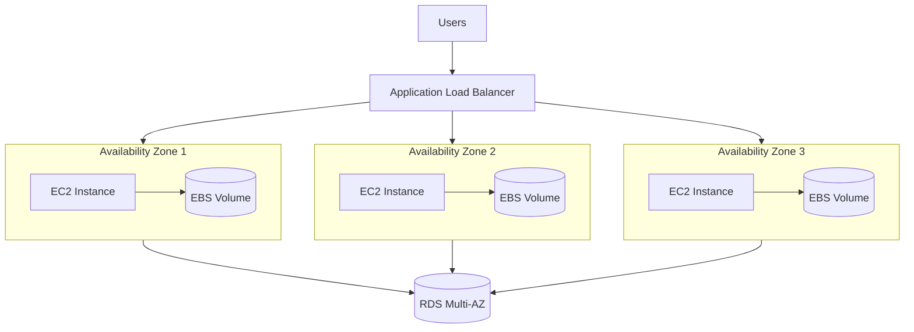

# How to Set Up Multi-AZ EC2 Deployments for High Availability

Author: [nawazdhandala](https://github.com/nawazdhandala)

Tags: AWS, EC2, High Availability, Multi-AZ, Load Balancing, Auto Scaling

Description: Design and deploy multi-AZ EC2 architectures with load balancers, Auto Scaling groups, and failover strategies for maximum availability.

---

A single availability zone failure shouldn't take down your application. That's the premise of multi-AZ deployments - spread your EC2 instances across multiple AZs so that if one AZ has issues, the others keep serving traffic. It sounds simple in theory, but getting it right involves careful planning around networking, load balancing, data, and scaling.

## The Architecture

A properly designed multi-AZ deployment looks like this:



The load balancer distributes traffic across AZs. Auto Scaling maintains the right number of instances in each AZ. If one AZ goes down, the load balancer routes traffic to the healthy AZs, and Auto Scaling launches replacement instances.

## Setting Up the VPC

Start with a VPC that has subnets in at least two (ideally three) AZs:

```bash
# Create a VPC
VPC_ID=$(aws ec2 create-vpc \
  --cidr-block 10.0.0.0/16 \
  --query 'Vpc.VpcId' --output text)

aws ec2 modify-vpc-attribute --vpc-id $VPC_ID --enable-dns-support
aws ec2 modify-vpc-attribute --vpc-id $VPC_ID --enable-dns-hostnames

# Create public subnets in three AZs (for the load balancer)
PUB_SUB_1=$(aws ec2 create-subnet --vpc-id $VPC_ID --cidr-block 10.0.1.0/24 --availability-zone us-east-1a --query 'Subnet.SubnetId' --output text)
PUB_SUB_2=$(aws ec2 create-subnet --vpc-id $VPC_ID --cidr-block 10.0.2.0/24 --availability-zone us-east-1b --query 'Subnet.SubnetId' --output text)
PUB_SUB_3=$(aws ec2 create-subnet --vpc-id $VPC_ID --cidr-block 10.0.3.0/24 --availability-zone us-east-1c --query 'Subnet.SubnetId' --output text)

# Create private subnets in three AZs (for the EC2 instances)
PRIV_SUB_1=$(aws ec2 create-subnet --vpc-id $VPC_ID --cidr-block 10.0.11.0/24 --availability-zone us-east-1a --query 'Subnet.SubnetId' --output text)
PRIV_SUB_2=$(aws ec2 create-subnet --vpc-id $VPC_ID --cidr-block 10.0.12.0/24 --availability-zone us-east-1b --query 'Subnet.SubnetId' --output text)
PRIV_SUB_3=$(aws ec2 create-subnet --vpc-id $VPC_ID --cidr-block 10.0.13.0/24 --availability-zone us-east-1c --query 'Subnet.SubnetId' --output text)
```

## Application Load Balancer

The ALB is the entry point for traffic. It automatically performs health checks and routes traffic only to healthy instances:

```bash
# Create an Application Load Balancer across all three AZs
ALB_ARN=$(aws elbv2 create-load-balancer \
  --name "app-alb" \
  --subnets $PUB_SUB_1 $PUB_SUB_2 $PUB_SUB_3 \
  --security-groups sg-alb123 \
  --scheme internet-facing \
  --type application \
  --query 'LoadBalancers[0].LoadBalancerArn' --output text)

# Create a target group with health checks
TG_ARN=$(aws elbv2 create-target-group \
  --name "app-targets" \
  --protocol HTTP \
  --port 80 \
  --vpc-id $VPC_ID \
  --health-check-path "/health" \
  --health-check-interval-seconds 10 \
  --healthy-threshold-count 2 \
  --unhealthy-threshold-count 3 \
  --target-type instance \
  --query 'TargetGroups[0].TargetGroupArn' --output text)

# Create a listener
aws elbv2 create-listener \
  --load-balancer-arn $ALB_ARN \
  --protocol HTTP \
  --port 80 \
  --default-actions "Type=forward,TargetGroupArn=$TG_ARN"
```

## Auto Scaling Group Across AZs

The Auto Scaling group ensures you have instances running in multiple AZs and replaces unhealthy ones:

```bash
# Create a launch template
aws ec2 create-launch-template \
  --launch-template-name "app-template" \
  --launch-template-data '{
    "ImageId": "ami-0abc123",
    "InstanceType": "m5.large",
    "SecurityGroupIds": ["sg-app123"],
    "UserData": "'$(base64 -w0 <<'EOF'
#!/bin/bash
yum install -y httpd
systemctl start httpd
echo "healthy" > /var/www/html/health
EOF
)'",
    "Monitoring": {"Enabled": true},
    "TagSpecifications": [
      {
        "ResourceType": "instance",
        "Tags": [
          {"Key": "Name", "Value": "app-server"},
          {"Key": "Environment", "Value": "production"}
        ]
      }
    ]
  }'

# Create the Auto Scaling group spanning three AZs
aws autoscaling create-auto-scaling-group \
  --auto-scaling-group-name "app-asg" \
  --launch-template "LaunchTemplateName=app-template,Version=\$Latest" \
  --vpc-zone-identifier "$PRIV_SUB_1,$PRIV_SUB_2,$PRIV_SUB_3" \
  --target-group-arns $TG_ARN \
  --min-size 3 \
  --max-size 12 \
  --desired-capacity 6 \
  --health-check-type ELB \
  --health-check-grace-period 300 \
  --default-cooldown 300
```

Setting `min-size` to 3 ensures at least one instance per AZ. The ASG's default AZ rebalancing tries to distribute instances evenly.

## Terraform Configuration

Here's the complete setup in Terraform:

```hcl
# Terraform: Multi-AZ EC2 deployment
data "aws_availability_zones" "available" {
  state = "available"
}

resource "aws_vpc" "main" {
  cidr_block           = "10.0.0.0/16"
  enable_dns_support   = true
  enable_dns_hostnames = true
}

# Create subnets in each AZ
resource "aws_subnet" "public" {
  count                   = 3
  vpc_id                  = aws_vpc.main.id
  cidr_block              = "10.0.${count.index + 1}.0/24"
  availability_zone       = data.aws_availability_zones.available.names[count.index]
  map_public_ip_on_launch = true

  tags = { Name = "public-${data.aws_availability_zones.available.names[count.index]}" }
}

resource "aws_subnet" "private" {
  count             = 3
  vpc_id            = aws_vpc.main.id
  cidr_block        = "10.0.${count.index + 11}.0/24"
  availability_zone = data.aws_availability_zones.available.names[count.index]

  tags = { Name = "private-${data.aws_availability_zones.available.names[count.index]}" }
}

# Application Load Balancer
resource "aws_lb" "app" {
  name               = "app-alb"
  internal           = false
  load_balancer_type = "application"
  security_groups    = [aws_security_group.alb.id]
  subnets            = aws_subnet.public[*].id

  enable_cross_zone_load_balancing = true
}

resource "aws_lb_target_group" "app" {
  name     = "app-targets"
  port     = 80
  protocol = "HTTP"
  vpc_id   = aws_vpc.main.id

  health_check {
    enabled             = true
    path                = "/health"
    interval            = 10
    healthy_threshold   = 2
    unhealthy_threshold = 3
    timeout             = 5
  }

  deregistration_delay = 60
}

resource "aws_lb_listener" "app" {
  load_balancer_arn = aws_lb.app.arn
  port              = 80
  protocol          = "HTTP"

  default_action {
    type             = "forward"
    target_group_arn = aws_lb_target_group.app.arn
  }
}

# Launch template
resource "aws_launch_template" "app" {
  name_prefix   = "app-"
  image_id      = "ami-0abc123"
  instance_type = "m5.large"

  vpc_security_group_ids = [aws_security_group.app.id]

  monitoring { enabled = true }

  tag_specifications {
    resource_type = "instance"
    tags = {
      Name        = "app-server"
      Environment = "production"
    }
  }
}

# Auto Scaling group across all AZs
resource "aws_autoscaling_group" "app" {
  name                = "app-asg"
  desired_capacity    = 6
  min_size            = 3
  max_size            = 12
  vpc_zone_identifier = aws_subnet.private[*].id
  target_group_arns   = [aws_lb_target_group.app.arn]

  health_check_type         = "ELB"
  health_check_grace_period = 300

  launch_template {
    id      = aws_launch_template.app.id
    version = "$Latest"
  }

  # Spread instances evenly across AZs
  min_elb_capacity = 3
}

# Scaling policy
resource "aws_autoscaling_policy" "cpu_target" {
  name                   = "cpu-target-tracking"
  autoscaling_group_name = aws_autoscaling_group.app.name
  policy_type            = "TargetTrackingScaling"

  target_tracking_configuration {
    predefined_metric_specification {
      predefined_metric_type = "ASGAverageCPUUtilization"
    }
    target_value = 60.0
  }
}
```

## Cross-Zone Load Balancing

Cross-zone load balancing distributes traffic evenly across all instances in all AZs, regardless of how many instances are in each AZ. Without it, each AZ gets equal traffic, which can overload AZs with fewer instances.

ALBs have cross-zone load balancing enabled by default. For NLBs, you need to enable it explicitly:

```bash
# Enable cross-zone load balancing on an NLB target group
aws elbv2 modify-target-group-attributes \
  --target-group-arn $TG_ARN \
  --attributes Key=load_balancing.cross_zone.enabled,Value=true
```

## Handling AZ Failures

When an AZ fails, the following happens automatically:
1. ALB health checks detect that instances in the failed AZ are unhealthy
2. ALB stops routing traffic to those instances
3. Auto Scaling detects the unhealthy instances and terminates them
4. Auto Scaling launches replacement instances in the healthy AZs

You don't need to do anything, but you should make sure your remaining capacity can handle the full load. If you have 6 instances across 3 AZs (2 per AZ) and one AZ fails, you're down to 4 instances until replacements launch.

A good rule of thumb: size your deployment so it can handle full production load with one AZ completely down. If you need 6 instances at peak, run 9 (3 per AZ) so losing one AZ still leaves you with 6.

## Stateless vs Stateful Considerations

Multi-AZ works best with stateless applications. If your instances don't store local state, any instance can handle any request, and AZ failures are seamless.

For stateful applications:
- Store session data in ElastiCache or DynamoDB (both support multi-AZ)
- Use RDS Multi-AZ for databases
- Use EFS for shared file storage across AZs
- Avoid storing important data on instance EBS volumes (they're AZ-specific)

## Monitoring Your Multi-AZ Deployment

Set up CloudWatch alarms that watch for AZ imbalance:

```bash
# Create an alarm for unhealthy targets
aws cloudwatch put-metric-alarm \
  --alarm-name "alb-unhealthy-targets" \
  --namespace AWS/ApplicationELB \
  --metric-name UnHealthyHostCount \
  --dimensions \
    Name=TargetGroup,Value=targetgroup/app-targets/abc123 \
    Name=LoadBalancer,Value=app/app-alb/xyz789 \
  --statistic Sum \
  --period 60 \
  --evaluation-periods 2 \
  --threshold 1 \
  --comparison-operator GreaterThanOrEqualToThreshold \
  --alarm-actions arn:aws:sns:us-east-1:123456789:ops-alerts
```

For deeper monitoring beyond just the load balancer, set up [CloudWatch alarms for CPU and memory](https://oneuptime.com/blog/post/set-up-cloudwatch-alarms-for-ec2-cpu-and-memory/view) on your individual instances.

## Testing AZ Failover

Don't wait for an actual AZ failure to find out if your setup works. Test it:

1. Manually terminate all instances in one AZ
2. Observe the ALB routing traffic to remaining AZs
3. Watch Auto Scaling launch replacements
4. Verify that your application continues serving requests throughout

You can also use AWS Fault Injection Simulator (FIS) for more sophisticated chaos testing.

Multi-AZ deployment is the minimum bar for production workloads on AWS. It protects against the most common failure mode - individual AZ issues - and with Auto Scaling, it largely manages itself. Once you've got this foundation in place, you can build on it with cross-region redundancy for even higher availability.
