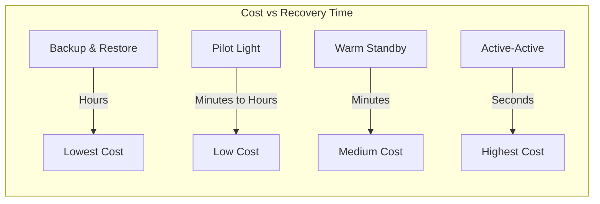
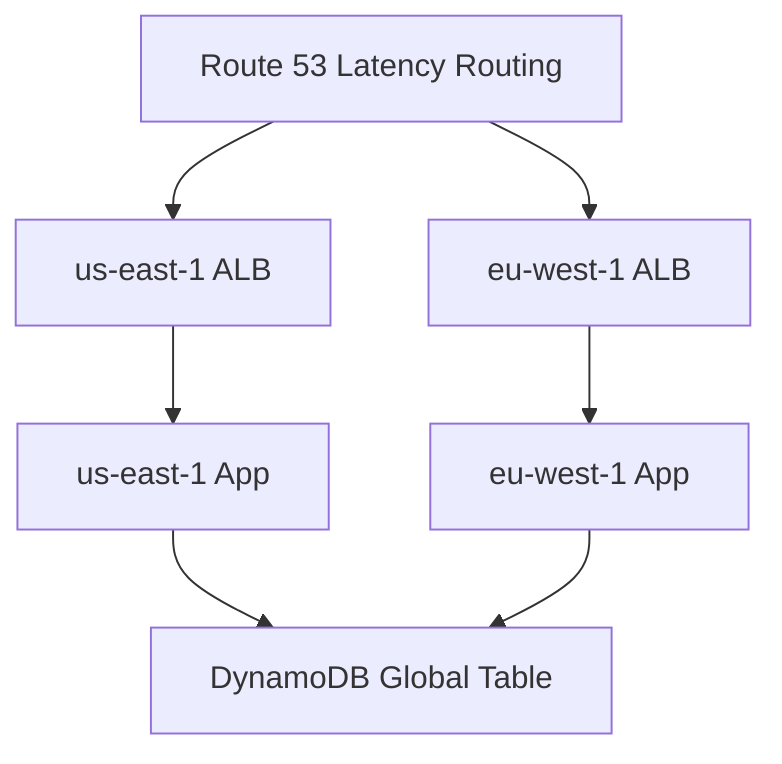

# How to Set Up Multi-Region Deployments for Disaster Recovery

Author: [nawazdhandala](https://github.com/nawazdhandala)

Tags: AWS, Multi-Region, Disaster Recovery, Route 53, Architecture

Description: Guide to setting up multi-region deployments on AWS for disaster recovery, covering active-passive and active-active patterns, data replication, and failover.

---

Multi-AZ protects you from data center failures. Multi-region protects you from something much worse - an entire AWS region going down. It's rare, but when it happens, every service in that region is affected. If your business can't tolerate hours of downtime, you need a multi-region strategy.

The tradeoff is clear: multi-region is more complex and more expensive than single-region. Let's look at the different approaches and when each one makes sense.

## Disaster Recovery Strategies

AWS defines four DR strategies, each with different cost and recovery time characteristics.



### 1. Backup and Restore
Copy your data to another region. If the primary fails, spin up infrastructure and restore from backups. Cheapest but slowest (hours to recover).

### 2. Pilot Light
Keep a minimal version of your environment running in the DR region - database replicas and core infrastructure. Scale it up when you need it. Recovery in minutes to hours.

### 3. Warm Standby
Run a scaled-down but fully functional copy in the DR region. During failover, scale it up to handle production traffic. Recovery in minutes.

### 4. Active-Active
Run full production workloads in both regions simultaneously. Users are routed to the nearest region. No failover needed - if one region fails, the other absorbs the traffic. Near-zero recovery time.

## Setting Up Pilot Light

Pilot light is the sweet spot for most organizations - affordable but with reasonable recovery time.

```typescript
// Primary region stack
import * as cdk from 'aws-cdk-lib';
import * as rds from 'aws-cdk-lib/aws-rds';
import * as s3 from 'aws-cdk-lib/aws-s3';

export class PrimaryRegionStack extends cdk.Stack {
  constructor(scope: cdk.App, id: string) {
    super(scope, id);

    // Primary Aurora cluster
    const primaryCluster = new rds.DatabaseCluster(this, 'PrimaryDB', {
      engine: rds.DatabaseClusterEngine.auroraPostgres({
        version: rds.AuroraPostgresEngineVersion.VER_15_4,
      }),
      instances: 2,
      instanceProps: {
        vpc: primaryVpc,
        instanceType: ec2.InstanceType.of(ec2.InstanceClass.R6G, ec2.InstanceSize.LARGE),
      },
    });

    // S3 bucket with cross-region replication
    const primaryBucket = new s3.Bucket(this, 'PrimaryBucket', {
      versioned: true, // Required for CRR
    });
  }
}
```

In the DR region, keep the database replica running but don't deploy compute resources until needed.

```typescript
// DR region stack - pilot light
export class DrRegionStack extends cdk.Stack {
  constructor(scope: cdk.App, id: string) {
    super(scope, id);

    // Aurora read replica in DR region (automatically kept in sync)
    const drCluster = new rds.DatabaseCluster(this, 'DrDB', {
      engine: rds.DatabaseClusterEngine.auroraPostgres({
        version: rds.AuroraPostgresEngineVersion.VER_15_4,
      }),
      instances: 1, // Minimal - scale up during failover
      instanceProps: {
        vpc: drVpc,
        instanceType: ec2.InstanceType.of(ec2.InstanceClass.R6G, ec2.InstanceSize.MEDIUM),
      },
      // This cluster is a read replica of the primary
    });

    // S3 bucket as replication destination
    const drBucket = new s3.Bucket(this, 'DrBucket', {
      versioned: true,
    });
  }
}
```

## Cross-Region Data Replication

### Aurora Global Database

Aurora Global Database replicates data across regions with less than 1 second of replication lag.

```typescript
// Aurora Global Database setup
const globalCluster = new rds.CfnGlobalCluster(this, 'GlobalCluster', {
  globalClusterIdentifier: 'my-global-cluster',
  sourceDbClusterIdentifier: primaryCluster.clusterIdentifier,
  engine: 'aurora-postgresql',
  engineVersion: '15.4',
});
```

### DynamoDB Global Tables

DynamoDB Global Tables provide active-active replication across regions.

```typescript
// DynamoDB Global Table
const table = new dynamodb.Table(this, 'GlobalTable', {
  tableName: 'UserData',
  partitionKey: { name: 'userId', type: dynamodb.AttributeType.STRING },
  billingMode: dynamodb.BillingMode.PAY_PER_REQUEST,
  replicationRegions: ['eu-west-1', 'ap-southeast-1'],
  // Point-in-time recovery for extra safety
  pointInTimeRecovery: true,
});
```

### S3 Cross-Region Replication

```typescript
// S3 CRR configuration
const replicationRole = new iam.Role(this, 'ReplicationRole', {
  assumedBy: new iam.ServicePrincipal('s3.amazonaws.com'),
});

// Grant permissions for replication
primaryBucket.grantRead(replicationRole);
drBucket.grantWrite(replicationRole);

// CRR rule (using L1 construct for full control)
const cfnBucket = primaryBucket.node.defaultChild as s3.CfnBucket;
cfnBucket.addPropertyOverride('ReplicationConfiguration', {
  Role: replicationRole.roleArn,
  Rules: [{
    Status: 'Enabled',
    Destination: {
      Bucket: drBucket.bucketArn,
      StorageClass: 'STANDARD',
    },
  }],
});
```

## DNS-Based Failover

Route 53 routes traffic between regions. For active-passive, use failover routing. For active-active, use latency-based or geolocation routing.

```typescript
// Route 53 failover between regions
const zone = route53.HostedZone.fromLookup(this, 'Zone', {
  domainName: 'example.com',
});

// Primary region record
new route53.CfnRecordSet(this, 'PrimaryRecord', {
  hostedZoneId: zone.hostedZoneId,
  name: 'app.example.com',
  type: 'A',
  setIdentifier: 'primary-us-east-1',
  failover: 'PRIMARY',
  aliasTarget: {
    dnsName: primaryAlb.loadBalancerDnsName,
    hostedZoneId: primaryAlb.loadBalancerCanonicalHostedZoneId,
    evaluateTargetHealth: true,
  },
  healthCheckId: primaryHealthCheck.attrHealthCheckId,
});

// DR region record
new route53.CfnRecordSet(this, 'DrRecord', {
  hostedZoneId: zone.hostedZoneId,
  name: 'app.example.com',
  type: 'A',
  setIdentifier: 'dr-eu-west-1',
  failover: 'SECONDARY',
  aliasTarget: {
    dnsName: drAlb.loadBalancerDnsName,
    hostedZoneId: drAlb.loadBalancerCanonicalHostedZoneId,
    evaluateTargetHealth: true,
  },
});
```

## Failover Runbook

Automated failover is ideal, but you should also have a manual runbook for scenarios where automation isn't appropriate.

```bash
#!/bin/bash
# failover-runbook.sh - Steps to failover to DR region

echo "Starting failover to DR region..."

# Step 1: Promote Aurora read replica to primary
aws rds failover-global-cluster \
  --global-cluster-identifier my-global-cluster \
  --target-db-cluster-identifier arn:aws:rds:eu-west-1:123456789:cluster:dr-cluster

# Step 2: Scale up DR compute
aws autoscaling update-auto-scaling-group \
  --auto-scaling-group-name dr-asg \
  --min-size 4 \
  --desired-capacity 8 \
  --region eu-west-1

# Step 3: Verify DR environment health
aws elbv2 describe-target-health \
  --target-group-arn arn:aws:elasticloadbalancing:eu-west-1:123456789:targetgroup/dr-tg \
  --region eu-west-1

# Step 4: Update Route 53 if not automatic
# (Usually handled by health checks, but force if needed)
echo "Failover initiated. Monitor Route 53 health checks for DNS switchover."
```

## Active-Active Pattern

For zero-downtime requirements, run active-active in both regions. This is the most expensive but provides the best user experience.



With DynamoDB Global Tables, both regions can read and write. Conflicts are resolved using last-writer-wins semantics.

## Cost Optimization

Multi-region is expensive. Here are ways to manage costs:

- Use pilot light instead of warm standby unless your RTO requires it
- Run smaller instances in the DR region and scale up during failover
- Use S3 Intelligent Tiering in the DR region
- Only replicate critical data, not everything

## Testing DR

Test your failover regularly. A DR plan that hasn't been tested is just a hope.

- Run failover tests quarterly at minimum
- Measure actual RTO and RPO against your targets
- Document everything that went wrong and fix it
- Use AWS Fault Injection Simulator for controlled chaos testing

For monitoring your multi-region deployment, see our guide on [building a logging and monitoring stack on AWS](https://oneuptime.com/blog/post/2026-02-12-build-logging-and-monitoring-stack-on-aws/view). Also check out [DNS failover with Route 53](https://oneuptime.com/blog/post/2026-02-12-set-up-dns-failover-with-route-53/view) for the DNS layer.

## Summary

Multi-region disaster recovery on AWS ranges from cheap-and-slow (backup and restore) to expensive-and-fast (active-active). Most organizations land on pilot light or warm standby as the right balance. The key is choosing the right strategy for your RTO/RPO requirements, setting up proper data replication, testing failover regularly, and accepting that the complexity cost is worth it for the services that truly can't afford extended downtime.
