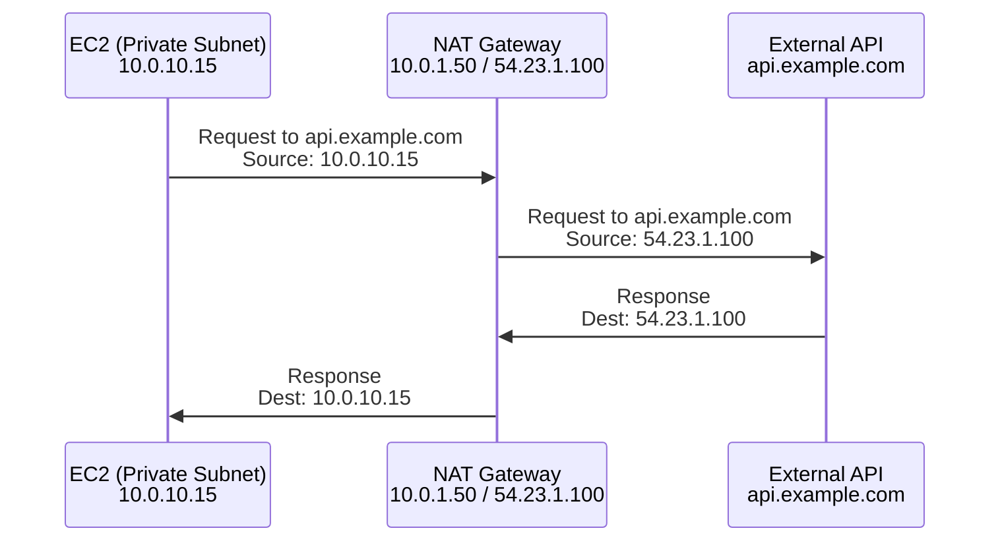

# How to Set Up a NAT Gateway for Private Subnet Internet Access

Author: [nawazdhandala](https://github.com/nawazdhandala)

Tags: AWS, VPC, Networking, NAT

Description: Configure a NAT gateway to give private subnet resources outbound internet access while keeping them hidden from incoming internet traffic.

---

Private subnets keep your resources safe from direct internet access. But those resources still need to reach the internet - for downloading software updates, calling external APIs, or pushing logs to third-party services. That's what a NAT gateway does. It lets private subnet resources initiate outbound connections to the internet while blocking any inbound connections from the internet.

Think of it as a one-way door. Traffic goes out, responses come back, but nobody outside can push the door open.

## How NAT Gateway Works

A NAT gateway sits in a public subnet and performs Network Address Translation. When a resource in a private subnet sends a packet to the internet, the NAT gateway replaces the source IP (the private IP) with its own Elastic IP. When the response comes back, the NAT gateway translates it back and forwards it to the original resource.



The external API only sees the NAT gateway's Elastic IP. It has no idea that a private instance behind it initiated the request.

## Creating a NAT Gateway

You need three things: a public subnet (where the NAT gateway lives), an Elastic IP, and a route in your private subnet's route table.

```bash
# Step 1: Allocate an Elastic IP for the NAT gateway
EIP_ALLOC=$(aws ec2 allocate-address \
  --domain vpc \
  --tag-specifications 'ResourceType=elastic-ip,Tags=[{Key=Name,Value=nat-gateway-eip}]' \
  --query 'AllocationId' \
  --output text)

echo "Elastic IP allocation: $EIP_ALLOC"
```

```bash
# Step 2: Create the NAT gateway in a public subnet
NAT_GW_ID=$(aws ec2 create-nat-gateway \
  --subnet-id $PUBLIC_SUBNET_ID \
  --allocation-id $EIP_ALLOC \
  --tag-specifications 'ResourceType=natgateway,Tags=[{Key=Name,Value=prod-nat-gateway}]' \
  --query 'NatGateway.NatGatewayId' \
  --output text)

echo "NAT Gateway: $NAT_GW_ID"
```

The NAT gateway takes a minute or two to become available. Wait for it before adding routes:

```bash
# Wait for the NAT gateway to become available
aws ec2 wait nat-gateway-available \
  --nat-gateway-ids $NAT_GW_ID

echo "NAT Gateway is ready"
```

```bash
# Step 3: Add a route in the private subnet's route table
aws ec2 create-route \
  --route-table-id $PRIVATE_RT_ID \
  --destination-cidr-block 0.0.0.0/0 \
  --nat-gateway-id $NAT_GW_ID
```

That's it. Resources in your private subnet can now reach the internet.

## Testing the Setup

SSH into a private subnet instance (via a bastion host or Session Manager) and verify:

```bash
# Test outbound internet access from a private subnet instance
curl -s https://checkip.amazonaws.com
# Should return the NAT gateway's Elastic IP

# Test package installation works
sudo yum update -y   # Amazon Linux
sudo apt update       # Ubuntu
```

If the curl returns the EIP you allocated, the NAT gateway is working correctly.

## High Availability: One NAT Gateway Per AZ

A single NAT gateway is a single point of failure. If the AZ it's in goes down, all private subnets lose internet access - even those in healthy AZs.

For production, deploy one NAT gateway per AZ and create per-AZ route tables:

```bash
# NAT gateway in AZ-a
NAT_GW_A=$(aws ec2 create-nat-gateway \
  --subnet-id $PUBLIC_SUBNET_AZ_A \
  --allocation-id $EIP_ALLOC_A \
  --query 'NatGateway.NatGatewayId' \
  --output text)

# NAT gateway in AZ-b
NAT_GW_B=$(aws ec2 create-nat-gateway \
  --subnet-id $PUBLIC_SUBNET_AZ_B \
  --allocation-id $EIP_ALLOC_B \
  --query 'NatGateway.NatGatewayId' \
  --output text)

# Wait for both
aws ec2 wait nat-gateway-available --nat-gateway-ids $NAT_GW_A $NAT_GW_B

# Route table for private subnets in AZ-a
aws ec2 create-route \
  --route-table-id $PRIVATE_RT_AZ_A \
  --destination-cidr-block 0.0.0.0/0 \
  --nat-gateway-id $NAT_GW_A

# Route table for private subnets in AZ-b
aws ec2 create-route \
  --route-table-id $PRIVATE_RT_AZ_B \
  --destination-cidr-block 0.0.0.0/0 \
  --nat-gateway-id $NAT_GW_B
```

Each private subnet routes through its own AZ's NAT gateway. If AZ-a goes down, AZ-b keeps working independently.

## CloudFormation Template

Here's the complete NAT gateway setup in CloudFormation with HA across two AZs:

```yaml
# nat-gateway-ha.yaml
Resources:
  # NAT Gateway in AZ-a
  NatEIP1:
    Type: AWS::EC2::EIP
    Properties:
      Domain: vpc
      Tags:
        - Key: Name
          Value: nat-eip-az-a

  NatGateway1:
    Type: AWS::EC2::NatGateway
    Properties:
      AllocationId: !GetAtt NatEIP1.AllocationId
      SubnetId: !Ref PublicSubnet1
      Tags:
        - Key: Name
          Value: nat-gateway-az-a

  # NAT Gateway in AZ-b
  NatEIP2:
    Type: AWS::EC2::EIP
    Properties:
      Domain: vpc
      Tags:
        - Key: Name
          Value: nat-eip-az-b

  NatGateway2:
    Type: AWS::EC2::NatGateway
    Properties:
      AllocationId: !GetAtt NatEIP2.AllocationId
      SubnetId: !Ref PublicSubnet2
      Tags:
        - Key: Name
          Value: nat-gateway-az-b

  # Private route table for AZ-a
  PrivateRouteTable1:
    Type: AWS::EC2::RouteTable
    Properties:
      VpcId: !Ref VPC

  PrivateRoute1:
    Type: AWS::EC2::Route
    Properties:
      RouteTableId: !Ref PrivateRouteTable1
      DestinationCidrBlock: 0.0.0.0/0
      NatGatewayId: !Ref NatGateway1

  PrivateSubnet1RTAssoc:
    Type: AWS::EC2::SubnetRouteTableAssociation
    Properties:
      SubnetId: !Ref PrivateSubnet1
      RouteTableId: !Ref PrivateRouteTable1

  # Private route table for AZ-b
  PrivateRouteTable2:
    Type: AWS::EC2::RouteTable
    Properties:
      VpcId: !Ref VPC

  PrivateRoute2:
    Type: AWS::EC2::Route
    Properties:
      RouteTableId: !Ref PrivateRouteTable2
      DestinationCidrBlock: 0.0.0.0/0
      NatGatewayId: !Ref NatGateway2

  PrivateSubnet2RTAssoc:
    Type: AWS::EC2::SubnetRouteTableAssociation
    Properties:
      SubnetId: !Ref PrivateSubnet2
      RouteTableId: !Ref PrivateRouteTable2
```

## Cost Breakdown

NAT gateways aren't free, and the costs can sneak up on you:

- **Hourly charge**: ~$0.045/hour per NAT gateway (~$32/month)
- **Data processing**: $0.045 per GB processed
- **Two NAT gateways for HA**: ~$64/month baseline

The data processing charge is what gets expensive. If your private instances are downloading large datasets or serving lots of traffic through the NAT, costs add up quickly. Consider using VPC endpoints for AWS services like S3 and DynamoDB - they bypass the NAT gateway entirely and are free for gateway endpoints. See [setting up VPC gateway endpoints for S3 and DynamoDB](https://oneuptime.com/blog/post/2026-02-12-set-up-vpc-gateway-endpoints-s3-dynamodb/view) for more.

## Monitoring NAT Gateway

Keep an eye on your NAT gateway metrics to catch issues early:

```bash
# Check NAT gateway connections and data transfer
aws cloudwatch get-metric-statistics \
  --namespace AWS/NATGateway \
  --metric-name BytesOutToDestination \
  --dimensions Name=NatGatewayId,Value=$NAT_GW_ID \
  --start-time $(date -u -d '1 hour ago' +%Y-%m-%dT%H:%M:%S) \
  --end-time $(date -u +%Y-%m-%dT%H:%M:%S) \
  --period 300 \
  --statistics Sum
```

Set up CloudWatch alarms for `ErrorPortAllocation` - this means the NAT gateway is running out of ports and can't create new connections. It happens under very heavy load and can cause connection failures.

If cost is a concern and you can tolerate some risk, check out [choosing between NAT gateway and NAT instance](https://oneuptime.com/blog/post/2026-02-12-choose-between-nat-gateway-and-nat-instance/view) for a cheaper alternative.

## Wrapping Up

NAT gateways are essential for private subnet internet access. The setup is straightforward - EIP, NAT gateway in a public subnet, route in the private subnet. For production, use one per AZ and monitor your data transfer costs. The monthly bill can grow quickly if you're not paying attention, so consider VPC endpoints for high-traffic AWS service connections.
