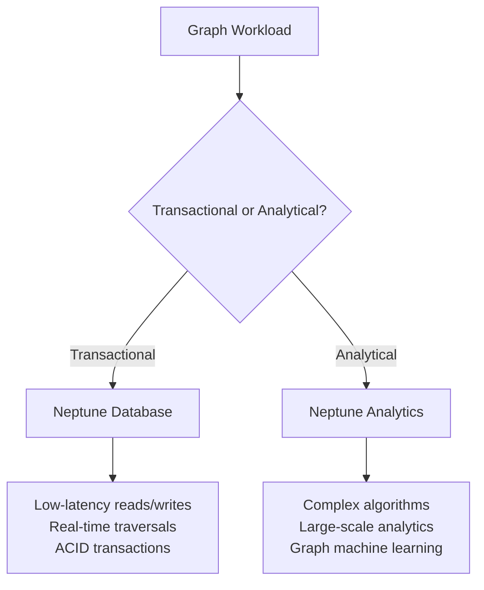

# How to Set Up Neptune Analytics for Graph Queries

Author: [nawazdhandala](https://github.com/nawazdhandala)

Tags: AWS, Neptune, Graph Database, Analytics, openCypher, Data Analysis

Description: Learn how to use Neptune Analytics for fast graph analytics queries on large datasets without managing database infrastructure.

---

Graph databases are powerful for modeling relationships - social networks, fraud detection, knowledge graphs, recommendation engines. But running complex analytical queries on large graphs with traditional Neptune can be slow. Analytical graph queries often need to traverse millions of edges, compute centrality scores, or find communities, and these operations do not perform well on a database optimized for transactional workloads.

Neptune Analytics is a separate service designed specifically for graph analytics. It loads your graph data into memory-optimized compute and lets you run analytical algorithms and queries that would be impractical on a transactional graph database. Think of it as the difference between OLTP and OLAP, but for graphs.

## When to Use Neptune Analytics vs. Neptune Database



Use **Neptune Database** for:
- Real-time graph queries in your application
- CRUD operations on graph data
- Low-latency lookups and short traversals

Use **Neptune Analytics** for:
- PageRank, community detection, shortest path algorithms
- Large-scale graph analytics across millions of nodes
- Graph-based machine learning feature extraction
- Ad-hoc analytical queries on graph data

## Creating a Neptune Analytics Graph

### Step 1: Create the Graph

Neptune Analytics graphs are standalone resources. You specify the memory size based on your data volume.

```bash
# Create a Neptune Analytics graph with 128 GB of memory
aws neptune-graph create-graph \
  --graph-name fraud-detection-graph \
  --provisioned-memory 128 \
  --public-connectivity \
  --vector-search-configuration dimension=256 \
  --tags Key=Environment,Value=production
```

The `provisioned-memory` parameter determines how much data you can load. As a rough guide, you need about 4x the raw data size in memory.

### Step 2: Wait for the Graph to Be Available

```bash
# Check the graph status
aws neptune-graph get-graph \
  --graph-identifier g-abc123def456 \
  --query '{Status:status,Endpoint:endpoint}'
```

## Loading Data

### Load from S3

Prepare your data in CSV format and load it from S3.

First, create node and edge files.

Node file (nodes.csv):
```
~id,~label,name:String,risk_score:Double
p1,Person,Alice,0.1
p2,Person,Bob,0.8
p3,Person,Charlie,0.3
a1,Account,ACC-001,0.0
a2,Account,ACC-002,0.0
```

Edge file (edges.csv):
```
~id,~source,~target,~label,amount:Double,timestamp:String
e1,p1,a1,OWNS,,2026-01-01
e2,p2,a2,OWNS,,2026-01-15
e3,a1,a2,TRANSFERRED,5000.00,2026-02-01
e4,a2,a1,TRANSFERRED,4950.00,2026-02-02
```

Load the data.

```bash
# Start a data import from S3
aws neptune-graph start-import-task \
  --graph-identifier g-abc123def456 \
  --source "s3://my-graph-data/fraud-detection/" \
  --role-arn arn:aws:iam::123456789012:role/NeptuneAnalyticsLoadRole \
  --format CSV
```

### Load from Neptune Database

If you already have data in Neptune Database, you can load it directly.

```bash
# Import data from an existing Neptune Database cluster
aws neptune-graph start-import-task \
  --graph-identifier g-abc123def456 \
  --source "arn:aws:neptune:us-east-1:123456789012:cluster:my-neptune-cluster" \
  --role-arn arn:aws:iam::123456789012:role/NeptuneAnalyticsLoadRole \
  --format NEPTUNE_DATABASE
```

## Running Graph Queries

Neptune Analytics supports openCypher for querying.

### Basic Traversal

```bash
# Query the graph using openCypher via the CLI
aws neptune-graph execute-query \
  --graph-identifier g-abc123def456 \
  --query-string "MATCH (p:Person)-[:OWNS]->(a:Account) RETURN p.name, a.~id AS account" \
  --language OPEN_CYPHER
```

### Finding Suspicious Transaction Patterns

```cypher
// Find circular money transfers (potential money laundering)
MATCH path = (a1:Account)-[:TRANSFERRED]->(a2:Account)-[:TRANSFERRED]->(a3:Account)-[:TRANSFERRED]->(a1)
WHERE a1 <> a2 AND a2 <> a3
RETURN [n IN nodes(path) | n.~id] AS accounts,
       [r IN relationships(path) | r.amount] AS amounts
ORDER BY reduce(total = 0, r IN relationships(path) | total + r.amount) DESC
LIMIT 20
```

### Degree Centrality

Find the most connected nodes in your graph.

```cypher
// Find accounts with the most transfer connections
MATCH (a:Account)-[t:TRANSFERRED]-()
WITH a, count(t) as degree
WHERE degree > 10
RETURN a.~id AS account, degree
ORDER BY degree DESC
LIMIT 50
```

## Running Graph Algorithms

Neptune Analytics includes built-in graph algorithms that run efficiently on the in-memory graph.

### PageRank

Find the most important nodes in your graph.

```bash
# Run PageRank algorithm
aws neptune-graph execute-query \
  --graph-identifier g-abc123def456 \
  --query-string "
    CALL neptune.algo.pageRank(
      {edgeLabels: ['TRANSFERRED'], maxIterations: 20, dampingFactor: 0.85}
    )
    YIELD node, score
    WITH node, score
    WHERE labels(node) = ['Account']
    RETURN node.~id AS account, score
    ORDER BY score DESC
    LIMIT 20
  " \
  --language OPEN_CYPHER
```

### Community Detection

Find clusters of closely connected nodes.

```cypher
// Detect communities of connected accounts
CALL neptune.algo.community(
  {edgeLabels: ['TRANSFERRED'], maxIterations: 10}
)
YIELD node, community
WITH community, collect(node.~id) AS members, count(*) AS size
WHERE size > 3
RETURN community, members, size
ORDER BY size DESC
LIMIT 10
```

### Shortest Path

Find the shortest connection between two nodes.

```cypher
// Find the shortest path between two accounts
MATCH (source:Account {~id: 'ACC-001'}), (target:Account {~id: 'ACC-999'})
CALL neptune.algo.shortestPath(source, target, {edgeLabels: ['TRANSFERRED']})
YIELD path, distance
RETURN [n IN nodes(path) | n.~id] AS accounts, distance
```

## Using Neptune Analytics with Python

```python
# Query Neptune Analytics from Python using boto3
import boto3
import json

client = boto3.client('neptune-graph')

def run_query(graph_id, query):
    """Execute an openCypher query against Neptune Analytics."""
    response = client.execute_query(
        graphIdentifier=graph_id,
        queryString=query,
        language='OPEN_CYPHER'
    )

    # Parse the response payload
    result = json.loads(response['payload'].read())
    return result['results']

# Find high-risk accounts
results = run_query('g-abc123def456', """
    MATCH (p:Person)-[:OWNS]->(a:Account)
    WHERE p.risk_score > 0.7
    MATCH (a)-[t:TRANSFERRED]->()
    WITH p, a, sum(t.amount) AS total_transferred
    WHERE total_transferred > 10000
    RETURN p.name, a.~id AS account, total_transferred
    ORDER BY total_transferred DESC
""")

for row in results:
    print(f"{row['p.name']} ({row['account']}): ${row['total_transferred']:,.2f}")
```

## Vector Search

Neptune Analytics includes vector search capabilities for similarity queries.

```cypher
// Find accounts with similar transaction patterns using vector embeddings
CALL neptune.algo.vectors.topKByNode(
  {node: account1, k: 10, concurrency: 4}
)
YIELD node, score
RETURN node.~id AS similar_account, score
ORDER BY score DESC
```

## Monitoring

```bash
# Monitor query performance
aws cloudwatch get-metric-statistics \
  --namespace AWS/NeptuneGraph \
  --metric-name QueryLatency \
  --dimensions Name=GraphId,Value=g-abc123def456 \
  --start-time $(date -u -d '1 hour ago' +%Y-%m-%dT%H:%M:%S) \
  --end-time $(date -u +%Y-%m-%dT%H:%M:%S) \
  --period 300 \
  --statistics Average,p99

# Monitor memory utilization
aws cloudwatch get-metric-statistics \
  --namespace AWS/NeptuneGraph \
  --metric-name MemoryUtilization \
  --dimensions Name=GraphId,Value=g-abc123def456 \
  --start-time $(date -u -d '24 hours ago' +%Y-%m-%dT%H:%M:%S) \
  --end-time $(date -u +%Y-%m-%dT%H:%M:%S) \
  --period 3600 \
  --statistics Average,Maximum
```

## Summary

Neptune Analytics gives you a purpose-built engine for graph analytics workloads. Instead of running expensive analytical queries on your transactional graph database, you load your data into Neptune Analytics and run PageRank, community detection, shortest path, and other algorithms at scale. Combined with openCypher query support and vector search, it is a solid platform for fraud detection, recommendation systems, and knowledge graph analytics.

For more on graph databases, see our guide on [Neptune Serverless](https://oneuptime.com/blog/post/use-neptune-serverless/view) for transactional graph workloads.
