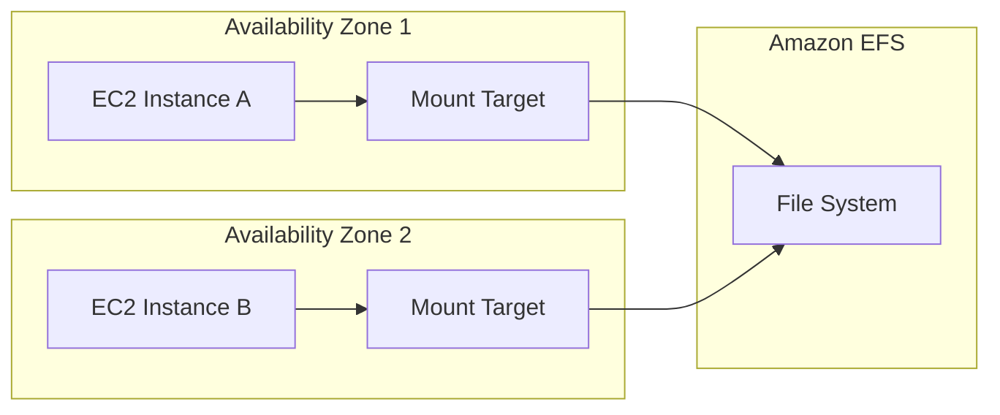

# How to Set Up NFS on EC2 Using EFS

Author: [nawazdhandala](https://github.com/nawazdhandala)

Tags: AWS, EC2, EFS, Storage, NFS

Description: Learn how to set up Amazon Elastic File System (EFS) as a shared NFS mount across multiple EC2 instances with step-by-step CLI instructions.

---

Need to share files between multiple EC2 instances? Amazon EFS (Elastic File System) is the simplest way to do it. EFS gives you a fully managed NFS filesystem that automatically scales, works across multiple Availability Zones, and requires zero maintenance. You mount it just like any other NFS share, and AWS handles replication, backups, and availability behind the scenes.

Let's set up an EFS filesystem from scratch and mount it on your EC2 instances.

## How EFS Works

EFS creates mount targets in each Availability Zone of your VPC. Your EC2 instances connect to the mount target in their AZ over NFS v4.1. The data is automatically replicated across multiple AZs for durability.



Each mount target gets an IP address in your subnet and an ENI (Elastic Network Interface). Traffic stays within your VPC - it never crosses the public internet.

## Step 1: Create Security Groups

EFS uses NFS port 2049. You need a security group that allows traffic on this port between your instances and the mount targets.

Create a security group for EFS mount targets:

```bash
# Get your VPC ID
VPC_ID=$(aws ec2 describe-vpcs \
    --filters "Name=isDefault,Values=true" \
    --query "Vpcs[0].VpcId" --output text)

# Create security group for EFS
EFS_SG=$(aws ec2 create-security-group \
    --group-name efs-mount-sg \
    --description "Security group for EFS mount targets" \
    --vpc-id $VPC_ID \
    --query "GroupId" --output text)

echo "EFS Security Group: $EFS_SG"

# Get the security group of your EC2 instances
EC2_SG="sg-0your-ec2-sg-id"

# Allow NFS traffic from EC2 instances to EFS mount targets
aws ec2 authorize-security-group-ingress \
    --group-id $EFS_SG \
    --protocol tcp \
    --port 2049 \
    --source-group $EC2_SG
```

## Step 2: Create the EFS File System

Create the filesystem with your preferred settings.

Create an EFS filesystem with General Purpose performance mode:

```bash
# Create the file system
FS_ID=$(aws efs create-file-system \
    --performance-mode generalPurpose \
    --throughput-mode bursting \
    --encrypted \
    --tags Key=Name,Value=shared-efs \
    --query "FileSystemId" --output text)

echo "File System ID: $FS_ID"

# Wait for it to become available
aws efs describe-file-systems \
    --file-system-id $FS_ID \
    --query "FileSystems[0].LifeCycleState"
```

A few notes on the options:

- **Performance mode**: `generalPurpose` works for most workloads. Use `maxIO` only for highly parallelized workloads with thousands of instances (it adds slightly higher latency).
- **Throughput mode**: `bursting` scales throughput with filesystem size. `elastic` provides automatic scaling up to 10 GB/s. `provisioned` lets you set a fixed throughput.
- **Encryption**: Always enable encryption. There's no performance penalty and it protects your data at rest.

## Step 3: Create Mount Targets

You need one mount target per Availability Zone where your EC2 instances run.

Create mount targets in each AZ:

```bash
# Get subnet IDs for each AZ
SUBNETS=$(aws ec2 describe-subnets \
    --filters "Name=vpc-id,Values=$VPC_ID" \
    --query "Subnets[*].[SubnetId,AvailabilityZone]" \
    --output text)

echo "Available subnets:"
echo "$SUBNETS"

# Create mount targets in each subnet
# Repeat for each subnet/AZ where you have instances
aws efs create-mount-target \
    --file-system-id $FS_ID \
    --subnet-id subnet-0abc123 \
    --security-groups $EFS_SG

aws efs create-mount-target \
    --file-system-id $FS_ID \
    --subnet-id subnet-0def456 \
    --security-groups $EFS_SG

# Verify mount targets are created
aws efs describe-mount-targets \
    --file-system-id $FS_ID \
    --query "MountTargets[*].[MountTargetId,AvailabilityZoneName,LifeCycleState,IpAddress]" \
    --output table
```

Wait until all mount targets show `available` as their lifecycle state. This usually takes about a minute.

## Step 4: Mount EFS on EC2 Instances

You have two options for mounting: the EFS mount helper (recommended) or standard NFS mount.

### Option A: Using the EFS Mount Helper (Recommended)

Install the amazon-efs-utils package and mount:

```bash
# Install the EFS mount helper
# Amazon Linux 2023
sudo yum install -y amazon-efs-utils

# Ubuntu
# sudo apt-get install -y amazon-efs-utils

# Create mount point
sudo mkdir -p /efs

# Mount using the helper (with encryption in transit)
sudo mount -t efs -o tls $FS_ID:/ /efs

# Verify the mount
df -h /efs
mount | grep efs
```

The EFS mount helper handles DNS resolution, encryption in transit (TLS), and uses recommended mount options automatically.

### Option B: Using Standard NFS Mount

If you prefer the standard NFS approach:

```bash
# Install NFS client
sudo yum install -y nfs-utils  # Amazon Linux
# sudo apt-get install -y nfs-common  # Ubuntu

# Create mount point
sudo mkdir -p /efs

# Mount using NFS
# Replace fs-0123456789abcdef0 with your filesystem ID
sudo mount -t nfs4 -o nfsvers=4.1,rsize=1048576,wsize=1048576,hard,timeo=600,retrans=2,noresvport \
    $FS_ID.efs.us-east-1.amazonaws.com:/ /efs

# Verify
df -h /efs
```

## Step 5: Make the Mount Persistent

Add the mount to /etc/fstab so it survives reboots.

Add EFS mount to fstab:

```bash
# Using EFS mount helper
echo "$FS_ID:/ /efs efs _netdev,tls 0 0" | sudo tee -a /etc/fstab

# Or using NFS
echo "$FS_ID.efs.us-east-1.amazonaws.com:/ /efs nfs4 nfsvers=4.1,rsize=1048576,wsize=1048576,hard,timeo=600,retrans=2,noresvport,_netdev 0 0" | sudo tee -a /etc/fstab

# Test the fstab entry
sudo umount /efs
sudo mount -a
df -h /efs
```

The `_netdev` option tells the OS to wait for the network to be ready before attempting the mount.

## Step 6: Set Up EFS Access Points (Optional)

Access points let you create application-specific entry points into the filesystem with enforced POSIX permissions.

Create an access point for an application:

```bash
# Create an access point with specific root directory and POSIX identity
aws efs create-access-point \
    --file-system-id $FS_ID \
    --posix-user Uid=1000,Gid=1000 \
    --root-directory "Path=/app-data,CreationInfo={OwnerUid=1000,OwnerGid=1000,Permissions=755}" \
    --tags Key=Name,Value=app-data-ap

# Mount using the access point
sudo mount -t efs -o tls,accesspoint=fsap-0123456789abcdef0 $FS_ID:/ /app-data
```

## Performance Tuning

EFS performance depends on several factors. Here are the main levers you can pull.

Tune EFS performance settings:

```bash
# Switch to Elastic throughput mode for unpredictable workloads
aws efs update-file-system \
    --file-system-id $FS_ID \
    --throughput-mode elastic

# Or set provisioned throughput if you know your needs
aws efs update-file-system \
    --file-system-id $FS_ID \
    --throughput-mode provisioned \
    --provisioned-throughput-in-mibps 256
```

On the client side, you can optimize NFS performance:

```bash
# Check current NFS statistics
nfsstat -c

# Monitor NFS performance in real time
nfsiostat 5
```

Some practical tips for better EFS performance:
- Use larger I/O sizes when possible (EFS is optimized for large sequential operations)
- Parallelize your file operations across multiple threads
- Avoid workloads with millions of tiny files - EFS charges per request and metadata operations add up
- Consider EFS One Zone storage class if you don't need multi-AZ and want lower cost

## Enabling Lifecycle Management

EFS supports automatic lifecycle management to move infrequently accessed files to a cheaper storage class.

Configure lifecycle policies to reduce costs:

```bash
# Move files to Infrequent Access after 30 days of no access
aws efs put-lifecycle-configuration \
    --file-system-id $FS_ID \
    --lifecycle-policies \
        TransitionToIA=AFTER_30_DAYS \
        TransitionToArchive=AFTER_90_DAYS \
        TransitionToPrimaryStorageClass=AFTER_1_ACCESS
```

The IA (Infrequent Access) storage class costs about 92% less than Standard. The Archive class is even cheaper. Files are automatically moved back to Standard on first access if you set the `TransitionToPrimaryStorageClass` policy.

## Backup and Monitoring

Enable automatic backups for your EFS filesystem:

```bash
# Enable automatic backups (uses AWS Backup)
aws efs put-backup-policy \
    --file-system-id $FS_ID \
    --backup-policy Status=ENABLED
```

Set up CloudWatch monitoring for the filesystem:

```bash
# Get filesystem metrics
aws cloudwatch get-metric-statistics \
    --namespace AWS/EFS \
    --metric-name TotalIOBytes \
    --dimensions Name=FileSystemId,Value=$FS_ID \
    --start-time $(date -u -d '1 hour ago' +%Y-%m-%dT%H:%M:%S) \
    --end-time $(date -u +%Y-%m-%dT%H:%M:%S) \
    --period 300 \
    --statistics Sum
```

## EFS vs. Other Shared Storage Options

EFS is the go-to choice for most shared storage needs on AWS, but it's worth knowing the alternatives:

- **EFS** - Best for general-purpose shared file access. Simple NFS interface. Scales automatically.
- **FSx for Lustre** - Best for HPC and ML workloads. Massive throughput (hundreds of GB/s).
- **FSx for NetApp ONTAP** - Enterprise features like snapshots, cloning, multiprotocol access.
- **EBS Multi-Attach** - Shared block storage for cluster-aware applications. See our [Multi-Attach guide](https://oneuptime.com/blog/post/configure-ebs-multi-attach-shared-storage/view).

For most teams, EFS hits the sweet spot of simplicity, reliability, and performance. Set it up once, and it just works.
