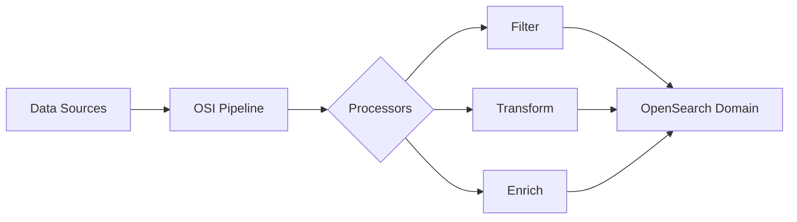

# How to Set Up OpenSearch Ingestion Pipelines

Author: [nawazdhandala](https://github.com/nawazdhandala)

Tags: AWS, OpenSearch, Data Ingestion, Streaming

Description: Learn how to configure Amazon OpenSearch Ingestion pipelines to stream data from various sources into your OpenSearch domains with transformations and filtering.

---

Amazon OpenSearch Ingestion (OSI) is a fully managed, serverless data collector that delivers data to your OpenSearch domains. Think of it as a managed pipeline that sits between your data sources and OpenSearch, handling transformations, filtering, and routing without you needing to manage any infrastructure.

Before OSI existed, most teams ran Logstash or Fluentd on EC2 instances to get data into their OpenSearch clusters. That meant more servers to manage, more things to monitor, and more things to break at 3 AM. OSI eliminates that middle layer entirely.

## How OpenSearch Ingestion Works

OSI is built on top of Data Prepper, the open-source data collector from the OpenSearch project. A pipeline definition tells OSI where to pull data from (sources), what to do with it (processors), and where to send it (sinks).



## Step 1: Set Up IAM Roles

Before creating a pipeline, you need an IAM role that gives OSI permission to write to your OpenSearch domain and read from your data sources.

```bash
# Create the trust policy for the pipeline role
cat > osi-trust-policy.json << 'EOF'
{
  "Version": "2012-10-17",
  "Statement": [{
    "Effect": "Allow",
    "Principal": {
      "Service": "osis-pipelines.amazonaws.com"
    },
    "Action": "sts:AssumeRole"
  }]
}
EOF

# Create the IAM role
aws iam create-role \
  --role-name OSIPipelineRole \
  --assume-role-policy-document file://osi-trust-policy.json

# Attach permissions for OpenSearch access
cat > osi-permissions.json << 'EOF'
{
  "Version": "2012-10-17",
  "Statement": [{
    "Effect": "Allow",
    "Action": "es:DescribeDomain",
    "Resource": "arn:aws:es:us-east-1:123456789012:domain/*"
  }, {
    "Effect": "Allow",
    "Action": "es:ESHttp*",
    "Resource": "arn:aws:es:us-east-1:123456789012:domain/my-domain/*"
  }]
}
EOF

aws iam put-role-policy \
  --role-name OSIPipelineRole \
  --policy-name OSIPermissions \
  --policy-document file://osi-permissions.json
```

## Step 2: Create a Basic Pipeline

Let's start with a straightforward pipeline that accepts HTTP input and writes to OpenSearch. This is the simplest configuration and is great for testing.

```yaml
# basic-pipeline.yaml
version: "2"
log-pipeline:
  source:
    http:
      path: "/log/ingest"
  processor:
    - date:
        from_time_received: true
        destination: "@timestamp"
  sink:
    - opensearch:
        hosts:
          - "https://my-domain.us-east-1.es.amazonaws.com"
        index: "application-logs-%{yyyy.MM.dd}"
        aws:
          sts_role_arn: "arn:aws:iam::123456789012:role/OSIPipelineRole"
          region: "us-east-1"
```

Deploy it with the CLI.

```bash
# Create the pipeline
aws osis create-pipeline \
  --pipeline-name my-log-pipeline \
  --min-units 1 \
  --max-units 4 \
  --pipeline-configuration-body file://basic-pipeline.yaml \
  --log-publishing-options \
    IsLoggingEnabled=true,CloudWatchLogDestination={LogGroup="/aws/osis/my-log-pipeline"}
```

## Step 3: Add Processors for Data Transformation

The real power of OSI comes from processors. You can chain multiple processors to transform, filter, and enrich your data before it hits OpenSearch.

Here's a pipeline that parses Apache access logs, extracts fields, adds geo-IP data, and drops health check requests.

```yaml
# advanced-pipeline.yaml
version: "2"
apache-log-pipeline:
  source:
    http:
      path: "/apache/logs"
  processor:
    # Parse the raw log line using grok patterns
    - grok:
        match:
          log:
            - "%{COMMONAPACHELOG}"
    # Convert string fields to appropriate types
    - convert_entry_type:
        key: "response"
        type: "integer"
    - convert_entry_type:
        key: "bytes"
        type: "integer"
    # Add geo-IP information based on client IP
    - geoip_enrichment:
        source: "clientip"
        target: "geo"
    # Drop health check noise from load balancers
    - drop_events:
        drop_when: '/request =~ "^GET /health"'
    # Add a timestamp from the log entry
    - date:
        match:
          timestamp:
            - "dd/MMM/yyyy:HH:mm:ss Z"
        destination: "@timestamp"
  sink:
    - opensearch:
        hosts:
          - "https://my-domain.us-east-1.es.amazonaws.com"
        index: "apache-access-%{yyyy.MM.dd}"
        aws:
          sts_role_arn: "arn:aws:iam::123456789012:role/OSIPipelineRole"
          region: "us-east-1"
```

## Step 4: Ingest from S3

One of the most common patterns is pulling data from S3. This works well for batch processing of log files that land in S3 via other services.

```yaml
# s3-pipeline.yaml
version: "2"
s3-log-pipeline:
  source:
    s3:
      # SQS queue that receives S3 event notifications
      notification_type: "sqs"
      codec:
        newline:
      compression: "gzip"
      sqs:
        queue_url: "https://sqs.us-east-1.amazonaws.com/123456789012/s3-log-notifications"
      aws:
        sts_role_arn: "arn:aws:iam::123456789012:role/OSIPipelineRole"
        region: "us-east-1"
  processor:
    - grok:
        match:
          message:
            - "%{TIMESTAMP_ISO8601:timestamp} %{LOGLEVEL:level} %{GREEDYDATA:msg}"
    - date:
        match:
          timestamp:
            - "yyyy-MM-dd'T'HH:mm:ss.SSS'Z'"
        destination: "@timestamp"
  sink:
    - opensearch:
        hosts:
          - "https://my-domain.us-east-1.es.amazonaws.com"
        index: "s3-logs-%{yyyy.MM.dd}"
        aws:
          sts_role_arn: "arn:aws:iam::123456789012:role/OSIPipelineRole"
          region: "us-east-1"
```

You'll also need to set up the SQS queue and S3 event notification.

```bash
# Create SQS queue for S3 notifications
aws sqs create-queue --queue-name s3-log-notifications

# Configure S3 bucket to send notifications to SQS
aws s3api put-bucket-notification-configuration \
  --bucket my-log-bucket \
  --notification-configuration '{
    "QueueConfigurations": [{
      "QueueArn": "arn:aws:sqs:us-east-1:123456789012:s3-log-notifications",
      "Events": ["s3:ObjectCreated:*"],
      "Filter": {
        "Key": {
          "FilterRules": [{
            "Name": "prefix",
            "Value": "logs/"
          }]
        }
      }
    }]
  }'
```

## Step 5: Pipeline with Multiple Sinks

Sometimes you want to route different data to different indices or even different OpenSearch domains. OSI supports multiple sinks with conditional routing.

```yaml
# multi-sink-pipeline.yaml
version: "2"
multi-route-pipeline:
  source:
    http:
      path: "/events/ingest"
  processor:
    - date:
        from_time_received: true
        destination: "@timestamp"
  route:
    - errors: '/level == "ERROR" or /level == "FATAL"'
    - metrics: '/type == "metric"'
  sink:
    # Error logs go to a dedicated index with longer retention
    - opensearch:
        hosts:
          - "https://my-domain.us-east-1.es.amazonaws.com"
        index: "error-logs-%{yyyy.MM.dd}"
        routes:
          - errors
        aws:
          sts_role_arn: "arn:aws:iam::123456789012:role/OSIPipelineRole"
          region: "us-east-1"
    # Metrics go to a separate index
    - opensearch:
        hosts:
          - "https://my-domain.us-east-1.es.amazonaws.com"
        index: "app-metrics-%{yyyy.MM.dd}"
        routes:
          - metrics
        aws:
          sts_role_arn: "arn:aws:iam::123456789012:role/OSIPipelineRole"
          region: "us-east-1"
    # Everything else goes to a general index
    - opensearch:
        hosts:
          - "https://my-domain.us-east-1.es.amazonaws.com"
        index: "general-logs-%{yyyy.MM.dd}"
        aws:
          sts_role_arn: "arn:aws:iam::123456789012:role/OSIPipelineRole"
          region: "us-east-1"
```

## Scaling and Monitoring

OSI pipelines auto-scale between your configured min and max units. Each Ingestion OCU (OpenSearch Compute Unit) provides roughly 1 vCPU and 4 GB of memory. Monitor your pipeline through CloudWatch.

```bash
# Check pipeline status
aws osis get-pipeline --pipeline-name my-log-pipeline \
  --query 'Pipeline.{Status:Status,MinUnits:MinUnits,MaxUnits:MaxUnits,Endpoint:IngestEndpointUrls}'

# View CloudWatch metrics for the pipeline
aws cloudwatch get-metric-statistics \
  --namespace "AWS/OSIS" \
  --metric-name "recordsIn.count" \
  --dimensions Name=PipelineName,Value=my-log-pipeline \
  --start-time "$(date -u -d '1 hour ago' +%Y-%m-%dT%H:%M:%S)" \
  --end-time "$(date -u +%Y-%m-%dT%H:%M:%S)" \
  --period 300 \
  --statistics Sum
```

For production pipelines, make sure you've got alerting configured for pipeline errors. If your ingestion pipeline goes down, data backs up fast. You can set up [CloudWatch alarms](https://oneuptime.com/blog/post/2026-02-12-set-up-cloudwatch-alarms-for-ec2-cpu-and-memory/view) to catch failures early.

## Sending Data to Your Pipeline

Once the pipeline is running, send data to it using any HTTP client. The pipeline endpoint is provided after creation.

```bash
# Send a test log event to the pipeline
curl -X POST "https://my-log-pipeline-abc123.us-east-1.osis.amazonaws.com/log/ingest" \
  -H "Content-Type: application/json" \
  -d '[
    {
      "message": "User login successful",
      "level": "INFO",
      "service": "auth-service",
      "user_id": "u-12345"
    }
  ]'
```

OSI pipelines are a solid choice when you want to simplify your ingestion architecture. They remove the need for self-managed Logstash or Fluentd instances, scale automatically, and integrate natively with AWS services. The YAML-based configuration makes pipelines version-controllable and reproducible across environments.
