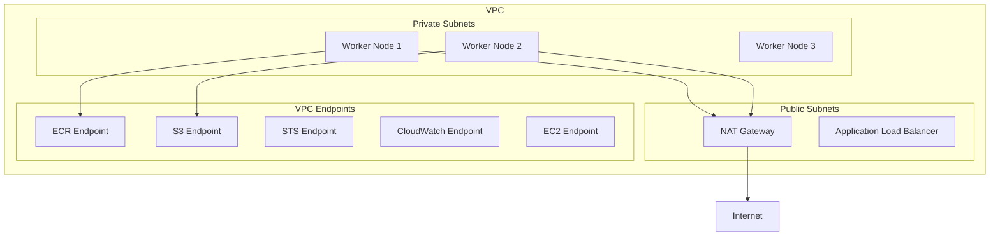

# How to Set Up Private EKS Clusters

Author: [nawazdhandala](https://github.com/nawazdhandala)

Tags: AWS, EKS, Kubernetes, Security, Networking

Description: Complete guide to creating and managing private Amazon EKS clusters where the API server and nodes have no public internet access.

---

A private EKS cluster is one where the Kubernetes API server endpoint is only accessible from within your VPC, and the worker nodes have no direct internet access. It's the recommended architecture for production workloads that handle sensitive data, comply with regulations like PCI-DSS or HIPAA, or simply follow the principle of least exposure.

Setting up a private cluster requires more networking configuration than a standard cluster, but the security benefits are significant. Let's walk through it.

## What Makes a Cluster "Private"

A fully private EKS cluster has three characteristics:

1. **Private API endpoint** - the Kubernetes API is only reachable from within the VPC (no public endpoint)
2. **Private nodes** - worker nodes run in private subnets with no public IP addresses
3. **No internet gateway dependency** - nodes access the internet through NAT gateways or not at all

You can also run a semi-private setup where the API endpoint is public but restricted to specific CIDRs. That's simpler and works for many teams. See our [endpoint access configuration guide](https://oneuptime.com/blog/post/configure-eks-control-plane-endpoint-access/view) for details on the different options.

## VPC Architecture

A private cluster VPC typically looks like this:



## Step 1: Create the VPC

Create a VPC with both public and private subnets. The public subnets are for NAT gateways and load balancers. The private subnets are for your nodes.

```yaml
# eksctl-private-cluster.yaml - Private cluster configuration
apiVersion: eksctl.io/v1alpha5
kind: ClusterConfig

metadata:
  name: private-cluster
  region: us-west-2
  version: "1.29"

vpc:
  cidr: "10.0.0.0/16"
  nat:
    gateway: HighlyAvailable
  clusterEndpoints:
    publicAccess: false
    privateAccess: true

privateCluster:
  enabled: true
  additionalEndpointServices:
    - "autoscaling"
    - "logs"

managedNodeGroups:
  - name: private-nodes
    instanceType: m5.xlarge
    minSize: 2
    maxSize: 10
    desiredCapacity: 3
    privateNetworking: true
    volumeSize: 100
    volumeType: gp3
    iam:
      withAddonPolicies:
        autoScaler: true
        cloudWatch: true
        ebs: true
```

```bash
# Create the private cluster
eksctl create cluster -f eksctl-private-cluster.yaml
```

When you set `privateCluster.enabled: true`, eksctl automatically creates VPC endpoints for the services EKS needs.

## Step 2: Create VPC Endpoints

If you're setting up the VPC manually (not through eksctl), you need to create VPC endpoints so your nodes can reach AWS services without going through the internet.

Required endpoints:

```bash
# Create interface VPC endpoints for EKS-required services
VPC_ID="vpc-0abc123"
SUBNET_IDS="subnet-0abc123,subnet-0def456"
SG_ID="sg-0abc123"

# ECR API endpoint
aws ec2 create-vpc-endpoint \
  --vpc-id $VPC_ID \
  --service-name com.amazonaws.us-west-2.ecr.api \
  --vpc-endpoint-type Interface \
  --subnet-ids $SUBNET_IDS \
  --security-group-ids $SG_ID \
  --private-dns-enabled

# ECR Docker endpoint
aws ec2 create-vpc-endpoint \
  --vpc-id $VPC_ID \
  --service-name com.amazonaws.us-west-2.ecr.dkr \
  --vpc-endpoint-type Interface \
  --subnet-ids $SUBNET_IDS \
  --security-group-ids $SG_ID \
  --private-dns-enabled

# S3 Gateway endpoint (for ECR image layers)
aws ec2 create-vpc-endpoint \
  --vpc-id $VPC_ID \
  --service-name com.amazonaws.us-west-2.s3 \
  --vpc-endpoint-type Gateway \
  --route-table-ids rtb-0abc123

# STS endpoint (required for IRSA)
aws ec2 create-vpc-endpoint \
  --vpc-id $VPC_ID \
  --service-name com.amazonaws.us-west-2.sts \
  --vpc-endpoint-type Interface \
  --subnet-ids $SUBNET_IDS \
  --security-group-ids $SG_ID \
  --private-dns-enabled

# EC2 endpoint (for node provisioning)
aws ec2 create-vpc-endpoint \
  --vpc-id $VPC_ID \
  --service-name com.amazonaws.us-west-2.ec2 \
  --vpc-endpoint-type Interface \
  --subnet-ids $SUBNET_IDS \
  --security-group-ids $SG_ID \
  --private-dns-enabled

# CloudWatch Logs endpoint
aws ec2 create-vpc-endpoint \
  --vpc-id $VPC_ID \
  --service-name com.amazonaws.us-west-2.logs \
  --vpc-endpoint-type Interface \
  --subnet-ids $SUBNET_IDS \
  --security-group-ids $SG_ID \
  --private-dns-enabled

# Elastic Load Balancing endpoint
aws ec2 create-vpc-endpoint \
  --vpc-id $VPC_ID \
  --service-name com.amazonaws.us-west-2.elasticloadbalancing \
  --vpc-endpoint-type Interface \
  --subnet-ids $SUBNET_IDS \
  --security-group-ids $SG_ID \
  --private-dns-enabled
```

## Step 3: Configure Security Groups for Endpoints

The VPC endpoint security group needs to allow HTTPS traffic from your nodes:

```bash
# Create security group for VPC endpoints
ENDPOINT_SG=$(aws ec2 create-security-group \
  --group-name vpc-endpoint-sg \
  --description "Security group for VPC endpoints" \
  --vpc-id $VPC_ID \
  --query "GroupId" --output text)

# Allow HTTPS from the cluster's node security group
aws ec2 authorize-security-group-ingress \
  --group-id $ENDPOINT_SG \
  --protocol tcp \
  --port 443 \
  --source-group $NODE_SECURITY_GROUP_ID
```

## Step 4: Accessing the Private API

Since the API endpoint is private, you can't reach it from outside the VPC. You have several options:

**Option 1: VPN or Direct Connect**

The most common approach for teams. Connect your corporate network to the VPC:

```bash
# Update kubeconfig - this only works from within the VPC or through VPN
aws eks update-kubeconfig --name private-cluster --region us-west-2
```

**Option 2: Bastion host / Jump box**

Run a small EC2 instance in the VPC and SSH to it:

```bash
# SSH to bastion, then use kubectl from there
ssh -i my-key.pem ec2-user@bastion-ip

# Or use SSH tunneling
ssh -i my-key.pem -L 6443:CLUSTER_API_ENDPOINT:443 ec2-user@bastion-ip
```

**Option 3: AWS Systems Manager Session Manager**

No SSH keys needed, works through SSM:

```bash
# Start a session to an instance in the VPC
aws ssm start-session --target i-0abc123def456

# Use kubectl from there
kubectl get nodes
```

**Option 4: Cloud9 IDE**

Spin up a Cloud9 environment in the VPC for browser-based access.

## Step 5: Container Image Access

With no internet access, your nodes can't pull images from Docker Hub or other public registries. You have two solutions:

**Use ECR with VPC endpoints** (recommended):

```bash
# Copy images to your private ECR
aws ecr get-login-password | docker login --username AWS --password-stdin 123456789012.dkr.ecr.us-west-2.amazonaws.com

docker pull nginx:1.25
docker tag nginx:1.25 123456789012.dkr.ecr.us-west-2.amazonaws.com/nginx:1.25
docker push 123456789012.dkr.ecr.us-west-2.amazonaws.com/nginx:1.25
```

**Use ECR pull-through cache**:

```bash
# Create a pull-through cache rule for Docker Hub
aws ecr create-pull-through-cache-rule \
  --ecr-repository-prefix docker-hub \
  --upstream-registry-url registry-1.docker.io
```

Then reference images as `123456789012.dkr.ecr.us-west-2.amazonaws.com/docker-hub/library/nginx:1.25`.

## NAT Gateway vs. Fully Private

You can choose between two levels of privacy:

- **Private with NAT** - nodes in private subnets access the internet through NAT gateways. Simpler setup, nodes can still reach external services.
- **Fully private** - no NAT gateway, no internet access at all. Requires VPC endpoints for every AWS service you use. More secure but more complex.

For most teams, private with NAT is the sweet spot. Go fully private only when compliance requirements demand it.

## Troubleshooting

If nodes can't join the cluster, check that they can reach the required VPC endpoints. DNS resolution must work for the private DNS names.

```bash
# From a node, verify VPC endpoint DNS resolution
nslookup eks.us-west-2.amazonaws.com
nslookup ecr.us-west-2.amazonaws.com
```

If pods can't pull images, verify the ECR VPC endpoints are configured and the security groups allow traffic.

Private EKS clusters take more upfront work, but they dramatically reduce your attack surface. Combined with [IRSA](https://oneuptime.com/blog/post/set-up-iam-roles-for-eks-service-accounts-irsa/view) and proper network policies, they form the foundation of a secure Kubernetes platform on AWS.
