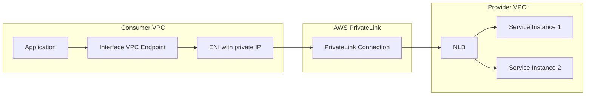

# How to Set Up PrivateLink Endpoint Services

Author: [nawazdhandala](https://github.com/nawazdhandala)

Tags: AWS, PrivateLink, VPC, Networking, Security, Private Connectivity

Description: Complete guide to setting up AWS PrivateLink endpoint services to expose your applications privately to other VPCs and AWS accounts without internet exposure.

---

Exposing a service to other teams or customers usually means putting it on the internet with all the security baggage that comes with it. AWS PrivateLink lets you expose your service privately over the AWS network. Traffic never touches the internet, and consumers access your service through an interface VPC endpoint in their own VPC.

## How PrivateLink Works

PrivateLink creates a private connection between a service provider and service consumers. The provider creates an endpoint service backed by a Network Load Balancer. Consumers create interface VPC endpoints that generate private IP addresses in their own subnets.



Key properties:
- Traffic stays on the AWS network (never touches the internet)
- Consumer gets a private IP in their own VPC
- Provider does not need to expose public IPs
- Works across accounts and even across regions (with some setup)
- Provider controls who can connect through allowlisting

## Step 1: Set Up the Provider Side

### Create the Network Load Balancer

PrivateLink requires an NLB (not ALB) as the frontend for your service.

```bash
# Create an internal NLB for the endpoint service
aws elbv2 create-load-balancer \
    --name my-service-nlb \
    --type network \
    --scheme internal \
    --subnets subnet-provider-1a subnet-provider-1b \
    --tags 'Key=Purpose,Value=PrivateLink'

# Create a target group
aws elbv2 create-target-group \
    --name my-service-targets \
    --protocol TCP \
    --port 443 \
    --vpc-id vpc-provider \
    --target-type instance \
    --health-check-protocol TCP \
    --health-check-port 443

# Register your service instances
aws elbv2 register-targets \
    --target-group-arn arn:aws:elasticloadbalancing:us-east-1:111111111111:targetgroup/my-service-targets/abc123 \
    --targets Id=i-service-1 Id=i-service-2

# Create a listener
aws elbv2 create-listener \
    --load-balancer-arn arn:aws:elasticloadbalancing:us-east-1:111111111111:loadbalancer/net/my-service-nlb/abc123 \
    --protocol TCP \
    --port 443 \
    --default-actions Type=forward,TargetGroupArn=arn:aws:elasticloadbalancing:us-east-1:111111111111:targetgroup/my-service-targets/abc123
```

### Create the VPC Endpoint Service

```bash
# Create the endpoint service backed by the NLB
aws ec2 create-vpc-endpoint-service-configuration \
    --network-load-balancer-arns arn:aws:elasticloadbalancing:us-east-1:111111111111:loadbalancer/net/my-service-nlb/abc123 \
    --acceptance-required \
    --tag-specifications 'ResourceType=vpc-endpoint-service-configuration,Tags=[{Key=Name,Value=my-api-service}]'

# Output includes the ServiceId and ServiceName
# ServiceName format: com.amazonaws.vpce.us-east-1.vpce-svc-0123456789abcdef0
```

The `--acceptance-required` flag means you must manually approve each connection request. This gives you control over who can access your service.

### Configure Allowed Principals

Specify which AWS accounts or IAM principals can create endpoints to your service:

```bash
# Allow a specific AWS account to connect
aws ec2 modify-vpc-endpoint-service-permissions \
    --service-id vpce-svc-0123456789abcdef0 \
    --add-allowed-principals "arn:aws:iam::222222222222:root"

# Allow a specific IAM role
aws ec2 modify-vpc-endpoint-service-permissions \
    --service-id vpce-svc-0123456789abcdef0 \
    --add-allowed-principals "arn:aws:iam::333333333333:role/ServiceConsumerRole"

# Allow an entire organization
aws ec2 modify-vpc-endpoint-service-permissions \
    --service-id vpce-svc-0123456789abcdef0 \
    --add-allowed-principals "arn:aws:organizations::111111111111:organization/o-abc123"
```

## Step 2: Set Up the Consumer Side

### Create the Interface VPC Endpoint

The consumer creates an interface endpoint in their VPC that connects to your service.

```bash
# Create an interface VPC endpoint (run from consumer account)
aws ec2 create-vpc-endpoint \
    --vpc-id vpc-consumer \
    --vpc-endpoint-type Interface \
    --service-name com.amazonaws.vpce.us-east-1.vpce-svc-0123456789abcdef0 \
    --subnet-ids subnet-consumer-1a subnet-consumer-1b \
    --security-group-ids sg-consumer-endpoint \
    --tag-specifications 'ResourceType=vpc-endpoint,Tags=[{Key=Name,Value=my-api-endpoint}]'
```

### Accept the Connection (Provider Side)

If acceptance is required, the provider must approve the connection:

```bash
# List pending connection requests (provider account)
aws ec2 describe-vpc-endpoint-connections \
    --filters 'Name=vpc-endpoint-state,Values=pendingAcceptance' \
    --query 'VpcEndpointConnections[].{
        EndpointId:VpcEndpointId,
        Owner:VpcEndpointOwner,
        State:VpcEndpointState
    }'

# Accept the connection
aws ec2 accept-vpc-endpoint-connections \
    --service-id vpce-svc-0123456789abcdef0 \
    --vpc-endpoint-ids vpce-0123456789abcdef0
```

## Step 3: Configure DNS

### Private DNS Name

You can associate a private DNS name with your endpoint service so consumers can use a friendly hostname instead of the endpoint-specific DNS name.

```bash
# Set a private DNS name for the endpoint service (provider side)
aws ec2 modify-vpc-endpoint-service-configuration \
    --service-id vpce-svc-0123456789abcdef0 \
    --private-dns-name "api.myservice.com"
```

You will need to verify domain ownership by adding a TXT record to your DNS. The API response includes the verification details.

```bash
# Check verification status
aws ec2 describe-vpc-endpoint-service-configurations \
    --service-ids vpce-svc-0123456789abcdef0 \
    --query 'ServiceConfigurations[0].PrivateDnsNameConfiguration'
```

### Consumer-Side DNS

Without private DNS, the consumer uses the endpoint-specific DNS names:

```bash
# Get the endpoint DNS names (consumer side)
aws ec2 describe-vpc-endpoints \
    --vpc-endpoint-ids vpce-0123456789abcdef0 \
    --query 'VpcEndpoints[0].DnsEntries'

# Output:
# [
#     {
#         "DnsName": "vpce-0123456789abcdef0-abc123.vpce-svc-0123456789abcdef0.us-east-1.vpce.amazonaws.com",
#         "HostedZoneId": "Z7HUB22UULQXV"
#     },
#     {
#         "DnsName": "vpce-0123456789abcdef0-abc123-us-east-1a.vpce-svc-0123456789abcdef0.us-east-1.vpce.amazonaws.com",
#         "HostedZoneId": "Z7HUB22UULQXV"
#     }
# ]
```

The consumer can create a Route 53 alias record pointing their application domain to the VPC endpoint:

```bash
# Create an alias for the endpoint in the consumer's private hosted zone
aws route53 change-resource-record-sets \
    --hosted-zone-id Z1CONSUMER \
    --change-batch '{
        "Changes": [{
            "Action": "UPSERT",
            "ResourceRecordSet": {
                "Name": "api.myservice.com",
                "Type": "A",
                "AliasTarget": {
                    "HostedZoneId": "Z7HUB22UULQXV",
                    "DNSName": "vpce-0123456789abcdef0-abc123.vpce-svc-0123456789abcdef0.us-east-1.vpce.amazonaws.com",
                    "EvaluateTargetHealth": true
                }
            }
        }]
    }'
```

## Step 4: Security Configuration

### Security Groups on the Consumer Endpoint

The consumer controls access to the endpoint with security groups:

```bash
# Create a security group for the VPC endpoint
aws ec2 create-security-group \
    --group-name endpoint-sg \
    --description "Security group for PrivateLink endpoint" \
    --vpc-id vpc-consumer

# Allow traffic from application instances
aws ec2 authorize-security-group-ingress \
    --group-id sg-endpoint \
    --protocol tcp \
    --port 443 \
    --source-group sg-application-instances
```

### Endpoint Policies

You can attach a resource policy to the VPC endpoint to further restrict access:

```bash
# Create an endpoint policy that restricts which API actions are allowed
aws ec2 modify-vpc-endpoint \
    --vpc-endpoint-id vpce-0123456789abcdef0 \
    --policy-document '{
        "Version": "2012-10-17",
        "Statement": [
            {
                "Effect": "Allow",
                "Principal": {
                    "AWS": "arn:aws:iam::222222222222:role/AppRole"
                },
                "Action": "*",
                "Resource": "*"
            }
        ]
    }'
```

## Testing the Connection

```bash
# From a consumer instance, test connectivity to the service
# Using the endpoint DNS name
curl -v https://vpce-0123456789abcdef0-abc123.vpce-svc-0123456789abcdef0.us-east-1.vpce.amazonaws.com/health

# Or using the private DNS name (if configured)
curl -v https://api.myservice.com/health

# Verify the request went through PrivateLink by checking source IP
# The provider sees the request coming from the NLB's private IP, not the consumer's IP
```

## Terraform Complete Example

```hcl
# Provider side
resource "aws_vpc_endpoint_service" "my_service" {
  acceptance_required        = true
  network_load_balancer_arns = [aws_lb.service_nlb.arn]

  allowed_principals = [
    "arn:aws:iam::222222222222:root"
  ]

  tags = {
    Name = "my-api-service"
  }
}

# Consumer side
resource "aws_vpc_endpoint" "my_service" {
  vpc_id              = aws_vpc.consumer.id
  service_name        = aws_vpc_endpoint_service.my_service.service_name
  vpc_endpoint_type   = "Interface"
  subnet_ids          = [aws_subnet.consumer_1a.id, aws_subnet.consumer_1b.id]
  security_group_ids  = [aws_security_group.endpoint.id]
  private_dns_enabled = true

  tags = {
    Name = "my-api-endpoint"
  }
}
```

## Monitoring

```bash
# Monitor endpoint bytes processed
aws cloudwatch get-metric-statistics \
    --namespace AWS/PrivateLinkEndpoints \
    --metric-name BytesProcessed \
    --dimensions Name=VPC_Endpoint_Id,Value=vpce-0123456789abcdef0 \
    --start-time "2026-02-12T00:00:00Z" \
    --end-time "2026-02-13T00:00:00Z" \
    --period 3600 \
    --statistics Sum
```

For broader networking monitoring, check our guide on [monitoring Route 53 DNS query logging](https://oneuptime.com/blog/post/monitor-route-53-dns-query-logging/view).

## Conclusion

PrivateLink is the right choice when you need to expose a service to other VPCs or accounts without internet exposure. The setup requires an NLB on the provider side and an interface endpoint on the consumer side, but once configured, it provides a secure, private, and scalable connection. The acceptance workflow gives providers full control over who can connect, and security groups on both sides provide fine-grained access control.
